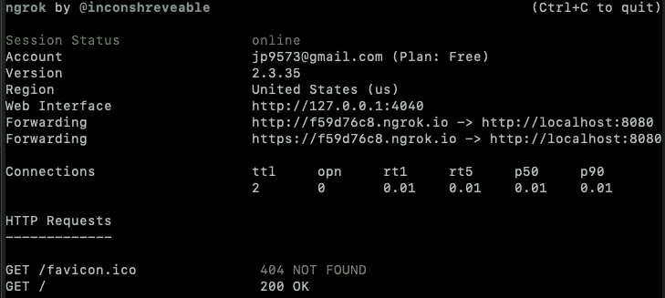

# Ngrok:让任何人都可以访问您的本地主机

> 原文：<https://betterprogramming.pub/ngrok-make-your-localhost-accessible-to-anyone-333b99e44b07>

## 让共享您的开发环境变得更容易一点


图片来自 [ngrok](http://ngrok.com/) 。

当您不断更改代码时，本地开发使测试过程变得快速而容易。但是在这样做的时候，您可能会遇到这样的情况:当您还在开发阶段的时候，您需要通过可访问的 URL 公开它。也许您想向客户或同事展示您的作品，或者您需要一个安全的、公开可用的回调 URL 来与 web 服务进行交互。你可以将你的应用上传到 Heroku 或 AWS 等主机平台，但每次更新时，你都必须将这些更改上传到主机服务器。不太好，对吧？

幸运的是， [ngrok](https://www.ngrok.com/) 是一个令人惊叹的实用程序，它可以为运行在本地主机上的应用程序创建一个即时安全、可公开访问的隧道 URL。简而言之，您可以公开本地 web 服务器、API、数据库等。因此，当您没有大的变化并且不想在您的开发环境中部署它时，公开您的服务更容易。

# **如何入门**

Ngrok 非常容易安装，并且没有运行时依赖性。只需解压缩它，将其添加到您的路径中，并在您的终端上运行它。

## 步骤 1:下载 ngrok

[为您的操作系统下载 ngrok](https://ngrok.com/#download) 。

## 第二步:解压

解压它，如果你愿意，把它添加到你的路径中(移动到`/usr/local/bin`或者使用你喜欢的命令):

```
$ unzip /path/to/ngrok.zip
```

## 第 3 步:连接到您的帐户

运行此命令将添加您的身份验证令牌，在仪表板中列出您打开的隧道，为您提供更长的隧道超时时间，等等。您可以从[仪表盘](https://dashboard.ngrok.com/auth/your-authtoken)中生成您的令牌，猜猜会发生什么？完全免费！

```
$ ./ngrok authtoken <YOUR_AUTH_TOKEN>
```

## 第四步:运行它！

请记住，您需要将 ngrok 添加到您的路径中，或者使用`./path/to/ngrok`。

```
$ ngrok help
```

公开您的 HTTP 服务(例如，我的服务器运行在端口号 8080 上，但是您可以相应地更改它):

```
$ ngrok http 8080
```

当您启动 ngrok 时，您会在终端中看到这样一个屏幕:



如示例所示，您可以通过[https://f59d 76 c8 . ngrok . io](https://f59d76c8.ngrok.io)*访问您的服务(localhost:8080 *)* 。*

现在，你可以从任何地方访问你的本地主机，包括国际空间站 (ISS)。太棒了，对吧？

如果你不喜欢 URL 中随机生成的名字，你可以用你自己的[子域名](https://ngrok.com/docs#subdomain)(付费计划)来暴露你的服务。例如:myawesomeapi.ngrok.com。

我们在这里只是使用了 HTTP。您甚至可以使用 TCP、TLS、SSH、虚拟主机等等。你可以通过阅读[文档](https://ngrok.com/docs)和[常见问题](https://ngrok.com/faq)来了解更多。

# 结论

ngrok 是一个强大的工具，可以通过安全隧道公开您的本地服务。您可以使用它免费公开 web 服务器、API Rest、SSH、游戏服务器、数据库和许多其他内容。