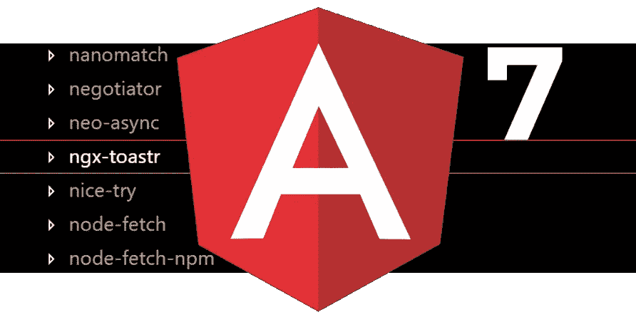
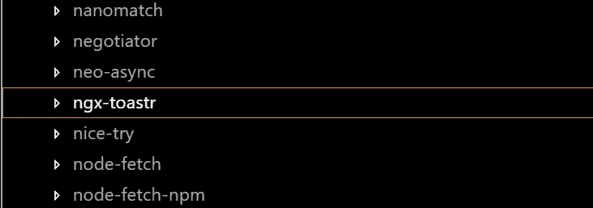
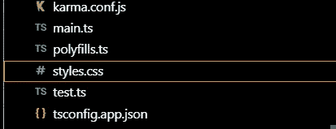
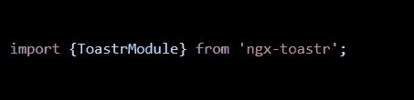
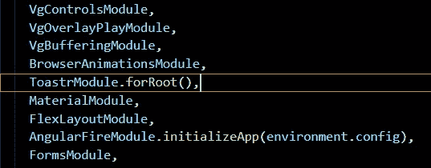
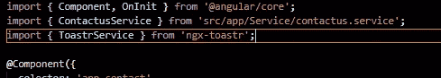
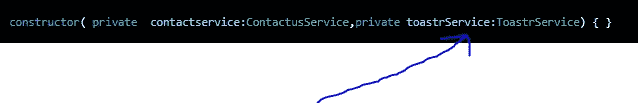
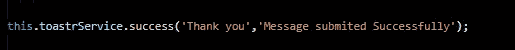

# ngx-toastr 角度为 7°及以上

> 原文：<https://betterprogramming.pub/ngx-toastr-in-angular-7-185ac435011e>

## 在 Angular 7 项目中逐步安装和配置 ngx-toastr 的方法

无论用户在做什么，显示特定的消息/通知总是好的做法。例如，当用户提交消息或订阅时事通讯时，我们应该通知他们他们的请求是否被成功提交。

在这篇文章中，我们将一步一步地在 Angular 7 项目中安装和配置`ngx-toastr`。

我假设你们中的大多数人已经创建了自己的 Angular 应用程序，如果没有，运行:

`ng new ‘name of app’`

去创造一个。

# **第一步**

在您的终端中，键入以下行并按 enter 安装软件包:

`npm install ngx-toastr — save`

或者

你可以访问下面的网站

 [## ngx-toastr

### Toastr 用于角度

www.npmjs.com](https://www.npmjs.com/package/ngx-toastr) 

# **第二步**

如果您不打算使用`@angular/animation`，您可以跳过这一步，否则，在您的终端中键入以下代码并按回车键:

`npm install @angular/animations — save`

*注意:* `*@angular/animations*` *包是默认 toast 的必需依赖项。*

# **第三步**

导航到您的`node_module`文件夹并找到`ngx-toastr`以确认安装成功

下一步，我们将看看如何在我们的应用程序中配置和使用它。

# **第四步**

自带默认 CSS，但是我们也可以设置自定义 CSS。为了能够在`ngx-toastr`中使用 CSS 类，在`style.css`中键入:

`@import “../node_modules/ngx-toastr/toastr.css”;`

# **第五步**

在我们可以在 Angular 应用程序的任何部分使用`ngx-toastr`之前，我们需要将它导入到`app.module.ts`文件中，这是我们程序中所有模块、组件和服务的主要入口点。让我们像这样从`‘ngx-toastr’`导入`ToastrModule`:

在我们的导入数组中，输入:

`ToastrModule.forRoot(),`

最后，在我们可以在 Angular 应用程序的任何组件中使用`ngx-toastr`之前，我们需要运行:

`import { ToastrService } from ‘ngx-toastr’;`

*注意:如果你熟悉 Angular，你会意识到每一个生成的服务都需要添加到* `*app.module.ts*` *文件中的提供者数组中，而不是针对烤面包机服务。*

是时候通过运行将`ToastrService` 注入到各自的`component.ts`构造函数中了:

# **结论**

我们现在可以使用我们的服务了！

示例:

在这种情况下，您可以在想要使用它的地方调用方法或函数。

第一个参数包含要向用户显示的消息的标题，第二个参数是要向用户显示的消息。

谢谢你的阅读，我希望你喜欢这篇文章！