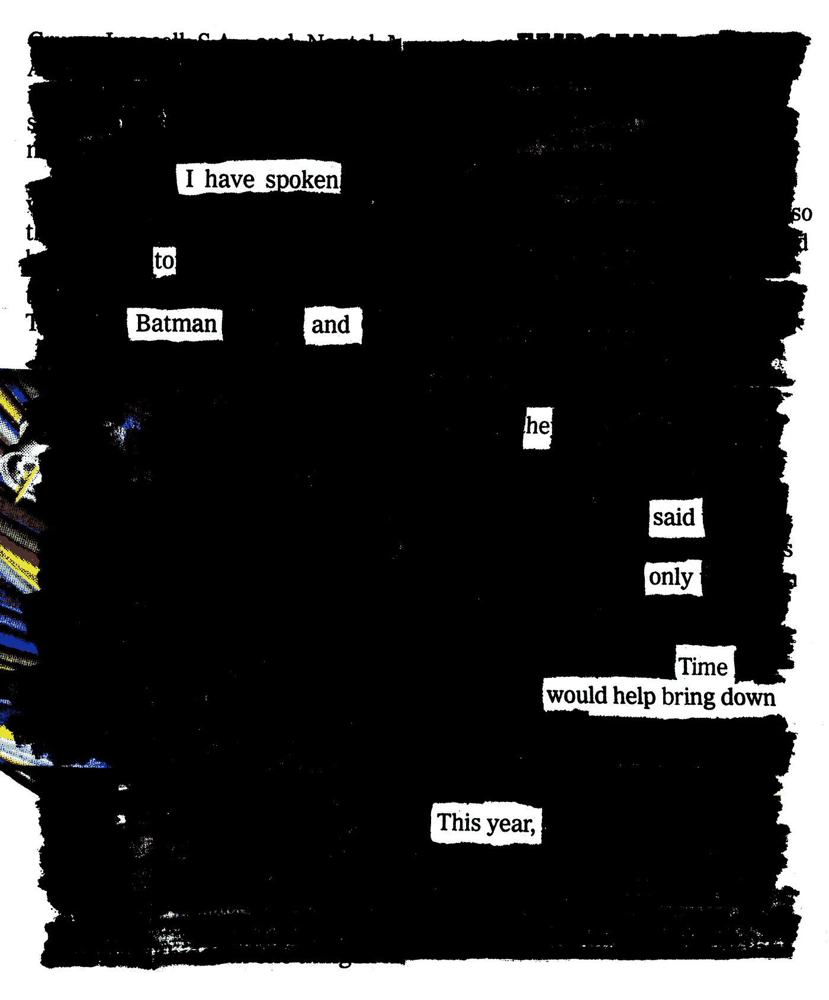
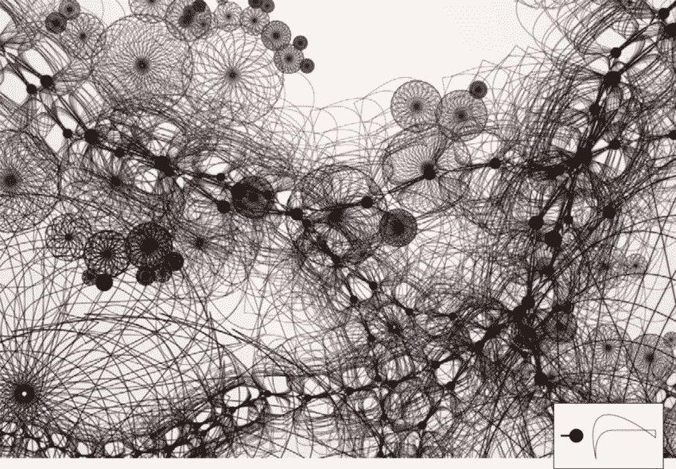
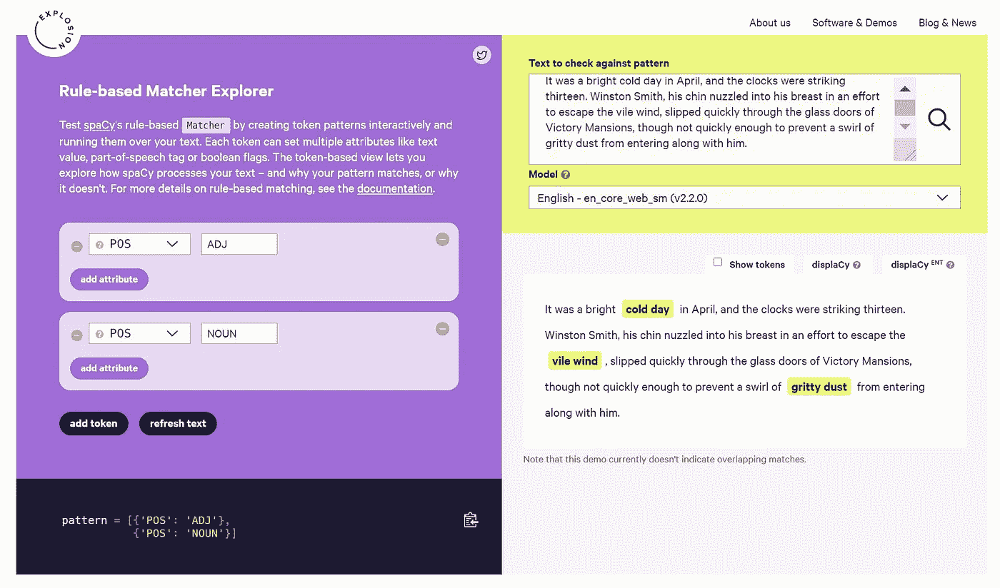

# 用 Python 实现 NLP:用 50 行代码构建一台俳句机器

> 原文：<https://betterprogramming.pub/nlp-with-python-build-a-haiku-machine-in-50-lines-of-code-6c7b6de959e3>

## 自然语言处理探究


阿列克谢·萨维琴科在 [Unsplash](https://unsplash.com/s/photos/clock?utm_source=unsplash&utm_medium=referral&utm_content=creditCopyText) 上的照片

**:代码更新至空间 3.2*

# 灵感

你喜欢异想天开的报纸停电诗吗？我们可以借用同样的想法来写一个写俳句的程序。昏厥诗的创作是在一段文本中寻找想要的词语的过程。当其他单词被删除时，这首诗就从上下文中浮现出来。令人耳目一新。



奥斯汀·克莱恩和蝙蝠侠说过话。

俳句是一种不押韵的诗歌形式，只有 17 个音节，通常写三行，音节数为 5-7-5。有了 Python 和 NLP(自然语言处理)工具，我们可以编写一个俳句机器，从一端接收任意一段文字，在另一端输出俳句。

让我们开始吧。

# NLP 库

自 2001 年首次亮相以来，NLTK(自然语言工具包)一直是一股强大的力量，也是当今最著名的 NLP 库。它的缺点是复杂和缓慢。2012 年，Tom De Smedt 和 Walter Daelemans 开发了一个名为 Pattern 的库，其中包含情感和图形分析。更流行的 TextBlob 是基于 Pattern 和 NLTK 开发的。



造型创意|汤姆·德·斯梅特

TextBlob 宣传自己是简化的文本处理，完全正确。我在几个项目中使用过它，我很喜欢它，但也发现它不适合举重。

对于我们在这里要做的事情，我会选择[空间](https://spacy.io/)。spaCy 是快速的，因为它是用 Cython 编写的，并且通过包含用于处理常见任务的预训练模型而设计为随时可用。闲暇之余，我建议你看一下马修·洪尼巴尔和伊娜丝·蒙塔尼的视频，他们解释了 spaCy 的设计理念:

Matthew Honnibal 和 Ines Montani:空间和爆炸:过去、现在和未来

# 项目设置

使用 Python 3，项目设置非常简单。我们需要两个库:spaCy 用于处理文本，而 [syllapy](https://pypi.org/project/syllapy/) 用于计算音节。我们已经知道在创作俳句时音节数是必不可少的:

```
pip3 install -U spacy
pip3 install syllapy
```

安装 spaCy 后，我们需要下载一个语言模型。spaCy 支持多种语言。我们将在这里使用英语:

```
python3 -m spacy download en_core_web_sm
```

# 阅读课文

我们可以自由地使用任何文本作为输入。在这个练习中，我从乔治·奥威尔的经典小说 *1984* 中选了几百个单词。

为我们的项目创建一个文件夹，然后用 Visual Studio 代码打开该文件夹。创建一个名为`data`的文件夹来存储文本文件。然后创建一个名为`z2poem.py`的 Python 文件。

在 Python 文件中，我们设置了空间。在内部，spaCy 维护一个文本处理管道。它是可定制的，但是默认设置对许多项目来说是好的。

让我们将一个语言模型加载到管道`nlp`中，然后创建一个文档`doc`来读取文本:

```
import spacy
nlp = spacy.load("en_core_web_sm")file = "data/orwell_1984.txt"
doc = nlp(open(file).read())
```

# 基于规则的模式匹配

为了实现停电诗的想法，我们需要从一段文字中选择一个短语。为了使选择适合一首俳句，它需要遵循一定的规则。例如，我们从不以“the”结尾，也很少把“of”作为最后一个单词。

spaCy 有一个优秀的基于规则的匹配工具。我们的目标是找到足够多的好词，但我们不需要穷尽所有的可能性。我们可以自由地想出一套规则，而且我们可以随时改进它。

例如，我们可以从匹配一个由形容词修饰的名词短语开始。它需要两个属性的模式:

```
pattern = [{'POS': 'ADJ'},
           {'POS': 'NOUN'}]
```

POS 代表词性。spaCy 为我们提供了一个交互工具，让我们可以随意摆弄，并写出要使用的模式。然后我们可以将它们复制并粘贴到我们的 Python 程序中。



为了制作我们的俳句，我使用了三种不同的模式:两个词，三个词和四个词的短语。我将展示下面四个单词的匹配器，您可以在本文末尾看到完成的代码:

```
from spacy.matcher import Matchermatcher4 = Matcher(nlp.vocab)pattern = [{'POS':  {"IN": ["NOUN", "ADP", "ADJ", "ADV"]} }, 
{'IS_ASCII': True, 'IS_PUNCT': False, 'IS_SPACE': False},  {'IS_ASCII': True, 'IS_PUNCT': False, 'IS_SPACE': False}, {'POS':  {"IN": ["NOUN", "VERB", "ADJ", "ADV"]} }]matcher4.add("FourWords", [pattern])
```

# 音节计数

最著名的音节计数工具可能是 CMU 的发音，但它有一个缺陷。发音实际上是计算音素而不是音节，音素并不总是与音节对齐。Michael Holtzscher 的 syllapy 更正[本期](https://medium.com/@mholtzscher/programmatically-counting-syllables-ca760435fab4)。虽然发音提供了其他功能，但我们很乐意使用 syllapy ，因为它提供了我们所需要的:

```
syllapy.count("word")
```

根据音节数，匹配规则的短语被进一步分类。创建两个列表:一个用于五音节的短语，另一个用于七音节的短语。不属于这两个列表的任何东西都被简单地扔掉。

# 俳句作文

最简单的方法是从五个音节的列表中选择一个短语，然后从七个音节的列表中选择一个，再从五个音节的列表中选择一个。当我们把所有东西放在一起时，下面是代码:

# 图灵检定

该程序可以在瞬间生成俳句。我[向](https://medium.com/house-of-haiku/poster-6bf094e424e0)[俳句之家](https://medium.com/house-of-haiku)提交了一篇并被接受，我想知道是否有人注意到俳句是由一个程序生成的。

如果俳句感觉像是人类写的，我们能认为它通过了图灵测试吗？

# 讨论

本文旨在为自然语言处理做一个练习。我们用不到 50 行代码制作了一台功能正常的俳句机器，但还有很大的改进空间，而且我们还仅仅触及了计算诗的皮毛。敬请期待，我将很快做出另一个版本的俳句机。

干杯！