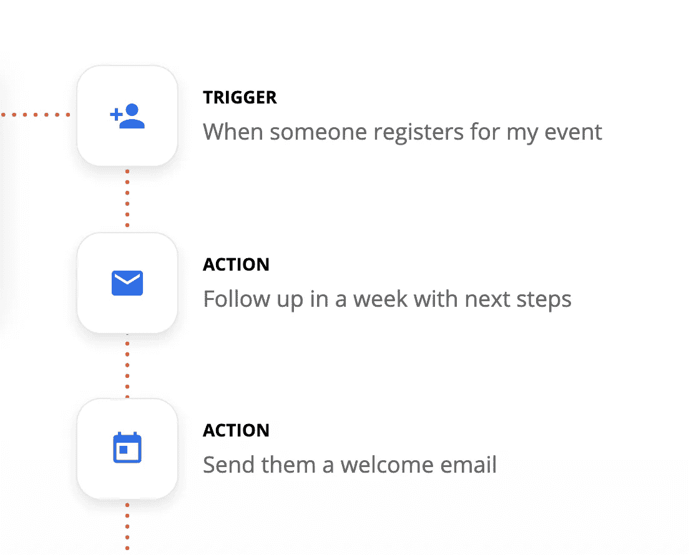
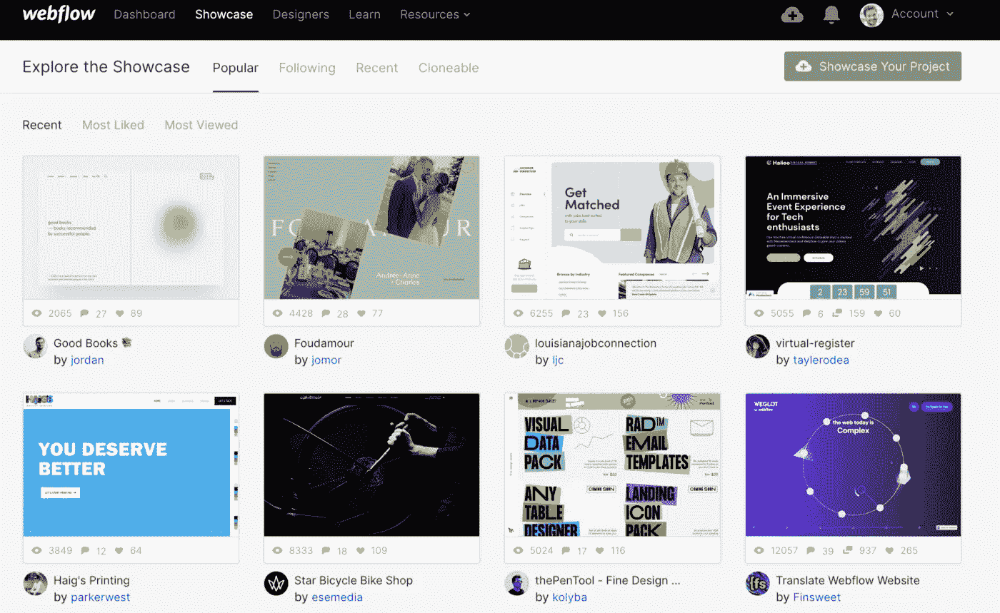
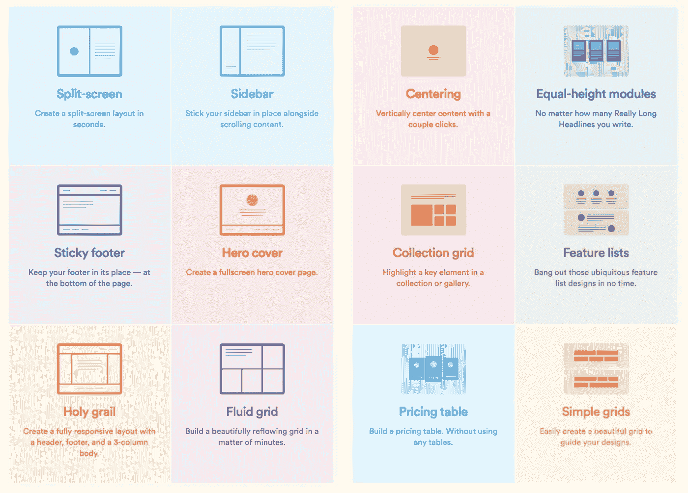
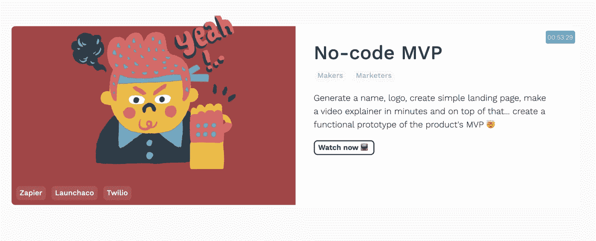

# 没有代码:如何在没有编程知识的情况下构建应用程序和自动化流程

> 原文：<https://betterprogramming.pub/no-code-how-to-build-apps-and-automate-processes-with-no-programming-knowledge-1c64a28e39ff>

## 不需要知道如何编码来创建应用程序是一个迷人的想法

照片由[克里斯汀·休姆](https://unsplash.com/@christinhumephoto?utm_source=unsplash&utm_medium=referral&utm_content=creditCopyText)在 [Unsplash](https://unsplash.com/collections/1955200/people-working?utm_source=unsplash&utm_medium=referral&utm_content=creditCopyText) 上拍摄

每个人都能编码的未来可能永远不会发生。实际上，即使我们对这些几乎无处不在的语言有基本的了解，比如 Python 或 JavaScript，也不足以从头开始构建一个应用程序或网站。在最好的情况下，你可以做一个不错的宠物项目，更接近于大学实践，而不是建立业务或维持公司的工作流程。

在软件开发行业，对无代码和低代码工具的需求越来越大。不用写一行代码，他们就能帮助你做正确的事情。不需要知道如何编码来创建应用程序是一个迷人的想法。

许多公司已经在他们的内部应用程序中使用这种方法，或者创建他们无法负担的自动化流程，因为他们没有足够的运营资本(开发人员和 UX 设计师)，或者因为他们仍然是最纯粹的自举方式的概念证明。

# 无需编写任何代码，即可在云中进行原型开发、构建和自动化的 SaaS 平台

这种 SaaS 平台是可视化界面，使用已经创建、连接并易于重用的组件。它们允许我们基于用户操作或者某些先前描述的规则来构建流。

通常，您遵循的途径是创建一个原型，测试，并最终将其分发给最终用户(部署)。稍后，我们将能够考虑是否将该实验迁移到我们的技术堆栈中涉及开发人员的地方。同时，我们可以继续使用这些第三方，就像它是我们的系统一样。

**我们可以在许多公司的业务中找到各种平台**，例如 [Typeform](https://www.typeform.com/) 来创建一个完美分割的、维他命化的表单，然后我们将其导出到 [Google 电子表格](https://www.google.es/intl/es/sheets/about/)、 [AirTable](https://airtable.com/) ，甚至在云中的一些机器学习过程中进行分析。

另一方面，自动化已经通过使用 [Zapier](https://zapier.com/home) 或 [IFTTT](https://ifttt.com/) 取得了很大进展，因此当任何触发(事件)发生时，它会执行某些操作，如通过 [Mailchimp](https://mailchimp.com/) 或 [Twilio](https://www.twilio.com/) 发送电子邮件，保存多媒体文件，用谷歌电子表格更新仪表板中的一些图表等。

前面提到的例子是允许各种动作或过程的 SaaS 平台，到目前为止，这些平台需要难以配置并且对于小公司来说根本负担不起的服务基础设施。这些平台的商业模式专注于提供越来越多的定制服务，而无需集成一行代码。只有通过提供与其他服务的大量集成，才能作为数据源或最终用户的沟通渠道。

我们都知道，大多数网站和应用程序都托管在云中，例如，在[谷歌云](https://cloud.google.com/)、 [AWS](https://aws.amazon.com/es/) 或[微软 Azure](https://azure.microsoft.com/es-es/) 上。但是，我们还必须记住，所有这些相关的流程都来自其他 SaaS 服务。我们作为用户收到的所有邮件、短信或推送通知都来自 [Mailchimp](https://mailchimp.com/) 、 [Salesforce](https://www.salesforce.com/es/) 、 [Twilio](https://www.twilio.com/) 、[亚马逊 SNS](https://aws.amazon.com/es/sns/) 等。

在大多数情况下，甚至触发发送这些通信的动作也不需要几行代码或复杂的事件队列。他们中的许多人来自于像 [Firebase](https://firebase.google.com/?hl=es) o [AWS](https://aws.amazon.com/es/) 这样的服务，例如，这些服务能够基于相关的分析工具产生受众。虽然，如果我们需要一些具体的东西，我们可以在云中包含小脚本或代码片段，作为[云函数](https://cloud.google.com/functions?hl=es)或 [Lambdas](https://aws.amazon.com/es/lambda/features/) 。

# 非代码和低代码工具有什么区别？

关键是要明确区分无代码和低代码是不一样的。在低代码平台的情况下，我们需要最低限度的编程知识。另一方面，在无代码中，我们使用可视化界面，我们不会看到(除非我们想要更高级的东西)一行代码。

低代码对于低技能的程序员来说是一个巨大的推动，甚至对于更高级的程序员来说也是一个快速启动东西的好方法，他们可以在以后工作，创建与更具挑战性的代码的集成。这也是软件开发领域的一个自然发展，通过增加层次，语言变得越来越抽象，更多地关注我们想做什么，而不是如何做。

**在无代码**中，我们关注的是我们希望用户看到什么的问题。因此，理论上，这些工具可以根据我们的指示，创建我们想法的多平台视觉界面，无论是 web 应用程序、原生应用程序，甚至是 slack 或语音助手之一的消息交换。

“低代码的概念不是我们以前没有见过的，而是从 20 世纪 90 年代就有了。”这是他们最近在 Spectrum IEEE 的一篇[文章中描述的。我们能记得那些](https://spectrum.ieee.org/tech-talk/computing/software/programming-without-code-no-code-software-development) [CASE 工具](https://en.wikipedia.org/wiki/Computer-aided_software_engineering)和那个老的[微软 Visual Basic](https://docs.microsoft.com/es-es/dotnet/visual-basic/) 框架，很多人还会记得。现在，一些工具试图模仿这种方法，如[微软 Power Apps](https://powerapps.microsoft.com/es-es/) 、 [Oracle Visual Builder](https://www.oracle.com/es/application-development/cloud-services/visual-builder/) 或 [Salesforce Lightning 平台](https://www.salesforce.com/products/platform/lightning/)。甚至谷歌最近也收购了 [AppSheet](https://www.appsheet.com/) ，这是一个创建移动应用的无代码平台。

有很大影响力的网络开发工具之一是 [Webflow](https://webflow.com/) ，它能够用几行代码创建复杂的网站。你可以通过简单地拖动组件、连接流程和重用平台提供的任何东西来设计你的网站的外观和感觉，而不要忘记更具挑战性的外部集成。你可以在它的网站上看到几十个教程。

# 无代码平台的三个关键要素

简而言之，这种非代码平台必须具备以下要素，以便在无需编写一行代码的情况下实现这种用户授权。

## 用户界面构建器

[Webflow](https://webflow.com/) 就是一个很好的例子。我们可以通过一个更接近于设计工具而不是编程工具的可视化界面来使用一组已经定义好的组件。它的工作原理仅仅是把它拖到我们希望元素显示给用户的地方。无论是一个包含一个段落、几个图像、一个处方集的盒子，还是一个依赖于为我们提供数据的 API 的动态布局，我们都可以将所有这些元素组合起来，并在每个屏幕上重用它们。

## 可视化建模

除了在布局上拖放元素，我们还必须定义步骤、流程和元素之间的连接。它甚至创建了组件和数据模型之间的层次结构。因此，这些工具中的大多数允许您使用元素之间的关系图来可视化和配置。

## 集成

至关重要的是，我们的应用程序可以与其他工具通信，尤其是我们在开始时提到的那些 SaaS 工具，以自动化过程或与用户通信。

# 在不丢失一行代码的情况下，从哪里开始使用这些“编程”工具呢？

第一步是想出一些我们可以自动化的流程。这样，我们就可以开始熟悉自动化工具，比如 [Zapier](https://zapier.com/home) 、 [IFTTT](https://ifttt.com/) o [微软 Flow](https://flow.microsoft.com/es-es/) 。

创建一些真正的流，例如，检查电子邮件并在电子表格中编写注册表，或者触发一些自动消息或集成一个小的 CMS，根据我们放置每个元素的状态来处理动作。无论是虚拟商店的产品，还是给客户或联系人的待定电子邮件。有数百个来自 Gmail、YouTube、电子表格、Drive、Dropbox、Salesforce、Stripe、社交网络的集成，甚至发送短信、推送，或创建灵活的数据库，如 Airtable。

最近我发现了 [Codeless How](https://codeless.how/) 的网站，在那里你可以看到关于如何创建一套集成的小视频教程，这些集成自动化了许多过程，如聊天机器人日历、完整的无代码 MVP、个人助理等。所有人都在使用上述工具。

之后，我会尝试探索一些工具来创造一个数字化的存在。我最喜欢的是 [Webflow](https://webflow.com/) 、 [AppSheet](https://www.appsheet.com/) 和 [Microsoft Power Apps](https://powerapps.microsoft.com/es-es/) 。

**当然，无代码平台并不意味着完全取代软件开发者**。相反，它们是生态系统软件工具的进化，允许越来越多的人在软件构建链中被授权。最重要的是，它们允许你专注于本质的东西，并在通过代码开发一个想法或将它集成到我们的产品堆栈之前，用功能原型快速迭代以评估它是否可行。