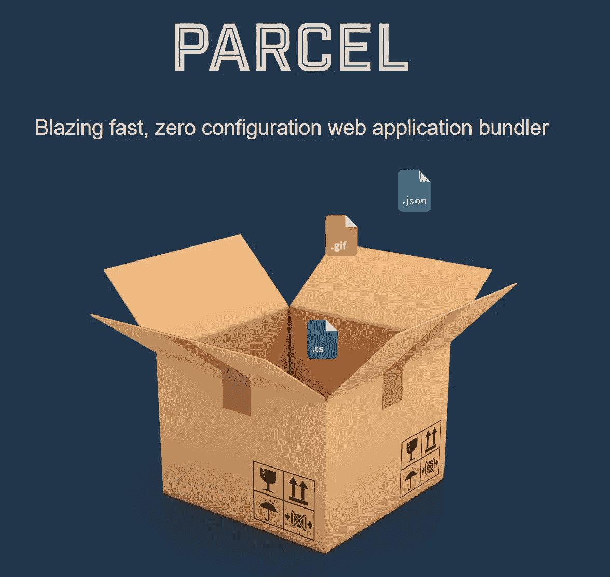
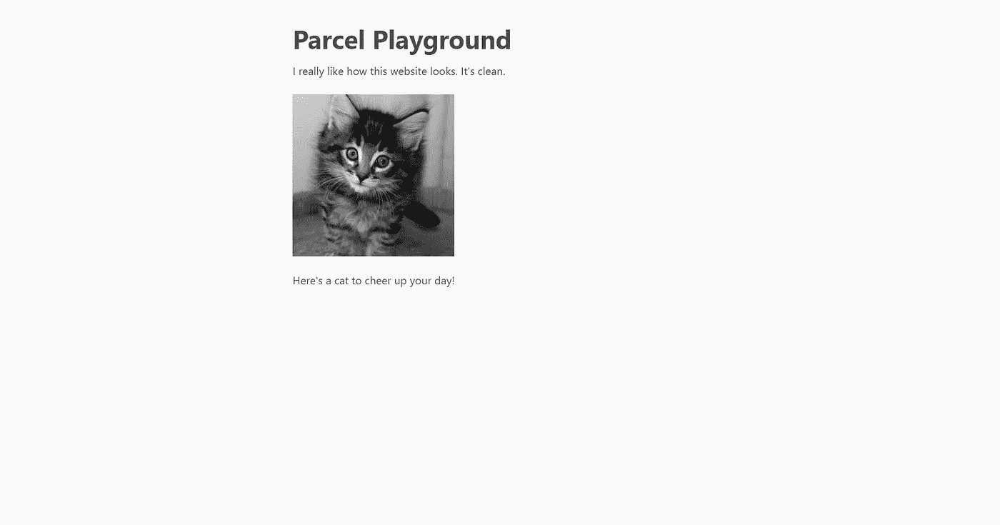

# 无配置与包裹反应

> 原文：<https://betterprogramming.pub/no-config-react-with-parcel-503babdd3992>

## 是时候抛弃 Webpack 了



package . js，来自[https://parceljs.org/](https://parceljs.org/)

当我开始使用 React 时，困扰我的一件事是构建 React 应用程序时配置文件的复杂性。想导入 SVG 文件？您需要安装另一个依赖项并再次编辑 Webpack 配置文件。对于许多玩具项目来说，创建和配置一个新项目所需的时间使得开始实际制作东西变得很困难。当我最终了解到 Parcel 是 React 的一个无配置捆绑器时，我被说服了。这里有一个简单的包裹入门指南。

一眼看去，package 只需要你安装一个依赖项，`parcel-bundler`就可以了。让我们首先为我们的项目创建一个新文件夹。你可以用 NPM，但我更喜欢用纱线作为我的包装经理。

```
mkdir parcel-playground
cd parcel-playground
yarn init -y
```

接下来，添加 Parcel 并作为项目依赖项进行反应。

```
yarn add parcel-bundler --dev
yarn add react react-dom
```

您将需要几个文件来开始，但主要归结为有一个入口点(`index.html`)和您的 React 入口点(`index.js`)

将一个`index.html`添加到文件夹的根目录，并将其放入文件的内容中:

`meta`标签使你的页面反应灵敏，因此移动用户有更好的体验。如果您是第一次接触 React，那么 ID 为`root`的`div`元素通常用于安装应用程序。

接下来，我们创建`index.js`，它允许我们的 React 应用程序挂载。

现在我们只需要一个运行程序的方法！由于`parcel`只是作为这个项目的一个依赖项安装的，所以我们只能在通过`package.json`文件中的命令运行`parcel`命令时使用它们。

让我们添加一个`start`命令，它将在我们运行`yarn start`时运行 package bundler:

现在，如果您运行`yarn start`，您应该会看到 bundler 在施展它的魔法，您的应用程序将在`localhost:1234`上提供。它现在看起来有点简单，所以让我们给它添加一些内容。

让我们在根文件夹中新建一个文件夹`components`，然后在其中创建另一个文件夹`MyPage`，最后在那个文件夹中创建一个`index.js`文件。理想情况下，我们希望将应用程序的安装与实际应用程序分开，所以让我们将内容从`index.js`移到`components/MyPage/index.js`。

您还应该注意到，如果您将 MyPage 的内容从`Hello World!`更改为其他内容，bundler 会自动用新文本重新加载页面。这是 package 带给你的便利，不需要任何配置。是不是很酷？

让我们为我们的页面添加更多的内容和一点样式。首先，保存[这个 CSS 文件](https://raw.githubusercontent.com/oxalorg/sakura/master/css/sakura.css)为`sakura.css`并放在`MyPage`文件夹中。这个 CSS 文件是一个无配置样式表——您需要做的就是导入它。



包裹操场页面的状态

好多了！处理 CSS 文件不需要额外的配置，一切都很正常——这对初学者的学习非常有益。稍后，当您需要更细粒度的控制时，您可以使用 Webpack 或其他捆绑器来微调您的应用程序。至于学习，我相信使用包裹是必经之路。

我的教程已经结束了。我希望你已经学会了如何使用 package 来加速你的学习和发展。如果你感兴趣，请在这里查看 package 的[精彩文档](https://parceljs.org/getting_started.html)。

# 资源

*   包裹:[https://parceljs.org/](https://parceljs.org/)