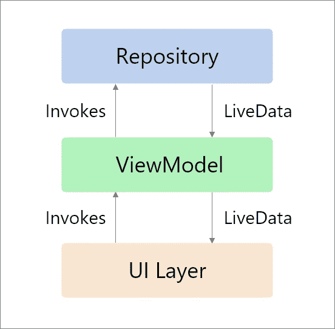
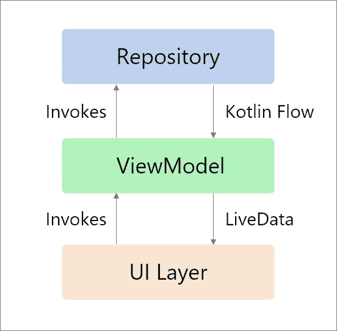

# 科特林的存储库中不再有实时数据

> 原文：<https://betterprogramming.pub/no-more-livedata-in-repositories-in-kotlin-85f5a234a8fe>

## 了解如何用 Kotlin 流替换 LiveData

由[詹姆斯·哈里森](https://unsplash.com/@jstrippa?utm_source=medium&utm_medium=referral)在 [Unsplash](https://unsplash.com?utm_source=medium&utm_medium=referral) 上拍摄的照片。

# 什么是 LiveData？

我们可以将 LiveData 描述为一个可观察的数据持有者类，这意味着它可以保存一组可以从其他 Android UI 组件(如活动、片段和服务)中观察到的数据。

LiveData 具有生命周期意识。一旦观察数据的组件被破坏或不活动，LiveData 就会停止向该观察者发布数据。这为 Android 开发者解决了很多常见问题。

大多数开发人员在 MVVM 架构中使用 LiveData 从视图模型向视图传递或传输数据。这通过减少内存泄漏来确保它们之间的生命周期感知通信。

但是我看到开发人员使用 LiveData 在存储库和视图模型之间进行通信，包括 Google I/O 应用程序。在这种情况下使用 LiveData 似乎是正确的。毕竟，它是为保存和传递数据而设计的。但是不建议这样做，您将在下面的小节中了解原因。

## 使用 LiveData 的优势:

*   没有内存泄漏
*   没有因组件停止而导致的崩溃
*   不再需要手动处理生命周期
*   资源共享

# 什么是科特林流？

在协程之前，大多数开发人员使用 RxJava 进行异步编程。当 Kotlin 提出协程时，开发人员非常喜欢。他们用比 RxJava 更复杂的方式解决了异步编程的所有传统问题。

在协程之前，我们必须调用一个异步函数，比如服务调用，从数据库中检索数据，读取文件，或者通过回调做任何事情。只有当我们知道操作已经完成时，我们才能继续实际的工作，就像手机从你的服务器接收数据后更新用户界面一样。

协程通过`suspend`函数提供了一个解决方案。`Suspend`函数可以暂停当前线程的执行，直到任务完成。看一看:

后来，协程程序提出了流 API。异步处理顺序执行的数据流是一种更好的方法。有了 Flow，协程就成了 Kotlin 项目中 RxJava 的替代品。

凭借顺序执行复杂操作和连续数据流的能力，Kotlin 的 Flow API 更加强大。

# 为什么我们应该在存储库中使用 Kotlin 流？

这是一个有趣的问题。

我先回答一个不同的。

## 为什么不是 LiveData？

LiveData 的核心目的是保存一组可以观察到的数据。它之所以与众不同，是因为它具有生命周期意识。关键的一点是 LiveData 观察者总是在主线程上被调用。

尽管我们在存储库中使用 LiveData 将数据传递给 ViewModel，但是这里 ViewModel 应该充当观察者，所以我们需要调用主线程的执行。不建议视图模型使用主线程操作。

在实时中，我们经常对从服务器获得的数据进行转换。通过使用 LiveData，我们必须在主线程中完成，这也是不推荐的。

当您看到 LiveData 的核心目的时，观察器总是在主线程上被调用是有意义的，因为它经常用于更新 UI 线程。

这不是 LiveData 第一次被滥用。在 Kotlin Flow 之前，开发人员要求 Android 团队将它做成类似 RxJava 的东西。相反，他们创建了协程，并解释说 LiveData 是一个简单的数据容器。

## 为什么是科特林流？

协程被设计成干净地、顺序地执行复杂的异步操作。协程暂停函数异步返回单个值，但是我们如何返回多个异步计算的值呢？这就是 Kotlin Flows 大放异彩的地方。

Flow 被明确设计为有效地处理复杂的异步操作，并根据需求多次发出。与通道不同，流是*冷*流，就像序列一样。在流被收集之前，流构建器中的代码不会运行。

因此，这些能力使得 [Kotlin Flow](https://kotlinlang.org/docs/reference/coroutines/flow.html) 成为存储库中 LiveData 的绝佳替代品。Flow 提供了类似的功能:构建器、冷流和有用的助手(例如转换数据)。与 LiveData 不同，它们不受生命周期的约束，并提供对执行上下文的更多控制。

# 用 Kotlin 流替换 LiveData

现在我们知道了为什么我们需要在存储库中使用 Kotlin Flow 而不是 LiveData，是时候学习如何做了。首先，让我们看一个现有项目的蓝图:

作者照片。

我们的目标是用 Kotlin 流替换视图模型和存储库之间的 LiveData。为此，首先我们需要用 Kotlin 流替换存储库函数的输出，如下所示:

知识库中的 Kotlin 流

这里，我们需要在返回类型中用 Flow 替换 LiveData。正如您看到的执行，Flow 首先发出加载状态。然后，在 Ktor 服务请求完成后，Flow 再次发出响应。如果有异常，我们可以在 catch 块中发出它。

记住，当我说我们使用 Flow 对执行有更多的控制时，通过使用`flowOn`，我们可以根据需求明确地改变执行线程。这是众多便捷功能之一，如`debounce`、`delayFlow`等等。

既然我们已经成功地在存储库中实现了流，那么让我们看看如何在 ViewModel 中观察数据。看一看:

视图模型中的 Kotlin 流

这里，我们使用`viewmodelscope`来限制请求的范围，然后调用流上的`collect`函数来触发请求。在`collect`接收器中，我们可以通过 LiveData 发布数据来更新 UI。现在现有项目的蓝图如下所示:

作者照片。

在 ViewModel 中，我们可以使用 Kotlin 流上的`map`函数来实现映射。当我们有两个不同的服务器响应和本地使用模型时，这就很方便了。看一看:

具有地图功能的流程

# 结论

目前就这些。希望你学到了有用的东西。感谢阅读。