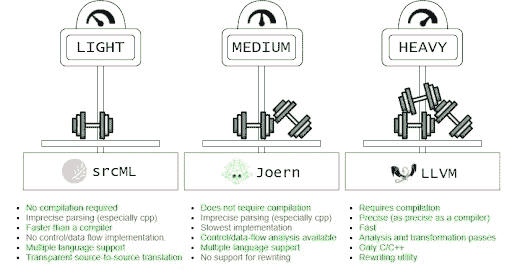

# 比较 C 语言的 3 种代码分析框架

> 原文：<https://betterprogramming.pub/no-pain-no-gain-comparing-3-program-analysis-frameworks-for-c-b1ef8bdd6219>

## 没有痛苦就没有收获。

吉恩·杰特在 [Unsplash](https://unsplash.com/@genejeter?utm_source=unsplash&utm_medium=referral&utm_content=creditCopyText) 上的照片

程序分析方法通常用图来表示程序。这些图表应该从源代码中自动生成。已经实现了许多工具来实现这一点，但是它们的设置通常很痛苦。在这篇文章中，我将比较我用来生成 C 程序的图形表示的 3 个程序分析框架。

**TL；DR:** 更强大的框架更难建立，因为它们需要编译器信息或者公开复杂的 API。

*   如果您需要的只是 AST，并且不需要 100%的精度，那么 SrcML 非常好。
*   如果你需要 CFG 或 PDG 来运行一大堆程序，Joern 是很棒的，并且可以处理一些潜在的解析错误。
*   如果您想要进行坚如磐石的分析，并且想要利用 Clang 编译器中使用的复杂程序分析过程，LLVM 是很好的选择，并且您可以提供编译器信息。

不劳无获。更多的痛苦更多的收获？？？(来源: [kharlamova](https://www.dreamstime.com/stock-illustration-gradual-development-muscle-building-weakling-to-steep-pitching-funny-cartoon-character-vector-illustration-isolated-image48375937) )

# 控制流程什么-现在？

不同类型的图表用于不同的分析，这取决于需要什么信息[0]:

*   抽象语法树(AST):程序中标记的树型表示，它抽象出诸如括号、空格和分隔符等细节。
*   控制流图(CFG):一种图形表示，其中每个节点是一个语句，每个边是控制流中的一个转换。
*   程序依赖图(PDG):一种图形表示，其中每个节点是一个语句，每个边是一个控制或数据依赖。如果语句影响变量的值，则变量依赖于该语句。

我选择研究我在自己的研究中使用的 3 种流行的程序分析框架的相对优势:

我根据我们对任何程序分析任务都关心的 3 个标准来评估框架。

*   速度:框架有多快？
*   精度:得到的 CFG 有多精确？
*   易用性:使用框架需要多少努力，特别是。在一大套程序上？

所有这些图形表示都可以从 C 源代码中自动生成，尽管这项任务有时很有挑战性。

# 解析 C 代码的挑战

c 程序很难解析，因为预处理程序允许任意的文本替换[1]。如果没有定义预处理器宏，解析器可能会误解某段代码的上下文，并完全错误地解析它。在我对 3 个框架的评估中，我称之为*不精确*。

c 程序还需要编译器信息，比如头文件中定义的类型和函数，以便正确解析[2]。这些头文件可以分散在整个机器上，标准库头文件位于不同操作系统或发行版的不同位置。编译器信息通常通过编译器标志(如`-I`或`-D`)传递给解析器。

SrcML、Joern 和 LLVM 的相对优势。(来源:[本杰明·斯廷霍克](https://benjijang.com/))

# SrcML

SrcML 是源代码的 XML 格式。它以独立于语言的格式提供 AST。它还保留所有字符，包括空格、注释和预处理程序宏。

SrcML 可以解析缺少包含和库的代码，这使得它非常适合大规模程序分析(大约几百万个程序)。然而，这也意味着 AST 有时可能不正确。如果有预处理宏，这个问题会变得更加严重。SrcML 解析器使用一组试探法来处理这些挑战，但是它有时会导致不正确的 AST。

SrcML 作者声称它比编译器更快(超过 25k loc/秒)[3]。我观察到它确实运行得非常快，而且由于它将 XML 输出为文本，所以可以在内存中完成所有处理。

SrcML 提供 AST，但不提供 CFG 或 PDG。为了获得 CFG，我们必须实现一个算法来基于 AST 生成 CFG。一些项目已经将此作为其实现的一部分(特别是 [srcSlice](https://github.com/srcML/srcSlice) 和 [srcPtr](https://github.com/srcML/srcPtr) )，但是我发现很难将这些实现用于其他用途。

SrcML 格式是独立于语言的，所以从理论上讲，您可以编写基于 XML 格式的分析，并将其应用于所有支持的语言(目前是 C、C++、C#和 Java)。

有趣的是，SrcML 是*可逆的*，这意味着用户可以将代码解析为 XML，编辑 XML，然后将 XML 解解析回代码，同时保留编辑内容。这允许一些很酷的编辑功能，我发现在某些情况下这比编辑原始源代码更容易，因为我可以通过遍历 XML 树来定位我想要编辑的符号。

SrcML 团队对我关于他们的框架的询问反应非常积极。

# 约恩

[Joern](https://joern.io/) 是一个解析 C/C++代码并生成代码属性图(CPG)的工作台。CPG 是 AST、CFG 和 PDG 在一个大图中的组合，它公开了足以进行广泛分析的信息。该工具的主界面是一个命令行解释器，允许用户在基于 Scala 的 DSL 中编写自定义查询。

Joern 不需要编译器信息，而是使用一种被称为*岛语法*的模糊解析方法来尽可能好地解析代码。

我发现 Joern 实现运行起来比 SrcML 和 LLVM 都慢。这可能是因为运行时平台的选择:SrcML 和 LLVM 是用 C++构建的，功能比较窄，而 Joern 是用 Scala 构建的，具有很强的可定制性/可脚本化。

支持多种语言:C/C++、x86/64 汇编、JVM、LLVM 位代码和 Javascript。我只尝试过 C/C++，这是唯一在他们的[文档页面](https://docs.joern.io/home#supported-languages)上标记为*高*成熟度的语言。

Joern 包含了很棒的分析工具，但是对代码的任何修改都必须手工粘贴在一起。不支持重写或转换。

ShiftLeft 团队在开发 Joern 方面非常活跃，他们对他们框架的用户很有帮助。

# LLVM

LLVM 是所有程序分析框架的鼻祖。它是一个为编译器开发设计的成熟工具集。

LLVM 是 Clang 编译器、Clang 静态分析器(CSA)、klee 和许多其他知名工具的基础。因为它在如此多的流行工具中被使用，所以它被优化得非常快。LLVM 公开了用于 AST、CFG 和 PDG 信息的 API，以及一大堆其他分析。基本上，任何对编译器可用的信息对 LLVM 工具的开发者都是可用的。同样，信息是 100%精确的，因为编译器不能容忍不正确的信息。

这种能力是有代价的——LLVM 要求定义所有类型，以便正确解析代码。由于 C 的模糊语法，如果没有定义类型，那么编译器就无法区分函数定义和变量定义，从而导致解析错误(cite)。如果缺少一些定义，LLVM 可能会产生一个缺失了大部分的不完整 AST。

通常，这些信息是通过给 LLVM 一组用于编译程序的编译器标志来提供的。如果您想要分析大量的程序，可能很难获得这些标志，因为这些标志依赖于平台和配置。这可能会引入大量的手动工作来获取这些标志，从而使 LLVM 不适合分析大规模的程序数据集。

LLVM 的分析功能只在源代码级别处理 C/C++。LLVM IR 提供了额外的实用程序，这是一种低级 SSA 汇编语言，许多其他语言都以它为目标。

LLVM 提供了用于重写源代码的[重写器 API](https://clang.llvm.org/doxygen/classclang_1_1Rewriter.html) 。我发现这些实用程序在大多数情况下非常方便，尽管在某些情况下，当我想要重写的位置没有被 AST 暴露时，很难绕过 rewriter API。

最后，我发现 LLVM C++ API [LibTooling](https://clang.llvm.org/docs/LibTooling.html) 有时候可以很直观很舒服，但是往往细节非常复杂，有很多 footguns。根据经验，我越来越擅长使用它，但我仍然需要一段时间来弄清楚我应该使用哪个 ASTMatcher。

# 基准分析

为了评估每个工具的速度，我为每个框架实现了一个简单的重构工具。重构工具用一个`while`语句交换一个`for`语句。虽然控制流信息对于早期处理`break`、`cont inue`或`return`是必要的，但是这只能用 AST 来完成。你可以在这里获得原型的源代码:[https://github.com/bstee615/pa_framework_examples](https://github.com/bstee615/pa_framework_examples)。

这是一个工具工作的例子。当输入该程序时:

那么这个程序应该是输出。

我在示例程序上以秒为单位测量了原型工具的运行时间，平均运行了 5 次。结果如下所示。格式:平均标准。偏差。

该评估显示了两种框架之间启动时间的差异。在我的研究中，我发现启动时间是一个相当大的考虑因素，而程序的大小对框架性能的影响相对较小。

对于所有实际问题，LLVM 和 SrcML 的性能非常相似。值得注意的是，我使用 Python 调用 SrcML 并解析输出 XML。如果我用 C++写，用 SrcML 库链接，可能会稍微快一点。

乔恩是迄今为止最慢的。这可能是由于启动 Scala VM 和 Joern 的解释器的开销。

框架是多维的，不仅仅是轻量级/重量级的。(来源:[摩根·约翰逊](https://www.self.com/story/guide-to-navigating-free-weights-at-the-gym))

这些框架中的每一个在程序分析中都有其最佳点。在现实中，分析真实世界的程序是困难的。有很多痛苦/快乐不同维度的选择。我在一个小例子中比较了速度，以突出框架之间的差异。我建议您对这 3 个框架进行自己的研究，找出哪一个最适合您的应用程序。最重要的是，不要武断地使用一种方法而不使用另一种方法——例如，假设您习惯于 LLVM 在分析中为您提供编译器级别的精度，那么您可能会从切换到 Joern 中受益，以便加快您的开发周期。

# 资源

[0] F. Yamaguchi，N. Golde，D. Arp 和 K. Rieck，“用代码属性图建模和发现漏洞”，2014 年 IEEE 安全和隐私研讨会，2014 年，第 590-604 页，DOI:【https://doi.org/10.1109/SP.2014.44.】T2

[1]阿莱杭德娜·加里多和拉尔夫·约翰逊。2002.重构 C 程序的挑战。《软件进化原理国际研讨会论文集》(IWPSE '02)。计算机械协会，纽约，纽约州，美国，6-14。DOI:https://DOI . org/10.1145/512035.512039

[2]e . bender sky(2007 年 11 月)。C 语言语法的上下文敏感性。伊莱本德斯基的网站原子。2022 年 3 月 3 日检索，来自[https://web . archive . org/web/20210713114717/https://Eli . the green place . net/2007/11/24/the-context-sensitivity-of-cs-grammar](https://web.archive.org/web/20210713114717/https://eli.thegreenplace.net/2007/11/24/the-context-sensitivity-of-cs-grammar)

[3] M. L. Collard、M. J. Decker 和 J. I. Maletic，“srcML:探索、分析和操作源代码的基础设施:工具演示”，2013 年 IEEE 软件维护国际会议，2013 年，第 516–519 页，DOI:[https://doi.org/10.1109/ICSM.2013.85](https://doi.org/10.1109/ICSM.2013.85)

*最初发表于*[*https://benjijang.com*](https://benjijang.com/posts/2022/03/no-pain-no-gain/)