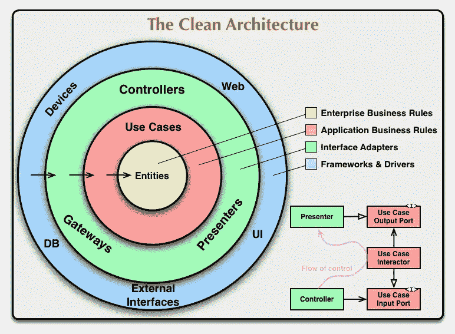
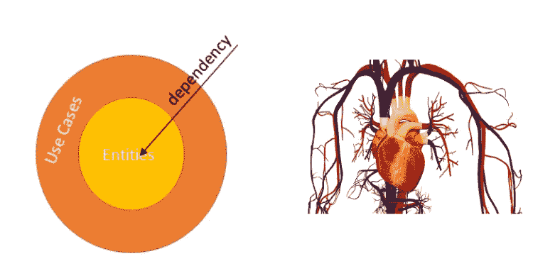
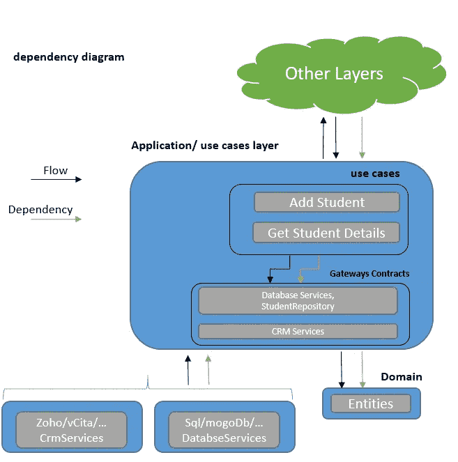
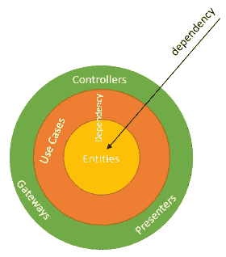
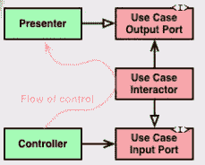

# 节点清洁架构—深入探讨

> 原文：<https://betterprogramming.pub/node-clean-architecture-deep-dive-ab68e523554b>

## 如何在您的节点应用程序中分离关注点


[钳工](https://unsplash.com/@benchaccounting?utm_source=medium&utm_medium=referral)在 [Unsplash](https://unsplash.com?utm_source=medium&utm_medium=referral) 上拍照

> “你的架构应该告诉读者关于系统的信息，而不是你在系统中使用的框架。”——罗伯特·c·马丁

最近，我们不得不为公司构建一个新的应用程序。在进行业务和技术设计(这超出了本文的范围)之后，我们决定该应用程序应该是一个使用 REST API 的单页面应用程序。

我们选择的技术组合是:

*   客户:反应
*   服务器(API + persistent):节点和[弹性搜索](https://www.elastic.co/)。

来自面向对象的语言背景，我们自然希望在新的闪亮的节点 API 中保持我们所有的[坚实的](https://en.wikipedia.org/wiki/SOLID)原则。

像任何其他架构一样，我们必须在实现中做出不同的权衡。我们必须小心，不要过度设计或过度抽象我们的层，但仍然保持所需的灵活性。

近年来，我们在 API 项目中实现了 Robert c . Martin(Bob 叔叔)的 clean architecture。该建筑试图将一些领先的现代建筑，如[六边形建筑](https://en.wikipedia.org/wiki/Hexagonal_architecture_(software))、[洋葱建筑](http://jeffreypalermo.com/blog/the-onion-architecture-part-1/)和[尖叫建筑](http://blog.cleancoder.com/uncle-bob/2011/09/30/Screaming-Architecture.html)整合成一个主建筑。

它旨在实现关注点的良好分离。像大多数架构一样，它也旨在使应用程序更灵活地适应客户需求中不可避免的变化(这种情况经常发生)。



节点清理架构图

这张图表摘自罗伯特·c·马丁的官方文章。我建议在深入研究节点实现之前阅读他的文章。这是关于该架构的最佳来源知识。

关于这个图以及如何阅读它的一些话(如果您还不理解它，请不要担心，我们将在本文中深入研究每一层):

*   层:每个环代表应用程序中的一个隔离层。
*   依赖:依赖方向是由外向内。这意味着实体层是独立的，而框架层(web、UI 等)是独立的。)取决于所有其他层。
*   实体:包含构建我们的应用程序的所有业务实体。
*   用例:这是我们集中逻辑的地方。每个用例为一个特定的业务用例编排所有的逻辑(例如向系统添加新的客户)。
*   控制器和表示器:我们的控制器、表示器和网关是中间层。您可以将它们视为用例的入口和出口。
*   框架:这一层有所有的具体实现。数据库、web 框架、错误处理框架等。Robert C. Martin 描述了这一层:“*这一层是所有细节的所在。网络是一个细节。数据库是一个细节。我们把这些东西放在外面，让它们伤害很小。”*

此时，您可能会对自己说:“数据库在外层，数据库是一个细节？”数据库应该是我的核心层。

我喜欢这个建筑，因为它背后有一个聪明的动机:

这种架构关注的不是框架和工具，而是应用程序的业务逻辑。它是独立于框架的(尽可能独立)。

这意味着无论您使用哪个数据库、开发框架、UI 或外部服务，应用程序的实体和业务逻辑都将保持不变。

我们可以在不改变逻辑的情况下改变以上所有内容。这使得测试用这种架构构建的应用程序变得如此容易。如果您还不理解这一点，请不要担心，我们将一步一步地探索它。

在本文中，我们将通过一个示例应用程序的例子来慢慢解开架构的不同层。

像任何其他架构一样，有许多不同的方法来实现它，每种方法都有自己的考虑和权衡。

在本文中，我将解释如何在 Node 中实现这种架构。我将试着解释在这个过程中不同的实现考虑。

让我们仔细看看这个示例应用程序。

# 示例应用程序

我们的示例应用程序是一个学生注册应用程序。该应用程序拥有一个学生，课程和注册列表。我们的后端应用程序是一个简单的节点 API，支持所有的应用程序用例。

在本文中，我们将逐层实现后端 API。你可以在 [GitHub repo](https://github.com/royib/clean-architecture-node) 中找到所有代码。文章包含代码的一部分，但是最好的方法(在我看来)是在阅读文章的同时探索代码。

# 实体和用例

> 这一层中的软件包含特定于应用程序的业务规则。它封装并实现了系统的所有用例。这些用例编排了实体之间的数据流，并指导这些实体使用其企业范围的业务规则来实现用例的目标。”罗伯特·马丁



在应用程序的核心，我们有两层:

*   实体层:包含构建我们的应用程序的所有业务实体。
*   用例层:包含我们的应用程序支持的所有业务场景。

我们将从内到外，或者从依赖规则的相反方向，遍历架构。

在内部，我们有独立的核心层。这些层包含业务和逻辑规则。框架在这些领域是罕见的生物；这些层应该会发生变化，主要是由于业务规则的变化。

当我们进入外层时，我们会发现更多的框架和更多的代码由于技术或效率的原因而随时间改变。

实体是一个独立的层，用例只依赖于它们。

在我们的示例应用程序中，您可以在`[src/entities](https://github.com/royib/clean-architecture-node/tree/master/src/entities)`文件夹下找到所有的实体，在`[src/application/use_cases](https://github.com/royib/clean-architecture-node/tree/master/src/application/use_cases)`文件夹下找到所有的用例。

# 实体

我们应用程序中的业务实体包括:

## **学生**

*   `ID`
*   `FirstName`
*   `LastName`
*   `FullName`
*   `Enrolments`

## **课程**

*   `ID`
*   `Name`

## **报名**

*   `Course`
*   `Grade`

`/Entities`

这一层是独立的，这意味着您将不会在实体的 JS 文件中看到任何`“require (‘…’)”`。

这一层不会受到路由或控制器等外部变化的影响，您可以将这些实体与任何数据库(SQL、NoSQL)保持一致。

# 用例

这是我们集中逻辑的地方。每个用例为一个特定的业务用例编排所有的逻辑。我们的应用程序 API 需要支持这些用例:

*   得到所有学生的名单。
*   获取单个学生的详细信息和注册情况。
*   添加新学生。
*   为学生添加注册。

让我们检查一下“添加新学生”用例。用例的主要职责是:

*   业务规则验证。
*   检查数据库中是否不存在该学生。
*   创建一个新的学生对象。
*   将新学生添加到数据库中。
*   更新大学 CRM 系统。

为了对数据应用验证规则，可以使用像 [Joi](https://www.npmjs.com/package/joi) 这样的库进行对象模式验证。使用 Joi，您可以描述实体的模式，并在插入之前应用验证规则。

举个更简洁的例子(框架不应该泄露给实体层！)，我决定保持这一层不受外部框架的影响。

通过查看用例的职责，我们可以看到用例有两个依赖项:

*   数据库服务:用例需要保存学生的详细信息，并检查他们是否在系统中不存在。例如，这个功能可以实现为一个调用 SQL 或 MongoDB 的类。
*   CRM 服务:用例需要通知大学 CRM 应用程序关于新生的情况。例如，这个功能可以实现为一个调用 [Zoho](https://www.zoho.com/) 或 [vCita](https://www.vcita.com/) CRM 的类。

一种选择是在用例中要求数据库和 CRM 服务的具体实现(例如，直接调用 SQL SDK)。该选项将使我们的数据库和 CRM 服务的具体实现与用例紧密耦合。

数据库/CRM 服务的任何变化(如 SDK 的变化)都会导致我们用例的变化。这个选项将打破我们干净的架构假设，即用例是独立的，框架(如数据库和外部服务)对内部层(如用例)是不可见的。

我们的用例只知道实体。此外，测试用例将变得更加困难。

好的，让我们假设用例不知道任何关于具体数据库的事情，比如 SQL 或者 [MongoDB](https://www.mongodb.com/) 。它仍然需要与他们交互来执行任务(比如在数据库中保存一个学生)，但是如果它不知道他们，它怎么能做到呢？

解决方案是在用例与外部世界之间建立网关。

这就是抽象拯救的地方。我们不是在特定的数据库或特定的 CRM 系统上创建依赖关系，而是在抽象上创建依赖关系。但是，抽象到底是什么？

抽象是创建服务蓝图而不实现它们的方式。为了创建抽象，我们需要做几件事情。

首先，每个用例类需要在其构造函数中将其依赖项定义为参数。例如，您可以看到,`AddStudent`用例期望两个参数。

一个[应用程序/用例/添加学生。js](https://github.com/royib/clean-architecture-node/blob/master/src/application/use_cases/AddStudent.js)

```
module.exports = (StudentRepository, CrmServices) => {}
```

其次，我们需要定义我们期望从这些服务中得到什么。换句话说，我们需要定义他们需要做什么。例如，学生存储库需要有一个“添加学生”功能。在这个过程的最后，我们将能够定义一个契约。

这是用例与框架之间的契约。框架是具体的数据库和 CRM 服务。

## 那些合同是什么？

基本上，契约是所需服务的功能签名。例如，CRM 服务需要提供一个“notify”函数，该函数获取一个`student`对象作为参数，并返回一个带有布尔值的承诺。

学生存储库合同告诉我们，存储库必须包含`get`、`add`、`update`和`delete`功能。

在像 C#和 Java 这样的语言中，我们有接口和抽象类来帮助我们实现这种契约，但是在 JS 中我们没有。

我们将通过创建一个包含没有实现的规范的“基类”来克服这个问题。与 C#不同，JavaScript 不会强制执行这些契约(这意味着当契约没有在具体类中完全实现时，它不会抛出错误)。

相反，契约将被很好地记录，并且基类(您可以把它看作一个抽象类)将作为一个后备，如果其中一个方法没有在具体类中实现的话。

所有的契约都位于应用程序层的[契约](https://github.com/royib/clean-architecture-node/tree/master/src/application/contracts)应用程序/契约/数据库服务下。js 。

[申请/合同/学生仓库。js](https://github.com/royib/clean-architecture-node/blob/master/src/application/contracts/StudentRepository.js)

应用程序/合同/CrmServices.js



> 使这种体系结构起作用的首要规则是依赖性规则。这条规则说源代码依赖只能指向内部。内圈的任何东西都不可能了解外圈的任何东西。特别是外圈声明的东西的名字一定不能被内圈的代码提及。这包括函数和类。变量或任何其他命名的软件实体*”—罗伯特·c·马丁*

在上图中，我们可以看到控制的反转，用例依赖于它们定义的抽象(橙色箭头指向网关契约)。

用例不依赖于除实体之外的其他层。外部世界需要遵循这些抽象来与用例对话(他们需要遵循契约)。

无依赖性意味着外部世界的变化不会影响用例及实体。依赖关系是从流中反转出来的。

# 控制器和演示者

> “这一层中的软件是一组适配器，它们将数据从对用例及实体最方便的格式转换成对某些外部机构(如数据库或 web)最方便的格式。例如，正是这一层将完全包含 GUI 的 MVC 架构。演示者、视图和控制者都属于这里" *—罗伯特·c·马丁*

在上一节中，我们讨论了我们的核心业务层，以及它们如何只依赖于它们定义的抽象。现在我们将讨论适配器，因此您在这里不会看到任何业务逻辑或框架。



控制器和演示者图表

我们的控制器、演示者和网关是中间层。你可以把它们想象成一个适配器，把我们的用例与外部世界粘合起来，反之亦然。



控制流程

外界是谁？

如果你来自 MVC、MVVM 或 MVP 世界，你可能听说过控制器。在经典的 MVC/MVP 中，控制器的工作是响应用户输入，验证它，做一些业务逻辑的事情，并且通常改变应用程序的状态。

另一方面，表示器从某种存储库中接收数据，并为视图层格式化数据。

# 控制器

在干净的架构中，控制器的工作是:

*   接收用户输入。
*   验证用户输入-净化。
*   将用户输入转换成用例期望的模型。例如，做日期格式和字符串到整数的转换。
*   调用用例并传递给它新的模型。

控制器是一个适配器，我们不需要任何业务逻辑，只需要数据格式化逻辑。

# 提出者

演示者将从应用程序存储库中获取数据，然后构建一个`ViewModel`。其主要职责包括:

*   格式化字符串和日期。
*   添加演示数据，如标志。
*   准备要在 UI 中显示的数据。

在我们的节点实现中，我们将一起实现控制器和表示器，就像我们在 MVC 项目中所做的一样。

您可以在项目中的`[src/controller](https://github.com/royib/clean-architecture-node/tree/master/src/controllers/)`文件夹下找到控制器代码。

[控制器/学生/学生控制器. js](https://github.com/royib/clean-architecture-node/blob/master/src/controllers/students/StudentController.js)

关于实现的一些话:

*   依赖性被注入到控制器中。它提取它需要的东西，并把它们传递给用例。稍后，我们将讨论依赖注入。
*   `AddStudent`是一个[工厂函数](https://www.youtube.com/watch?v=ImwrezYhw4w)，它返回一个`AddStudent`用例对象。
*   我们从请求体对象中提取学生属性。在这里，我们可以添加格式化逻辑，比如日期格式和字符串操作。
*   用提取的属性调用用例，并按照承诺的结果行动。
*   在结果从用例中返回之后，我们可以使结果适应视图。我们可以操纵模型，使其最适合视图逻辑。


控制器和演示者依赖关系图

控制器充当外部世界和用例层之间的中介。这取决于用例，但它们并不依赖于它。

# 结构


节点清洁架构—框架

> “这一层是所有细节的所在。网络是一个细节。数据库是一个细节。我们把这些东西放在外面，让它们伤害很小”——罗伯特·c·马丁

在上一节中，我们讨论了适配器层，以及它们如何作为用例的入口和出口。

现在，我们将讨论框架层，这一层包括我们所有的具体实现，如数据库、web 框架、错误处理等。

在我们的[示例项目](https://github.com/royib/clean-architecture-node)中，框架被实现为:

*   web 应用框架由 Express 实现。
*   数据库服务被实现为一个简单的内存数据库。
*   CRM 服务是一个简单的模拟服务。

使用内存数据库实现学生存储库。
[框架/持久性/in memory/inmemorystudentrepository . js](https://github.com/royib/clean-architecture-node/tree/master/src/frameworks/persistance/InMemory)

# 依赖注入

正如我们之前讨论的，我们的用例依赖于契约而不是实现。这些契约需要在运行时通过依赖注入来满足。

如果您不熟悉依赖注入的概念，我鼓励您看一看 Fun Fun Fun Function 博客上的两个很好的视频，它们完美地解释了这个主题:

*   [依赖注入基础知识](https://www.youtube.com/watch?v=0X1Ns2NRfks)
*   [控制反转](https://www.youtube.com/watch?v=-kpEP4JeEdc)

有几个库为 Node 中的依赖注入提供支持，但是出于学习的目的，我决定不使用任何外部库来实现它。对于一个较大的项目，建议考虑使用外部库进行 DI。

在我们的示例项目中，我们有一个工厂函数，它返回一个包含项目所有必需依赖项的对象。

[Config/project dependencies . js](https://github.com/royib/clean-architecture-node/blob/master/src/config/projectDependencies.js)

这是唯一包含具体实现信息的文件。

这些依赖性是通过不同的层注入的。框架层是唯一控制所有不同契约的真正实现的层。

我们的 web 层是由一个带有几个路由的 express 服务器实现的。

例如，如果我们想用 MongoDB 替换内存中的数据库服务，我们需要:

*   使用 MongoDB 实现创建新的数据库服务类。
*   使用 MongoDB 实现创建一个新的学生存储库类。
*   更改`Config/projectDependencies.js`:

# 摘要

在本文中，我们展示了如何逐层构建健壮的结构，将核心业务逻辑从框架中分离出来。

其他客户端可以访问用例，我们不局限于特定的 web 服务器。我们可以很容易地用 MongoDB/Elasticsearch 替换我们的数据库，或者迁移到一个新的 CRM 系统，所有这些都不涉及我们的逻辑。

我们还可以通过只接触框架层来对我们的一个框架中的 SDK 变化做出反应。由于各层的松散耦合架构，测试也变得很容易。

在复杂的项目中，保持所有层的整洁是困难的，有时甚至是乏味的。它总是关于架构中的权衡，并且我们不时需要妥协和打破我们的界限以获得另一个好处。

我相信，如果我们努力遵守这些规则，我们将在未来获得巨大的利益。