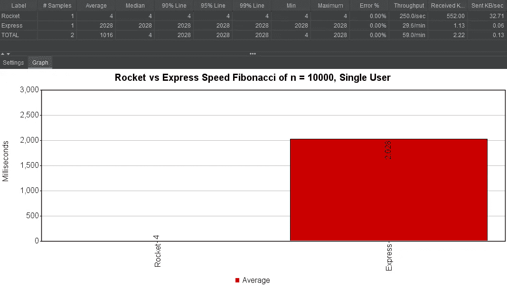
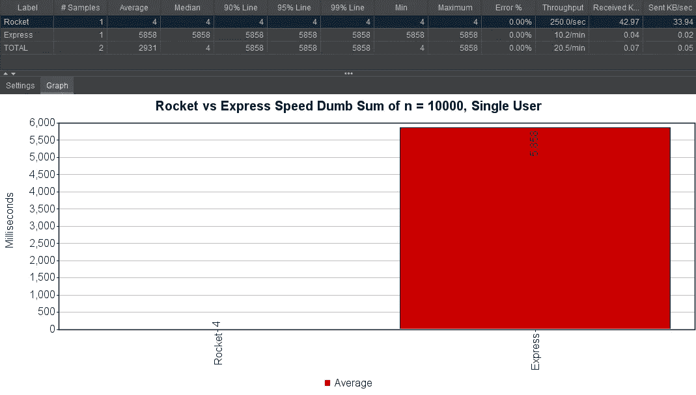
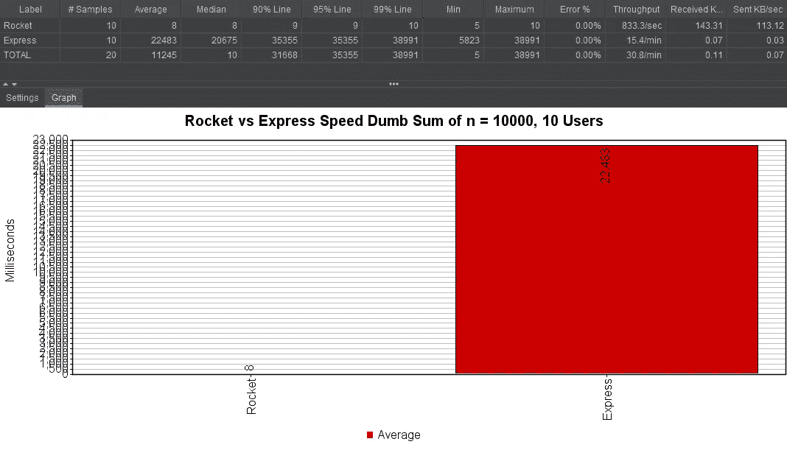

# 节点快车 vs. Rust 火箭

> 原文：<https://betterprogramming.pub/node-express-vs-rust-rocket-speed-comparison-db43a5cf4537>

## 速度对比

由[克里斯蒂安·恩格梅尔](https://unsplash.com/@christianem?utm_source=medium&utm_medium=referral)在 [Unsplash](https://unsplash.com?utm_source=medium&utm_medium=referral) 上拍摄的照片。

在过去的几个月里，我一直在努力学习 Rust 编程语言。到目前为止，我对它印象颇深。

有大量令人难以置信的 Rust 功能，它实际上已经连续四年被 Stack Overflow 开发者调查( [2019 结果](https://insights.stackoverflow.com/survey/2019#most-loved-dreaded-and-wanted))评为最受欢迎的编程语言。关于 Rust 我不会说太多细节，但是[这篇伟大的文章](https://stackoverflow.blog/2020/01/20/what-is-rust-and-why-is-it-so-popular)解释了这种语言是什么以及为什么人们喜欢它。

我过去曾使用 Node 的 [Express](https://expressjs.com/) 构建过一些 API，所以我想直接将其与 Rust 的 [Rocket](https://rocket.rs/) 进行比较。缺乏一点创造性，我为每台服务器创建了两个函数。

斐波那契数列数字查找器:

和一个`Dumb Sum` —一个以一种愚蠢的方式找到从 *0* 到 *n* 的总和的函数。它计算第一个数字，然后第一个和第二个，然后第一个、第二个和第三个，依此类推，直到到达 *n* :

事不宜迟，结果如下。

斐波那契(`/api/fib?n=10000`):

n = 10000 的火箭 vs .高速斐波那契

哑求和(`/api/dumb-sum?n=10000`):

火箭 vs 快车 n = 10000 的哑和

测试是用 [Apache Jmeter](https://jmeter.apache.org/) 完成的。所有测试都在我的机器上本地运行。如果你想自己运行代码，可以克隆[这个回购](https://github.com/dsegovia90/express-vs-rocket/tree/master)。

希望这篇文章能激发你去看看 Rust 和 Rocket。感谢您的阅读！

*注意:Express'* `*dumb-sum*` *有多个用户的 API 端点非常慢，因为一个用户调用会阻塞下一个用户的调用。因此，发出请求的第十个用户必须等待其他九个请求先完成。*

*如果你打算下载代码并在本地运行，确保你构建的 Rocket 带有* `*--release*` *标志。Rocket 还需要 Rust 的夜间版本。*