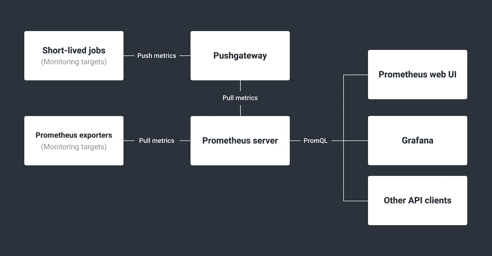
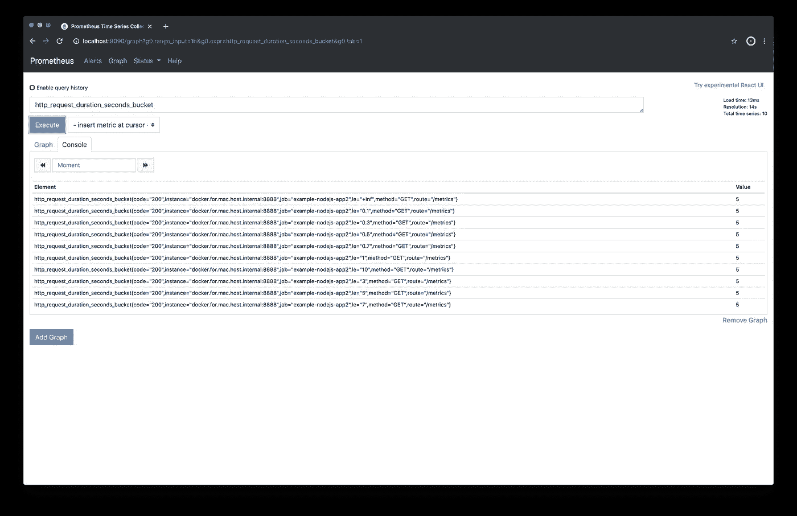
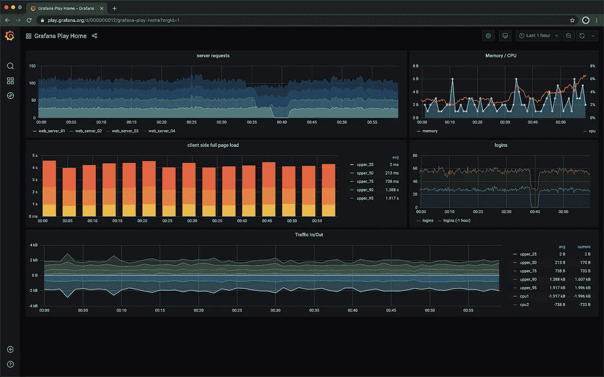
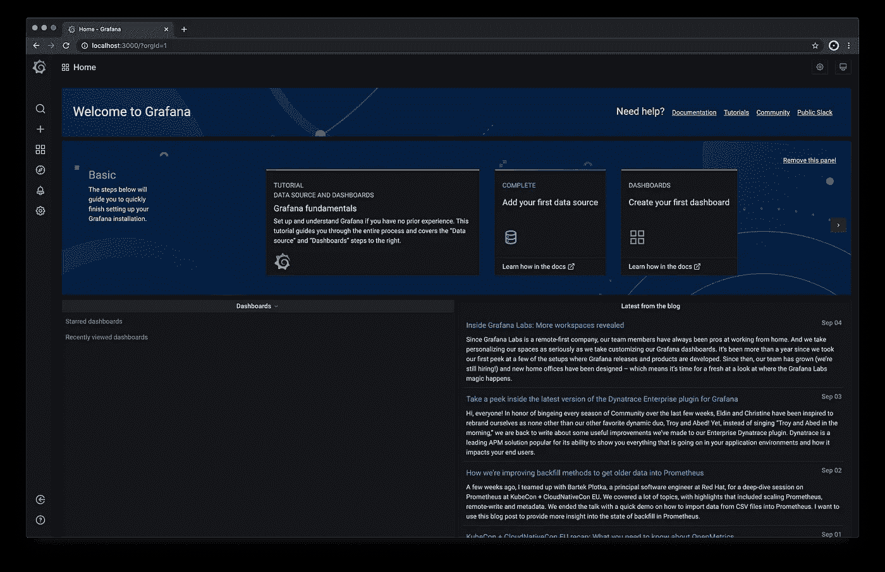
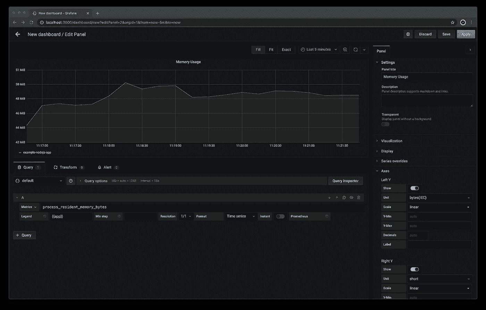
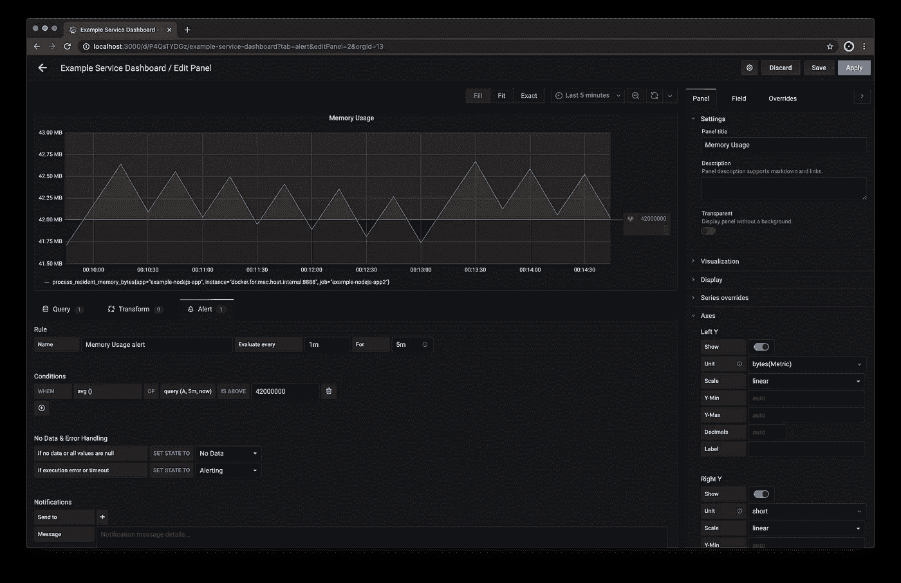
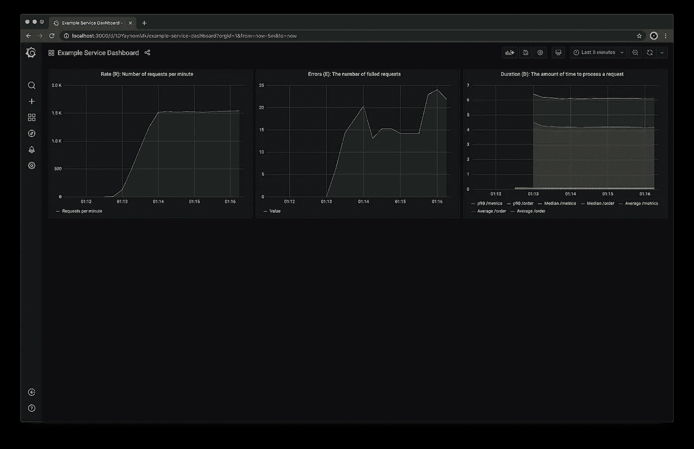
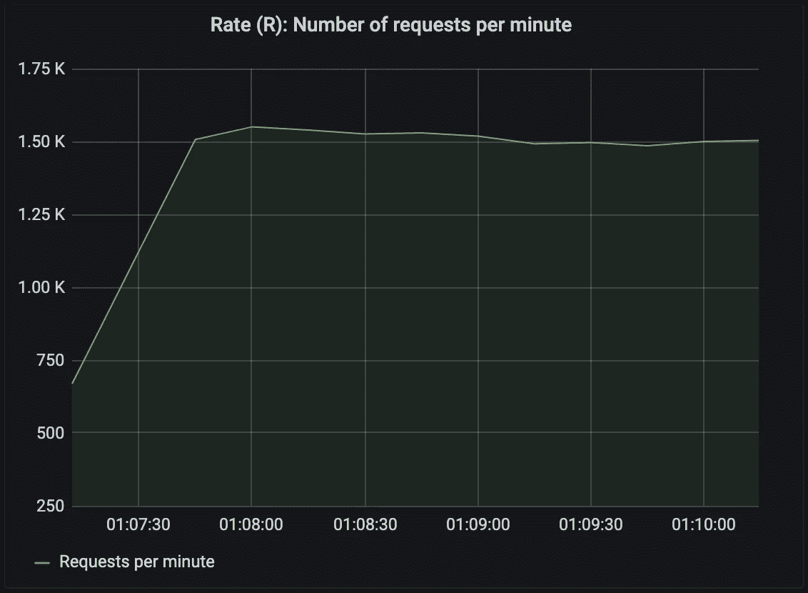
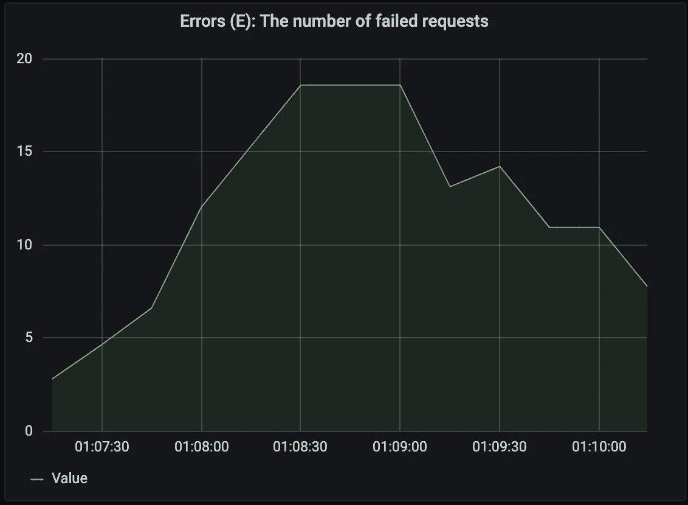
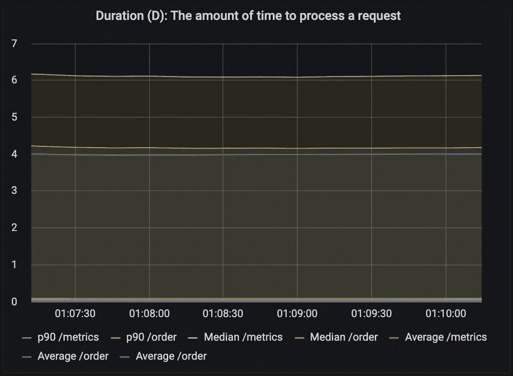

# 使用 Prometheus 和 Grafana 监控 Node.js 应用程序

> 原文：<https://betterprogramming.pub/node-js-application-monitoring-with-prometheus-and-grafana-b08deaf0efe3>

## 应用程序监控对于每个生产软件系统都是必不可少的


# 什么是应用程序监控，为什么有必要进行监控？

应用程序监控是一种使用软件工具来深入了解软件部署的方法。这可以通过简单的健康检查来实现，以查看服务器是否可用于更高级的设置，在这些设置中，监控库集成到您的服务器中，并将数据发送到专用的监控服务。它甚至可以涉及到应用程序的客户端，为用户体验提供更详细的见解。

对于每个开发人员来说，监控应该是日常工作中至关重要的一部分，因为您需要知道软件在生产中的行为。您可以让您的测试人员与您的系统一起工作，并尝试模拟交互或高负载，但是这些技术永远不会与真实的生产工作负载相同。

# 什么是普罗米修斯，它是如何工作的？

Prometheus 是 SoundCloud 在 2012 年创建的一个开源监控系统。2016 年，Prometheus 成为云原生计算基金会托管的第二个项目(继 Kubernetes 之后)。



Prometheus 服务器以预定义的时间间隔通过 HTTP 从您的服务器和其他监视目标收集指标。对于短暂的批处理作业，由于其短暂的性质，无法定期收集指标，Prometheus 提供了一个 Pushgateway。这是一个中间服务器，监视目标可以在退出之前将它们的指标推送到该服务器。数据会保留在那里，直到 Prometheus 服务器稍后将其取出。

Prometheus 的核心数据结构是时间序列，它实质上是一个按指标分组的带有时间戳的值列表。

通过 PromQL (Prometheus 查询语言)，Prometheus 提供了一种函数式查询语言，允许实时选择和汇总时间序列数据。查询结果可以直接在 Prometheus web UI 中查看，也可以通过 HTTP API 由外部系统(如 Grafana)使用。

# 如何使用 prom-client 为 Prometheus 导出节点中的指标

prom-client 是最流行的 Prometheus Node 客户端库。

它提供了通过拉和推方法将指标导出到 Prometheus 的构建模块，并支持[所有 Prometheus 指标类型，](https://prometheus.io/docs/concepts/metric_types/#metric-types)如直方图、摘要、计量器和计数器。

# 建立一个示例节点项目

创建一个新目录，并设置节点项目:

```
$ mkdir example-nodejs-app
$ cd example-nodejs-app
$ npm init -y
```

# 安装 prom 客户端

prom 客户端 npm 模块可以通过以下方式安装:

```
$ npm install prom-client
```

# 公开默认指标

每个 Prometheus 客户端库都带有预定义的默认指标，这些指标被认为适用于特定运行时的所有应用程序。prom 客户端库[也遵循这个约定](https://github.com/siimon/prom-client#default-metrics)。默认指标对于监控内存和 CPU 等资源的使用非常有用。

您可以使用下面的代码片段来捕获和公开默认指标:

```
const http = require('http')
const url = require('url')
const client = require('prom-client')// Create a Registry which registers the metrics
const register = new client.Registry()// Add a default label which is added to all metrics
register.setDefaultLabels({
  app: 'example-nodejs-app'
})// Enable the collection of default metrics
client.collectDefaultMetrics({ register })// Define the HTTP server
const server = http.createServer(async (req, res) => {
  // Retrieve route from request object
  const route = url.parse(req.url).pathname if (route === '/metrics') {
    // Return all metrics the Prometheus exposition format
    res.setHeader('Content-Type', register.contentType)
    res.end(register.metrics())
  }
})// Start the HTTP server which exposes the metrics on http://localhost:8080/metrics
server.listen(8080)
```

# 公开自定义指标

虽然默认指标是一个很好的起点，但在某些时候，您需要定义自定义指标，以便掌握全局。

捕获和公开 HTTP 请求持续时间的自定义度量可能如下所示:

```
const http = require('http')
const url = require('url')
const client = require('prom-client')// Create a Registry which registers the metrics
const register = new client.Registry()// Add a default label which is added to all metrics
register.setDefaultLabels({
  app: 'example-nodejs-app'
})// Enable the collection of default metrics
client.collectDefaultMetrics({ register })// Create a histogram metric
const httpRequestDurationMicroseconds = new client.Histogram({
  name: 'http_request_duration_seconds',
  help: 'Duration of HTTP requests in microseconds',
  labelNames: ['method', 'route', 'code'],
  buckets: [0.1, 0.3, 0.5, 0.7, 1, 3, 5, 7, 10]
})// Register the histogram
register.registerMetric(httpRequestDurationMicroseconds)// Define the HTTP server
const server = http.createServer(async (req, res) => {
    // Start the timer
  const end = httpRequestDurationMicroseconds.startTimer() // Retrieve route from request object
  const route = url.parse(req.url).pathname if (route === '/metrics') {
    // Return all metrics the Prometheus exposition format
    res.setHeader('Content-Type', register.contentType)
    res.end(register.metrics())
  } // End timer and add labels
  end({ route, code: res.statusCode, method: req.method })
})// Start the HTTP server which exposes the metrics on http://localhost:8080/metrics
server.listen(8080)
```

将上面的代码复制到一个名为`server.js`的文件中，用下面的命令启动节点 HTTP 服务器:

```
$ node server.js
```

现在，您应该能够通过`[http://localhost:8080/metrics](http://localhost:8080/metrics)`访问指标了。

# 如何从普罗米修斯那里获得度量

Prometheus 是一个 Docker 映像，可以通过 YAML 文件进行配置。创建一个名为`prometheus.yml`的配置文件，内容如下:

```
global:
  scrape_interval: 5s
scrape_configs:
  - job_name: "example-nodejs-app"
    static_configs:
      - targets: ["docker.for.mac.host.internal:8080"]
```

配置文件告诉 Prometheus 每五秒钟抓取一次所有的目标。目标在`scrape_configs`中定义。在 Mac 上，您需要使用`docker.for.mac.host.internal`作为主机，这样 Prometheus Docker 容器就可以抓取本地节点 HTTP 服务器的指标。在 Windows 上使用`docker.for.win.localhost`，在 Linux 上使用`localhost`。

使用`docker run`命令启动 Prometheus Docker 容器，并挂载配置文件(`prometheus.yml`):

```
$ docker run --rm -p 9090:9090 \
  -v `pwd`/prometheus.yml:/etc/prometheus/prometheus.yml \
  prom/prometheus:v2.20.1
```

Windows 用户需要将`pwd`替换为他们当前工作目录的路径。

您现在应该能够在`[http://localhost:9090](http://localhost:9090/)`访问 Prometheus Web UI。



# 什么是 Grafana，它是如何工作的？

Grafana 是一个 web 应用程序，允许您可视化数据源。可视化可以是图形或图表。它有多种图表类型，允许您选择任何适合您的监控数据需求的图表。在 Grafana 中，多个图表被分组到仪表板中，因此可以一次查看多个指标。

Grafana 图表中显示的指标来自数据源。Prometheus 是 Grafana 支持的数据源之一，但它也可以使用其他系统，如 Amazon CloudWatch 或 Azure Monitor。

Grafana 还允许您定义在某些问题出现时触发的警报，这意味着如果出现问题，您将收到电子邮件通知。有关更高级的警报设置，您可以阅读关于 [Grafana 集成 Opsgenie](https://docs.opsgenie.com/docs/grafana-integration) 的信息。



# 开始 Grafana

Grafana 也可作为码头集装箱。Grafana 数据源可以通过配置文件进行配置。

创建一个名为`datasources.yml`的配置文件，内容如下:

```
apiVersion: 1datasources:
  - name: Prometheus
    type: prometheus
    access: proxy
    orgId: 1
    url: http://docker.for.mac.host.internal:9090
    basicAuth: **false**
    isDefault: **true**
    editable: **true**
```

配置文件指定 Prometheus 作为 Grafana 的数据源。请注意，在 Mac 上，我们需要使用`docker.for.mac.host.internal`作为主机，以便 Grafana 可以访问 Prometheus。在 Windows 上，使用`docker.for.win.localhost`，对于 Linux，使用`localhost`。

使用下面的命令启动 Grafana Docker 容器，并挂载数据源的配置文件(`datasources.yml`)。我们还传递一些环境变量来禁用登录表单，并允许匿名访问 Grafana:

```
$ docker run --rm -p 3000:3000 \
  -e GF_AUTH_DISABLE_LOGIN_FORM=true \
  -e GF_AUTH_ANONYMOUS_ENABLED=true \
  -e GF_AUTH_ANONYMOUS_ORG_ROLE=Admin \
  -v `pwd`/datasources.yml:/etc/grafana/provisioning/datasources/datasources.yml \
  grafana/grafana:7.1.5
```

Windows 用户需要用当前工作目录的路径替换`pwd`。

您现在应该能够在`[http://localhost:3000](http://localhost:3000/)`访问 Grafana Web UI。



# 配置 Grafana 仪表板

一旦这些指标在 Prometheus 中可用，我们希望在 Grafana 中查看它们。这需要创建一个仪表板并向该仪表板添加面板:

1.  在`[http://localhost:3000](http://localhost:3000/)`进入 Grafana UI，点击左边的“+”按钮，选择“仪表板”。
2.  在新仪表板中，单击“添加新面板”按钮。
3.  在编辑面板视图中，您可以选择一个指标并为其配置图表。
4.  左下方的指标下拉菜单允许您从可用的指标中进行选择。让我们在这个例子中使用一个默认的指标。
5.  在指标输入中输入`process_resident_memory_bytes`，在图例输入中输入`{{app}}`。
6.  在右侧面板上，输入`Memory Usage`作为面板标题。
7.  因为度量的单位是字节，所以我们需要在 Axes 部分为左侧的 *y* 轴选择“bytes(Metric)”，以便于人们阅读图表。

现在您应该看到一个图表，显示了节点 HTTP 服务器的内存使用情况。



按“应用”保存面板。回到仪表板，单击右上角的小保存符号。将出现一个弹出窗口，允许您保存新创建的控制面板供以后使用。

# 在 Grafana 中设置警报

因为没有人想整天坐在 Grafana 前面看着，等着看事情是否出错，Grafana 允许你定义警报。这些警报定期检查指标是否符合特定的 rul，例如，每秒错误数是否超过特定值。

可以为仪表板中的每个面板设置警报。

1.  进入我们刚刚创建的 Grafana 仪表板。
2.  单击面板标题，然后选择编辑。
3.  在编辑视图中，从中间选项卡中选择“警报”，然后按“创建警报”按钮。
4.  在条件部分中，在 IS ABOVE 之后指定`42000000`。这告诉 Grafana 当节点 HTTP 服务器消耗超过 42 MB 内存时触发警报。
5.  按右上角的“应用”按钮保存警报。



# 示例代码库

我们创建了一个[代码库](https://github.com/coder-society/nodejs-application-monitoring-with-prometheus-and-grafana)，其中包含一组 Docker 容器，包括 Prometheus、Grafana 和一个节点示例应用程序。它还包含一个 Grafana 仪表板，遵循[红色监控方法](https://grafana.com/blog/2018/08/02/the-red-method-how-to-instrument-your-services/)。

克隆存储库:

```
$ git clone [https://github.com/coder-society/nodejs-application-monitoring-with-prometheus-and-grafana.git](https://github.com/coder-society/nodejs-application-monitoring-with-prometheus-and-grafana.git)
```

节点 app 的 JavaScript 代码位于`[/example-nodejs-app](https://github.com/coder-society/nodejs-application-monitoring-with-prometheus-and-grafana/tree/master/example-nodejs-app)` 目录。所有容器都可以通过`docker-compose`方便地启动。在项目根目录中运行以下命令:

```
$ docker-compose up -d
```

执行该命令后，一个节点应用 Grafana 和 Prometheus 将在后台运行。可以在`[http://localhost:3000/d/1DYaynomMk/example-service-dashboard](http://localhost:3000/d/1DYaynomMk/example-service-dashboard)`通过 Grafana UI 访问和查看收集的指标图表。



为了给 Node 应用程序生成流量，我们将使用 [ab，Apache 基准测试命令行工具](https://httpd.apache.org/docs/2.4/programs/ab.html)，它允许从命令行发送请求。

在 MacOS 上，它是默认预装的。在基于 Debian 的 Linux 发行版上，可以使用以下命令安装 ab:

```
$ apt-get install apache2-utils
```

对于 Windows，你可以从 Apache Lounge 下载二进制文件作为 ZIP 存档文件。ab 将在那个档案中被命名为`ab.exe`。

此 CLI 命令将运行 ab，以便向节点应用程序的`[/order](https://github.com/coder-society/nodejs-application-monitoring-with-prometheus-and-grafana/blob/master/example-nodejs-app/index.js#L22)`端点发送 10，000 个请求:

```
$ ab -m POST -n 10000 -c 100 [http://localhost:8080/order](http://localhost:8080/order)
```

根据您的硬件，运行此命令可能需要一些时间。

运行`ab`命令后，您可以通过`[http://localhost:3000/d/1DYaynomMk/example-service-dashboard](http://localhost:3000/d/1DYaynomMk/example-service-dashboard)`访问 Grafana 仪表盘。



*图 1:每分钟的请求数*

图 1 显示节点应用程序每分钟处理大约 1，500 个请求。



*图 2:每分钟请求错误数*

图 2 显示每分钟最多有 20 个错误。



*图 3:请求持续时间*

图 3 显示了处理一个请求所花费的时间。此处显示的是 Node.js 应用程序不同端点的第 90 个百分位数、中值和平均持续时间。第 90 个百分位数是最慢的 10%的请求。对于我们用 ab 发送的 10，000 个请求，这意味着花费时间最长的 1，000 个请求。在本例中，它显示了对`/order`端点的 1，000 个请求花费了 6 秒多时间。

# 摘要

Prometheus 是一个强大的自托管监控开源工具。对于既不想从头开始构建，又不想投资 SaaS 解决方案的情况，这是一个不错的选择。

有了一个面向 Node 的社区支持的客户端库和许多面向其他语言的客户端库，所有系统的监控都可以集中在一个地方。

它的集成非常简单，只需要几行代码。对于长期运行的服务，可以直接完成；对于短期作业和基于 FaaS 的实现，可以借助推送服务器来完成。

Grafana 也是一个开源工具，可以很好地与 Prometheus 集成。它提供的众多优势包括灵活的配置、允许您可视化任何相关指标的仪表板，以及通知任何异常行为的警报。

这两种工具结合起来提供了一种直观的方式来深入了解您的系统。Prometheus 在收集指标方面提供了巨大的灵活性，Grafana 提供了许多不同的图表来显示这些指标。Prometheus 和 Grafana 也彼此整合得如此之好，令人惊讶的是它们不是一个产品的一部分。

现在，您应该对 Prometheus 和 Grafana 有了很好的了解，并且知道如何利用它们来监控您的节点项目，以便对您的软件部署有更多的了解和信心。