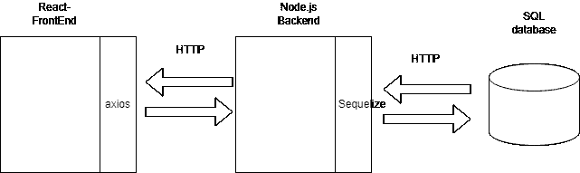
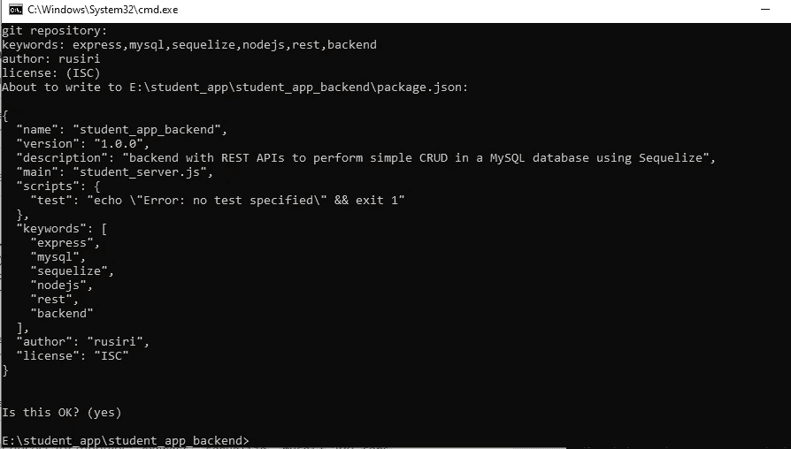
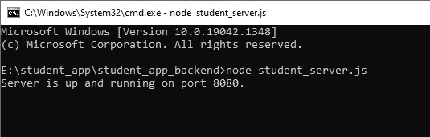
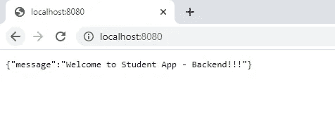

# 使用顺序化 ORM 连接 Node.js 服务器和 SQL 数据库

> 原文：<https://betterprogramming.pub/node-js-backend-to-connect-mysql-database-using-sequelize-modeling-8cc637ed5f29>

## 创建处理 SQL 数据库的松耦合 Node.js 后端服务器的指南


詹姆斯·麦金文在 [Unsplash](https://unsplash.com?utm_source=medium&utm_medium=referral) 上拍摄的照片

在本教程中，我将指导您创建一个松散耦合的 Node.js 后端服务器来处理 SQL 数据库，使用 Sequelize 来执行对象关系映射。

前端应用程序将使用 React 构建，但我们将在另一篇文章中介绍。在本文中，我们将重点放在后端服务器上。

这里我将使用`Express`，它是 Node.js 的后端 web 应用程序框架。

# 什么是顺序化？

直接引自[官方文件](https://sequelize.org/):

> Sequelize 为 Postgres、MySQL、MariaDB、SQLite 和 Microsoft SQL Server 提供了基于 promise 的 Node.js **对象关系映射**。它具有可靠的事务支持、关系、急切加载和延迟加载、读取复制等特性。

换句话说，Sequelize 完成了 JavaScript 的面向对象用法和关系 SQL 数据库之间的映射。

## 我们要做什么？

我们将为学生管理创建一个简单的 CRUD 应用程序。它具有添加学生，更新学生，删除学生和查看学生详细信息的功能。

对于这四个动作，我们创建的 Express 服务器将公开以下四个 URL。

1.  要插入新学生:`baseURL/students`
2.  要更新现有学生的详细信息:`baseURL/students/:id`
3.  删除学生:`baseURL/students/:id`
4.  查看所有学生:`baseURL/students`

这是我们应用程序的高层架构。



所以我们开始吧！

1.  我们将从创建 Node.js 应用程序开始！只需创建一个新文件夹来放置您的项目。我正在创建一个名为`student_app_backend`的文件夹，然后打开文件夹中的`cmd`并初始化那里的节点，使用以下命令:

```
npm init
```

如果您保留默认设置，系统会提示您详细信息，否则请输入所需的详细信息，然后输入——如下所示:



现在进入下一步。

让我们安装所需的模块。我要安装的模块是`MySQL2`、`Express`、`Sequelize`和`cors`。

这里我使用`MySQL2`，因为它是 Node.js 的 MySQL 客户端，关注性能。它支持预处理语句、非 utf8 编码、二进制日志协议、压缩、SSL 等等。从[这里阅读更多信息](https://www.npmjs.com/package/mysql2)

Cors(跨源资源共享)是一个 Node.js 包，用于管理与其他服务器的跨源 HTTP 请求。如果你想了解更多，我推荐这篇有趣的文章。

在 cmd 中使用以下命令安装上述内容:

```
npm install express mysql2 cors sequelize - save
```

现在让我们配置 web 服务器。

我们将在后端应用程序的根目录下创建`student_server.js`。添加以下代码来设置服务器:

现在只需在`cmd`中使用以下命令来执行服务器:

```
node student_server.js
```



在您的 web 浏览器中打开[http://localhost:8080/](http://localhost:8080/)URL，您应该会得到以下消息！



第四步，让我们创建数据库。

使用任何方便的方法创建一个名为`student_db`的 MySQL 数据库。最简单的方法是，您可以使用 XAMPP 在那里启动 apache 和 MySQL 模块。然后在我的网络浏览器中打开`phpMyAdmin`，在那里创建一个名为`student_db`的新数据库。只有您需要创建数据库。当我们第一次启动服务器时，数据列的创建将在`Sequelize`的帮助下完成！所以不用再担心数据库了！

接下来，我们将设置数据库配置。

为此，我在根目录中创建了一个名为`config`的新文件夹，并在 config 中创建了文件`database_config.js`并放置了以下配置:

现在我们必须使用 Sequelize 来执行剩下的任务！对于这些建模，我在根目录下创建了一个名为`models`的单独文件夹。

首先，我们需要初始化 Sequelize，提供必要的配置。
为此，我们将在`models`文件夹中创建一个名为`index.js`的文件，在那里我们将为 Sequelize 进行初始化:

接下来，我们需要定义我们的数据模型。数据库中的表及其数据字段应该是什么样的？我们将在`models`文件夹的单独文件中定义它们。我正在创建一个名为`student.js`的文件，并将这些建模信息放在那里:

所以当我们开始执行这个后端应用程序时，它会检查这个`student`表是否存在于数据库中。如果尚未创建，将按照我们在此定义的方式创建。酷！

现在让我们创建控制器！在`model`中，我们定义了数据模型的外观。在这里，我们定义了我们的应用程序如何运行。为此，我在根目录下创建了一个名为`controllers`的独立文件夹。在其中，我将创建名为`student.js`的控制器文件，并在那里创建我的应用程序中需要的函数。

在这个控制器中，我们定义了向数据库发送数据和从数据库接收数据的方式。

现在我们只差一步了。

定义您的前端应用程序应该寻找执行 CRUD 的路线。我将在我的应用程序根目录下创建一个名为`routes`的文件夹，并在其中添加一个`routes.js`来放置路线:

现在通过添加下面这一行将`routes`文件包含在您的服务器`student_server.js`中:

```
require("./routes/routes.js")(app);
```

如果您没有运行该应用程序，我们就完成了，只需打开项目根文件夹中的 cmd，然后简单地键入并输入:

```
node student_server.js
```

后端应该启动并运行！

你可以在 GitHub 的这里找到源代码[！](https://github.com/RusJaI/Node-SQL-Loose-Coupled-Backend)

干杯，感谢阅读。