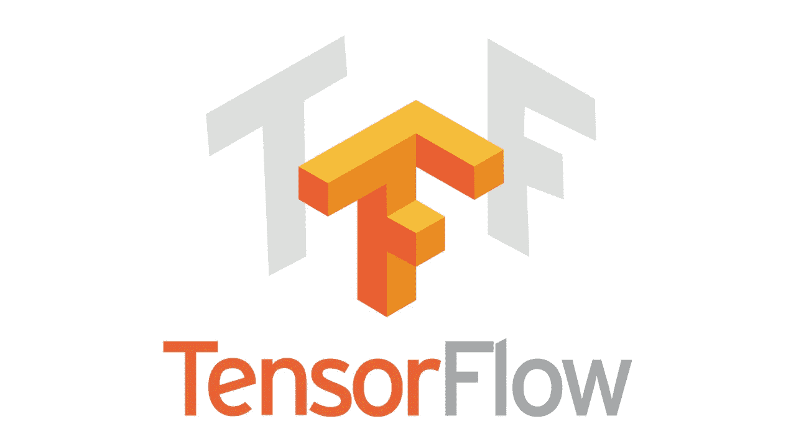
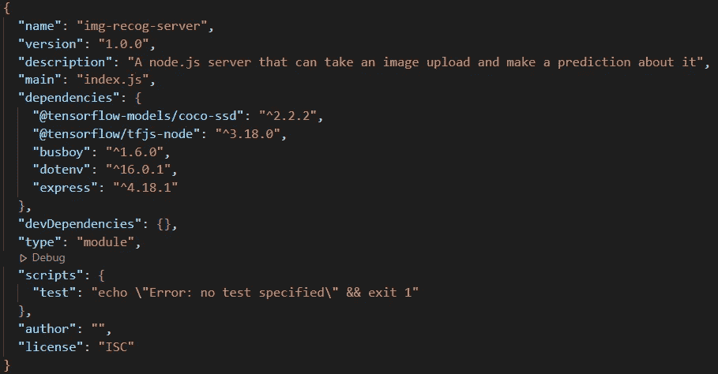
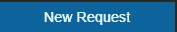
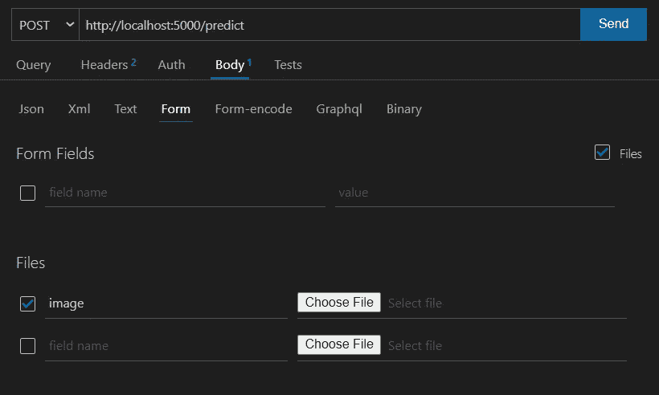
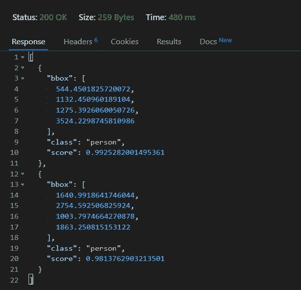

# 利用 TensorFlow 和 Express.js 实现图像识别

> 原文：<https://betterprogramming.pub/node-js-implementation-of-image-recognition-using-tensorflow-and-express-js-b006f5609415>

## 一个初学者友好的演练，为图片上传构建一个快速服务器



# 人工智能的现状

人工智能是一个相当活跃的领域，以其惊人的能力和复杂的性质吸引着我们的兴趣。自 20 世纪 40 年代首次提出利用电子设备再造大脑的可能性以来，这项技术已经取得了长足的进步。虽然人工智能以及机器学习在其一生的大部分时间里一直是相当排外的领域，但事情开始发生变化。

在其历史的大部分时间里，机器学习只对那些受过广泛的计算机科学教育并能接触到结实的硬件的人开放。但现在，随着 TensorFlow 和 Keras 等开源平台的出现，任何拥有编码基础知识和计算机的人都可以训练 ML 模型和/或利用现有的大量模型。

人工智能的民主化对于该行业的未来至关重要，可能对整个人类也是如此。我们不能让行业巨头垄断世界历史上最强大的工具，它必须是你我都有机会接触和利用的东西。

尽管如此，你可能会认为图像识别和对象检测是一项艰巨的任务，如果我们在 C++中从头开始工作，这可能是真的。然而，我在这里告诉你，即使是我，一个单纯的 JavaScript 开发者，也已经成功地在 Express 服务器中实现了对象检测。

今天，我要亲自教你怎么做。

# 我们要建造什么

## 代码

那么，我们今天到底在建造什么？还好，没那么复杂；基本都是我之前说的。我们将有一个带有端点的 Express 服务器，它上传图像，并使用 TensorFlow 的 COCO-SSD 模型对上传图像中存在的对象进行预测。然后，它将以 JSON 的形式返回这些预测的数组，供客户端使用。

这基本上是一个 [TensorFlow 教程](https://codelabs.developers.google.com/codelabs/tensorflowjs-object-detection#0)的服务器实现，该教程通过构建一个客户端应用程序来运行对网络摄像头输入流的对象检测。之后，它以可视的方式向最终用户显示预测。

# 客户端与服务器端

我强烈推荐前面提到的客户端实现教程，它有自己的好处。当在客户的计算机上运行预先训练的模型时，您增加了他们的隐私、模型的速度，并且降低了成本，因为您不必支付服务器设置的费用。这些肯定是要考虑的，但是服务器端也有它的好处。

服务器端实现允许您完全访问将用于运行模型的硬件，允许您优化更大、更好和更高内存的模型。Node.js 服务器可以在几乎任何计算机上运行，包括 Raspberry Pi，这意味着执行模型操作的集中式服务器可以成为物联网集成的资产。

也就是说，这完全取决于用例，以及您的最终用户。花时间寻找最适合您的情况的实现总是一个好主意，这将导致最具可伸缩性、可维护性和灵活性的产品。

# 让我们来构建服务器

总之，我已经说够了东拉西扯。你是来学习指导的。让我们开始吧。

# 要求

首先，您需要确保您的环境设置正确。您需要安装 Node.js 来进行包管理和运行代码。虽然不一定需要特定的版本，但我在本教程中使用了 Node `v14.17.0`和 Npm `v6.14.13`。

正确安装 TensorFlow 包需要 Python 2.7。3+不行。如果你安装了另一个版本，不要担心。只需进入[下载页面](https://www.python.org/downloads/release/python-2716/)，安装正确的版本(2.7.16 引入了一个错误修复，所以我使用了它)，然后使用`py -2.7`命令切换到它(您可以使用`py -0`命令检查所有当前安装的版本)。

# 新项目

一旦满足了要求，就为它创建一个新的文件夹，并导航到它。

```
**$** mkdir ./img-recog-server && cd ./img-recog-server
```

初始化新的空 Npm 项目。

```
**$** npm init -y
```

# 属国

接下来，我们将安装所需的依赖项。前两个是 TensorFlow 包，`[@tensorflow/tfjs-node](https://www.npmjs.com/package/@tensorflow/tfjs-node)`和`[@tensorflow-models/coco-ssd](https://www.npmjs.com/package/@tensorflow-models/coco-ssd)`，第一个是针对 Node 优化的主包，第二个是将进行预测的模型。对于 Express 服务器，我们将需要`express`用于服务器，`dotenv`用于处理环境变量，`busboy`用于处理图像上传。

```
**$** npm i @tensorflow-models/coco-ssd @tensorflow/tfjs-node express dotenv busboy
```

此时，你的`package.json`应该是这样的。

*不要忘记添加* `*"type": "module"*` *以允许 es6 模块语法。*



一旦您正确配置了 npm 项目，我们就可以开始编写代码了。

# 代码

现在，我们将创建一个新的`index.js`文件，作为我们程序的入口点。在整个教程中，我将为您提供各种代码片段，您可以将每个代码片段添加到文件的末尾，最终创建一个完整的程序。

```
$ touch index.js
```

输入文件，我们将开始导入正确的模块。

现在我们正在导入正确的模块并初始化`dotenv`包。现在，如果我们把一个`.env`文件放在我们目录的根目录下，紧挨着`index.js`，我们可以写环境变量，并用`process.env.[variable_name]`把它们放到我们的代码中。做一个`.env`文件，写如下。

```
PORT=5000
```

你可以使用任何你喜欢的端口；换个号码就行了。稍后，我们将在代码中使用它。然而，首先，我们将在代码中初始化模型。

```
// * INIT MODEL
let model = undefined
(async () => {
    model = await coco_ssd.load({
        base: "mobilenet_v1"
    })
})();
```

现在，使用异步立即调用函数表达式(IIFE ),我们可以将模型加载到变量中。这让我们确保在模型初始化之前，我们不会试图使用它。现在我们已经初始化了这个模型，让我们设置我们的 Express 服务器。

```
const app = express()
const PORT = process.env.PORT || 5000app.post("/predict", (req, res) => {})app.listen(PORT, () => {
    console.log("Listening on port " + PORT)
})
```

回到`PORT`环境变量。我们将用它来初始化我们的应用程序实例。我们还创建了一个 HTTP POST 路由来处理我们的对象识别。为了能够解释它，我把它留为空白，但是现在让我们编写实际的代码:

这就是事情变得复杂的地方。首先，我们检查模型是否初始化，如果没有，我们会让用户知道，但肯定应该在服务器启动几秒钟后。

检查之后，我们使用`busboy`包拦截来自 POST 请求的`Content-Type: multipart/form-data`。这是必要的，因为 vanilla Express 不能正确解析表单数据，所以我们使用类似于`busboy`的扩展来创建一个流/管道，以便数据通过。然后，当我们上传一张图片时，它会将图片放入一个缓冲区，然后这个缓冲区可以被`tf.node.decodeImage`方法读取。

TensorFlow 将解码任何格式为 BMP、GIF、JPEG 或 PNG 的图像。这个方法返回一个张量，它基本上是一个多维数组，`coco_ssd`模型更容易理解。也就是说，`coco_ssd`模型还支持 [ImageData](https://developer.mozilla.org/en-US/docs/Web/API/ImageData/ImageData) 、一个 [HTML 图像元素](https://developer.mozilla.org/en-US/docs/Web/API/HTMLImageElement)、一个 [HTML 画布元素](https://developer.mozilla.org/en-US/docs/Web/API/HTMLCanvasElement)或一个 [HTML 视频元素](https://developer.mozilla.org/en-US/docs/Web/API/HTMLVideoElement)，并将相应地做出预测。

`model.detect`还带有另外两个可选参数，如上所示，在图像之后，您可以定义要发回的最大边界框数量，以及要包含的预测的最小分数。我将箱子的最大数量设置为`3`，将分数设置为`0.25`。

一旦所有这些都运行了，并且模型完成了它的预测，那么我们就把从`model.detect`方法返回的数组作为 JSON 返回给最终用户。

既然你已经做了，你就完了。您已经成功地创建了一个可以上传图像并基于此返回预测的服务器。您可以使用以下命令运行您的服务器。

```
$ node index.js
```

如果有些东西不工作，并且您想要仔细检查，我会将完整的代码留在下面:

# 测试

然而，我们还没有完全完成。你会想先测试一下。所以，把你选择的 API 测试套件拿出来，我们会做一个快速的 API 请求来确保你已经把它准备好了。

我使用带有 VSCode 的[迅雷客户端](https://www.thunderclient.com/)，因为对我来说那是最快的，但是 Postman 是另一个不错的选择。如果你用的是 Postman，我推荐[这个线程](https://community.postman.com/t/how-to-upload-images-to-a-post-request/15256)上传图片。不然用迅雷客户端超级简单。

一旦你安装了扩展，进入 VSCode 侧边栏的 Thunder Client 选项卡。图标应该是这样的，但是在 Windows 上找到它的另一种方法是`ctrl + shift + r`。


到达后，点击顶部的蓝色“新请求”按钮。



然后，像这样填写请求信息。



确保您正在发出帖子请求，并对正文使用表单选项。然后，选中右上角的“文件”框，添加一个字段名，随意命名，并选择正确格式的图像。同样，我们只能使用符合 BMP、GIF、JPEG 和 PNG 格式的图像。

配置好请求后，按`ctrl + s`保存请求。确保您的服务器正在运行，然后发出请求。您应该会得到类似这样的响应。



# 结论

现在，你终于完成了。您有一个可以上传图像并用于运行图像检测的服务器。那么，现在怎么办？嗯，机器学习是一个巨大的领域，有无限的可能性。通过下面的链接探索许多可用的模型，训练自己的模型，并找出将人工智能添加到应用程序的酷方法。无论你想要什么。

随着人工智能的成长和发展，我们作为开发者也必须如此。

机器学习日益增长的可访问性意味着我们有一个独特的机会来利用这一惊人的技术，随着我们进入一个更加以人工智能为主导的劳动力市场，用它来发展和完善我们的技能的能力将是一个巨大的优势。

可能性是无限的，你有能力把它们变成现实。

*各位编码快乐！*

# 参考

*   [原创 TensorFlow 物体检测客户端教程](https://codelabs.developers.google.com/codelabs/tensorflowjs-object-detection#1)
*   [tensor flow Hub 上的模型](https://tfhub.dev/)
*   [tensor flow 上的 JavaScript 模型](https://www.tensorflow.org/js/models)
*   [TensorFlow 模型 GitHub](https://github.com/tensorflow/tfjs-models)
*   [使用 TensorFlow.js 和 Node.js](https://www.tensorflow.org/js/guide/nodejs)