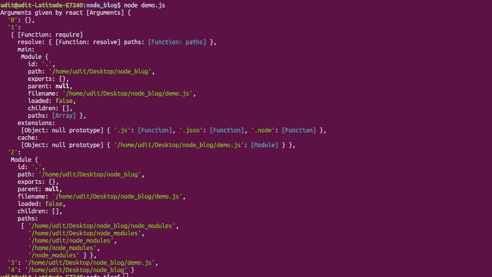
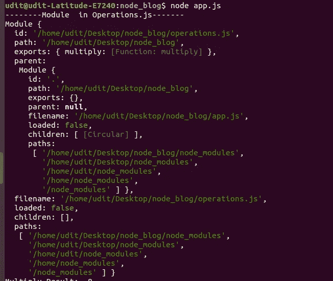
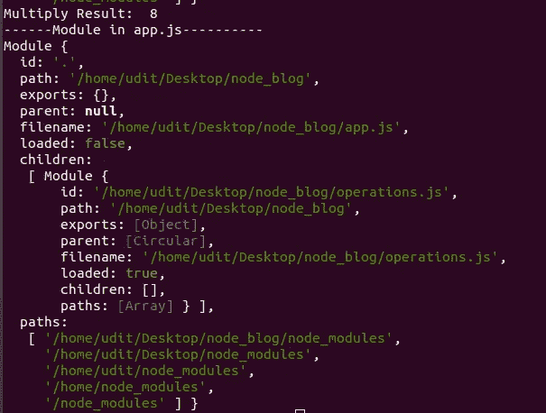
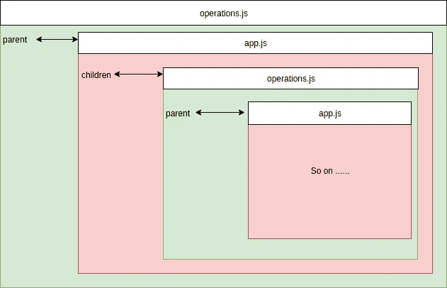
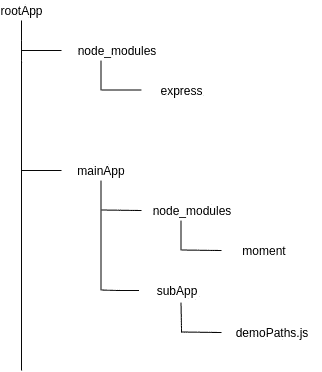
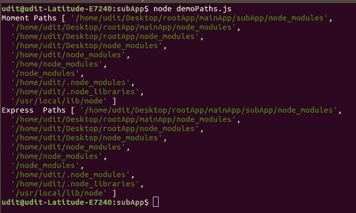
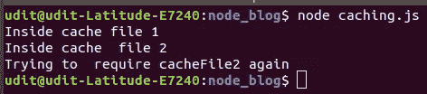
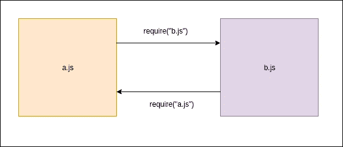

# Node.js 模块:基础到高级

> 原文：<https://betterprogramming.pub/node-js-modules-basics-to-advanced-2464001229b6>

## 理解模块化如何工作以及我们可以使用的东西


由 [Markus Spiske](https://unsplash.com/@markusspiske?utm_source=medium&utm_medium=referral) 在 [Unsplash](https://unsplash.com?utm_source=medium&utm_medium=referral) 上拍摄的照片

在[节点](https://nodejs.org/)，模块化是一个一流的概念。在`Node.js`模块系统中，每个文件被视为一个独立的模块。

因此，如果您正在创建一个`demo.js`文件，这意味着您正在 Node 中创建一个模块。基本上，模块帮助我们将代码封装成可管理的块。

我们在模块(即 JavaScript 文件)中定义的任何东西都仅限于该模块，除非我们想将它暴露给代码的其他部分。

因此，我们在模块中定义的任何东西都只对该模块是私有的。

# 如何创建模块

在 Node 中创建一个模块非常简单，只要创建一个文件就可以了。

代码 1

就这样，现在你在 Node 中有了一个模块，没什么特别的，只是简单的创建了一个文件。

# 模块类型

*   核心模块:`Node.js`自带的模块，如`https`、`os`、`fs`、`net`等。
*   第三方模块:从任何软件包管理器安装的模块。我们使用这些模块来完成或简化任何现有的任务。例如，为了简化我们的 web API 开发，我们使用`express`，或者处理日期和时间，我们使用`moment`。
*   本地模块:这些是我们自己创建的模块。这些模块基本上由我们代码的核心业务逻辑组成。

# 模块化以前是如何工作的

在`Node.js`或 ES5 模块之前，JavaScript 中的模块化是通过使用`IIFE`(立即调用函数表达式)实现的，顾名思义，这是一个定义后立即调用的函数。

代码 2

现在，如果我们运行这段代码，我们将得到输出`5`。

函数`sum`在这个生命中定义，如果该生命之外的任何代码试图访问`sum` 函数，将导致`ReferenceError: sum is not defined`，即`sum`函数是这个特定生命的私有函数。

那么，我们如何在生活之外访问这个`sum`函数呢？

代码 3

为了在生活之外暴露我们的`sum`函数，我们在生活之外创建一个对象(`exportObj`)，然后，通过闭包，我们在生活之内访问那个对象，并将我们的`sum`函数赋给它的一个属性。

之后，我们在生命之外的`exportObj`对象上调用`sum`函数。这一次，我们能够得到没有任何错误的结果。

# 模块化如何在 Node.js 中工作

我们在上面已经看到，为了在 Node 和 ES5 之前实现模块化，我们使用了函数。

在`Node.js`中，这与我们实现模块化的方式相同，即仅使用函数，但有一个问题——包装我们代码的包装函数不是由我们编写的，而是由 Node 自动为我们添加的。

让我们看一个例子来更好地理解它。

假设我们定义了一个名为`sum.js`的文件，其内容如下:

代码 4

上面的代码，在`sum.js`中，被`Node.js`封装成一个函数。

因此，在`Node.js`中，这段代码被包装，在我们的运行环境中看起来像这样:

代码 5

所有东西都被包装了，就像我们在生活中包装的一样，但是在这里，这个包装函数有一些参数。我们将在本文后面详细讨论它们。

检查你的代码是否被包装在一个函数中，我们是否收到这些参数。在 JavaScript 中，我们知道所有函数都接收一个名为`arguments`的参数，所以，如果我们在代码中得到`arguments`，它就确认我们的代码在函数内部。

代码 6



代码 6 的输出(图 1)

我们可以看到我们得到了`arguments`的输出(arguments 是一个类似数组的对象，它的键是数字，默认情况下传递给每个函数)。因此，它确认了我们的代码被包装在一个函数中，并且该函数接收五个参数，这些参数由`Node.js`给出。

让我们逐一讨论这五个论点。

# 出口

这是一个用于在一个模块中公开我们的功能的对象，因此这些功能可以在其他模块中使用。

我们可以暴露任何东西，可以是函数、变量、常量、类等等。正如我们在前面的*模块性在* 之前是如何工作的一节中所做的，我们已经在`exportObj`上创建了一个属性，然后给它赋值。

和我们对`exports`对象做的一样——我们在`exports`对象上创建一个属性，然后给这个属性赋值，或者你想公开的任何东西(变量、函数、类、常量)。

代码 7

这里，我们通过将函数引用分配给`exports`对象上新创建的 multiply 属性来公开 multiply 函数，即 multiply 函数只在这个模块之外可用，而 sum 函数不可用。

注意:不要给这个`exports`对象提供一个新的引用，也就是不要给`exports`参数分配一个新的对象。(我们将讨论为什么不这样做。)

代码 8

# **要求**

这是一个我们用来从其他模块导入或要求功能的功能。它是对用于导出功能的`exports`对象的补充。另一方面，`require`用于导入这些功能。

为了需要一个模块，我们调用`require`函数时，要么使用模块的路径(绝对路径或相对路径)，对于本地模块，以`/`、`./`或`../`开头；对于核心模块和第三方模块，则使用模块的名称。

然后，它返回我们需要的模块的导出内容。

注意:基本上我们在需要一个模块的时候，会得到对象`module.exports` (这个我们会讨论)的引用。

代码 9

在*代码 7* 中，我们实现了两个函数`sum`和`multiply`，但是我们只导出了`multiply`，所以在`operations.js`模块之外只有那个可用。这就是为什么我们试图调用`sum`时会得到一个错误。

Node 的`require`函数提供的不仅仅是导入功能，我们将对此进行更深入的探讨。

# 组件

这是传递的第三个参数，`module`变量是对代表当前模块的对象的引用。它有各种有用的属性，我们可以在任何模块的带有`console.log(module)`的终端中看到。

假设我们在`app.js`(代码 9)和`operations.js`(代码 7)中做`console.log(module)`。我们得到以下输出:



operations.js 中的 console.log(模块)(图 2)



app.js 中的 console.log(模块)(图 3)

`module`对象包含关于我们模块的所有数据，例如:“谁是它的父模块？它的孩子是谁？解析第三方模块的所有途径是什么？是完全装了，还是没装？”

但是`module`对象最重要的属性是`exports`属性，我们也可以在模块上使用这个`exports`属性来导出我们的数据，而不是使用包装函数的`exports`参数。

代码 10

因此，这是从我们的模块中导出功能的第二种方式。

注:我们将看到`exports`和`module.exports`的区别，以及它们是如何相互连接的。

## `module`对象的概要

1.  `module.filename`是模块的完全解析文件名。
2.  `module.id`是模块的标识符。通常，这是完全解析的文件名，除了主模块，它是'`.`'(句号)，见图 3。主模块是启动节点应用程序的模块，例如，如果我们在终端中写`node app.js`，那么`app.js`就是主模块。
3.  `module.path`是您的名称模块的目录名。
4.  `module.parent`是一个引用父模块的对象。
5.  `module.children`是所有子模块对象的数组。
6.  `module.loaded`是一个布尔属性，它告诉我们模块是否已经完成加载，或者正在加载过程中。
7.  `module.paths`是节点将查找以解析模块的所有路径的数组。

你们中的一些人可能已经注意到了图 2 和图 3 中，模块父属性或子属性中的这个奇怪的`[Circular]`东西。那是什么？

实际上，`[Circular]`定义了一个循环引用，如图 2 所示，它打印出了`operations.js`的模块对象。`operations.js`模块的父属性引用了`app.js`模块。

同样，`operations.js`是`app.js`的子模块，所以它的子属性应该有一个对`operations.js`模块的引用。类似地，`operations.js`模块的父属性再次引用了`app.js`模块，因此它将进入这个无限循环。

为了防止这个无限循环，Node 发现，如果任何模块的父模块或子模块已经被加载，它将不再加载它们，而是显示这个`[Circular]`。



图 4

# _ _ 文件名

这是一个包含当前模块绝对路径的变量。

给定两个模块:`a` 和`b`，其中`b`是`a`的依赖，有一个目录结构:

*   `/User/home/node_blog/a.js`
*   `/User/home/node_blog/node_modules/b/b.js`

所以，如果我们在`b.js`内做`console.log(__filename)`，就会得到`/User/home/node_blog/node_modules/b/b.js`。如果我们在`a.js`内做 `console.log(__filename)`，就会得到`/User/home/node_blog/a.js`。

# _ _ 目录名

当前模块的目录名。这与`__filename`的`path.dirname()`相同。

所以，对于以上模块，`a.js`和`b.js`。

如果我们在`b.js`内做 `console.log(__dirname)`，我们会得到`/User/home/node_blog/node_modules/b/`，在`a.js`内，我们会得到`/User/home/node_blog/`。

现在我们已经学习了该模块的基础知识。从现在开始，我们将深入探讨这个话题。请再耐心听我说一会儿，因为我们要讨论各种有趣的事情

# 模块导出和导出之间的区别

我们使用`module.exports`和`exports`从模块中导出我们的功能。

但是，它们之间有一点点不同。相反，我会说他们没有不同，但他们是相似的。`exports`对象只是`module.exports`的简写。

在节点内部，`exports`对象引用了`module.exports`对象。这有点像:

```
const exports = module.exports;
```

然后，当我们在一个模块中`require`时，这个`module.exports`对象由`require`函数返回。

这就是我们不改变`exports`对象的引用的原因，正如我们在代码 8 中所写的，因为如果我们改变`exports`对象，它将不再引用`module.exports`，导致功能不能从我们的模块中导出。

我们可以在一个模块中同时使用`module.exports`和`exports`吗？

是的，我们可以，但是如果我们两个都用的话，有一些微妙的地方我们应该记住。

那就是，当我们在任何模块中使用`require`时，我们得到的是引用`module.exports`的`module.exports`对象和`exports`对象，所以需要维护这个引用。

代码 11

在这段代码中，总和不会被导出，因为我们已经通过为其分配一个新对象来更改了对`module.exports`的引用，但是`exports`对象现在也引用了之前对`module.exports`的引用。

为了导出总和，我们需要将`exports`对象的引用更新为`module.exports`的当前引用。

代码 12

# 详细模块

没有必要只有一个文件才能成为我们需要的模块。除了文件，我们还有文件夹作为模块，我们可以在中使用。

通常，作为模块的文件夹是模块中的模块，即它包含实现功能的各种模块。这就是库所做的，它们被组织在一个自包含的目录中，然后它们提供了该目录的单一入口点。

有两种方式我们可以要求一个文件夹。

1.  在文件夹的根目录下创建一个`package.json` ，指定一个`main`模块。一个示例`package.json`文件可能如下所示:

代码 13

如果这是在`./some-library`的一个文件夹中，那么`require('./some-library')`会尝试加载`./some-library/lib/some-library.js`。

这就是`Node.js`对`package.json`的认知程度。

2.如果节点在模块的根目录中找不到任何`package.json`，或者如果`main`条目丢失或无法解析，则在`package.json`中找不到任何`package.json`。然后，`Node.js`将尝试从该目录加载`index.js`或`index.node`。例如，如果上面的例子中没有`package.json`文件，那么`require('./some-library')`将尝试加载:

*   `./some-library/index.js`
*   `./some-library/index.node`

如果这些尝试失败，那么`Node.js`将报告整个模块丢失，并显示默认错误:

```
Error: Cannot find module ‘some-library’.
```

在文件模块中，`.js`文件也不是唯一的模块，我们还有`.json`文件和`.node`文件，它们也是节点中的模块。

# 详细要求

当我们需要一个模块时，没有必要给出文件扩展名。

例如，如果我们需要一个`some-file.js`文件，并且它在同一层，我们可以这样要求它:

```
const someFile = require(‘./some-file’);
```

也就是说没有指定扩展名。

在解析该文件的路径时，Node 遵循一个过程。

它首先寻找`some-file.js`，如果`some-file.js`不存在，它将寻找`some-file.json`，如果也不存在，它将寻找`some-file.node`。

`.js`文件被解释为 JavaScript 文本文件，`.json`文件被解析为 JSON 文本文件，即我们得到 JavaScript 对象。`.node`文件被解释为编译后的附加模块。

# 要求如何工作？

当我们使用`require`功能需要一个模块时，它会通过不同的步骤导入所需的模块。

1.  解析模块，即找到模块的绝对路径。
2.  将模块加载到内存中，以便可以执行其代码。
3.  执行模块的代码。
4.  将模块的所有导出捆绑到一个对象中`module.exports`。
5.  缓存模块，这样，当我们再次需要这个模块时，我们就不会一遍又一遍地重复所有这些步骤。

解析模块经历一个顺序:

1.  首先，它将查看 resolve 函数中指定的模块是否是核心模块。如果它是一个核心模块，它将返回它并仅在那里停止。
2.  然后，它将查看指定模块的路径是否以`/`、`./`或`../`开头，如果节点找到匹配，它将加载它。
3.  如果我们寻找的模块既不是核心模块，也不是以`/`、`./`或`../`开头，那么 Node 将开始在`module.paths`数组(见图 2 或图 3)中指定的所有目录中逐一寻找我们的模块。即，节点将开始在我们的应用程序父目录`node_modules`文件夹中查找，如果没有找到，它将移动到父目录，依此类推，直到到达文件系统的根目录。
4.  如果节点找不到我们的模块，它将抛出一个“找不到”错误。

在解析一个模块后，Node 将加载它并执行它的代码，但是如果我们只想检查我们是否有一个特定的模块，也就是说，我们不想加载并执行它，我们只想解析它。

为此，我们在`require`上使用`resolve`功能:

```
const resolvedFilename = require.resolve(moduleToResolve);
```

使用内部的`require()`机制来查找一个模块的位置，但是不加载模块，只返回解析后的文件名。

我们已经看到了 order 节点解析一个模块，并且，正如我们在上面的第 3 点中讨论的，它在解析一个模块的过程中搜索一个路径。

但是，我们如何以编程方式知道该节点搜索了哪些路径来解析我们的模块呢？为此，我们使用:

```
const allPaths = require.resolve.paths(moduleToResolve);
```

如果`moduleToResolve`字符串引用核心模块，例如`http`或`fs`，则返回包含在`moduleToResolve`或`null`解析期间搜索的路径的数组。

例如，对于以下目录结构:



目录结构(图 5)

如果我们编写并执行以下代码:

代码 14

代码 14 的输出将是:



图 6

# 节点模块的缓存

模块在第一次加载后被缓存。这意味着(除了别的以外)如果解析到同一个文件，那么每次调用`require('foo')`都会得到完全相同的对象。

这些模块缓存在一个键值对的对象中，我们可以使用`require.cache`来引用这个对象。

但是，如果我们从这个对象中删除任何一个键，那么`require`将会重新加载这个模块。本地插件也有例外。如果我们删除它们的密钥并尝试重新加载它们，将会导致错误。

例如，我们有两个文件:

`cacheFile1.js`

```
console.log(‘Inside cache file 1’);
```

`cacheFile2.js`

```
console.log(‘Inside cache file 2’);
```

代码 15



代码 15 的输出(图 7)

在上面的输出中，您可以看到我们只获得了一次“内部缓存文件 2 ”,但是我们需要它两次。发生这种情况是因为，在第一次，只有`cacheFile1.js`和`cacheFile2.js`被缓存。

# 检查模块是否为主模块

主模块是启动应用程序的模块。例如，如果我们通过编写`node app.js`来开始我们的应用程序，那么`app.js`就是我的应用程序的主要模块。

我们在 require 上还有一个属性，叫做`require.main` *，*，它是一个引用我的主模块的`module`对象，所以如果在我们的代码中，我们需要检查这个模块是否是主模块，然后我们想要执行一些动作，我们可以这样做:

```
if(require.main === module){//Your Code goes here}
```

# 循环要求



图 8

因此，当`a.js` 要求`b.js`而`b.js`要求`a.js`时，就会发生循环要求。

当有循环`require()`调用时，模块在返回时可能还没有执行完。让我们举个例子:

代码 16

代码 17

代码 18

当`main.js`加载`a.js`时，然后`a.js`依次加载`b.js`。此时，`b.js`试图加载`a.js`。

为了防止无限循环，未完成的`a.js`导出对象的副本被返回到`b.js`模块。`b.js`然后完成加载，它的`exports`对象被提供给`a.js`模块。

当`main.js`加载完两个模块时，它们都已经完成了。因此，该程序的输出将是:

```
$ node main.js
main starting
a starting
b starting
in b, a.done = false
b done
in a, b.done = true
a done
in main, a.done = true, b.done = true 
```

# Node.js 中的模块模块

`Node.js`中还有一个`module`模块，与我们目前所学的模块对象不同。当我们与模块交互时，它提供了一些通用的实用方法。

例如，它提供了一个名为`builtinModules`的实用属性，列出了`Node.js`的所有核心模块的名称，我们可以用它来检查我们正在使用的模块是否是节点的核心模块，并相应地执行操作。

```
const builtin = require('module').builtinModules;
```

# 谢谢你

谢谢你们一直忍耐到现在。我们在这里讨论的各种主题并没有被广泛使用，但是为了在 Node 中脱颖而出，我们需要知道事情实际上是如何工作的以及它们提供的不同功能。

因此，如果你去构建一个应用程序，你会更好地理解模块化是如何工作的，以及我们可以使用的所有东西。

# 参考

 [## Node.js v12.9.0 文档

### 在 Node.js 模块系统中，每个文件都被视为一个单独的模块。例如，考虑一个名为 foo.js 的文件…

nodejs.org](https://nodejs.org/dist/latest-v12.x/docs/api/modules.html)