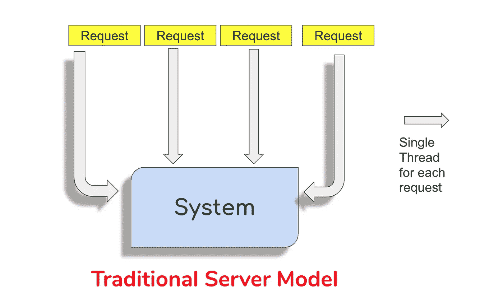
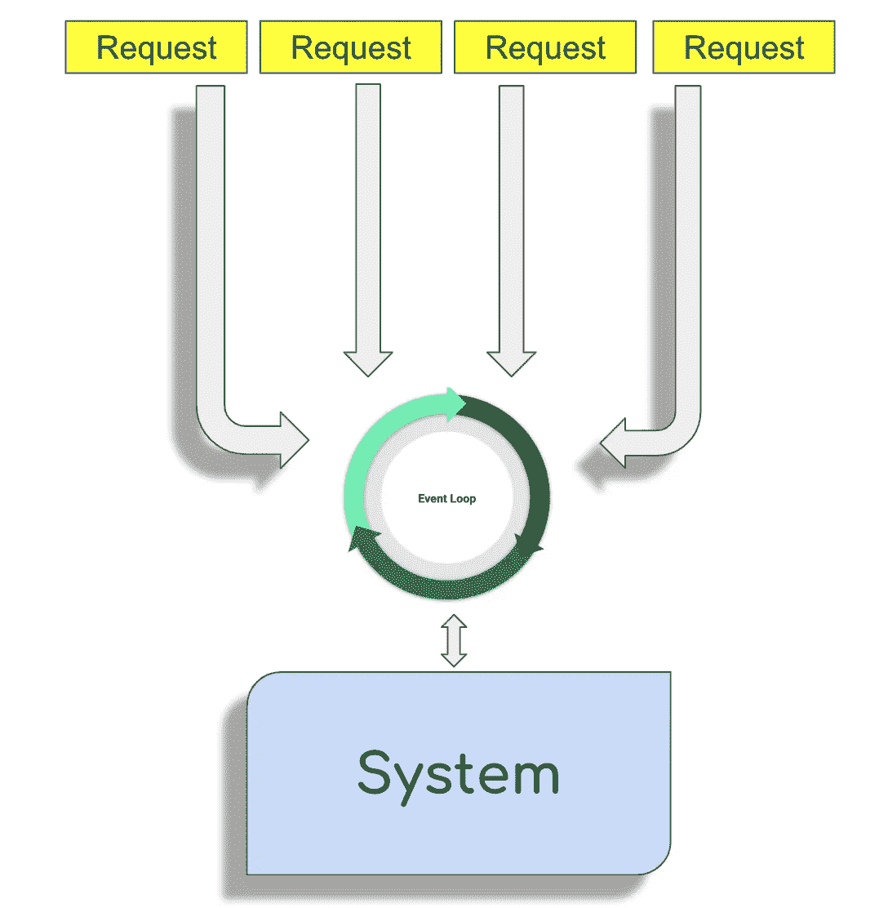

# Node.js —开始编码前的一些概念

> 原文：<https://betterprogramming.pub/node-js-some-concepts-before-you-start-coding-ed613effe4a0>

## 节点中的高阶函数、回调和事件循环


这篇文章将帮助您理解 [Node.js](https://nodejs.org/) 背后的不同概念，并让您能够创建生产就绪的应用程序。

Node.js 使用事件驱动的非阻塞 I/O 模型，这使它变得轻量级和高效。

我们都看过上面的声明，但它真正的意思是什么？让我们了解一下传统服务器模型过去是如何工作的。



在传统的服务器模型中，对于服务器的每个请求，都会产生一个线程来处理相同的请求。这种类型的实现规模不大，因为您的服务器可以处理的多个请求的数量与您的机器可以产生的线程数量成正比。



在 Node 中，一个进程由一个主执行线程和无数个后台线程(通常执行 I/O 工作)组成。使用队列来执行后台线程和主线程之间的协调。主线程从队列中取出任务(按照接收顺序排队)并执行它们。

简而言之，下面列出了使用 Node.js 的一些好处:

*   减少开发时间。
*   减少所需的服务器数量/服务器成本。
*   减少 API 响应时间/页面加载时间。

但是有些情况下你不应该使用 Node.js，一个例子可以在[优步工程](https://eng.uber.com/go-geofence/)的这篇文章中找到。

在实际使用 Node.js 编码之前，我想提一下 Javascript 的一些核心概念，这些概念使得 Node.js 能够以这种方式工作。

# **1。高阶函数**

对于任何 JS 开发人员来说，这可能是一件很平常的事情，但是对于 JS 新手来说，可能会觉得这很奇怪。在 JS 中，可以将一个函数作为参数传递给另一个函数。让我们用一个简单的例子来理解这一点。

只要在 Jsbin 这里输入这个代码[就能看到神奇之处！在上面的例子中，函数`sayWhat`被传递给了`speak`函数。](https://jsbin.com)

# 2.所有后卫

在上面的例子中，我们已经看到了`callback`的使用。下面的语句停止代码执行。

```
*alert(`${name} threw a boomerang few years ago`);*
```

一旦关闭警报，传递的方法将被调用。这被称为回调。

# 3.事件循环

所有的函数调用都放在一个基于后进先出的调用堆栈中。事件循环不断检查调用堆栈，看是否有任何函数需要运行。这样做的时候，它会将找到的任何函数调用添加到调用堆栈中，并按顺序执行每个函数调用。

我推荐[菲利普·罗伯茨的这个解说视频](https://youtu.be/8aGhZQkoFbQ)

让我们用实际的方法来理解事件循环。首先运行下面的代码。

上述代码将按预期工作。3 → 1 → 2 → 4

最小值`setTimeout`的结果调用在第二个参数中提到的时间之后作为参数传递的函数。由于时间被称为 0，您可能会认为输出是 3 → 1 → 2 → 4。但由于事件循环的工作方式，实际上是 3 → 2→ 4 → 1。

我们已经理解了这篇文章的一些基本概念。在下一篇文章中，我们将学习如何安装 Node.js 并编写一些基本代码。


今天到此为止。