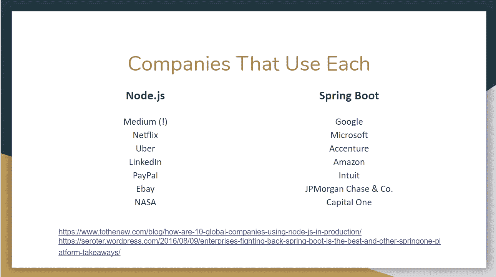
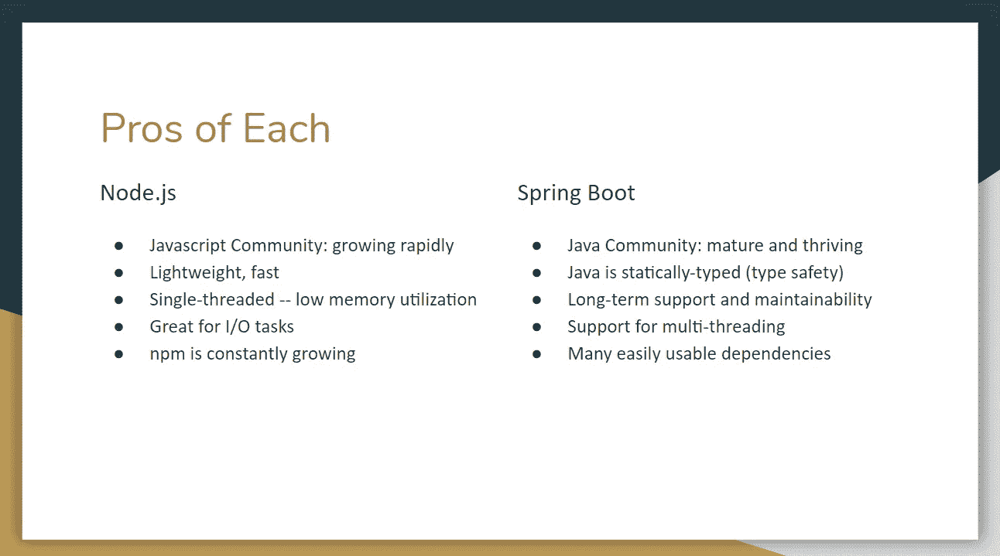
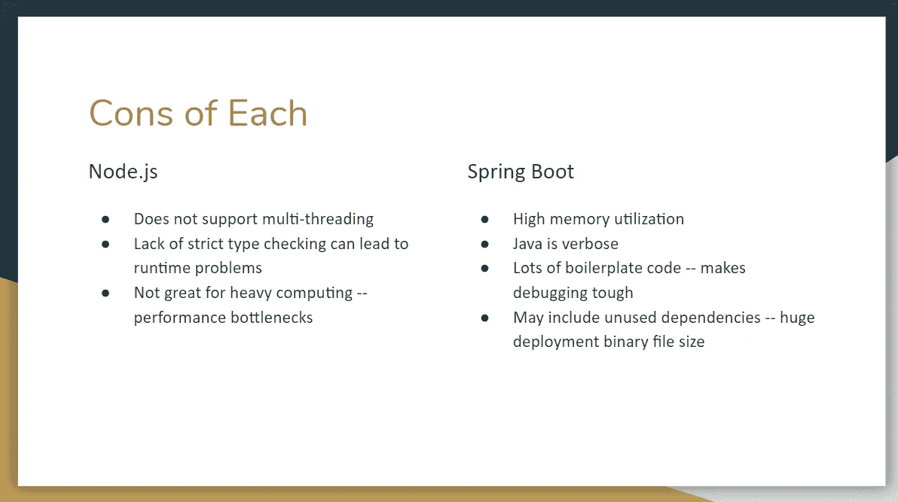

# Node.js 与 Spring Boot——你该选择哪一个？

> 原文：<https://betterprogramming.pub/node-js-vs-spring-boot-which-should-you-choose-2366c2f76587>

## 轻松点。Spring Boot。对吗？没那么快…

拥抱辩论！照片来自克里斯蒂娜@ wocintechchat.com

这是一个与我关系密切的话题，因为在我工作的地方，当涉及到开发服务器端 web 应用程序时，一切都围绕着 [Spring Boot](https://spring.io/projects/spring-boot) 进行。Spring Boot 这个，Spring Boot 那个！Spring Boot 看不够，是吗？

但是我在业余时间所做的研究让我相信 Node.js 是用于 web 开发的最佳工具。这是真的吗？让我们深入了解一下。

# 目标

回答问题:如果你必须选择一种服务器端技术，Node.js 或 Spring Boot，为你未来十年的业务提供动力，你会选择哪种？

我知道这是一个非常宽泛的问题，因为我们忽略了我们有多少用户，以及我们的业务正在解决什么问题。我希望它尽可能通用。我们将假设我们的业务从零开始，并以指数速度增长，最终处理大量数据(当然，不可避免地会成为下一个谷歌)。

在这篇文章中，我们只看 Node.js 和 Spring Boot。我知道其他的框架，比如 [Django](https://www.djangoproject.com/) ， [Flask](https://www.fullstackpython.com/flask.html) ，Ruby on Rails 等等。，但是我的背景主要是 Java 和 JavaScript，所以我们只关注这两个。

我知道更准确的比较应该是 [Express.js](https://expressjs.com/) vs. Spring Boot，但是为了便于讨论，我将扩大范围并使用 Node.js。对于那些不熟悉的人来说，这是不同之处:

Node.js 是用于在浏览器外执行 JavaScript 代码的运行时环境。它不是一个框架。

Express.js 是 Node.js 事实上的 web 应用程序框架。

此外，我将大量引用 Java，因为 Spring Boot 是一个基于 Java 的框架。

# 为什么这很重要？

理解这两个框架之间的根本区别和它们的特殊之处，以及它们各自带来的不同限制是很重要的。作为 web 开发人员，我们必须知道有哪些工具，以及如何使用它们来改进我们自己的应用程序和业务。

您将在下面看到采用这些框架的不同公司。

图片来源:瑞安·格里森

这并不是说谷歌根本不用 Node.js 或者网飞不用 Spring Boot。这些只是公开宣称使用这些技术的公司。

你会注意到双方都有很棒的技术公司，所以这并不能真正帮助我们选择哪个更好。然而，它向我们表明，情况正在发生变化。在过去的几十年里，Java 已经统治了 web 开发世界的大部分。有趣的是，Node.js/JavaScript 在这一领域确立了自己的合法地位。

# 节点. js

Node.js 主要用 JavaScript 开发，使用事件驱动、单线程、非阻塞的 I/O 模型。这使得它非常高效和轻便。非常适合需要跨分布式设备实时运行的数据密集型应用程序。

这到底是什么意思？让我给你解释一下。

非阻塞 I/O: 这是学习 Node.js 时需要理解的一个非常重要的概念，这个系统允许一个线程在等待另一个任务完成的同时，处理另一个任务。换句话说，新任务在等待其他任务完成时不会被*和*阻塞。这是如何实现的？Node.js 依赖于异步函数。

这样做的好处是只使用了一个线程，因此我们的内存利用率很低。Node.js 是单线程的。此外，你不必担心与管理多线程相关的问题——然而，在 Spring Boot 世界，Java web 应用程序习惯于在多线程上运行一切。

# Spring Boot

Spring Boot 用 Java 实现，允许快速启动生产级的独立应用程序。这是 Spring 平台的引导版本。Spring Boot 的想法是，它非常容易运行，所以它最大限度地减少了启动和运行应用程序的麻烦。

Spring Boot 是所有关于依赖。它严重依赖注释或 XML。这简化了配置，当您的项目在增长，并且您开始有大量的依赖项需要管理时，这是非常重要的。一切都是自动配置的。

正如我之前提到的，Spring Boot 是多线程的。这在处理长时间或重复操作时非常有用。当主线程被消耗时，其他线程被并发使用。

微服务的创建也得到简化。利用 Spring Boot 提供的一系列功能，可以轻松创建一套新的独立的基于云的服务。

# 利弊

## 各有利弊

## 各有利弊

# 结论

所以，回答这个问题:如果你必须选择一种服务器端技术，Node.js 或 Spring Boot，来驱动你未来十年的业务，你会选择哪一种？

你可能来这里是为了看到一个决定被做出，而不是经典的“视情况而定”是的，我理解为什么人们说视情况而定。如果我正在构建一个依赖于大量 I/O(金融科技、预订系统、媒体应用等)的应用程序。)，我会使用 Node.js。但如果我需要我的应用程序进行大量计算(物联网、电子商务平台、大数据)，你最好相信我会选择 Spring Boot。

如果要我选一个的话，谁是赢家？我喜欢能够与开发人员一起建立团队的想法，他们都可以在整个堆栈上工作。从前端到后端，任何人都可以在任何给定的时间接任何任务。我还觉得 JavaScript 更容易学习，所以在团队中加入新成员时，学习曲线会更短。

我对 Node.js 的主要担心是无法处理繁重的计算。但是我觉得 Javascript 社区最终会解决这个问题。一厢情愿？也许吧。但是他们在很短的时间内走了很长的路，我迫不及待地想知道他们接下来会走向何方。