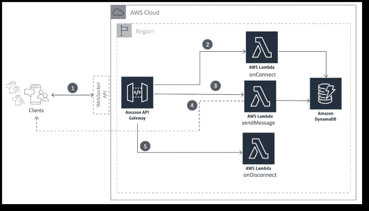
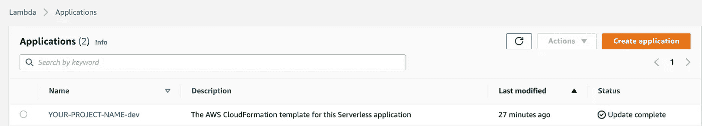
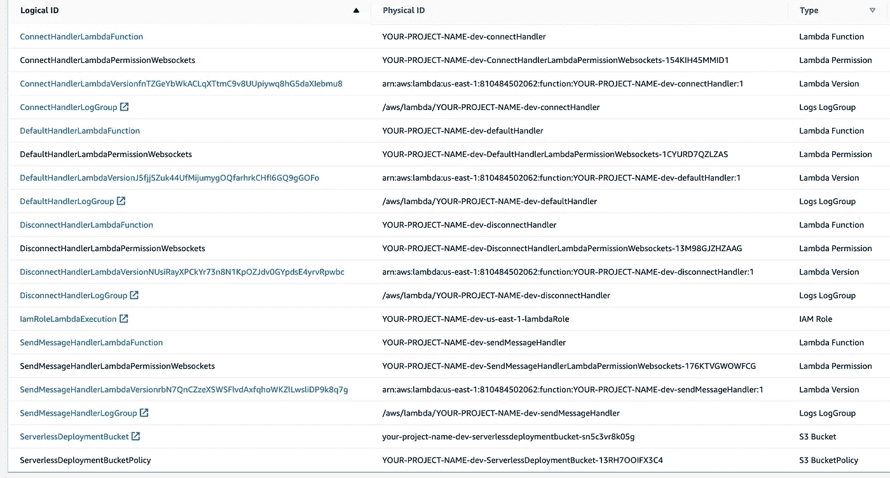

# AWS 上的 Node.js 和 Websockets

> 原文：<https://betterprogramming.pub/node-js-websockets-on-aws-2fba33bef9be>

## 用 AWS 上的无服务器快速设置 WebSockets API 服务


照片由[杰瑞米·毕肖普](https://unsplash.com/@jeremybishop?utm_source=medium&utm_medium=referral)在 [Unsplash](https://unsplash.com?utm_source=medium&utm_medium=referral) 上拍摄

在一些项目中，我们需要客户端能够与服务器实时通信。Websocket 协议通过 TCP 套接字连接工作，并提供客户端和服务器之间的实时双向通信能力。

本文给出了在 AWS 上设置 WebSockets API 服务的简单指南，使用了[无服务器](https://www.serverless.com/)框架、API 网关和 DynamoDB。

# 先决条件

在我们开始之前，你需要一些基本的知识和信息。

## AWS 帐户

如果您还没有 AWS 帐户，请点击[链接](https://portal.aws.amazon.com/billing/signup#/start)创建您自己的帐户。

## 配置 AWS CLI

[AWS 命令行界面](https://docs.aws.amazon.com/cli/latest/userguide/cli-chap-welcome.html) (AWS CLI)是一个开源工具，使用命令行 shell 中的命令与 AWS 服务进行交互。

我们在本教程中使用`aws-cli` npm 包:

```
$ npm install aws-cli -g
```

## 无服务器框架

[无服务器框架](https://www.serverless.com)使用 YAML + CLI 来轻松开发和部署到 AWS、Azure、Google Cloud 等。

要安装无服务器:

```
$ npm install serverless -g
```

# 服务架构的一瞥



基本 Websocket 应用架构由 [AWS](https://aws.amazon.com/blogs/compute/announcing-websocket-apis-in-amazon-api-gateway/)

使用 WebSockets API 和 AWS Gateway 的基本 WebSocket 应用程序架构如下:

*   客户端和 DynamoDB 上的服务之间的 API 网关持久连接。
*   `$connect`路由:客户端第一次连接到 WebSocket API 时使用的路由。
*   `$disconnect`路由:当客户端从您的 API 断开时使用的路由。此呼叫是在尽最大努力的基础上进行的。
*   `$default`路由:当路由选择表达式产生的值与 API 路由中的任何其他路由关键字都不匹配时使用。例如，这可以用于实现通用的错误处理机制。
*   `$custom`路线:本例中的`sendMessage`路线。客户端使用该路由向服务器发送消息，然后可以触发向所有连接的客户端的消息广播。

# 初始化样板代码

使用无服务器框架创建样板代码很简单。在终端运行`serverless`命令，按照每个步骤中的问题设置项目:

```
$ serverlesserverless: No project detected. Do you want to create a new one? Yes
Serverless: What do you want to make? AWS Node.js
Serverless: What do you want to call this project? YOUR-PROJECT-NAMEProject successfully created in 'YOUR-PROJECT-NAME' folder.
```

然后，将目录更改为创建的项目文件夹，并查看生成的以下文件:

```
$ cd YOUR-PROJECT-NAME
$ ls -all|- .gitignore
|- handler.js
|- serverless.yml
```

# serverless.yml 文件

的。yml 扩展名代表 YAML 文件，它是人类可读的数据序列化配置文件。在 serverless.yml 文件中，我们将:

*   指定服务名称。
*   将服务绑定到特定的运行时环境。
*   默认阶段为`dev`，可自定义。
*   创建 DynamoDB 资源。
*   为表名设置一个环境变量。
*   为 Websocket 事件设置函数和处理程序。

杨梦的 Serverless.yml

# Handler.js 文件

为了简化教程项目，我们将所有代码放在 handler.hs 文件中。在该文件中，我们将执行以下操作:

*   使用`require(“aws-sdk”)`初始化 AWS SDK。
*   通过使用`new AWS.DynamoDB.DocumentClient()`，初始化 DynamoDB 客户端并访问在环境变量中定义的表。
*   定义成功和失败模块。
*   设置并导出四个路径处理程序:`connectHandler`、`disconnectHandler`、`defaultHandler`和`sendMessageHandler`。
*   持久化并删除表中的连接。

杨梦的 Handler.js

# 部署服务

无服务器框架也使得部署服务变得容易:

```
$ serverless deployServerless: Packaging service...
Serverless: Excluding development dependencies...
Serverless: Uploading CloudFormation file to S3...
Serverless: Uploading artifacts...
Serverless: Uploading service YOUR-PROJECT-NAME.zip file to S3 (1008 B)...
Serverless: Validating template...
Serverless: Updating Stack...
Serverless: Checking Stack update progress...
..........................................................................................
Serverless: Stack update finished...
Service Information
service: YOUR-PROJECT-NAME
stage: dev
region: us-east-1
stack: YOUR-PROJECT-NAME-dev
resources: 31
api keys:
  None
endpoints:
  wss://***.execute-api.us-east-1.amazonaws.com/dev
functions:
  connectHandler: YOUR-PROJECT-NAME-dev-connectHandler
  disconnectHandler: YOUR-PROJECT-NAME-dev-disconnectHandler
  defaultHandler: YOUR-PROJECT-NAME-dev-defaultHandler
  sendMessageHandler: YOUR-PROJECT-NAME-dev-sendMessageHandler
layers:
  None
```

搞定了。

当我们登录到 AWS 控制台并导航到 AWS Lambda 服务时，我们会发现应用程序`YOUR-PROJECT-NAME`是以`dev`为 stage 后缀创建的。



杨梦在自动气象站控制台的应用

以及与`YOUR-PROJECT-NAME`应用相关的资源:



杨梦在自动气象站控制台的资源

# 测试服务

我们使用`wscat`来测试 WebSockets 服务。要安装它:

```
$ npm install wscat -g
```

要连接到服务器，请在使用`serverless deploy`时从部署的输出中获取`endpoint` URL。

在我们的例子中，它是样本项目的`wss://***.execute-api.us-east-1.amazonaws.com/dev`。

```
$ wscat -c wss://***.execute-api.us-east-1.amazonaws.com/devConnected (press CTRL+C to quit)
>
>
```

连接后，发送定制 JSON 来测试`sendMessage`处理程序:

```
> { "action": "sendMessage", "data": "Hello World!" }
< Hello World!
>
>
```

如果一切正常，您应该会在 WebSocket 会话中收到`Hello World!`消息。

# 结论

本文涵盖了如何通过使用 AWS API 网关和无服务器框架来设置 WebSockets 服务的基础知识。还有很多需要探索的地方，比如添加 AWS Cognito 授权等。

感谢阅读。我很想听听你们的想法，回答你们可能有的任何问题！

文中提到的所有代码和资源都可以在 [GitHub repo](https://github.com/ericleiyang/WebsocketsWithServerlessAndAWSAPIGateWay) 中找到。