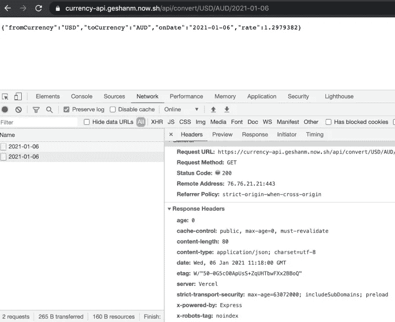
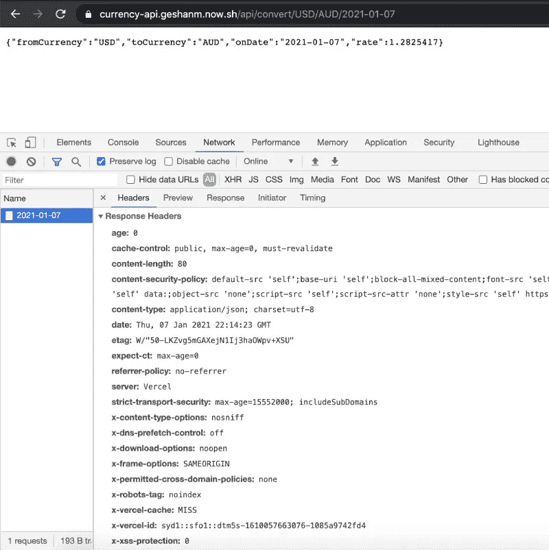
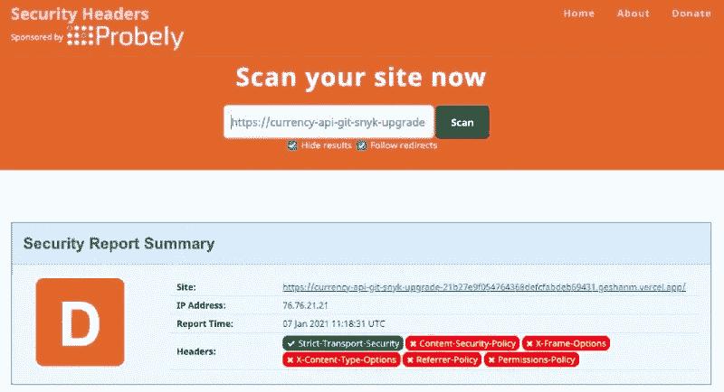
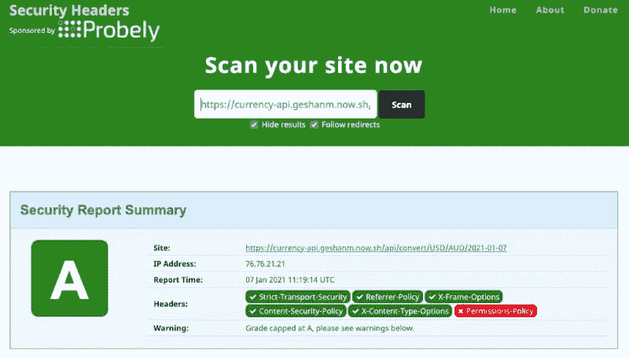

# 如何保护 Node.js 应用程序

> 原文：<https://betterprogramming.pub/nodejs-express-helmet-aa58c09c55c5>

## 让我们使用头盔，这是保护您的 Express.js 应用程序的必备工具


照片由 [Unsplash](https://unsplash.com?utm_source=medium&utm_medium=referral) 上的 Darshni Priya MS 拍摄。

安全是每个人的责任。[头盔](https://github.com/helmetjs/helmet)保护你的 Node.js 应用免受一些明显的威胁。在编写 Node.js + [Express.js](https://expressjs.com/) 应用程序时，请始终使用头盔来保护您的应用程序或 API 免受 XSS、内容安全策略等常见安全风险的影响。

在本文中，我们将看到如何将头盔添加到现有的 API 中，以及它如何增强应用程序的安全性。我们开始吧！

# 目录

```
· [Web application security](#7252)
· [Handy OWASP cheat sheets](#0285)
· [Node.js Web application security](#56c4)
· [Example Express Js application](#1aec)
· [Express without Helmet Js](#3197)
· [Express Helmet to the rescue](#256a)
· [Helmet js with sane defaults](#b1cc)
· [Response headers for security](#fc59)
  ∘ [Content Security Policy](#7ed7)
  ∘ [Expect Certificate Transparency](#be9f)
  ∘ [Referrer Policy](#aee8)
  ∘ [Strict Transport Security](#065a)
· [Quick scan](#2f37)
· [Before Express Helmet](#5d58)
· [After Express Helmet](#65ba)
· [Conclusion](#ceeb)
```

# Web 应用程序安全性

Web 应用程序安全性是一个相当大的话题。有[人写过](https://www.oreilly.com/library/view/web-application-security/9781492053101/) [书](https://leanpub.com/wasec)讲述这件事。例如，OWASP 发布了一份年度[十大 web 应用程序安全风险](https://owasp.org/www-project-top-ten/)列表，该列表通常以注入(如 SQL 注入)和跨站点脚本(XSS)为特色。

例如，对于 [Node.js 和 MySQL](http://markdown-to-medium.surge.sh/blog/2020/11/nodejs-mysql-tutorial/) ，您可能希望使用 [MySQL2](https://github.com/sidorares/node-mysql2) 库而不是 [MySQL](https://github.com/mysqljs/mysql) 库，因为它支持[预处理语句](https://github.com/sidorares/node-mysql2#using-prepared-statements)，可以从数据库级别处理 SQL 注入。

根据您面向公众的应用程序及其相关数据的敏感程度，您可能需要了解许多其他安全方面的知识。

# 方便的 OWASP 备忘单

如果你想尝试一些安全方面的东西，OWASP 有一个长长的清单[备忘单](https://cheatsheetseries.owasp.org/Glossary.html)来帮助你快速开始。这包括从[码头工人安全](https://cheatsheetseries.owasp.org/cheatsheets/Docker_Security_Cheat_Sheet.html)到 [SQL 注入预防](https://cheatsheetseries.owasp.org/cheatsheets/SQL_Injection_Prevention_Cheat_Sheet.html)的小抄。

如果你想找一些关于安全的东西，你可以从 OWASP 找到一个关于这个主题的备忘单。

# Node.js Web 应用程序安全性

今天，我们关注一个用 Node.js 和 Express 构建的 web 应用程序。像 Helmet 这样的库可以帮助设置正确的响应头，这对于更安全的应用程序来说是非常好的。因为 Node.js 有一个内置的 web 服务器，所以从 Node.js 本身控制 HTTP 响应头比从 Apache 或 Nginx 等其他 web 服务器控制更容易。

如果你用的是 Koa，可以用 [Koa 头盔](https://github.com/venables/koa-helmet)添加重要的回复头。

如果您正在使用其他语言，请考虑头盔网站的[另请参见](https://helmetjs.github.io/see-also/)部分中的可用选项。

例如，PHP 有一个[安全头文件](https://github.com/BePsvPT/secure-headers)编辑器包。对于 Django，有一个名为 [Django CSP](https://django-csp.readthedocs.io/en/latest/index.html) 的 pip 包。

# 快速应用示例

在本演练中，我们将使用[开源](https://github.com/geshan/currency-api/)货币 API 应用程序。这是一个简单的货币转换器代理 API，给出给定日期内一种货币对另一种货币的汇率。

我也在其他例子中使用过，比如[更快的 Docker 构建](https://geshan.com.np/blog/2020/10/docker-build-example-faster-docker-build/)一个。我还在一篇 [Docker 多阶段构建](https://geshan.com.np/blog/2019/11/how-to-use-docker-multi-stage-build/)文章中使用了相同的应用程序。这是一个简单的 API。我们来分析一下不戴头盔会带来的头部和安全隐患。

# 快递不戴头盔

下面是托管在 Vercel 上的不带头盔的 Currency API Node.js + Express app 的头部截图:



引起我注意的一件事是`x-powered-by`响应头。我不认为知道它是一个快速应用程序会给客户端增加任何价值。相反，如果攻击者发现我们使用的是旧版本的 Express，他们会试图利用任何已知的漏洞。这个头会被头盔摘下来。

使服务器更安全的一些头文件是:

*   `Content-Security-Policy`
*   `Strict-Transport-Security`
*   `Expect-CT`
*   `Referrer-Policy`
*   `X-Content-Type-Options`

在这个节骨眼上，下一步让我们将头盔添加到我们的 Currency API Express 应用程序中。

# 头盔来拯救

我们已经看到，一些响应头对于安全性至关重要。为了获得这些指示浏览器使我们的网站更加安全的基本响应头，我们将在我们的应用程序中添加头盔。我们可以将头盔添加到我们的 Express API 应用程序中，只需安装:

```
npm instal --save helmet
```

之后，我们将在我们的`index.js`文件中需要头盔，并把它作为一个中间件使用，如下所示:

```
const bodyParser = require('body-parser');
const helmet = require('helmet');
const exchangeRates = require('./src/exchangeRates');const app = express();
app.use(helmet());
```

您可以查看作为[拉取请求](https://github.com/geshan/currency-api/pull/113/files)的变更。

# 具有合理默认值的头盔

从上面的代码变化中可以看出，我们刚刚使用了带有`app.use(helmet());`的头盔，没有添加任何额外的配置。头盔的好处是它自动添加 11 个子中间件，默认配置相同。

这可能是为什么生产的快速安全最佳实践[推荐](https://expressjs.com/en/advanced/best-practice-security.html#use-helmet)使用头盔的原因之一。

除了使用头盔，还提到了[安全 cookie](https://expressjs.com/en/advanced/best-practice-security.html#use-cookies-securely)等东西。

现在是时候看看头盔在默认配置下增加了哪些新的响应头了:



我之前也提出过类似的请求，但是这次由于头盔的原因，没有了`x-powered-by`响应头。相反，头盔增加了一些新的头，从安全角度来看非常有用。

# 安全性的响应标头

通过添加默认配置的头盔，我们可以看到一些新的响应头被添加到我们的货币 API 应用程序的响应:

*   `[Content-security-policy](https://developer.mozilla.org/en-US/docs/Web/HTTP/CSP)`(也简称 CSP)
*   `[Expect-CT](https://developer.mozilla.org/en-US/docs/Web/HTTP/Headers/Expect-CT)` (CT 为证书透明度)
*   `[Referrer-Policy](https://web.dev/referrer-best-practices/#referer-and-referrer-policy-101)`
*   `[Strict-Transport-Security](https://developer.mozilla.org/en-US/docs/Web/HTTP/Headers/Strict-Transport-Security)`

让我们更详细地讨论这四个问题。

## 内容安全政策

这个头文件通过声明允许加载哪些动态资源来增加一层安全性。它有助于减少跨站点脚本(XSS)和一些形式的点击劫持。你可以阅读更多关于 [CSP](https://content-security-policy.com/) 的内容。

例如，通过严格的 CSP，你可以屏蔽来自其他网站的图片。下面是头盔默认给定的头的值:

```
content-security-policy: default-src 'self';base-uri 'self';block-all-mixed-content;font-src 'self' https: data:;frame-ancestors 'self';img-src 'self' data:;object-src 'none';script-src 'self';script-src-attr 'none';style-src 'self' https: 'unsafe-inline';upgrade-insecure-requests
```

根据这个策略，您不能加载远程样式，因为`style-src`被设置为只有`self`。根据你的具体需求，可以放宽政策。看看头盔上的[配置选项](https://github.com/helmetjs/helmet#reference)。

## 期望证书透明

顾名思义，`Expect-CT`检查证书的误用。当一个站点启用了`[Expect-CT](https://developer.mozilla.org/en-US/docs/Web/HTTP/Headers/Expect-CT)`头时，它们请求浏览器检查该站点的任何证书是否出现在公共 CT 日志中。

浏览器忽略 HTTP 上的`Expect-CT`头。标头仅对 HTTPS 连接有影响。因此，根据[公共日志](https://www.certificate-transparency.org/known-logs)，这是浏览器对网站的给定证书是有效证书的明确检查。头盔加了`expect-ct: max-age=0`，意思是浏览器应该期望证书有效。

## 推荐人-策略

简单地说，`Referrer-Policy`定义了应该从请求的 referrer 中获取什么数据。默认情况下，Helmet 会将此设置为无数据，这意味着 URL 的任何部分——无论是源还是查询字符串——都不能在您的网站上使用。Web.dev 有一篇关于[推荐者最佳实践](https://web.dev/referrer-best-practices)的精彩文章，带有易于理解的图形解释。头盔加`referrer-policy: no-referrer`，限制蛮多的。

## 严格的运输安全

这个响应头告诉浏览器需要使用 HTTPS 访问网站，而不是 HTTP。它有`max-age`和`includeSubdomain`指令。`Max-age`告诉浏览器它应该记住的时间(以秒为单位),该网站只能使用 HTTPS 访问。可选的`includeSubdomain`指令表明这个规则也适用于站点的子域。头盔增加了以下内容:

```
strict-transport-security: max-age=15552000; includeSubDomains
```

所以它说，该网站需要通过 HTTPS 访问 180 天，其子域名。

头盔还增加了其他头套，如`x-permitted-cross-domain-policies`、`X-Content-Type-Options`等。它们比上面提到的四个要稍微次要一点。

# 快速扫描

您可以在[安全标题](https://securityheaders.com/)上快速浏览您网站的安全标题。以下是使用 Currency API Express 应用程序前后的结果:

## 头盔前



如上所述，如果不使用头盔，就会缺少重要的 HTTP 响应头，如`Content-Security-Policy`、`Referrer-Policy`等。网站在这一点上的得分是“d”

## 后头盔



有了头盔，它会跳到安全标题上的“A”。

这意味着头盔是每个 Node.js + Express 应用程序中的必备组件，以获得更好的安全响应头。

如果您正在构建一个 Express 应用程序并考虑将其投入生产，请确保将头盔添加到您的清单中。

# 结论

对于所有 Node.js + Express 应用程序来说，头盔是一个很棒的包。

它应该与适当的配置一起使用，以便应用程序是安全的，并且仍然是最优许可的。

除了响应头之外，还有其他因素需要考虑，为了更好的整体安全性，我们还应该关注安全 cookies、包的最新和安全版本等。