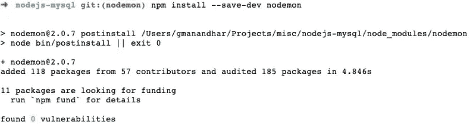
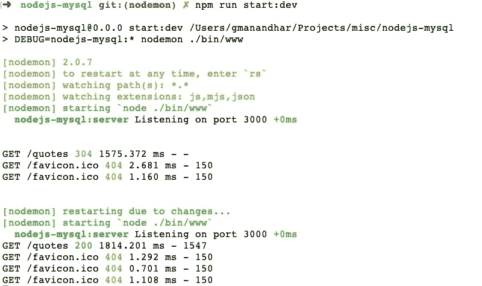

# 如何使用 Nodemon 重启 Node.js 应用程序

> 原文：<https://betterprogramming.pub/nodemon-e5d7b35ffc01>

## 自动高效地重启您的网络应用

由[卡米尔 S](https://unsplash.com/@16bitspixelz?utm_source=medium&utm_medium=referral) 在 [Unsplash](https://unsplash.com?utm_source=medium&utm_medium=referral) 拍摄的照片。

如果您正在开发任何 Node.js 应用程序， [nodemon](https://nodemon.io/) 是您武器库中的必备武器之一。了解如何安装和有效使用 nodemon，以便在每次相关文件更改时自动重启 Node.js 应用程序。

您想重启 Node.js web 服务器并节省大量开发时间吗？在本文中，我们将看到如何轻松地将 nodemon 用于任何 Node.js 应用程序。

# 快速介绍

让 nodemon 监视您的文件更改就像让一只鹰监视它的猎物一样。每次保存文件时，Node.js 服务器都会自动重启。

就连 nodemon 的广告语都写着“自动重装。”可能会让您感到惊讶的是，nodemon 可以与 Python、Ruby 甚至 Make 等其他语言一起使用。超过 150 万个项目将 Nodemon 用作依赖项，因此它肯定是经过实战检验的。如果您没有使用 nodemon 进行开发，那么您就错过了。

让我们继续安装 nodemon。

# 如何安装 nodemon

在安装 nodemon 之前，我们将使用一个示例应用程序来查看 nodemon 的运行情况。我们将使用我在我的 [Node.js MySQL](https://geshan.com.np/blog/2020/11/nodejs-mysql-tutorial/) 教程中使用的 [Node.js MySQL 开源应用程序](https://github.com/geshan/nodejs-mysql)。这是一个简单的 quotes REST API，使用 Node.js 和 Express.js 与 MySQL 数据库进行通信。接下来，我们将在这个示例应用程序中安装 nodemon。

像大多数 npm 模块一样，Nodemon 有两种安装方式。

## 将 nodemon 作为全局依赖项安装

要将 nodemon 安装为全局 NPM 依赖项，我们可以运行以下命令:

这将把 nodemon 作为一个全局依赖项安装。这也将使`nodemon`命令在您运行它的任何路径上都可用。优点是不需要在每个 Node.js 项目中安装 nodemon。

## 将 nodemon 作为本地项目依赖项安装

要将 nodemon 安装为本地项目 NPM 依赖项，我们可以在我们想要的项目中执行以下命令:

对于我们的示例项目，我们将运行上面的命令。运行它应该会向我们显示如下内容:

如何将 nodemon 安装为本地开发依赖项

正如我们使用的`--save-dev`，nodemon 已经被添加到了`package.json`文件的`devDependencies`部分。类似地，相关的更改也被添加到了`package-lock.json`文件中。如果你使用 yarn，你可以运行`yarn add nodemon --dev`来添加 nodemon 到你的`devDependencies`。

当您在本地安装 nodemon 时，您将不能在任何地方访问`nodemon`命令。如果在`package.json`上下文之外运行 nodemon，就会出现`nodemon command not found`问题。为了解决这个问题，您可以全局安装 nodemon。

您可以在[这个](https://github.com/geshan/nodejs-mysql/pull/8/files)拉请求中使用 NPM 来查看添加`nodemon`作为开发依赖所涉及的更改。

# 如何使用 nodemon

为了使用 nodemon，我们将在运行应用程序时用`nodemon`命令替换`node`命令。由于我们将 nodemon 作为本地依赖项安装，为了使事情变得更简单，我们将在`package.json`中添加一个新脚本来运行带有 nodemon 的应用程序。我们可以在`package.json`文件中添加新脚本，如下所示:

之后，我们可以使用命令`npm run start:dev`运行应用程序，并点击`http://localhost:3000/quotes`在浏览器上查看输出。因为我们用 nodemon 运行应用程序，如果我们更改任何文件并保存它，它将再次在 nodemon 之后重新运行命令。例如，我在`src/services/quotes.js`中的一行上添加了一个`,`并保存了文件，结果是:

如何使用 nodemon 作为 package.json 脚本

如上所示，Express.js 服务器按照预期在每次文件更改时重启。

# 更多 nodemon 配置

我们可以通过向`nodemon`命令传递更多参数或添加一个`nodemon.json`文件来添加更多配置。例如，如果你想让 nodemon 和 Docker 一起工作，你需要添加`--legacy-watch`或者`-L`，这样它就可以支持 Chokidar 轮询。你也可以用 Docker 的例子来看看这个 [Node.js。](https://geshan.com.np/blog/2020/11/nodejs-with-docker/#1.3-add-nodemon-to-monitor-changes-and-reload)

您甚至可以使用`--delay`参数延迟 nodemon 的重启，如下所示:

这将等待两秒钟，然后根据文件更改重新启动服务器。例如，如果您想观看`.js`和`.sql`文件，您可以使用以下命令:

根据我们想要做的，我们可以向一个`nodemon.json`文件添加更多的配置。下面是一个`nodemon.json`文件的例子:

上面的`nodemon.json`将确保`clear`命令在每次重启时运行，这将清除任何旧的控制台输出。同样，它也会在文件更改后 2.5 秒重新启动服务器。我们还可以添加其他配置，如文件扩展名或要忽略的文件。这些配置也可以放入`package.json`文件中的`nodemonConfig`索引下。[看一下](https://github.com/remy/nodemon/wiki/Sample-nodemon.json)node mon repo 的另一个样本`nodemon.json`文件。

我强烈推荐阅读 nodemon [文档](https://github.com/remy/nodemon#nodemon)。常见问题解答是一个很好的地方，可以找到你在 nodemon 中遇到的任何问题的答案。有涉及 Docker，Windows，权限等的回答。

您可以在[这个](https://github.com/geshan/nodejs-mysql/pull/9/files)拉请求的示例配置文件中找到`nodemon`命令。

如果您需要更多关于 nodemon 使用的文档或帮助，如果 nodemon 安装在本地，您可以运行`./node_modules/nodemon/bin/nodemon.js -h`。如果 nodemon 是全局安装的，您可以简单地执行`nodemon -h`并查看帮助。

# 结论

我们已经看到 nodemon 对于 Node.js 开发来说是一个非常有用的工具。无论您是使用 web 服务器、命令行界面(CLI)还是任何其他工作负载，nodemon 都会让您的生活变得更加轻松。

Nodemon 就像在每次文件更改时让某人为您重启服务器。它在编写 web 应用程序时非常方便，因为它消除了测试中的许多摩擦。

我希望您已经学会了如何使用 nodemon 自动重启 Node.js 应用程序。