# 名义打字稿介绍

> 原文：<https://betterprogramming.pub/nominal-typescript-eee36e9432d2>

## 什么是名词性类型，为什么我应该使用它们？

照片由 [Arif Riyanto](https://unsplash.com/@arifriyanto?utm_source=unsplash&utm_medium=referral&utm_content=creditCopyText) 在 [Unsplash](https://unsplash.com/search/photos/programmer?utm_source=unsplash&utm_medium=referral&utm_content=creditCopyText) 上拍摄

要理解名词性类型，让我们从名字开始。单词 *nominal* 源于拉丁语词根 *nom，*意为“名字”。很简单，“名义上”这个词可以换成“命名”这个词。*命名类型*。

名义类型系统使用类型的名称来检查等价性。出于直觉，这里有一个反例:

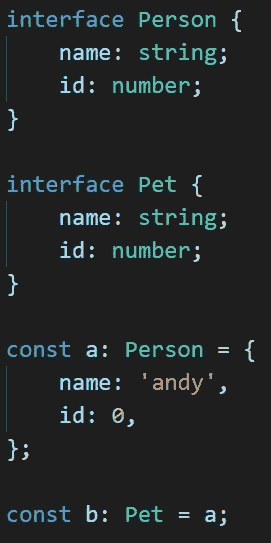

`Person`和`Pet`接口都包含相同的信息:名称和 id。

因为对象`a`匹配`Person`类型的结构，所以它可以被认为是`Person`。

由于这个相同的对象与`Pet`类型的结构相匹配，所以它也可以被认为是`Pet`。

这种类型系统被称为*结构*类型，是构建 TypeScript 的类型系统。

结构类型系统使用类型的*结构*，即属性的名称和类型，来断言类型之间的等价性。对于 TypeScript 来说，`Person`和`Pet`没有区别。

对于名义类型系统来说，`Person`和`Pet`是不同的；即使它们共享所有相同的属性。名义类型系统使用类型的名称来确定类型是否相同。

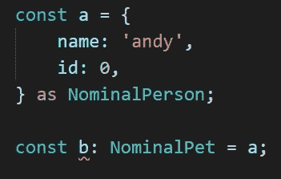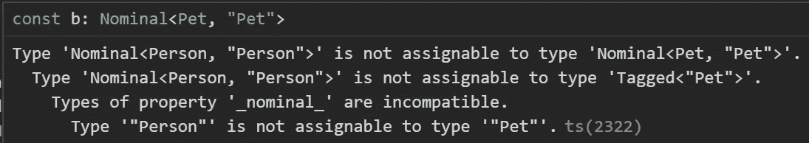

暂时忽略一些细节，错误消息的最后一行说明了一切:

> 类型“Person”不可分配给类型“Pet”。

虽然这些类型看起来一样，听起来一样，闻起来一样，但它们没有相同的名称。在名义类型系统下，这些是不同的类型。

# TypeScript 中的名义类型

TypeScript 没有对名义类型的本机支持。这一事实有很长的、有争议的历史，未来打字稿版本的路线图已经暂时搁置了名义类型。

不管怎样，许多技术已经浮出水面，让*在 TypeScript 中模拟*标称类型。因为这些技术都不是完美的名义类型，所以它们都有各自的优缺点。让我们介绍一些更常见的技术。

## 品牌宣传

也许最常见的技术叫做*品牌*。事实上，TypeScript 编译器在其自己的源代码中非常频繁地使用标记。

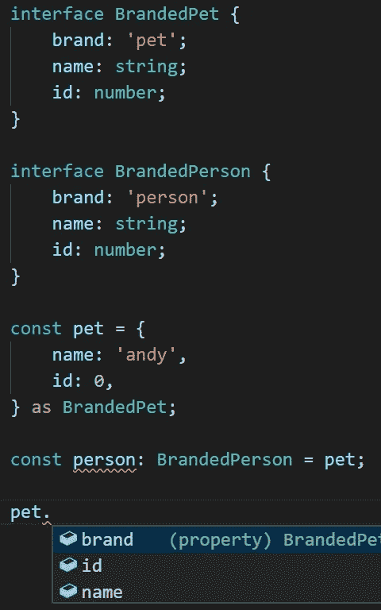

品牌或标签通常是添加到对象上不存在的属性中的字符串文字类型。

在这种情况下，TypeScript 会引发一个错误，因为字符串文字`'person'`不等于字符串文字`'pet'`。

使用物业名称作为品牌也可以达到同样的效果。例如，`'pet': void`。

品牌化技术的主要缺点是，它给品牌化对象引入了一个运行时不存在的假属性。

## 枚举

另一个常见的技巧是使用`enum`来创建名义类型。在 TypeScript 中，枚举是唯一的，因此与枚举相交的任何类型都是唯一的。

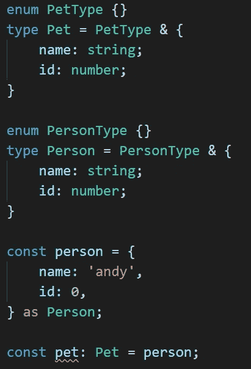

我们可以通过将唯一的枚举与每个类型相交来创建伪名义类型。这样做的优点是不会给每个接口添加虚假的属性，缺点是每个类型需要两个类型声明。

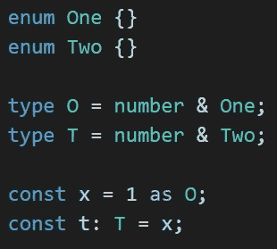

此外，因为枚举向下编译为数字，所以与数字相交的枚举等价于与数字相交的任何其他枚举。这是一个非常微妙的点，但是在试图创建名义数字类型时可能会有问题(名义类型的常见情况，我们将在下面看到)。

## 私有类成员

构造名义类型的最后一种方法是使用私有类成员来表示类型。这与品牌化是同一个概念，但是因为品牌是私有的，所以它不会显示为对象上的属性。

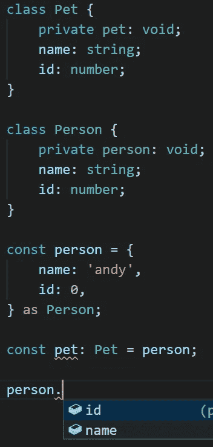

这种方法最方便的方面是封装它的能力。因为品牌属性不出现在对象上，品牌可以隐藏在一个实用程序文件或[实用程序库](https://github.com/andnp/SimplyTyped)中:

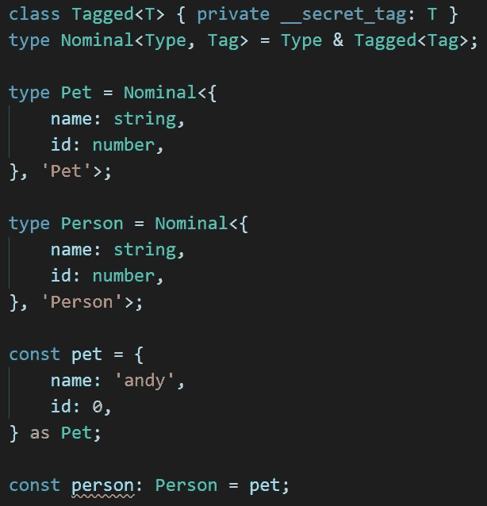

# 何时使用标称类型

何时(以及是否)使用名义类型是一个颇有争议的话题。我发现在两种情况下，名义类型对我很重要。首先是封装。第二是强制执行某些图书馆合同。

## 包装

有时候，我编写的代码完全封装在它自己的模块中。除了通过明确的预定义通道，外部世界的任何代码都不应以任何方式与此代码进行交互。例如:

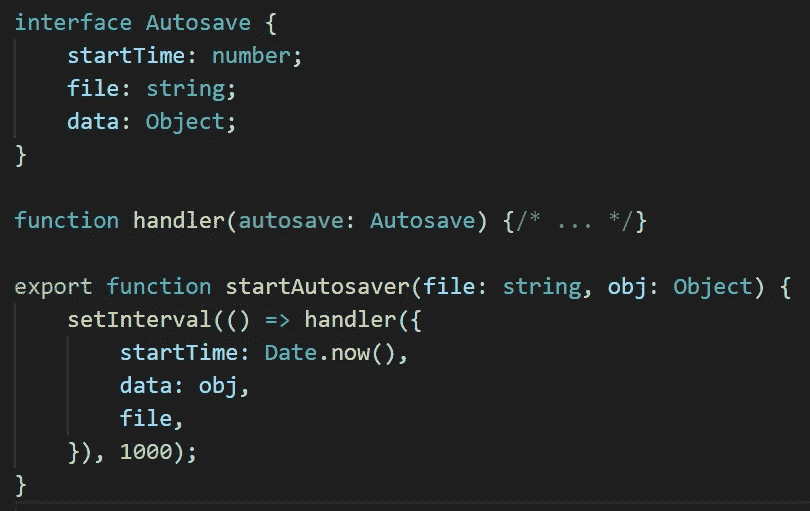

不可否认，这个例子有点做作，但是请继续关注我。在我的`Autosave.ts`模块中，我想传递一个`Autosave`对象。该对象包含所有必要的信息，以进行任何自动保存相关的操作。

随着这个模块的增长，可能会扩展到多个文件，我想确保我的`handler`函数是特定于到`Autosave`的。不应该简单地用任何碰巧有一个`startTime`、一个`file`和一些`data`的对象来调用`handler`函数。

为了避免混淆和防止误用，我可能想将`Autosave`接口标称化。这要么会迫使消费者确保他们使用的是一个`Autosave`对象，要么甚至会阻止消费者完全使用`handler`函数。

在任何情况下，通过使`Autosave`成为名义上的，我在传达我写`handler`函数时只考虑了`Autosave`。我写它不是为了一般地处理任意的相似结构的对象。

## 图书馆

标称类型的另一个常见用途是对测量单位进行编码。事实上，度量单位与名义类型略有不同，但很重要。但那是一个更长的对话。

例如，也许我有一个导出这个的库:

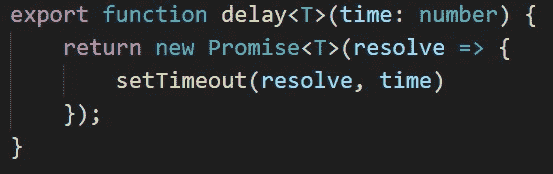

这个函数的消费者知道`time`是以毫秒为单位，而不是以秒为单位，这一点非常重要。我可以在文档中喊出我想要的，但是另一种处理方式是:

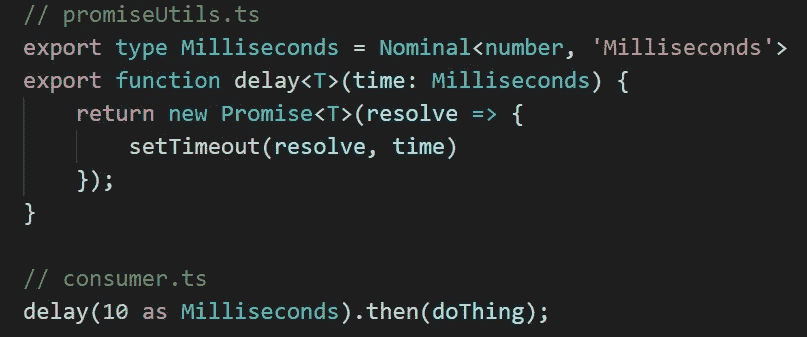

现在，每次消费者想要呼叫`delay`时，他们必须明确地将他们的号码转换为`Millisecond`。这允许一个额外的安全步骤，强迫用户签字同意他们理解和认可他们正在使用的单元。

本文到此为止！下面是对包含`Nominal`类型的实用程序库的简单介绍。

# 简单类型化

SimplyTyped 是一个泛型类型实用程序库。这包括我在整个故事的几个地方使用的封装的`Nominal`类型。将这些实用工具保存在这个共享空间中的好处是，它提供了防止在 TypeScript 中破坏更改的安全性。

随着 TypeScript 语言的发展和成熟，一些模式已经失宠。SimplyTyped 总是针对每晚的 TypeScript 版本进行测试，以便在发布下一版本的 TypeScript 之前捕获并修复这些重大更改。

 [## 和 np/SimplyTyped

### 又一个类型库。这一点与众不同，它的目标是在行业用例的驱动下，减少实验性…

github.com](https://github.com/andnp/SimplyTyped)