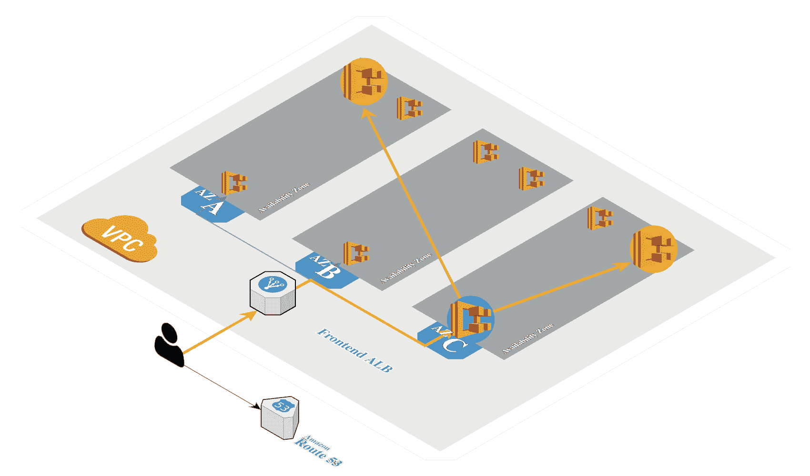
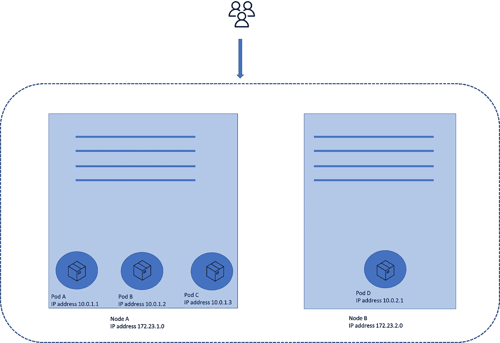
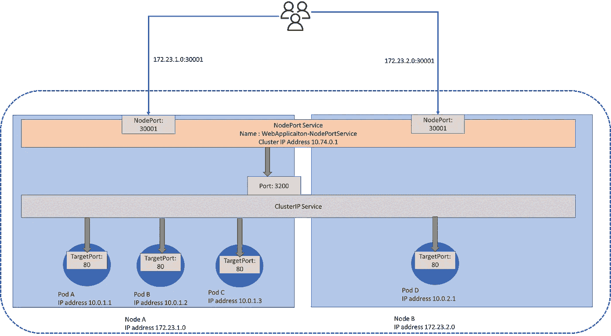
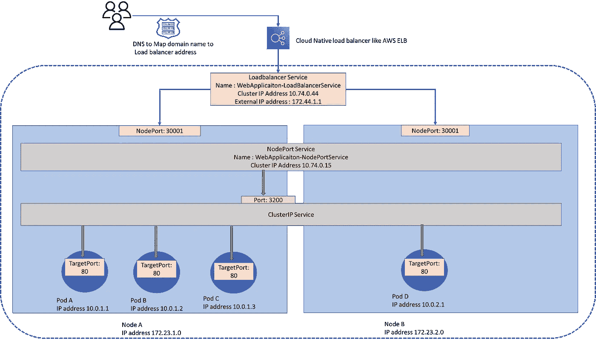
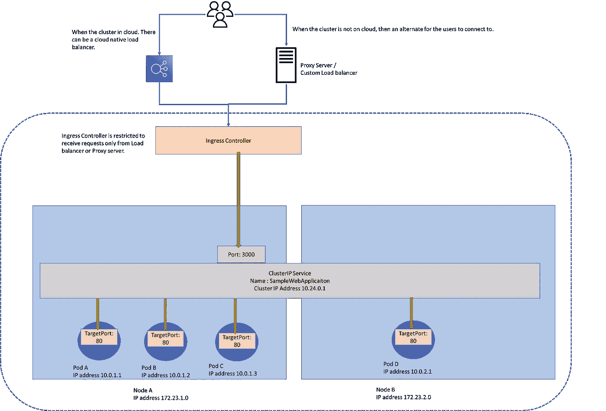

# Kubernetes 中的南北通信——客户机如何与集群内部的服务进行通信？

> 原文：<https://betterprogramming.pub/north-south-communication-in-kubernetes-how-does-a-client-talk-to-a-service-inside-a-cluster-8af8b27dbb9>

## 从 pod 的 IP 地址到云原生负载平衡器的逐步解决问题的方法

图片鸣谢——https://www.eksworkshop.com/ EKS[AWS](https://www.eksworkshop.com/)

在开始交流之前，先快速澄清一下 Kubernetes 中使用的一些基本术语:

豆荚——库伯内特斯最小的实体。每个 pod 都有一个 IP 地址。为简单起见，将它们视为运行应用程序的容器的包装器(就像运行在 docker 容器中的应用程序)。一个 pod 可能有多个容器；附加容器充当主应用程序容器的助手。也许，我会为下一篇文章保留多容器容器。

节点—部署 pod 并形成集群的物理或虚拟服务器/机器。

现在，假设 pod 正在运行一个 web 应用程序，有两个节点和四个 pod 服务于它。

具有两个工作节点的群集托管四个单元。每个 pod 都运行一个应用程序容器

如果用户以某种方式获得了 pod 的公共 IP 地址，那么客户端可以从外部访问 web 应用程序吗？这些单元位于节点内部的独立网络上。其次，pod 是易变的，每次创建一个 pod，它都会获得一个新的 IP 地址。

我们正在讨论示例中的四个 pod，那么我们公开谁的 IP 地址呢？还是我们向外界公开四个 IP 地址，让客户端决定要在哪个 IP 地址上碰碰运气？

# 1.节点端口服务

我们需要的是豆荚上面的一些层。这一层称为节点端口服务，因为它在节点上创建一个端口来访问 pod。

NodePort 服务在集群内部有自己的 IP 地址，它实际上是一组请求转发规则。它接受来自外界的请求，并将其传播到分布在一个或多个节点上的 pod。

可以通过使用任一节点的 IP 地址和节点端口服务的已配置端口来访问 Pods。

它还负责使用随机算法和会话相似性将流量分配给 pod。在内部，NodePort 服务使用另一个组件与 pod 通信，即 ClusterIP 服务。

所有问题都解决了？不完全是，仍然有三个问题:

## 使用 IP 地址从外部访问节点端口服务

它使用节点`<IP-Address of Node>:<Port of NodePort service>`的 IP 地址。因此，如果节点是永久的，我们可以给出两个节点的 IP 地址，客户端可以使用其中的任何一个。第一个问题是我们给了他们不止一个地址来访问服务器。

第二个问题是关于弹性和规模。因此，节点也是不稳定的，可能会停机(一般来说，可以通过拥有一个向外界公开的静态 IP 地址来克服这一限制。以及在放大和缩小事件时调用脚本，该脚本将该 IP 地址分配给集群中的一个节点)。

## 端口的范围是有限制的

有了 NodePort 服务，端口只能在`30,000–32,767`范围内配置。

## 安全性包括

由于工作者节点的端口直接对外界开放，因此出现了许多安全问题。

由于上述限制，NodePort 服务在开发或测试环境中可能是理想的。当在定制环境/集成中需要一些自由时，它也可能是有用的。让我们考虑替代方案:

# **2。负载平衡器服务**

在 NodePort 服务之上增加一层可能会有所帮助。当集群部署在公共云中时，如 AWS 或 Google，我们可以使用 Kubernetes 的负载平衡器服务，它与 AWS ELB 等云原生负载平衡器集成。

用户连接到外部负载平衡器，该平衡器将流量导向 pod。

负载平衡器服务有一个群集 IP 地址和一个外部 IP 地址。负载平衡器服务是对 NodePort 服务的抽象(是对 ClusterIP 服务的抽象)。因此，创建了 NodePort 服务，但是端口只能由云本地负载平衡访问，而不能直接对外部世界访问。

可能存在到负载平衡器的 DNS 路由，用户可以使用域名访问服务。也可以通过访问负载平衡器来直接访问该服务。外部负载平衡器控制如何将流量分配给 pod。

顺便提一下，根据负载平衡器和云平台的类型，可以指向节点/实例(在节点级别有一个跃点)或直接获取 pod 本身的 IP 地址(避免跃点，使其更有效)。例如，在 AWS 的网络负载均衡器中这是可能的。

# 3.进入

如果集群不在云上，或者在云上，但只是为了迎合 HTTP 流量，那么可以使用 Kubernetes 入口来代替负载平衡器。入口是第 7 层(HTTP)抽象，为传入请求指定路由规则。路由/重定向规则由称为入口控制器的另一个组件实现。

入口控制器

入口控制器充当集群内的反向代理/入口点。根据路由规则，来自客户端的任何请求通过负载平衡器到达入口控制器，并从那里被重定向到 pods。不需要节点端口服务。

此外，值得强调的是，根据服务和控制器实现，还有其他入口设置的可能性。

# 摘要

Kubernetes 使用服务来促进交流。我们看了节点端口服务、负载平衡器服务，并谈到了集群 IP 服务。我将在下一篇讨论集群通信的文章中再次讨论这个问题。

入口是 Kubernetes 中的另一个对象，它可以在集群外部公开 HTTP 服务。提供路由、TLS 终止和负载平衡。

此外，Kubernetes 与云提供商集成得很好，简化了集群设置。

我试着让这篇文章容易阅读和有用。让我知道你的反馈。

**我的相关文章**

**Kubernetes 集群中的服务如何通信？**[https://medium . com/codex/east-west-communication-in-kubernetes-how-do-services-communication-in-a-cluster-310 e9 DC 9 DD 53](https://medium.com/codex/east-west-communication-in-kubernetes-how-do-services-communicate-within-a-cluster-310e9dc9dd53)

**侧车模式，流程外架构** & **对多容器 pod 的需求**—[https://medium . com/codex/communication-inside-a-kubernetes-pod-why-do-we-Need-multi-container-pod-3d 8d 0d 64 c 2c 9](https://medium.com/codex/communication-inside-a-kubernetes-pod-why-do-we-need-multi-container-pods-3d8d0d64c2c9)

**为什么我们需要 Kubernetes 中的服务网格？—**[https://medium . com/codex/east-west-service-to-service-communication-what-is-service-mesh-4 e 56 f 94 BC 89 c](https://medium.com/codex/east-west-service-to-service-communication-what-is-service-mesh-4e56f94bc89c)

**通过入口控制器暴露非 HTTP 端点&新的网关 API**[https://medium . com/codex/north-south-communication-in-kubernetes-exposure-Non-HTTP-services-to-the-outside-world-4 ebba 4217443](https://medium.com/codex/north-south-communication-in-kubernetes-exposing-non-http-services-to-the-outside-world-4ebba4217443)