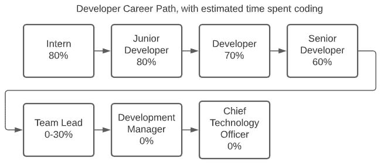
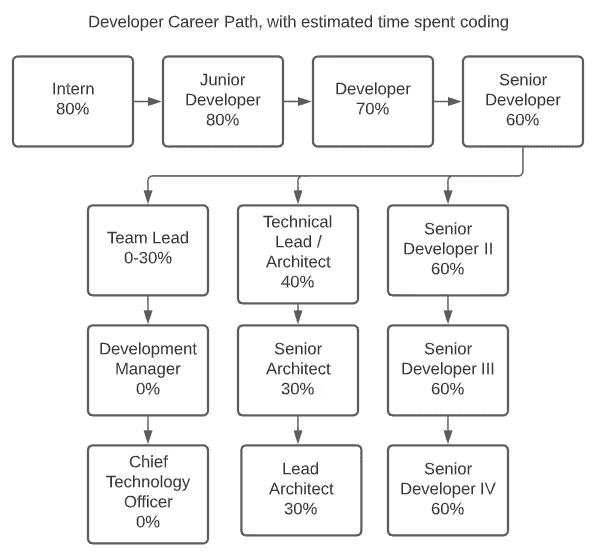

# 并非所有的开发人员都是经理

> 原文：<https://betterprogramming.pub/not-all-developers-are-managers-11e4eb2066b4>

## 关注人们的优势可以提高工作效率，留住人才

马库斯·斯皮斯克在 [Unsplash](https://unsplash.com/s/photos/leadership?utm_source=unsplash&utm_medium=referral&utm_content=creditCopyText) 上的照片

有许多不同类型的技能。一个与自然合拍的人可能成为园丁，而一个节奏出众的人可能成为音乐家。软件开发人员倾向于专注于学习代码和算法，而不是管理技能。为什么他们会被提拔到需要人际交往能力的岗位？

一个不完美的职业道路的例子，有一定比例的时间花在编码上(图片来源:作者)

随着他们被提升，开发人员花在他们专业领域的时间越来越少，直到他们不再编码。为了获得更高的薪水，他们牺牲自己的热情去做一些他们明显缺乏经验的事情。在某些情况下，他们还不如转行。

# 理想道路的想法

一个职业道路分成三个独立路线的例子(图片来源:作者)

一些开发人员作为人员经理(团队领导)茁壮成长，所以这条路仍然是可行的。对管理他人不感兴趣的人仍然可以通过建筑来发展自己的事业。最后，那些只为金钱利益而对爬上公司阶梯感兴趣的人可以选择继续做他们喜欢的事情。

那些把人作为唯一前进道路的公司可能会有意想不到的副作用。

## 神入

> “[人际智能]包括有效的语言和非语言交流，注意他人差异的能力，对他人情绪和气质的敏感性，以及接受多种观点的能力。”—马克·维塔尔， [9 种智力—信息图](https://blog.adioma.com/9-types-of-intelligence-infographic/)

与经理的一对一会议对于收集双向反馈和帮助人们实现个人目标非常重要。然而，如果经理的智慧是逻辑的，而不是人际的，他们可能会努力满足下属的需求。

有了专门的人事经理，员工可以从能够在情感上沟通的人那里获得指导。同理心是迈向更快乐的工作环境的一步，对生产力有积极的影响。

## 禁用团队

一个好的经理能让团队更有效率地工作。然而，如果一个人爬到那个位置是加薪的自然下一步，他们可能没有动力给自己竞争。

人事经理有一个专注的角色:让团队充满活力。他们不必与那些追求技术角色的人竞争，甚至可能不是来自开发背景。专注的角色意味着:

*   他们可以专注于提高自己的管理技能。
*   他们可以研究个人和个性。
*   他们没有被会议淹没。

身兼多职的经理可能会成为团队的负担。他们经常被会议压得喘不过气来，这会阻碍技术决策的进展。如果他们的工作是零星的，并有助于团队的速度，这可能会人为地提升团队在 sprint 中所能完成的表现。即使他们的开发工作没有被计算在内，代码审查和测试仍然需要时间。这些代码变更有时不能满足团队的最佳实践，特别是如果经理不能参加技术决策变更的会议。

## 促销逻辑

有些人的晋升是基于他们的雇佣日期、加班时间或交付能力，而不是他们的领导能力。由于职业道路单一，这可能是留住人才的最佳选择。然而，结果可能意味着表现最好的人不再编码。他们中的一些人最终离开去了其他公司，因为他们想念它。

> “没有比根据每个人的长处来看待他们更有效的赋权方式了。”—唐·克利夫顿

Clifton 强项评估侧重于提高强项而非弱项。让人们扮演正确的角色可以让团队变得更有效率。

## 建筑之路

这条道路是为那些对设计系统感兴趣的人准备的。架构师通过研究和实验从团队中移除未知的负担，允许团队专注于实现和测试。他们可以展示模式和最佳实践，而不是指导人们如何与他人互动；他们帮助发展团队的逻辑能力，而不是人际交往能力。

虽然这些角色仍然是技术性的，但人际交往技能仍然可以帮助架构师茁壮成长。一个独立的人事经理可以让他们更好地与他人合作。

## 延续路径

开发人员可能对管理人员或设计系统不感兴趣。这些人可能会满足于他们不想要的角色，因为这是获得加薪的唯一途径。从 I 级到 V 级的晋升可以留住人才，同时仍然提供额外的责任。这些人在代码评审期间让初级开发人员与团队标准保持一致。他们还与架构一起讨论和实现解决方案。

# 结论

通过关注一个人的优势，他们可以被安排到最大限度发挥其潜力的角色中。只有管理职业道路会把人们推向不适合他们的位置。这些开发人员可能会离开，到另一家公司与他们真正的激情重聚。