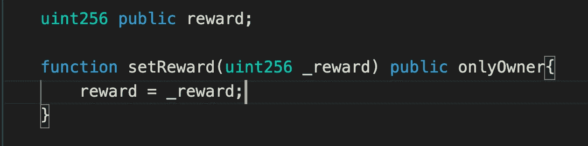
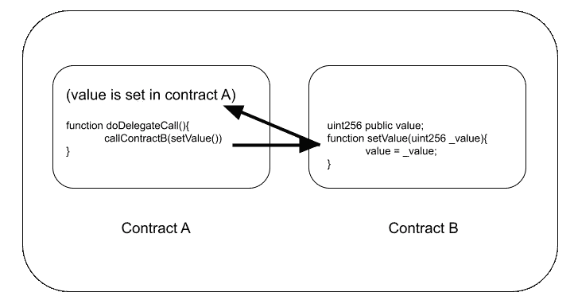
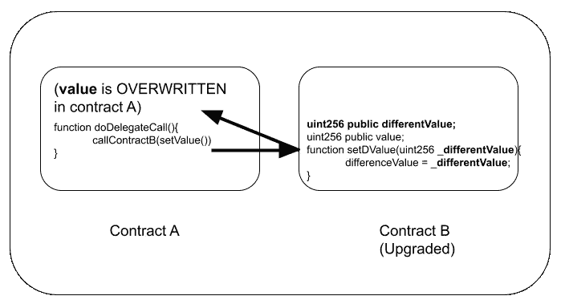
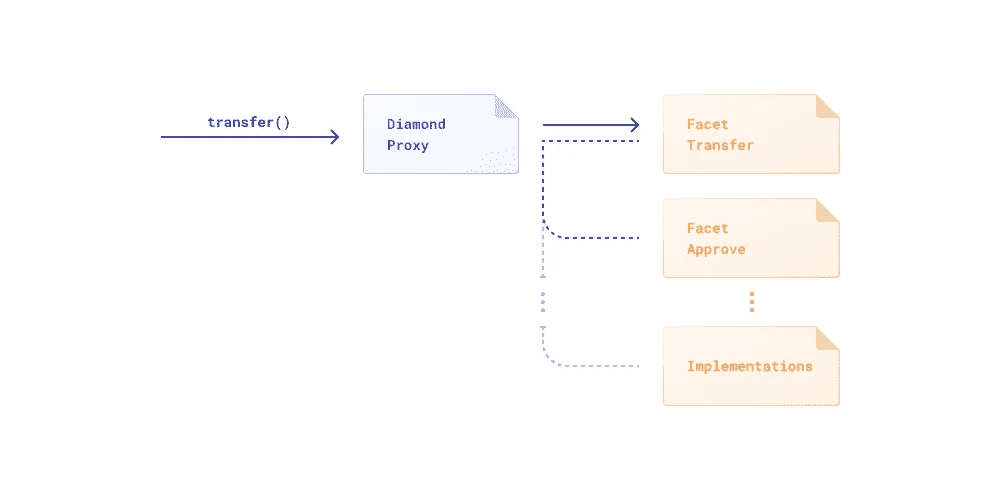

# 并非所有智能合约都是不可变的—创建可升级的智能合约

> 原文：<https://betterprogramming.pub/not-all-smart-contracts-are-immutable-create-upgradable-smart-contracts-e4e933b7b8a9>

## 对坚实世界的探索


[Cytonn 摄影](https://unsplash.com/@cytonn_photography?utm_source=medium&utm_medium=referral)在 [Unsplash](https://unsplash.com?utm_source=medium&utm_medium=referral) 上拍摄。

出于多种原因，您可能需要升级您的智能合同。你可能想要修复一个 bug，添加新的特性，或者其他什么。这篇文章将告诉你你需要知道的不同的事情，常规的方法，一些哲学，等等。

# 介绍

当在链上部署您的智能合约时，我们都知道它们是不可变的。

但是如果我告诉你…他们是*可变*呢？

嗯，我不会真的是正确的。然而，在某种程度上，智能合约一直在“变化”。当人们转让代币时，当人们在合同中下注时，他们必须更新他们的余额来反映这一点。它们是不可变的原因是，那些契约中的逻辑永远不会改变，并且将永远在链上。

所以，从技术上来说，它们是永远不变的。一旦部署，那部分代码就永远不能更改，这是智能合约的主要优势之一。

但是，如果我们想要:

1.向协议添加新功能。

2.修复现有协议中的一个明显缺陷。

现在，即使我们不能改变部署到特定地址的特定代码，我们实际上可以改变的比你想象的多得多。在这个视频中，我们将向您展示如何使用 hardhat 和 [OpenZeppelin](https://openzeppelin.com/) 升级您的智能合约。

此外，我从 OpenZeppelin 的[智能合同升级状态](https://blog.openzeppelin.com/the-state-of-smart-contract-upgrades/#diamonds)、Bits 博客的 T10 踪迹 T11、包括 Diamon 标准的[EIPs](https://eips.ethereum.org/EIPS/eip-2535)以及许多其他有用的在线资源中学到了很多资料。

关于升级智能合同的视频

# 摘要

乍一看，你可能会想，“这难道没有挫败智能合约不可更改的叙事吗？”你是对的。升级您的智能合同肯定会带来一些哲学和去中心化的含义。这就是为什么确保你理解你正在处理的合同是干什么的是如此重要，并且作为一名工程师，你需要理解权衡。

我将重点介绍升级您的智能合同的三种主要方式:

1.不真正升级的方法

2.社会 yet/迁移方法

3.代理(三种)

# **1。不真实的方法**

第一种“升级”的方式有点不诚实。你只需在你的智能合约中参数化一切。这是什么意思？这意味着你有一堆 setter 函数来改变你的智能契约的外观。这方面的一个例子可能简单到在 DeFi 协议上设置 1%到 2%的奖励参数。



Setter 函数示例

这实际上没有修改状态或向契约添加任何新内容的灵活性。如果你没有提前计划好一些特性，你就会停滞不前。这里要考虑的另一件事是谁是管理员。如果你只有一个管理员，你需要知道你是一个集中的协议。

这方面的另一个例子可能是合同登记处。这是早期版本的 [Aave](https://docs.aave.com/developers/deployed-contracts/deployed-contracts) 利用的优势。在调用一个函数之前，您需要检查一个契约注册中心，在那里可以找到与您的调用相关联的数据。同样，这并不真正允许我们拥有真正升级的全部功能，因为我们需要有远见来计划我们未来想要的每一次升级。

这仍然可能是团队选择的一种方式，因为如果您确保管理员只是 DAO/治理协议，它允许治理协议更新协议工作方式的一部分。

# **2。社交 Yeet**

Social Yeet/migration 方法是 Trail of Bits 推荐协议升级的方式。当你刚刚部署了一个新的智能合同，并告诉每个人，“好的，现在这是新的！”按照社会习俗，每个人都应该接受新合同。因此我有个俚语名字，“社交名流”

这些与前面提到的方法一起工作很好，并且拥有真正不可变的巨大优势。你今天调用的函数将永远以同样的方式工作。这也意味着，如果你总是使用智能合约，你永远不必担心被拉地毯，因为它不会改变。这是最容易审计的，对底层可靠性的理解最少，很多协议都使用并利用了这种方法。每当你看到合同上写着“这是 V2！”他们做过类似的事情。

请记住，当我们这样做时，我们仍然必须将所有数据从我们的第一个版本移动到这个版本。有时，人们会将他们的数据和逻辑分离到不同的契约中，以使这种迁移更容易。

# **3。代理人**

现在是你一直在等待的时刻:如何使用代理——这是“最真实”的升级形式，因为它们允许我们有一个单一的合同地址，用户可以继续与协议进行交互，就像什么都没有改变一样，而且还可以抓住你的失误。

代理契约利用了`delegatecall`，这是一个低级函数调用，其中目标地址的代码在调用契约的上下文中执行，并且`msg.sender`和`msg.value`不改变它们的值。

这意味着，如果我在契约 B 上`delegatecall`了一个函数，我就在契约 a 中执行了契约 B 的逻辑。因此，如果契约 B 有一个函数说，“嘿，在顶部存储一个变量”，我就要在契约 a 中这样做。



根据合同 B 的逻辑设置合同 A 中的值

这让我们可以做很多事情。最重要的是，我们可以让契约将所有调用委托给不同的契约:

这意味着我可以永远拥有一个代理合同，当我想升级时，只需让它指向不同的合同。如果这是我的合同设置，我想升级我的合同，我只需在我的代理合同上调用一个仅限管理员的功能，我会将所有合同调用到这个新合同。

我们在本期《建筑师》中讨论了四个不同的主题:

*   实现契约拥有我们协议的所有代码。当我们升级时，我们启动一个全新的实施合同。
*   代理契约指出哪个实现是“正确的”,并将每个人的函数调用路由到该契约。
*   用户呼叫代理。
*   管理员是升级到新实施合同的用户(或用户组/投票人)。

在这个场景中，我可以将我的数据存储在代理中，因为`delegatecall`将在代理中执行实现的逻辑。每当我想更新我的逻辑时，我只需将实现契约指向一个新契约。

我还可以通过将存储附加到逻辑契约来添加新的存储，代理将在升级时选择该存储。

这有许多“问题”，最显著的是存储冲突和函数选择器冲突。

## **存储冲突**

当我们使用`delegatecall`时，请记住我们在契约 a 中执行契约 B 逻辑。因此，如果契约 B 要求将`value`设置为`2`，我们需要将`value`设置为`2`。但是这些“智能契约”有点愚蠢，我们实际上设置了与`value`相同的存储位置。因此，如果我们的合同看起来像这样，我们仍将设置最高值:



合同 A 的值在升级中被覆盖。

重要的是要知道，在这方面，我们只能将值附加到我们的智能合约，因为当我们这样做时，我们将获得新的未使用的存储点，但我们不能重新排序或更改过去的存储点。

## **功能选择器冲突**

当我们告诉我们的代理执行一个函数时，它使用一个函数选择器来查找这个函数。函数选择器是名称和函数签名的四字节散列(现在不用担心这些是什么)。现在，完全有可能实现契约中的函数与管理函数具有相同的函数选择器，这可能会导致我们不小心做了许多奇怪的事情！

尽管它们不同，但这两者有相同的功能选择器:

```
// This solidity will not compile!
contract Foo {
    function collate_propagate_storage(bytes16) external { }
    function burn(uint256) external { }
}
```

# 代理模式

## 透明代理合同

这导致了我们的第一种代理，即“透明代理契约”这些契约只允许管理员调用代理中的管理函数，其他人调用实现中的函数。这样，你总是知道如果你是一个管理员，你将调用一个管理函数。如果您是用户，您将从实现中调用。

这是我在[布朗尼升级组合](https://github.com/brownie-mix/upgrades-mix)中演示的实现。这是一个非常简单的代理模式，我认为是最容易使用和最用户友好的。如果你试图在这种模式下做一些潜在的问题，它会恢复，这很好，但这是以更多的气体为代价的。这也是一种模式，使您每次想升级时都要升级整个合同。

## 通用可升级代理

我们将要介绍的第二种代理是“通用可升级代理”或“UUPs”这些是代理，其中升级逻辑实际上在实现契约内。这里的优点是它现在可以依靠 Solidity 编译器来寻找那些函数冲突。与完全分离管理功能不同，代理更小，并且允许每次调用从存储器中少读取一次，节省了汽油。你不再需要检查来电者是否是管理员。

缺点是，如果您忘记添加升级逻辑，或者在您的实现合同中添加了糟糕的升级逻辑，那么您就被困住了！然后回去签你的智能合同。这也存在同样的问题，即一次升级适用于所有情况，如果您想升级，您必须升级整个合同。

## 钻石代理

我们要讲的最后一个方法是“钻石”标准。我喜欢将 diamond 标准视为一种“多重透明代理模式”，因为它允许用户升级智能合约的特定部分，而不是整个应用程序。这解决了两个大问题:

1.  它允许契约大于最大契约大小，因为您的分散式应用程序现在在某种程度上是“分片”的。
2.  它允许用户在每次升级时升级合同的特定部分，而不是整个合同。

有时你的合同太大，无法适应最大合同规模，所以你需要很多。如果您有多个合同，这也使更精细的升级成为可能。您可能只需要升级一项功能，而不是整个合同。

编辑:在本文以前的版本中，我提到过您需要注意函数选择器冲突。然而，在钻石合同的新实施中，如果出现冲突，钻石似乎会恢复原状。

它确实有一些让我害怕的“陷阱”。来自[钻石储存如何工作](https://dev.to/mudgen/how-diamond-storage-works-90e) s:

> 不要犯这些错误:
> 
> 1.不要对不同的结构使用相同的命名空间字符串。因为这两个结构将在存储中相互覆盖。

我更希望有一个陷阱更少的合同，而不是一个可以引入更多陷阱的合同…所以确保你在实现这种类型的代理时明白你在做什么。命名是我希望看到改变的，因为学习钻石行业的所有术语来应用于智能合同感觉真的是违反直觉的。事实上，[我在 ERC 页面](https://github.com/ethereum/EIPs/issues/2535#issuecomment-846649104)上提议修改一些命名...我愿意死在这座山上。让函数添加名为`cut` 的功能对我来说似乎是违反直觉的。该标准仍在审查中，仍处于其 EIP 的“草案”阶段。

尽管我在这里提出了一些批评，我还是希望看到它被清理和最终完成，因为它对当前的代理模式提供了一些惊人的改进。尼克·穆奇在领导类似这样的事情上做了惊人的工作，我感谢他对这个和其他生态工业园的持续倡导。



钻石标准例子。原图来自 [OpenZeppelin](https://blog.openzeppelin.com/the-state-of-smart-contract-upgrades/#diamonds) 。

咻…这里有很多概念性的东西。一旦您理解了所有这些，您就可以按照 OpenZeppelin 的分步指南使用[透明代理契约模式](https://docs.openzeppelin.com/upgrades-plugins/1.x/hardhat-upgrades)部署契约了。