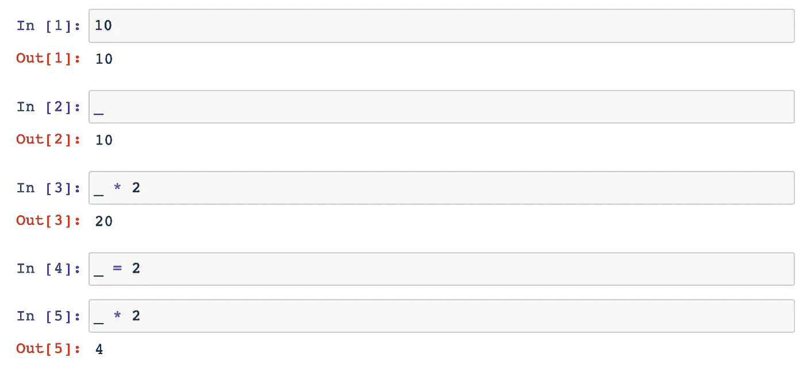
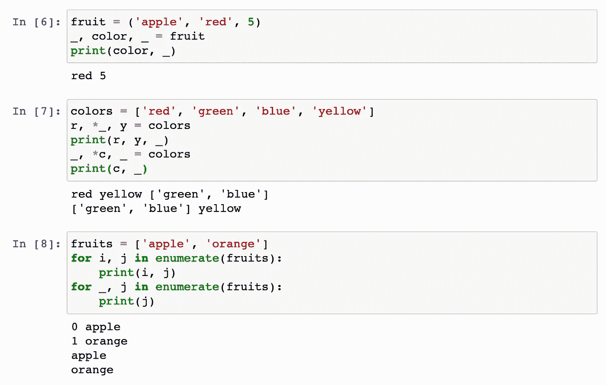
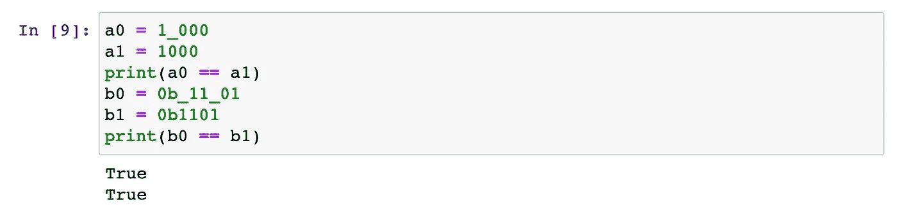
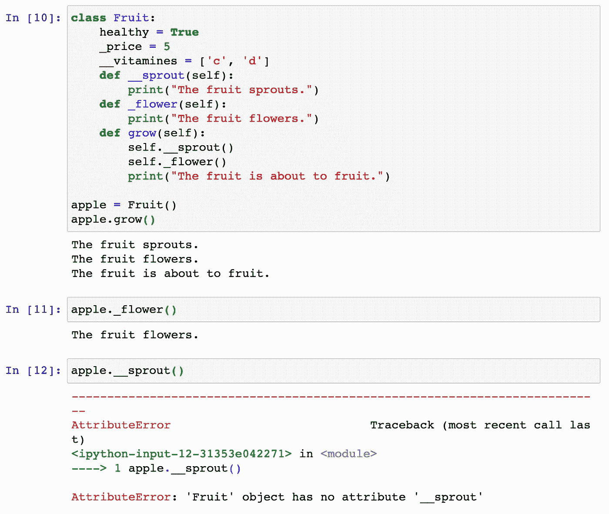
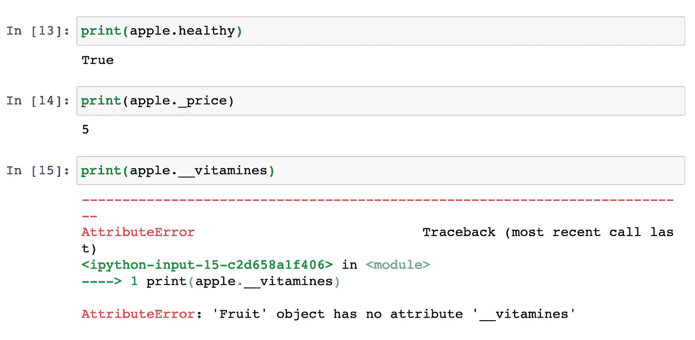
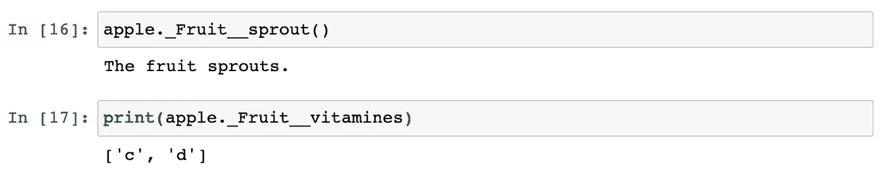
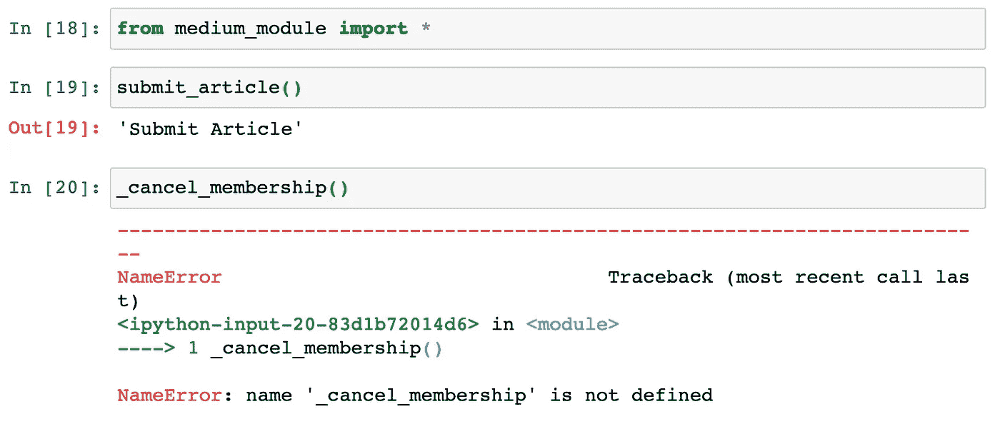
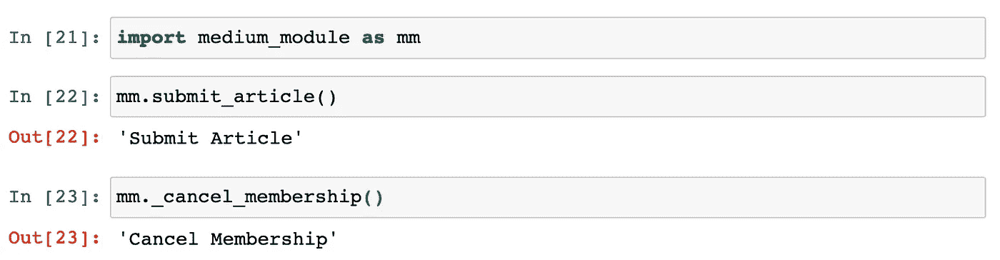
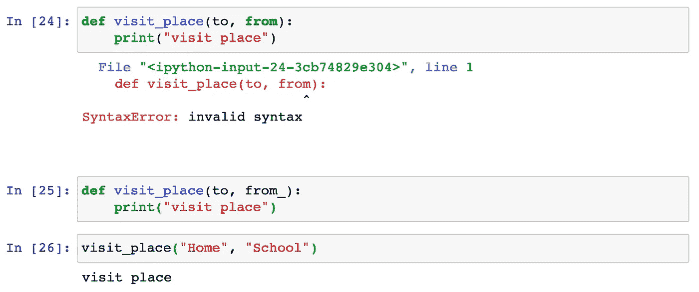
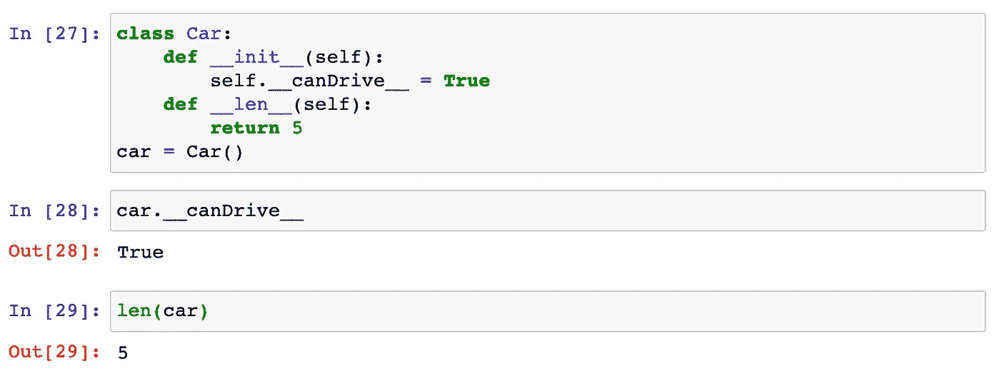

# 在 Python 中，并不是所有的下划线都相等

> 原文：<https://betterprogramming.pub/not-all-underscores-are-equal-in-python-b50768124092>

## 了解每个单词的含义

克里斯·里德在 [Unsplash](https://unsplash.com/s/photos/programming?utm_source=unsplash&utm_medium=referral&utm_content=creditCopyText) 上拍摄的照片

在 Python 中，我们在各种场景中使用下划线。你可能已经注意到了，它们并不总是服务于相同的目的。

这篇文章将总结最常见的用例。希望这有助于你理解 Python 中的下划线，这样你就可以按预期使用它们了。

# 1.对最后一个表达式值的引用

下划线的另一个常见用途是在解释器环境(例如，终端会话、Jupyter 笔记本)中使用它来引用最后一个表达式值。这里有一个例子。

如您所见，[2]中的第一个`_`的值为 10。在[3]的计算中，我们可以使用一个`_`来直接引用这个值。

重要的是，当一个值(即[4]中的 2)被赋给一个`_`，使其成为一个变量时，`_`将具有所赋的值，正如[5]中乘法的乘积所反映的那样。

# 2.被忽略值的表示

这也是一种常见的用法。下面是使用下划线忽略不需要的值的各种情况:

当我们分解一个元组时，我们只需要命名将要使用的项。例如，在上面的[6]中，我们只想使用`fruit`的`color`，我们使用下划线来命名其他项目。需要注意的一点是，下划线本质上是变量，因此当我们打印`_`时，它将显示最新的赋值。在这种情况下，`_`是 5——元组的最后一项。

当我们分解一个列表时，有几个使用场景，如[7]所示。一个是我们只需要使用`colors`列表中的第一个和最后一个条目，所以我们为每个条目命名两个变量，用`*_`来指代中间的所有条目。另一种是我们只想使用原始列表中间的项目列表。在这种情况下，我们只使用下划线来命名第一个和最后一个项目，变量`c`是一个新列表，由原始列表中间的项目组成。

一个常见的任务是，我们必须迭代一个列表来对每个条目运行一些操作。对于第一次迭代，我们使用`i`和`j`分别指代索引和条目。有时候，我们不需要知道索引，在这种情况下，我们可以通过在最初写`i`的位置使用一个`_`来忽略它。

# 3.分隔数字的位数

这个特性主要是为了可读性。下图显示了相关的示例。如您所见，第一对数字(即`a0`和`a1`)相等，第二对也是如此:

# 4.变量或函数名的一部分

下划线最常见的用法是作为变量或函数名的一部分。以下代码片段向您展示了一些示例:

如你所见，对于变量，下划线可以在变量的开头、中间或结尾。此外，下划线本身也可以是变量名。

下划线可以像变量名一样灵活地用在函数名中。在开头、中间、结尾或单独使用它们都是有效的。但是，根据下划线的数量和位置，它们可以有不同的指示和使用场景，如下所述。

## 4.1.私有属性和方法

如前所述，下划线可以是函数的前缀。当这些函数在自定义类中定义时，这些函数就变成私有的。如下所示，我们声明了一个`Fruit`类，其中定义了三个属性:`healthy`、`_price`和`__vitamines`，以及三个方法:`grow()`、`__sprout()`和`_flower()`。

如[10]末尾所示，没有下划线前缀的方法是公共的，可以在类的范围之外调用。一个下划线表示该方法是私有的，但是如果我们在[11]中选择这样做的话，可以从外部调用它。函数名前面的两个下划线使得该方法严格私有，因此不能在外部调用，如[12]的错误消息所示。

同样，同样的规则也适用于类的属性。相关的例子如下:

虽然看起来通过在属性和方法名前面使用双下划线，我们能够使它们成为私有的，但事实并非如此。事实上，双下划线表示“名称篡改”，这是指使用公式对这些属性/方法的更改:`_ClassName__attributeName or _ClassName__methodName`。

示例如下所示:

一个相关的场景是，当我们从某个模块导入时，带有下划线前缀的属性和方法不会被导入。这里有一个简化的例子。假设我们有一个名为`medium_module`的模块，如下。

当我们通过调用`from medium_module import *`来使用这个模块时，这两个函数并不都可用——带有 _ 前缀的函数不可用。

然而，需要注意的是，如果我们通过如下调用`import medium_module as mm`来导入模块，我们可以访问这些“私有”方法:

## 4.2.避免命名冲突

这是一个不太常见的场景。Python 有一些关键字，像`def`、`impor` t、`from`，是为特殊用途保留的。通常，我们不能在函数中使用这些关键字，否则会造成命名冲突。为了解决这个问题，我们可以在这些关键字后面使用一个尾随下划线。

下面是一个简化的例子。如您所见，使用`from_`有效，而使用`from`无效:

## 4.3.神奇的方法

在 4.1 中，我们提到如果属性或方法有双前导下划线，命名混乱就会发生。然而，有一种特殊情况不会发生名称混淆:当属性或方法以双下划线开始和结束时:

Python 保留使用双前导和尾随下划线。例如，在自定义类中，我们使用`__init__`来构造一个对象。这种类型的方法通常被称为“魔术方法”理论上，我们可以使用这种模式创建自己的神奇方法。然而，在大多数情况下，我们不需要。

# 结论

感谢阅读。我希望你能从这篇文章中学到一些有用的东西。

最后，本教程回顾了 Python 中下划线的常见用例。除了第三种用法(即分隔数字的位数)只是为了可读性，所有其他用例在 Python 项目中都很方便。