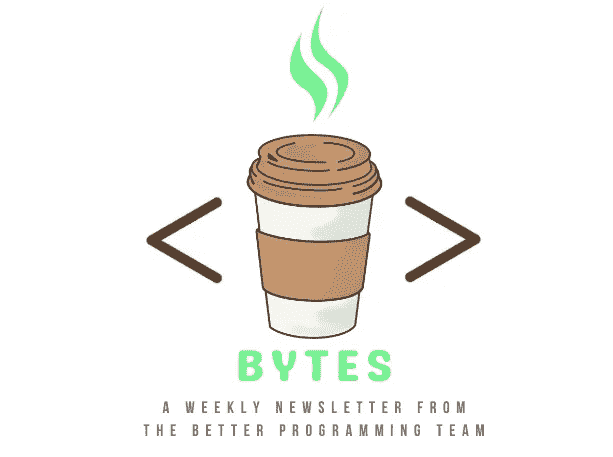
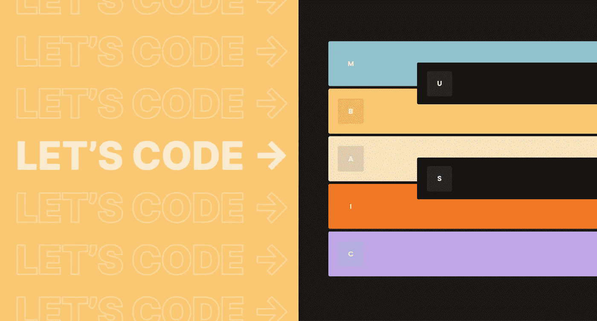
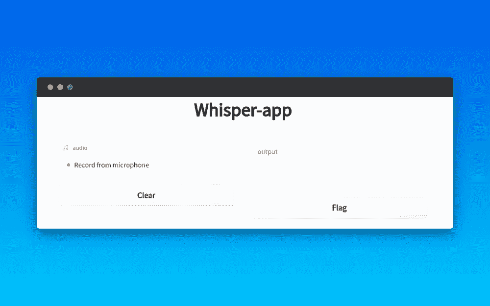
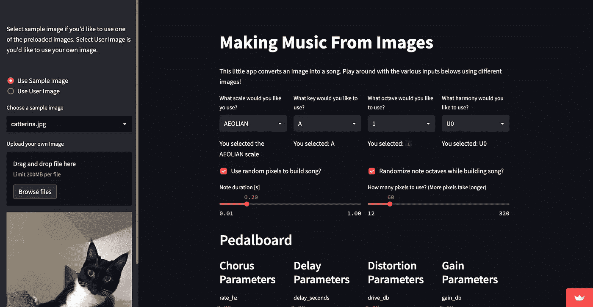
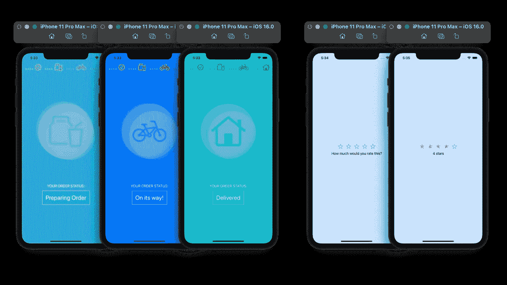

# 不只是人工智能艺术发电机的东西

> 原文：<https://betterprogramming.pub/not-just-ai-art-generator-stuff-fed9d1a74e4d>

## 咖啡字节第 47 期



嘿，各位，我希望你们这周过得愉快。

貌似现在大家都在用 AI 生成内容！所以，毫不奇怪，我们在今天的列表中找到了四篇与之相关的文章。无论你是对文本到声音，声音到文本，文本到图像，还是图像到声音的生成器感兴趣，我们都希望你能在这个周末开始着手这些项目。

我们还包括了另外四个指南，承诺不会挖掘人工智能艺术生成器(试图跟上潮流已经势不可挡)。

事不宜迟，以下是我最喜欢的八本书。

## 让我们给钢琴键编码

Wayne Cen 接受一项挑战，重新创造一个虚拟钢琴键盘。他结合了 React、TypeScript、Next.js，工作起来就像 Mubasic 网站一样！

查看他的教程[这里](/lets-code-mubasic-piano-keys-3ac397d3df1d)。

[](https://betterprogramming.pub/lets-code-mubasic-piano-keys-3ac397d3df1d)

## 嘘…小声点

OpenAI 的最新工具 Whisper 已经推出几周了，在部署他的机器学习应用程序之前， [Franco Vega](https://medium.com/u/8717c1a5e68b?source=post_page-----fed9d1a74e4d--------------------------------) 对语音到文本生成器工具进行了[快速分析](https://medium.com/@franco.vegam/how-to-run-whisper-speech-recognition-model-and-create-a-simple-app-8426890299d8)。我还没有尝试过 Gradio 工具，但是它看起来很方便在 web 应用程序中演示 ML 模型。



## 从字符串到 ASCII 艺术

在 OpenAI 的 DALLE-2 引起了相当大的轰动的时候， [Mark Lucking](https://medium.com/u/cad7f7bef2a?source=post_page-----fed9d1a74e4d--------------------------------) 将我们带回了一个 GPU 还是一个遥远的梦想、ASCII 艺术是规范的时代。他向我们展示了如何用 SwiftUI 生成无数不同的风格。

## 从图像中产生声音

使用 Python， [Victor Murcia](https://victormurcia-53351.medium.com/?source=post_page-----81db627fd549--------------------------------) 演示了如何通过将颜色空间的细分映射到音阶中的特定音符来从图像制作音乐。这太酷了，不是吗？

点击阅读他的教程[，然后看看你能在](/making-music-from-images-with-python-81db627fd549)[应用](https://victormurcia-making-music-from-images-music-to-images-ce4ydi.streamlitapp.com/)上创造什么。



## 从 SaaS git lab 迁移到自托管

GitLab 加入 Heroku 限制其免费计划！随着自由层 GitLab SaaS 的用户限制即将到来，[艾玛·里齐](https://medium.com/u/8a7d960b6087?source=post_page-----fed9d1a74e4d--------------------------------)写了一个[及时指南](https://towardsdatascience.com/migrating-from-gitlab-saas-to-self-hosted-34b99bac0147)来帮助部署你自己的带有自动备份的 GitLab 实例。

## 使用 SwiftUI 构建多步骤视图

Sarah 本周回来教我们如何为导航创建一个多步可定制的 SwiftUI 视图。如果你正在学习如何为你的订餐应用程序添加一个入职表单或构建一个用户界面，请查看她的指南[。](/create-multi-steps-view-in-swiftui-fe5bf6923661)



## 头部倾斜以控制您的应用程序

[Cole Dennis](https://medium.com/@coledennis) 用 ARKit 搭建了一个[很酷的演示项目](https://coledennis.medium.com/tutorial-use-head-tilt-to-control-a-swiftui-app-using-arkit-realitykit-a03ab4fe5a6c)。它可以识别用户是否倾斜头部并更新 SwiftUI 视图。一个有趣的设计，还可以帮助身体残疾的人告诉别人他们想要什么。

## 来寻求建议；留下来听故事

在“我希望我早些知道的事情”文章的海洋中，我最喜欢[这一块](/11-non-technical-lessons-for-software-engineers-414d5a06b6eb)。这不是你通常在媒体上看到的建议。相反，维克多 Pleșcan 利用十多年的经验提供了大量的背景故事。无论你在职业生涯的哪个阶段，这本书都是必读的！

这是本周的总结。直到你下次喝咖啡，

Anupam 和更好的编程团队

```
Newsletter logo created by one of our editors, [Deon Ashleigh](https://medium.com/@ashleighbonner).
```