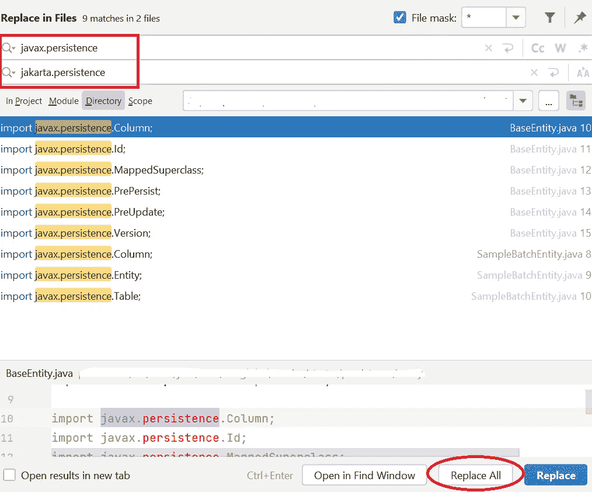

# Spring Boot 协议 3 升级说明

> 原文：<https://betterprogramming.pub/notes-on-spring-boot-3-upgrade-a15e16f84862>

## 在本快速指南中了解即将到来的变化

作者照片

随着 Spring Boot 3.0 GA 版本即将发布(2022 年 11 月)，是时候开始准备和升级我们现有的 Spring Boot 微服务到最新的 Spring Boot 3 里程碑版本 3.0.0-M4 了。我正在分享我将一个微服务升级到 Spring Boot 3 的笔记。希望对你有帮助。

# 先决条件

*   Java 17。Spring Boot 3.0 将基于 Spring Framework 6.0，需要 Java 17 或更高版本。如果您的微服务是基于较旧的 Java 版本构建的，请确保在执行以下步骤之前先将其升级到 Java 17。
*   升级到最新的 Spring Boot 2.7.x。如果您的微服务设置了 dependabot 工作流，那么在撰写本文时，您的微服务应该已经自动升级到最新的 Spring Boot 2.7.x 版本 2.7.3。但是如果，不管出于什么原因，你的微服务仍然在旧版本的 Spring Boot 上，确保你在继续之前先升级到最新的 2.7.x。同时，如果您的微服务还没有设置，请设置您的 dependabot 工作流。遵循我的故事[中的指导(技巧 1–4)9 个实用的 GitHub 技巧来帮助简化开发](/8-practical-github-tips-to-help-streamline-development-bf394079d554?sk=6fb3d50ddb3f91c6623fff98b0324145)。

# pom.xml 中的更改

您的项目`pom.xml`将需要以下更改:

将父版本从 2.7.3 更新到 3.0.0-M4。在撰写本文时，这些是 2.7.x 和 3.0.0-Mx 的最新版本。根据您准备升级到 Spring Boot 3 的时间，这些版本可能会有所变化，因此请确保您确实升级到了最新版本。

由于 Spring Boot 3 在 maven central 中还不可用，我们需要在我们的根 pom 中指定`spring-milestones`存储库，这样 maven 就知道在构建期间将 Spring Boot 3 里程碑构件放在哪里。一旦 Spring Boot 3 正式上市并在 maven central 中可用，这一部分就可以删除。

# 班级的变化

# 用 Jakarta EE 9 APIs 替换 Java EE 8

这可能是这次升级中最大的突破性变化。Spring Boot 3.0 将是第一个使用 Jakarta ee9 API(`jakarta.*`)而不是 EE 8 ( `javax.*`)的 Spring Boot 版本。这意味着我们将不得不用`javax.*`寻找 EE 8 进口，并用`jakarta.*`替换它们。Spring Boot 微服务中使用的典型 EE 8 包包括:

*   `javax.persistence.*`
*   `javax.validation.*`
*   `javax.servlet.*`
*   `javax.annotation.*`
*   `javax.transaction.*`
*   等等。

要知道`javax.sql.*`和`javax.crypto.*`之类的包是来自 Java 17 JDK，而不是来自 EE 8，所以留着是安全的。

有一个 IntelliJ 快捷方式可以在项目级别查找和替换包导入。你可以这样做:

*   在 IntelliJ 项目窗口中选择项目的根目录
*   点击`ctrl + shift + R`或通过 IntelliJ 菜单:编辑→查找→在文件中替换。会弹出一个类似下面截图的窗口
*   将`javax.persistence`替换为`jakarta.persistence`
*   单击“全部替换”以替换所有出现的内容
*   对其他 EE 8 `javax`组件重复相同的步骤

# 移除或修复不推荐使用的代码

Spring Boot 3.0 将删除所有不推荐使用的代码，因此建议您检查现有代码是否依赖于任何不推荐使用的方法。如果报告了弃用警告，值得考虑使用`-Werror` Java 编译器选项来使您的构建失败。

# 检查第三方依赖的 Jakarta EE 9 兼容版本

如果您的微服务构建由于仍然使用 EE 8 版本的第三方依赖而失败，您需要检查该依赖是否有任何 Jakarta EE 9 兼容版本可用。如果是这样，请先升级第三方依赖关系，然后再继续。

对于本页未列出的您遇到的任何其他问题，请参考 Spring Boot 团队的[指南文档](https://spring.io/blog/2022/05/24/preparing-for-spring-boot-3-0)。

尽早计划 Spring Boot 3 升级。当 Spring Boot 3 在今年 11 月发布到 maven central 时，如果你安装了 reliabot，reliabot 会自动将你的应用升级到 Spring Boot 3。你不希望到时候被迫去修改，尤其是当你有其他截止日期要满足的时候。立即采取主动行动！

编码快乐！

附注:在《Spring Boot 3》于 2022 年 11 月 24 日正式上市后添加此段落。请参考 [Spring Boot 3 发行说明](https://github.com/spring-projects/spring-boot/wiki/Spring-Boot-3.0-Release-Notes)了解 Spring Boot 3 中引入的更改/修复。查看编译错误，有些错误并不容易查明，例如其他 Spring 库升级引入的编译错误，请在[发行说明](https://github.com/spring-projects/spring-boot/wiki/Spring-Boot-3.0-Release-Notes)页面上跟踪其他 Spring 库的链接，以准确跟踪发生了什么变化，并相应地应用建议的修复。比如[这个链接](https://spring.io/blog/2022/02/21/spring-security-without-the-websecurityconfigureradapter)就和弃泉安防的`WebSecurityConfigureAdapter`有关。根据你的应用，如果你当前在你的应用中引用了`WebSecurityConfigureAdapter`，你将需要根据链接上的指令进行重构。

# 参考

[为 Spring Boot 3.0 做准备](https://spring.io/blog/2022/05/24/preparing-for-spring-boot-3-0)

[https://github . com/Spring-projects/Spring-Boot/wiki/Spring-Boot-3.0-Release-Notes](https://github.com/spring-projects/spring-boot/wiki/Spring-Boot-3.0-Release-Notes)