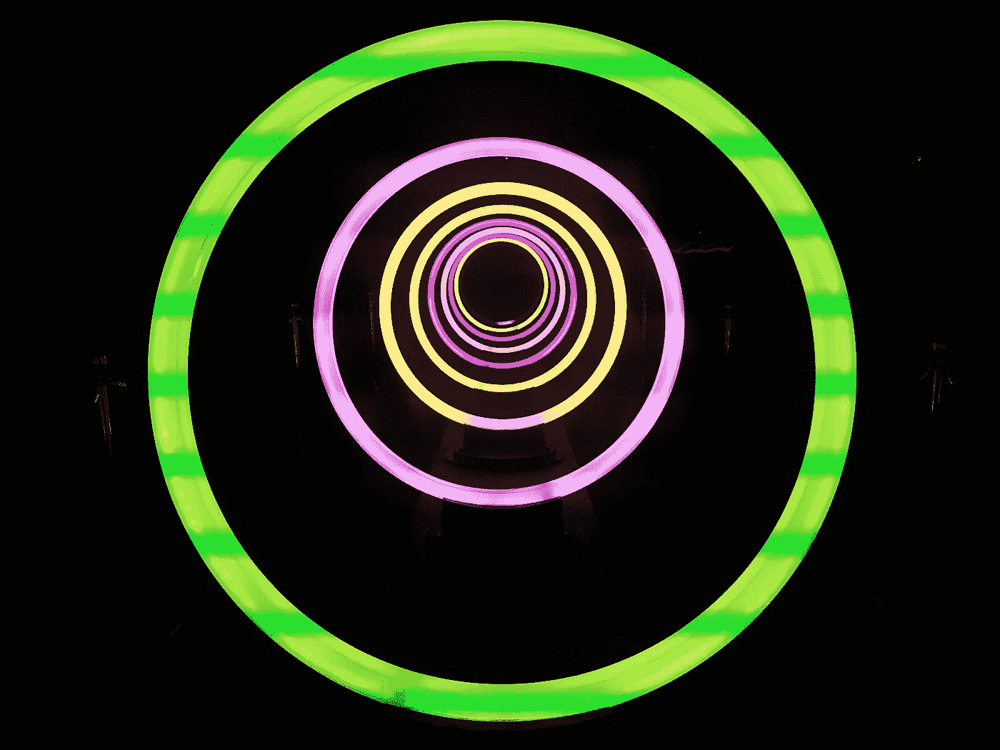
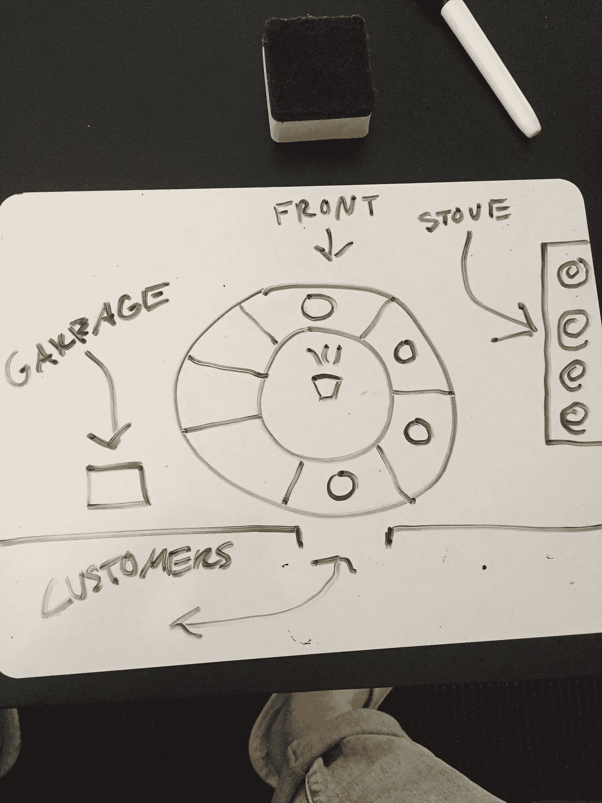

# 数据结构:循环缓冲区快速入门

> 原文：<https://betterprogramming.pub/now-buffering-7a7d384faab5>

[詹姆斯·托马斯](https://unsplash.com/photos/CQGLCAeFlfQ?utm_source=unsplash&utm_medium=referral&utm_content=creditCopyText)在 [Unsplash](https://unsplash.com/search/photos/line-of-people?utm_source=unsplash&utm_medium=referral&utm_content=creditCopyText) 上拍照

你是否曾经打开电脑，开始输入密码，却发现输入的内容有很大的滞后？当计算机处理器醒来并意识到它需要开始从键盘中的迷你处理器获取数据时，就会出现这种延迟。但是，如果键盘内存中只有一点点空间，这些信息是如何存储的呢？

这就是循环缓冲区的用武之地。

循环缓冲区是某种类型的[队列](https://en.wikipedia.org/wiki/Queue_(abstract_data_type))。如果你不熟悉队列，你可能知道它是一条线。(就像你排队等着上厕所一样。)这个队列是先进先出(FIFO)结构。这意味着第一个进入队伍的人是第一个离开的人。那么循环队列有什么不同呢？

循环缓冲区将数据存储在固定大小的数组中。因此，一旦设置了大小并且缓冲区已满，如果添加更多数据，缓冲区中最旧的项将被推出。通过存储指向结构前面和后面的两个指针，不需要动态操作数组。

但是，如果缓冲区已满，需要添加新的内容，只需将反向指针指向的列表项设置为新项，然后[将反向指针增加一个](https://github.com/Coswold/CS_1.3/blob/master/circular_buffer.py#L22)。前面将指向最近添加的项目。

当您实时处理大量数据时，这种内存分配技术非常有用。随着越来越多的数据添加到结构中，旧数据将被删除，因此不需要移动任何数据。如前所述，指针只是移动位置。

现在回到你的键盘和密码输入。你所有的击键都保存在一个循环缓冲区中。因此，如果你打字的速度足够快，你可能会丢失一些按键输入。

画得很差的环形缓冲餐厅。

# 环形缓冲餐厅

为了帮助想象循环缓冲区，让我们建立一个自动化餐厅。这家餐厅有一个取餐窗口(缓冲区的后面)，一次一个顾客可以在这里取餐(数据)。窗户后面是一个旋转的圆形桌子，可以容纳 8 份食物(缓冲区)。还有一个指向桌子前面(或者缓冲区前面)的灯。每次从窗口取餐时，桌子顺时针旋转一点。

当厨师做好一顿饭后，他把它放在被照亮的地方前面的一个地方。然后灯光照在新放置的盘子上。如果缓冲区满了，一顿饭就要出炉了，窗口的饭菜就会被倒进垃圾桶。桌子会旋转，新的饭菜会放在空的地方。

# 用例

一位讲师曾经告诉我，一家增强现实技术公司使用一个循环缓冲器来保存用户输入的运动帧。他们记录用户的手和身体运动，并实时传输到显示器上。如果用户在短时间内输入大量动作，这些动作将被存储。

当您回放几分钟的流媒体电影或电视节目时，这些先前的帧会存储在一个循环缓冲区中，以便可以快速访问。如果倒带的帧数多于缓冲区中存储的帧数，则重新加载正在搜索的帧将需要更多时间。

总之，如果您需要快速访问已经被观察或使用过的流数据，循环缓冲区可能是一个好的解决方案！

# 资源

这里有一个我实现的[循环缓冲区](https://github.com/Coswold/CS_1.3/blob/master/circular_buffer.py)的链接。

 [## 环形缓冲区基础

### 环形缓冲区的先进先出数据结构是异步数据传输的有用工具

www.embedded.com](https://www.embedded.com/electronics-blogs/embedded-round-table/4419407/The-ring-buffer)  [## 循环缓冲区-概述|科学直接主题

### 循环缓冲器在 DSP 编程中很有用，因为大多数实现都包含某种循环。在过滤器中…

www.sciencedirect.com](https://www.sciencedirect.com/topics/engineering/circular-buffer)  [## 电脑键盘如何工作

### 键盘很像一台微型电脑。它有自己的处理器和电路，可以将信息传送到…

computer.howstuffworks.com](https://computer.howstuffworks.com/keyboard2.htm)  [## 循环缓冲区-维基百科

### 需要额外的引用来验证。通过增加对可靠来源的引用来改进这篇文章。无来源…

en.wikipedia.org](https://en.wikipedia.org/wiki/Circular_buffer)