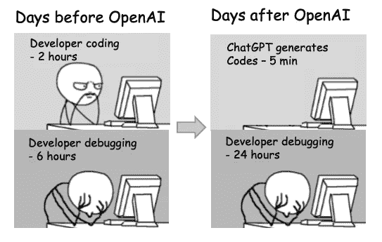
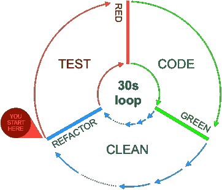

# TDD 在即将到来的人工智能时代的新角色

> 原文：<https://betterprogramming.pub/now-tdd-is-more-important-than-ever-dfaf65024d9>

## 现在，ChatGPT 和 GitHub Copilot 正在改变编程格局，TDD 比以往任何时候都更加重要。

在过去的几周里，我写了一系列的文章，讲述如何在开发中以实践的方式应用 BDD 和 TDD。我想继续说下去，但我觉得有必要稍微停顿一下。

```
**TDD** (Test Driven Development): discipline consisting in three rules:
**1.** Write the test until it fails,
**2.** Write the code until it passes the test
**3.** Clean both, and repeat.
```

就在几天前，我看到一条推特，上面有这样一个笑话:



[https://twitter.com/nixcraft/status/1600143595042140161](https://twitter.com/nixcraft/status/1600143595042140161)

读了这个笑话后，我意识到经常使用 TDD 的程序员和不经常使用 TDD 的程序员的生活是多么的不同。

我第一次感受到 TDD 和代码生成器 AIs 是如何一起工作的，是在 2021 年加泰罗尼亚计算机工程师官方协会的一次活动中。

在活动期间，一些演讲谈到了人工智能、算法以及它们如何改变我们的生活。但是大部分关于艾的言论对我来说都像是空话。所有的想法都不可靠。全是理论，没有实际意义。虽然如今，人工智能正在深深影响着我们的生活，但在一年前的那个时刻，GPT 三号还没有对公众开放，DALL-E 甚至还不存在。所以，你可以理解几乎所有的知识都来自文章、炒作和其他。

但是我的观点不同。我很幸运，我很早就接触到了 GitHub Copilot，并且已经广泛使用了几个月。所以，那一刻，AI 不是纸面上的承诺，而是实实在在的东西。而更多的是因为在早期的接入期，我看到了副驾驶的成长。我在活动前至少看到了三大改进。

当我在活动中，听一个关于人工智能作为一个可能的未来的演讲时，我觉得有必要分享我每天使用一个人工智能的经验。所以，我决定介入。我解释了我的经历，我解释了我是如何使用它的，以及我是如何对待它的，就好像它是一个我可以指导去做单调乏味的事情的孩子一样。

除了人工智能，我们还讨论了专业性，以及当代码伤害任何人时，程序员会发生什么(参见[不要搞砸，你会被判有罪](https://drpicox.medium.com/dont-screw-up-you-will-be-found-guilty-95b673319f78))。因此，再加上人工智能是用代码编写的这一事实，观众中不可避免地提出了一个问题:

> 如果一个 AI，比如 GitHub Copilot，写了一个错误的代码，谁来负责？

对我来说，答案很清楚:我的。

为什么？我和 TDD 一起工作，我编写所有的测试，我验证代码是否满足这些测试。因为我使用 TDD，我看到测试失败，我知道他们测试了他们应该测试的。因此，当人工智能编写代码时，如果测试通过，我知道它会工作。我抓住了天网的要害，不好意思，GitHub 副驾驶。

我的生活继续每天使用 GitHub Copilot。我不敢相信我已经用了一年多了。所以，我做了很多练习。

几天前，我看到了这个故事中我之前展示过的笑话。

你能猜到为什么我认为 TDD 变得如此重要吗？是什么让这个笑话变得毫无意义？快速迭代循环！



用 TDD，你从来不编码两个小时，你应该尽快停下来。尝试总是最小的变化，并重新执行测试。如果在任何时候出现故障，[没有必要调试](/how-programmers-waste-time-1efd6427b26e)，相反，[你可以撤销最后的更改，并再次尝试](/to-boldly-code-like-never-before-a13df2e67679)。所以，你永远不会，或者几乎永远不会，调试几个小时。任何人工智能生成的所有代码都只有一个目的。

现在，让我们展望未来。目前，人工智能编写非常原始的代码。好吧，他们令人印象深刻，但有一系列的任务，他们还没有能力。比如，创建一个[智能代码架构](https://drpicox.medium.com/the-smartest-code-architecture-84b8277d4763)。

目前，我使用 TDD 来指导它，写和重写我想要的作品。我删除了必须修改的部分，为代码创建了新的文件或框架，并让人工智能来填补空白。我甚至看到，在某些情况下，人工智能是如何阅读测试，并相应地填充代码的。

因此，有一天，认为人工智能将编写所有代码，甚至重构它并改变它的架构，这似乎不是一个愚蠢的想法。但是，即使在这种情况下，这将是不可能的，人工智能将只能创建大块大块的代码，谁在乎呢？对于每一个变化，我们应该只添加所需的新测试，删除所有代码，让人工智能在几分钟内重写一切。

因为价值不在代码中，而在测试中。因为测试是我们对该领域所做的所有学习过程的高潮。如果你还没有，我推荐你读一读“[两盘寓言](https://drpicox.medium.com/the-two-disks-parable-ac1a16803c58)”。

而且，我们可以更进一步。有了像 [Gherkin 和 BDD](https://medium.com/codex/is-it-true-the-extraordinary-claim-of-dan-north-about-bdd-e9d1038b4bc) 这样的工具，我们可以更好地专注于领域，专注于要解决的问题，并让人工智能来完成工作。

所以现在你明白为什么我说 TDD 让这个笑话变得毫无意义，并让人工智能成为如此好的伴侣。

*感谢阅读。我通常喜欢写故事来思考我们如何理解和应用软件工程，并让我们思考我们可以改进什么。如果你喜欢这篇文章，* [*查看我在媒体上最成功的故事*](https://drpicox.medium.com/my-most-viewed-stories-95b5d96ade0e) *阅读更多。*