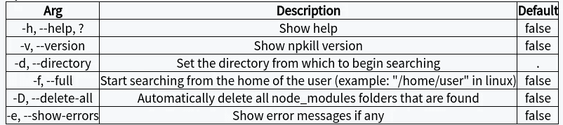

# NP kill——用样式删除 node_modules 的简单方法

> 原文：<https://betterprogramming.pub/npkill-the-easy-solution-to-deleting-node-modules-with-style-1c591126f7a5>

## Node.js 开源工具


我最快乐的软件开发记忆之一是当我开发并在朋友和家人之间分发我的第一个项目时。

虽然我在那之前很久就学会了开发，但那是在 2003 年我用汇编语言开发经典游戏 [Arkanoid](https://en.wikipedia.org/wiki/Arkanoid) 的时候。

当然，这个游戏不能在网上发行，因为我们家里没有互联网，GitHub 也不存在，而且，在我的特殊情况下，我不知道任何面向开发者的社交网络。

今天，这个故事是储存在我脑海中的美好回忆…可能还在旧软盘上…

现在，我教开发人员，我不断鼓励我的学生让他们所有的项目可见，并依靠社区，因为在那里他们可以找到教室外最好的同事。

如果发生在今天，上一段的故事会有很大的不同。我会做的第一件事是在社交网络上发布我的项目，并找到一个好的导师来学习。

虽然你不能回到过去，但我很高兴向你展示一个由我以前的两个职业培训学生开发的项目。我认为这是对社区的巨大贡献。

这个工具解决了 [Node.js](https://nodejs.org/) 开发人员在项目中安装大量依赖项时遇到的一个传统问题。

随着我们开发更多的项目，我们电脑中的文件夹数量也在增长。更多的时候，我们不记得`node_modules`文件夹存放在哪里，所以很难找到并删除它们。


这两个学生(现在是开发者)开发了一个`[npm](https://www.npmjs.com/)`包，允许管理我们又旧又重的`node_modules`文件夹。

所以，我很高兴的宣布 [*npkill*](https://github.com/voidcosmos/npkill) 。

# npkill

这个工具允许你列出系统中的任何`node_modules`目录，以及它们占用的空间。然后，您可以选择要抹掉的内容以释放空间。不错！

在我们解释获得这个重要工具的简单步骤之前，我要和你分享一个 GIF，我在笔记本电脑上用这个工具在一个工作文件夹中保存了多个 GiB。


# 装置

```
$ npm i -g npkill
```

# 使用

```
$ npkill
```

默认情况下，`npkill`将扫描`node_modules`，从执行`npkill`命令的路径开始。

用↓ ↑在列出的文件夹之间移动，用 Del 键删除选中的文件夹。

# 选择



警告:在未来的版本中，一些命令可能会改变

# 例子

1.  在您的`projects` 目录 *:* 中搜索`node_modules` 目录

```
npkill -d ~/projects# other alternative:
cd ~/projects
npkill
```

2.自动删除所有已经潜入你的备份的`node_modules`:

```
npkill -d ~/backups/ — delete-all
```

# 结论

在这篇文章中，我讨论了两个重要的主题:

1.  这个神奇的工具，对管理我们的`node_modules`很有帮助。
2.  你也可以开发一个很棒的项目。几个月前，他们在课堂上发现基本概念，比如承诺、提升、设计模式或工具。记住你也可以做任何事情。

我的建议是访问 [npkill 官方回购](https://github.com/voidcosmos/npkill)，阅读代码，并开始帮助他们创建开源内容的有趣冒险。

# 参考

*   [npkill GitHub](https://github.com/voidcosmos/npkill)
*   [npkill Web](https://zaldih.tk/npkill/)