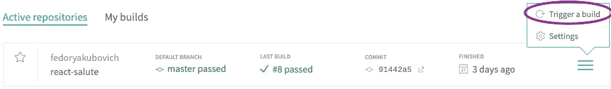
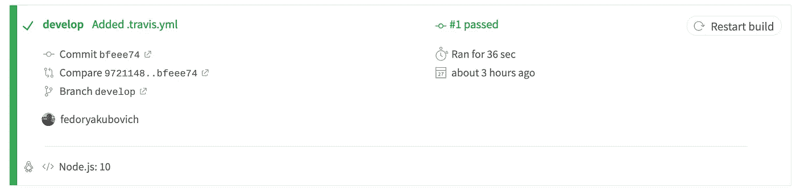
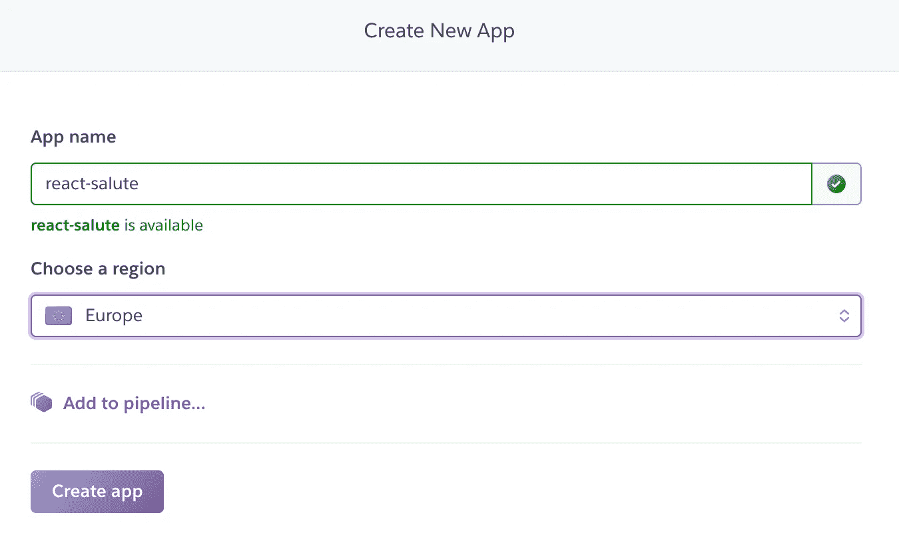
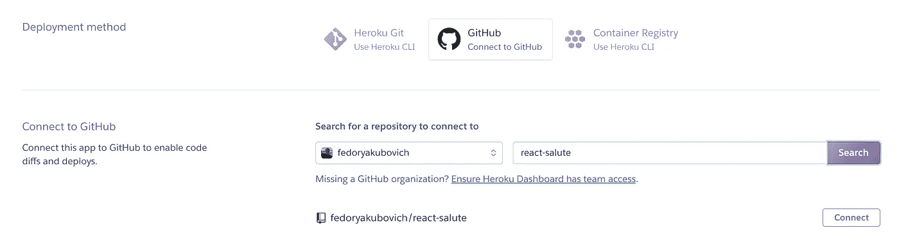
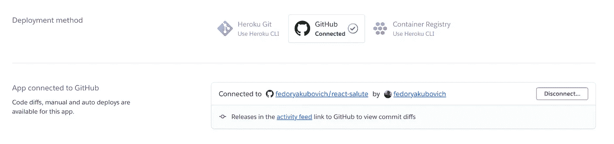
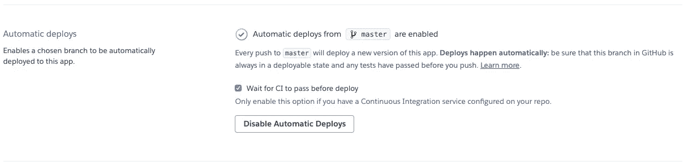
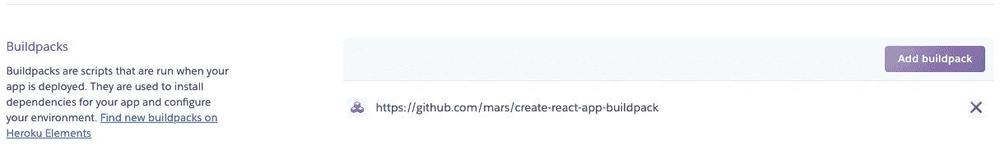
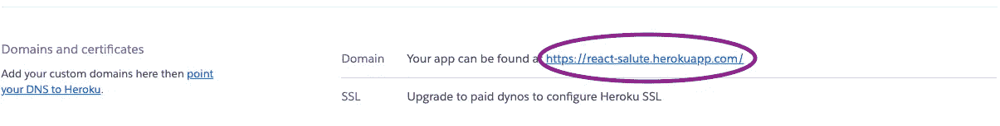

# NPM 套餐:从零到英雄

> 原文：<https://betterprogramming.pub/npm-package-from-zero-to-hero-5a2e73fa1394>

## 为 React.js 创建一个 NPM 包


照片由 [Gerd Altmann](https://www.pexels.com/@geralt) 在[像素](https://www.pexels.com/)上拍摄

# 介绍

在本教程中，我们将使用 create-react-app 为 React 创建一个 NPM 包，然后使用 Travis 和 Heroku 配置 CI/CD。

我们将创建最简单的包:Hello World。本文并不是向您展示如何为您的包编写代码，而是演示如何发布您的 NPM 包、编写测试和配置 CI/CD。

# **开始一个项目**

首先，我们需要使用 [create-react-app](https://github.com/facebook/create-react-app) 创建一个项目。这是基于 [React](https://github.com/facebook/react) 库启动应用程序的最佳方式。根据[文档](https://facebook.github.io/create-react-app/)，引擎盖下 create-react-app 使用 [Webpack](https://webpack.js.org/) 、 [Babel](https://babeljs.io/) 、 [EsLint](https://eslint.org/) 等项目。您不需要学习和配置许多构建工具。您可以只使用一个命令来创建自己的 React 应用程序，但是如果您想要高级配置，您可以从 Create React App 直接编辑它们的配置文件。

在创建包之前，让我们打开终端并转到存储项目的文件夹。然后，我们将创建我们的 [NPM](https://www.npmjs.com/) 包:

```
npx create-react-app react-salute
cd react-salute
npm start
```

现在我们可以打开 [http://localhost:3000/](http://localhost:3000/) 查看我们的 app 了。

运行这些命令会创建一个名为`react-salute`的 React 应用程序。这是生成初始项目结构和安装可传递依赖项的地方:

```
react-salute
├── README.md
├── node_modules
├── package.json
├── .gitignore
├── public
│   ├── favicon.ico
│   ├── index.html
│   └── manifest.json
└── src
    ├── App.css
    ├── App.js
    ├── App.test.js
    ├── index.css
    ├── index.js
    ├── logo.svg
    └── serviceWorker.js
```

如您所见，没有复杂的文件夹结构，也不需要配置。一切都很简单。

# **建造图书馆**

我们使用一个`src`文件夹作为我们包中的主文件夹。这是我们存储源代码、示例和测试的地方。

首先，让我们创建一个文件夹`src/lib`并将包含以下内容的`index.js` 文件放入其中:

src/lib/索引. js

> 尽管有`*examples*`和`*__tests__*`文件夹，`*lib*`文件夹将被用来上传到 NPM。

干得好！我们已经创建了一个告诉我们`Salute React!`的组件，在这里我们可以通过向组件传递`name`参数来更改`React`单词。该代码将被编译并发布到 NPM。

接下来，我们需要一些本地检查组件的方法。为此，我们创建一个文件夹`/src/examples`和一个`index.js`文件，内容如下:

src/examples/index.js

很简单——我们导入我们的库并创建两个使用它的例子。

现在，为了让事情顺利进行，让我们修复`/src/index.js`文件:

src/index.js

要查看结果，让我们运行`npm start`并在浏览器中转到 [http://localhost:3000/](http://localhost:3000/) 。

起作用了。太好了！

> 我们可以从`/src`目录中删除`App.css, App.js, App.test.js, index.css, logo.svg, serviceWorker.js`。

让我们继续下一步，为我们的包创建一些测试。

# 测试

在本章中，我们将遵循 create-react-app [测试文档](https://facebook.github.io/create-react-app/docs/running-tests)。

为了测试我们的包，我们将使用 [Jest](https://jestjs.io/) + [Enzyme](https://airbnb.io/enzyme/) 。

*酵素支持* [*与*](https://airbnb.io/enzyme/docs/api/mount.html) `[*mount()*](https://airbnb.io/enzyme/docs/api/mount.html)` *全渲染，还可以用它来测试状态变化和组件生命周期。*

让我们安装`enzyme`:

```
npm install --save-dev enzyme enzyme-adapter-react-16
```

*从 Enzyme 3 开始，您将需要安装 Enzyme 以及与您正在使用的 React 版本相对应的适配器。*

*Create React 应用程序使用 Jest 作为它的测试运行程序，所以它已经安装了* d。

适配器也需要在我们的全局设置文件中进行配置。为此，我们用以下代码创建一个`src/setupTests.js`文件:

`src/setupTests.js`

当运行`npm test`命令时，Jest 将查找具有以下任何流行命名约定的测试文件:

*   `__tests__`文件夹中带有`.js`后缀的文件。
*   后缀为`.test.js`的文件。
*   带有`.spec.js`后缀的文件。

`.test.js` / `.spec.js`文件(或`__tests__`文件夹)可以位于`src`顶层文件夹下的任意深度。

现在我们可以编写测试了。将`index.js`文件放入`src/__tests__`文件夹，内容如下:

src/__tests__/index.js

> 我们已经创建了三个测试用例。第一种情况检查默认消息`Salute React!`。第二个检查消息是否通过`name`。最后一个检查`name`参数变化。

我们的测试准备好了，让我们运行它们:

```
npm test
```

我们应该在控制台中看到类似这样的内容:

```
PASS  src/__tests__/index.js
  <ReactSalute />
    ✓ Check default message (7ms)
    ✓ Check message passed through props (1ms)
    ✓ Check reset props (32ms)Test Suites: 1 passed, 1 total
Tests:       3 passed, 3 total
Snapshots:   0 total
Time:        2.598s
Ran all test suites.Watch Usage: Press w to show more.
```

测试已经通过，我们可以继续前进。

# 出版

我们需要做的第一件事是准备我们的 NPM 方案——或者更具体地说，是编译它。为此，我们安装了`babel-cli`,这样我们就可以使用 CLI 编译我们的项目:

```
npm install --save-dev @babel/cli
```

由于我们使用了 `*create-react-app*` *，所有其他的 babel 的依赖项都已经安装好了——我们不需要担心它们。*

现在我们需要告诉`babel`如何正确处理我们的代码。为此，我们使用`presets`。让我们用以下内容创建一个`.babelrc`文件:

```
{ "presets": ["react-app"] }
```

如你所见，我们只指定了一个预置:`react-app`。这在开发 react 应用程序时是必需的。

为了让我们能够从任何平台发布我们的包，我们需要安装`[cross-env](https://github.com/kentcdodds/cross-env)`:

```
npm install --save-dev cross-env
```

然后我们将以下命令添加到`package.json`中的`scripts`部分:

```
"scripts": {
  ...
  "prepublishOnly": "cross-env NODE_ENV=production babel src/lib --out-dir dist"
},
```

`prepublishOnly` —在包装准备和包装之前运行，仅在`npm publish`运行。在我们的例子中，我们指定告诉`babel`将代码编译到一个`dist`文件夹中，该文件夹将被推送到 NPM。

让我们定制我们的包。

```
"name": "react-salute",
"version": "0.0.1",
"main": "./dist/index.js",
"keywords": [
  "react",
  "salute",
  "react-salute",
  "hello",
  "world",
  "prop-types"
],
"repository": {
  "type": "git",
  "url": "https://github.com/fedoryakubovich/react-salute"
},
"author": {
  "name": "Fedor Yakubovich",
  "url": "https://github.com/fedoryakubovich"
},
"bugs": {
  "url": "https://github.com/fedoryakubovich/react-salute/issues"
},
"files": [
  "dist/index.js",
  "README.md",
  "LICENSE",
  "package.json"
],
"license": "MIT"
...
```

*让我们来分析一下它是如何工作的:*

*   `name` —我们包裹的名称。发布到`npm`时的必填字段。在我们的例子中是`react-salute`。
*   `version` —我们包的版本。发布到`npm`时的必填字段。我们每次发布自己的包，版本一定要和之前的不一样，不然就会出错。
*   `main` —主字段是模块 ID，它是程序的主要入口点。在我们的例子中是`/dist/index.js`。
*   `keywords` —一个字符串数组，当您的包在 *npm 搜索*中列出时，人们会发现它。
*   `repository` —链接到源代码。
*   `author`—链接到作者的个人资料。
*   `bugs`—项目问题跟踪器的 URL 和/或问题应报告到的电子邮件地址。
*   `files` —一些特殊的文件和目录也被包含或排除，不管它们是否存在于`files`数组中。
*   `license` —包的许可。

> 我们必须从`package.json`中删除 private: true。否则，NPM 将拒绝出版它。

*你可以在下面可用的链接上看到* `*package.json*` *的高级设置:*[*https://docs.npmjs.com/files/package.json*](https://docs.npmjs.com/files/package.json)*。*

接下来，我们需要将我们的包发布到 NPM。我们必须在 https://www.npmjs.com/网站上注册。所以，如果你还没有注册，让我们开始吧！

注册后，输入以下命令，并在系统询问时输入您的帐户数据:

```
npm login
```

这个命令告诉你 PC 上安装的`npm`你是谁，你将代表谁发布你的包。

最后，我们通过运行以下命令来发布我们的包:

```
npm publish
```

太好了，我们已经发布了我们的包！

# 配置 Travis CI

在这一章中，我们不会停下来解释持续集成。如果您不熟悉这一概念，尤其是 Travis CI，请在这里阅读[核心概念](https://docs.travis-ci.com/user/for-beginners/)。不会花你太多时间。

首先，我们必须在 https://travis-ci.com/注册。我们只需要把我们的 GitHub 账户和 Travis CI 联系起来。

> 我们将使用 [GitHub](https://github.com/) 来存储我们的包，因为只有 GitHub 与 Travis CI 集成。

注册之后，我们需要将 Travis 的配置文件添加到项目的根目录中。让我们用以下内容创建一个`.travis.yml`文件:

`src/.travis.yml`

在这里，我们已经描述了应该在我们的项目中使用哪个 Travis 环境以及运行哪个命令。`npm test`命令是在`package.json`中指定的——如果我们想使用不同的命令进行测试，我们必须改变我们的`.travis.yml`。

然后，我们需要将我们的更改推送到 GitHub，这应该会在我们的 Travis 中启动任务。如果它没有启动，我们可以转到我们的[仪表板](https://travis-ci.com/dashboard)，找到`react-salute`存储库，并从右侧的下拉列表中选择*触发构建*。



Travis —触发构建

构建完成后，我们应该会看到类似这样的内容:



Travis —构建结果

这意味着我们的测试通过了。我们可以进入最后一章了！

# 配置 Heroku

[Heroku](https://www.heroku.com/) 是一个云平台，帮助您构建、交付、监控和扩展应用。他们说:“*我们是从创意到 URL 的最快途径*”对于我们的例子，我们将使用 Heroku 作为免费的托管服务。

首先我们需要在 Heroku 上注册。我们可以通过链接[https://signup.heroku.com/](https://signup.heroku.com/)来做到这一点。然后我们创建一个项目。要创建一个，我们需要转到[仪表板](https://dashboard.heroku.com/apps)并点击`*New->Create new app*` *。*接下来，我们需要输入项目的名称——在我们的例子中是 react-salute，并选择我们的应用程序所在的服务器所在的地区——在我们的例子中是欧洲。



Heroku —创建新应用程序

提交*创建应用*按钮后，我们将被重定向到项目部署设置页面。在*部署方法*设置中，选择 *GitHub* 。



*Heroku —部署方法(步骤 1)*

在 Connected to GitHub 设置中，我们可以选择将 Heroku 项目链接到哪个项目。我们选择`react-salute`。



*Heroku —部署方法(步骤 2)*

接下来，我们设置*自动部署*。在这里，我们选择哪个分支将执行自动部署。我们选择`master`分支。

此外，让我们选中*在部署*复选框之前等待 CI 通过。这意味着 Heroku 将等待 Travis CI 成功工作。

最后，让我们检查*启用自动部署*。



Heroku —自动部署

现在我们从 D *电子显示*选项卡移到*设置*选项卡。

在构建包配置中，点击*添加构建包*按钮。在打开的模态窗口中，在 Buildpack URL 字段中输入以下地址:[https://github.com/mars/create-react-app-buildpack](https://github.com/mars/create-react-app-buildpack)。

我们保存我们的更改。



Heroku —添加构建包

*[*create-react-app-build pack*](https://github.com/mars/create-react-app-buildpack)*是 heroku buildpack，部署用 create-react-app 生成的 React.js web 应用。buildpack 通过内置的捆绑器自动部署，并通过*[*Nginx*](http://nginx.org/en/)*提供服务。**

*在我们配置好 Heroku 之后，我们进入 Github 帐户，将我们的工作分支(开发)与 master 合并。合并后，Travis CI 将启动并运行我们的测试。测试成功通过后，Heroku 将开始构建。成功完成构建后，我们就可以享受结果了。我们可以在*域和证书*设置中的*设置*选项卡中看到我们的包的 URL。*

**

*Heroku —域和证书*

*让我们打开[https://react-salute.herokuapp.com/](https://react-salute.herokuapp.com/)。*

*在本教程中，我们创建了最简单的 NPM 包，为它编写了测试，并为连续交付配置了 Travis CI 和 Heroku。*

*以此信息为基础，创建更复杂、更有用的 NPM 软件包，并免费提供它们的实例。*

*点击查看 GitHub 回购[。](https://github.com/fedoryakubovich/react-salute)*

*我希望这篇文章对你和你未来的项目有用。*