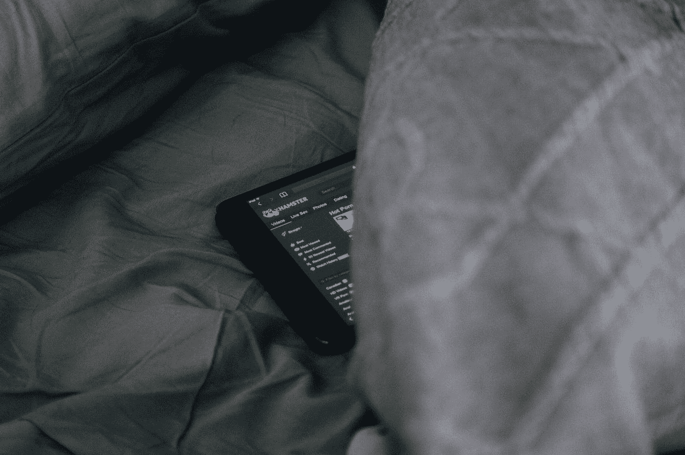
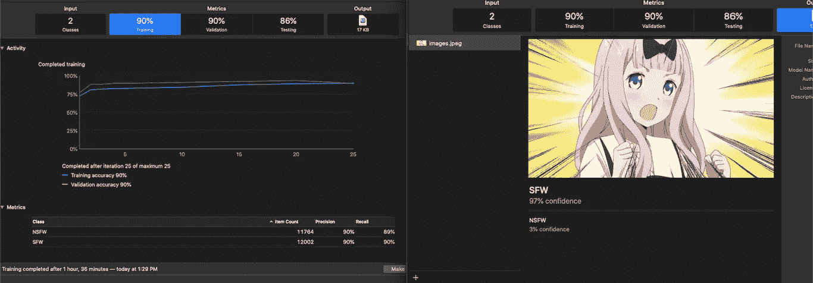
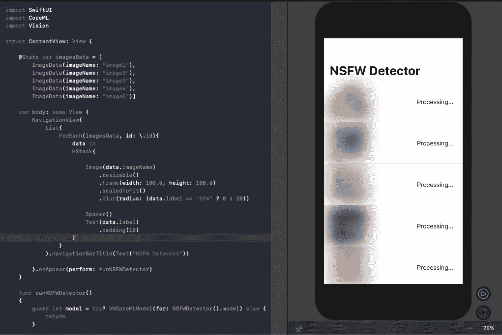
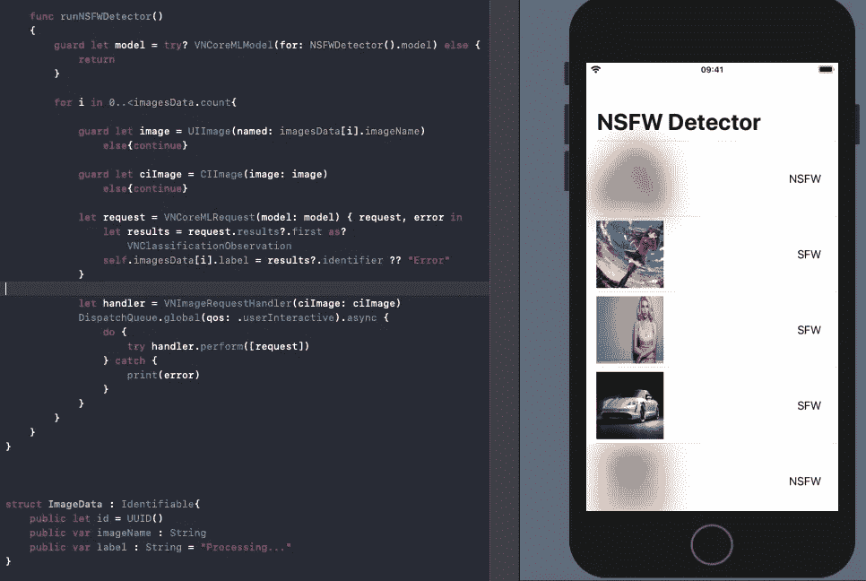

# 在 SwiftUI 应用程序中使用 Create ML、Core ML 和 Vision 的 NSFW 图像分类器

> 原文：<https://betterprogramming.pub/nsfw-image-detector-using-create-ml-core-ml-and-vision-79792d805bab>

## 模糊包含敏感内容的 SwiftUI 图像



查尔斯·🇵🇭在 [Unsplash](https://unsplash.com?utm_source=medium&utm_medium=referral) 上的照片

随着设备上机器学习的出现，让智能手机比以往任何时候都更智能的机会层出不穷。

从健康领域到艺术和安全，在我们的设备上直接使用机器学习正在对许多行业产生深远的影响，并为更多行业带来无限可能。

苹果通过 [Create ML](https://developer.apple.com/documentation/createml) ，提供了一个易于使用的机器学习框架，具有熟悉的拖放/游乐场般的界面。你训练和评估你的模型的速度是令人难以置信的。

通过使用 Create ML，我们可以利用现成的模型模板(文本、图像、推荐器等)。)并在我们的 iOS 应用中部署 [Core ML](https://developer.apple.com/documentation/coreml) 模型。

在本文中，我们将创建一个图像分类器 Create ML 模型来识别图像是否是 NSFW。

# 我们的目标

*   使用适当的 [Kaggle](https://www.kaggle.com/) 数据集训练创建 ML 图像分类器。随后，我们将把核心 ML 模型发布到 Xcode 项目中。
*   使用 [Vision](https://developer.apple.com/documentation/vision) 框架在基于 SwiftUI 的应用中驱动核心 ML 模型。推断为 NSFW 的图像将被模糊掉。

# 训练创建 ML 图像分类器模型

启动 Xcode 附带的 Create ML 应用程序，并为本文选择图像分类器模板。Create ML 的图像分类器使用迁移学习来加快训练时间。

图像分类器模型需要输入图像，并以预测的标签作为输出进行响应。为了训练这样的分类器，我们需要传递一组已经标记的图像。

我们已经使用来自 Kaggle 的[数据集来训练我们的图像分类器模型。按照标准的数据科学规则，将数据集分成 80-20 个`train`和`test`文件夹。](https://www.kaggle.com/drakedtrex/my-nsfw-dataset)

我们的训练和测试数据集被分组到两个文件夹中:SFW 和 NSFW，包含各自的图像。

Create ML 的图像分类器允许我们通过翻转、模糊、旋转和向图像数据集添加噪声来增加数据集。数据扩充通过使用一些图像的修改版本来扩展当前数据集，从而为数据集带来多样性。

下面是培训完成后创建 ML 应用程序的一瞥:



或者，我们可以使用`MLImageClassifier`类在 macOS Xcode 平台上以编程方式生成我们的核心 ML 模型。

`CreateMLUI`能够显示实时预览和结果。`[MLClassifierMetrics](https://developer.apple.com/documentation/createml/mlclassifiermetrics)`包含评估模型的训练和验证准确性的指标。

# 在基于 SwiftUI 的应用程序中使用核心 ML 模型

接下来，我们将在一个基于 SwiftUI 的应用程序中部署上面生成的核心 ML 模型。我们将运行 SwiftUI 列表中呈现的一组图像的模型，并相应地模糊那些被预测为 NSFW 的图像。

以下代码展示了 SwiftUI 应用程序的`ContentView`主体:

默认情况下，模糊半径是在图像上设置的，除非模型预测它是安全的。半径越大，图像越模糊。

SwiftUI 列表中每一行的数据都需要符合`Identifiable`协议，以便它们相对于其他行具有唯一的身份:

```
struct ImageData : Identifiable{public let id = UUID()public var imageName : Stringpublic var label : String = "Processing..."}
```



应用程序的初始状态

视觉框架负责根据核心 ML 模型约束调整输入图像的大小，并驱动核心 ML 模型以实现期望的输出。

核心 ML 模型以如下方式包装在`VNCoreMLModel`中:

```
let model = try? VNCoreMLModel(for: NSFWDetector().model)
```

在我们的例子中，Vision 请求将返回类型为`VNClassificationObservation`的观察结果，因为这是一个`Classifier`模型。

# 运行愿景请求

下面的代码遍历每个图像，并在`CIImage`上执行视觉请求。因此，它返回`identifier`属性中的标签:

```
func runNSFWDetector(){

       guard let model = try? VNCoreMLModel(for:  NSFWDetector().model) else { return }for i in 0..<imagesData.count{guard let image = UIImage(named: imagesData[i].imageName)
                else{continue}guard let ciImage = CIImage(image: image)
                else{continue}let request = VNCoreMLRequest(model: model) { request, error in
                let results = request.results?.first as? VNClassificationObservation
                self.imagesData[i].label = results?.identifier ?? "Error"
            }let handler = VNImageRequestHandler(ciImage: ciImage)
            DispatchQueue.global(qos: .userInteractive).async {
                do {
                    try handler.perform([request])
                } catch {
                    print(error)
                }
            }
        }
    }
```

Vision 请求异步运行，因此主线程不会被阻塞，结果会在完成处理程序中返回。

随后，我们更新了`ImageData`结构中的标签，从而触发 SwiftUI 主体根据更改再次呈现。

因此，我们在实时预览中获得了应用程序的以下结果:



NSFW 的图像很模糊

预测为 SFW 的图像被显示，其余的被模糊。

# 结论

我们看到了使用 Create ML 训练图像分类器模型并随后在应用程序中部署核心 ML 模型是多么容易。

最后，我们利用视觉框架对图像进行推理，以确定图像是否包含 NSFW 内容。SwiftUI 允许我们非常快速地从零开始构建视图。

本文的完整源代码可以在 [GitHub 资源库](https://github.com/anupamchugh/iowncode/tree/master/NSFWCreateMLImageClassifier)中找到。

这一次到此为止。我希望您喜欢阅读、培训和在您的设备上部署机器学习模型。