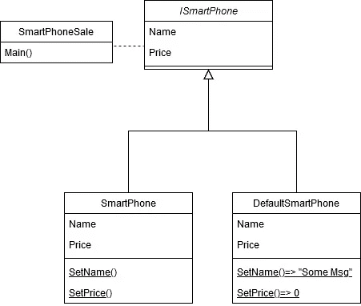
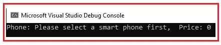
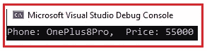

# 在 C#中实现空对象设计模式

> 原文：<https://betterprogramming.pub/null-object-design-pattern-b53d6220f09f>

## 流行设计模式一览


[Rich Tervet](https://unsplash.com/@richtervet?utm_source=medium&utm_medium=referral) 在 [Unsplash](https://unsplash.com?utm_source=medium&utm_medium=referral) 上拍摄的照片

伙计们，我们已经走了很长的路。从`object != null;`到`object ?? object.value;`，现在回到`object != null;`。

# 为什么我们需要这种模式？

我们都熟悉空支票。我们如此频繁地使用它，以至于现在我们甚至在使用它之前都不思考。我们的大脑开始从肌肉记忆中编码。

```
person != null;person ?? person.name;
```

镜子里的霸王龙随着一些无效检查开始变得越来越大。看看下面的情况，对眼睛来说太不容易了。您会在整个应用程序中发现这样的空检查。

```
If(object1 != null && object1.value == true && object2 != null && object2.value == “success” || object3 == null)
```

在空对象设计模式的帮助下，我们终于可以开始给我们的空检查带来一些意义。我们可以显示一些默认行为或者什么都不做，而不是验证空检查。有了这个，我们可以设法保持客户的代码更干净。

# 什么是空对象设计模式？

请看清单 1，客户端，`class SmartPhoneSale`如下:

在这种情况下，代码可能会引发空异常。

客户端`class SmartPhoneSale`可以用引用变量`DependencyBase` `interface ISmartPhone`访问依赖关系`class SmartPhone`，如果`SmartPhone`为空，我们可以用 NullObject `class *DefaultSmartPhone*`替换该空行为。

在下面的例子中，一个`class DefaultSmartPhone`正在提供`class SmartPhone`的什么都不做或者默认实现，当我们需要检查空值的时候就会用到它。

让我们看看它在概念上的样子:



空对象设计模式的 UML 设计

*   `class SmartPhoneSale`:这是一个客户端类，使用了设计模式。在我们的例子中，`SmartPhoneSale`有一个 main 方法，它将执行一个空对象的方法。您可以在清单 1 中看到`class client`的实现。
*   `interface ISmartPhone` : 又称`DependencyBase`接口。这是一个具有客户端需要使用的方法定义的接口。在我们的例子中，客户端需要方法:1。`SetName()`又二。`SetPrice()`。
*   `class SmartPhone`:是依赖类。这个类是客户端需要的一个实际的依赖。这个类有客户需要的业务逻辑。
*   `class DefaultSmartPhone`:就是`NullObject class`。这是一个空对象类，可以用来代替`class SmartPhone`来替换空检查。它不包含任何功能，但是实现了由`interface ISmartPhone`定义的所有成员。

# 实施

按照我们的概念，我们已经在清单 1 中实现了一个客户端类。

现在我们需要代码中的抽象。让我们继续创建这个接口。

`DependencyBase`界面`interface ISmartPhone`如下所示:

下一站，混凝土课。一个是默认初始化，另一个是我们的逻辑。

让我们创建一个默认类。

清单 3: `**class DefaultSmartPhone**`下面给出了 NullObject 类:

正如你所看到的，我们在这里什么都不做，除了当一个对象进入空状态时分配它去做一些事情。

清单 4:依赖类，`class SmartPhone`:

我们都准备好了，现在让我们用新实现的空对象设计模式对客户端类做一些更改。

清单 5:利用空对象设计模式的`class client`:

如您所见，当`smartPhone`的对象为空时，我们为他分配了默认类的实例。

`smartPhoneInstance`为空时的输出:



当`SmartPhoneInstance`不为空时输出。只需取消清单 5 中第 7 行的注释。



这是需要学习的最简单的设计模式。使用增加代码可扩展性的设计模式是一个很好的实践。它让您对对象通信有了一个大致的了解。

我真诚地希望您喜欢这篇文章，并希望您受到启发，将所学知识应用到自己的应用程序中。