# NumPy 图解:NumPy 的视觉指南

> 原文：<https://betterprogramming.pub/numpy-illustrated-the-visual-guide-to-numpy-3b1d4976de1d>

## 温习你的数学或从头开始学习

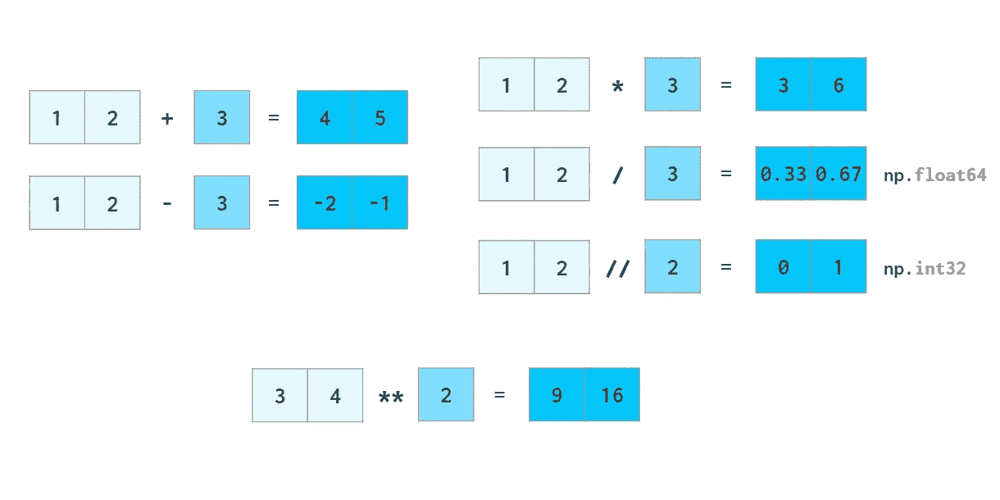

图片来源:作者

[NumPy](https://numpy.org/) 是一个基础库，大多数广泛使用的 Python 数据处理库都是建立在这个基础库之上的([熊猫](https://pandas.pydata.org/)、 [OpenCV](https://opencv.org/) )、受( [PyTorch](https://pytorch.org/) )启发，或者可以高效地与( [TensorFlow](https://www.tensorflow.org/) 、 [Keras](https://keras.io/) 等)共享数据。理解 NumPy 的工作方式也有助于提高您在这些库中的技能。也可以在 [GPU](https://stsievert.com/blog/2016/07/01/numpy-gpu) 上运行 NumPy 代码，而不需要或只需要很小的改动。

NumPy 的核心概念是一个 n 维数组。它的美妙之处在于，不管数组有多少维，大多数操作看起来都是一样的。但是 1D 和 2D 的情况有点特殊。文章由三部分组成:

1.  [向量，1D 数组](#3338)
2.  [矩阵，2D 阵列](#35fb)
3.  [3D 及以上](#c6af)

我以杰伊·阿拉姆马的一篇很棒的文章“NumPy 的视觉介绍”为起点，显著扩展了它的覆盖范围，并修改了两个细微差别。

# Numpy 数组与 Python 列表

乍一看，NumPy 数组类似于 Python 列表。它们都是容器，可以快速获取和设置项目，但插入和移除元素的速度要慢一些。

NumPy 数组节拍列表最简单的例子是算术:

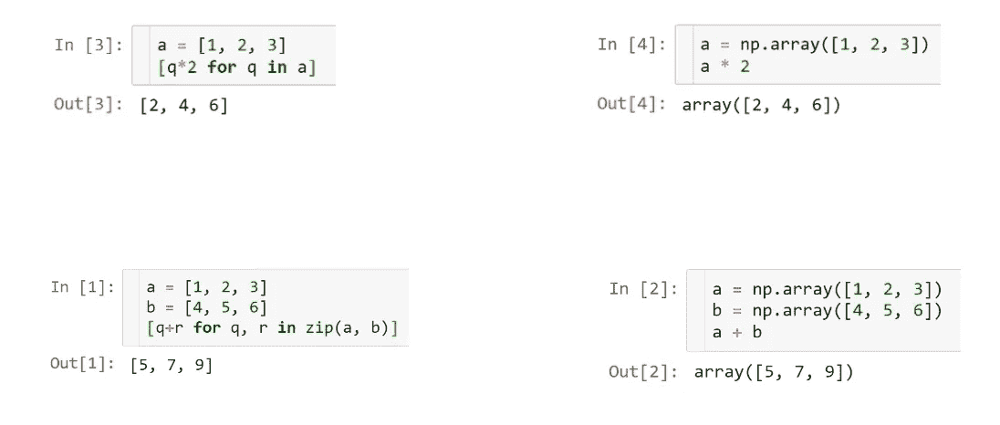

除此之外，NumPy 数组还有:

*   更紧凑，尤其是当有多个维度时
*   当操作可以矢量化时，比列表更快
*   在末尾追加元素时比列表慢
*   通常是同构的:只能快速处理一种类型的元素

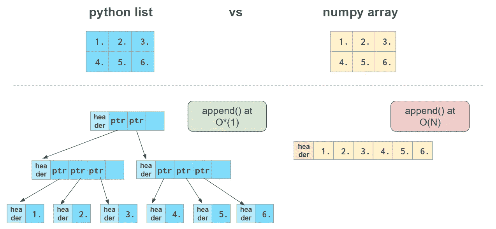

这里 O(N)表示完成运算所需要的时间与数组的大小成正比(参见 [Big-O Cheat Sheet](https://www.bigocheatsheet.com/) site)，O*(1)(所谓“摊销”O(1))表示时间一般不取决于数组的大小(参见 Python [时间复杂度](https://wiki.python.org/moin/TimeComplexity) ⁴ wiki 页面)

# 1.向量，1D 阵列

## 向量初始化

创建 NumPy 数组的一种方法是转换 Python 列表。类型将从列表元素类型中自动推导出来:

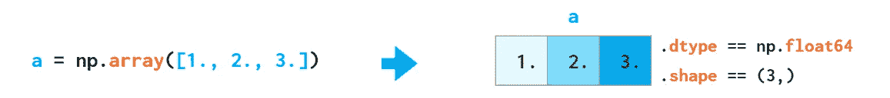

一定要输入一个同质的列表，否则你会以`dtype=’object’`结束，它消灭了速度，只留下 NumPy 中包含的语法糖。

在我的新文章中有更多关于 dtypes 的内容

 [## NumPy 数据类型综合指南

### 除了 int32 和 float64 还有什么？

better 编程. pub](/a-comprehensive-guide-to-numpy-data-types-8f62cb57ea83) 

NumPy 数组不能像 Python 列表那样增长:数组末尾没有预留空间来方便快速追加。因此，通常的做法是要么增大一个 Python 列表，并在准备就绪时将其转换为 NumPy 数组，要么用`np.[zeros](https://numpy.org/doc/stable/reference/generated/numpy.zeros.html)`或`np.[empty](https://numpy.org/doc/stable/reference/generated/numpy.empty.html)`预先分配必要的空间:

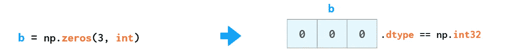

通常需要创建一个空数组，通过形状和元素类型来匹配现有数组:

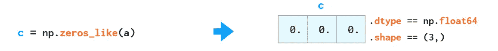

实际上，所有创建一个填充有常量值的数组的函数都有一个`_like`对应项:

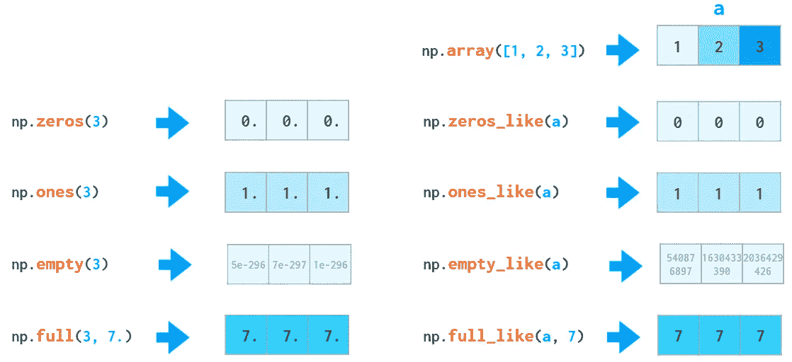

NumPy 中有多达两个函数用于单调序列的数组初始化:

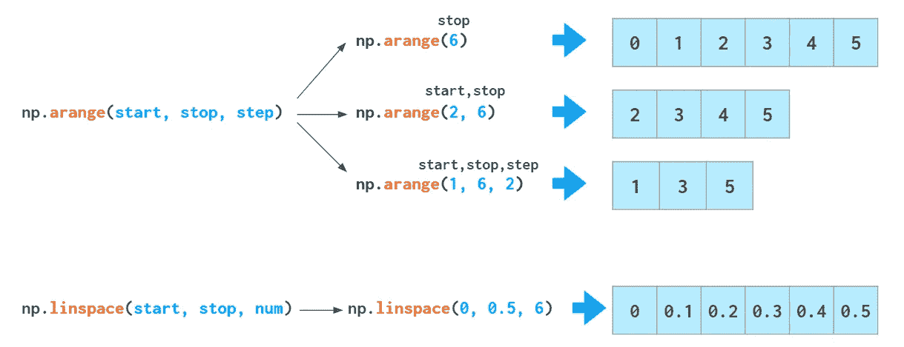

如果你需要一个类似的浮点数组，像`[0., 1., 2.]`，你可以改变`[arange](https://numpy.org/doc/stable/reference/generated/numpy.arange.html)`输出的类型:`arange(3).astype(float)`，但是有一个更好的方法。`arange`函数是类型敏感的:如果你将 int 作为参数，它将生成 int，如果你将 float(例如`arange(3.)`)作为参数，它将生成 float。

但是`arange`并不特别擅长处理浮动:

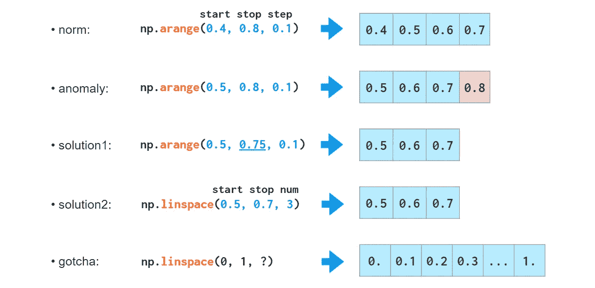

这个`0.1`对我们来说看起来像一个有限的十进制数，但对计算机来说不是:在二进制中，它是一个无限的分数，必须在某个地方四舍五入，因此是一个错误。这就是为什么将带小数部分的步骤输入到`arange`通常是个坏主意:您可能会遇到一个差一位的错误。您可以使间隔的结束落在非整数步数中(解决方案 1 ),但这会降低可读性和可维护性。这就是`[linspace](https://numpy.org/doc/stable/reference/generated/numpy.linspace.html)`可能派上用场的地方。它不受舍入误差的影响，并且总是生成您所要求的元素数量。不过`linspace`有一个常见的问题。它计算点，而不是间隔，因此最后一个参数总是比你通常想到的要多一个。所以它是 11，而不是上面例子中的 10。

出于测试目的，通常需要生成随机数组:

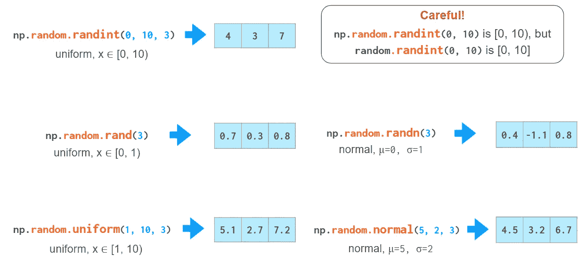

旧式随机数生成(已弃用)

还有一个新的随机数组生成界面。它是:
-更适合多线程，
-更快，
-更可配置(你可以通过选择一个非默认的所谓“位生成器”来获得更高的速度或质量)，
-能够通过两个旧版本未能通过的复杂的综合测试。

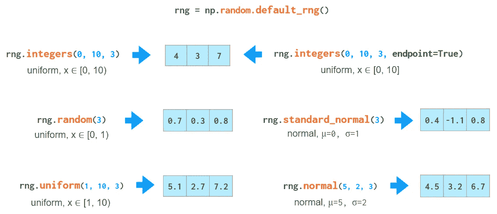

新型随机数生成

## 向量索引

一旦您将数据存储在阵列中，NumPy 在提供简单的归还方法方面表现出色:

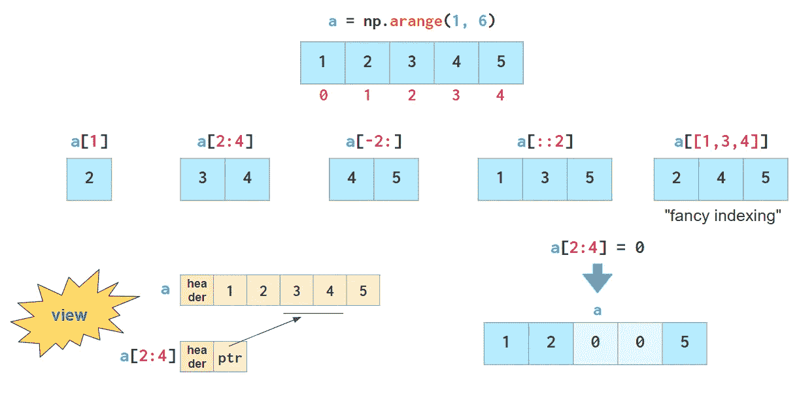

除了花哨的索引之外，上面介绍的所有索引方法实际上都是所谓的“视图”:它们不存储数据，也不反映原始数组中的变化(如果它在被索引后发生了变化)。

包括花式索引在内的所有这些方法都是可变的:它们允许通过赋值来修改原始数组内容，如上所示。这个特性打破了通过切片来复制数组的习惯:

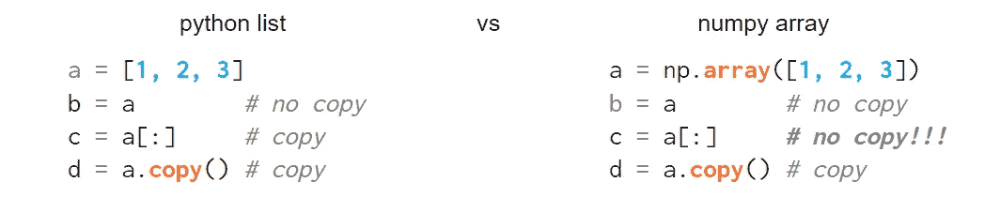

此外，这种赋值不能改变数组的大小，所以像

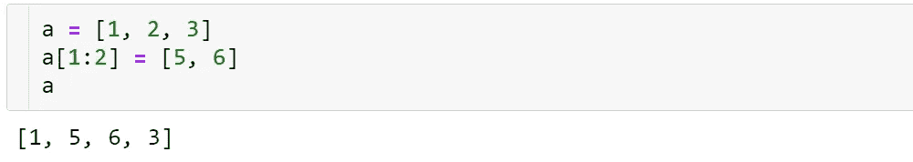

在 NumPy 中不起作用—使用`np.insert`、`np.append`等。取而代之(在下面的“2D”一节中描述)。

从 NumPy 数组获取数据的另一个非常有用的方法是布尔索引，它允许使用各种逻辑运算符:

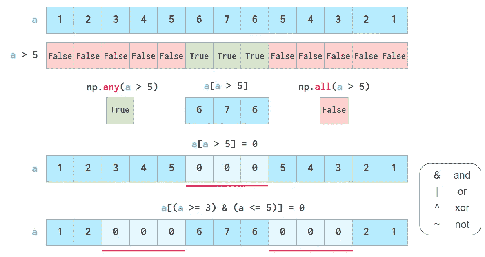

[any](https://numpy.org/doc/stable/reference/generated/numpy.any.html) 和 [all](https://numpy.org/doc/stable/reference/generated/numpy.all.html) 的行为就像它们的 python 对等体一样，但是不会短路

尽管小心；类似于`3<=a<=5`的 Python“三元”比较在这里不起作用。

如上所述，布尔索引也是可写的。它的两个常见用例是作为专用函数派生出来的:过度重载的`np.[where](https://numpy.org/doc/stable/reference/generated/numpy.where.html)`函数(参见下面的两种含义)和`np.[clip](https://numpy.org/doc/stable/reference/generated/numpy.clip.html)`。

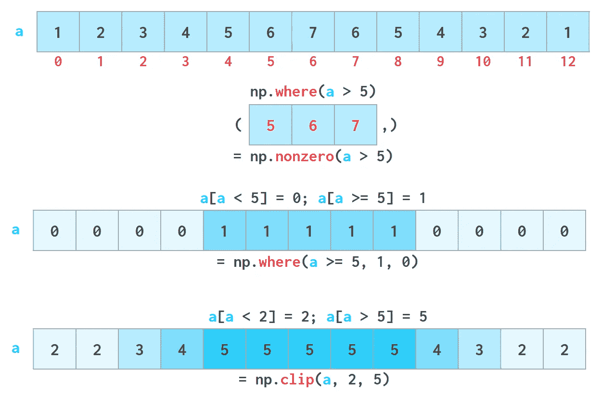

请注意，带有一个参数的`np.where`返回一个数组元组(在 1D 的情况下是 1 元组，在 2D 的情况下是 2 元组，等等)，因此您需要编写`np.where(a>5)[0]`来获得上面示例中的`np.array([5,6,7])`(对于`np.nonzero`也是如此)。

对于单边裁剪，有`np.[minimum](https://numpy.org/doc/stable/reference/generated/numpy.minimum.html)`和`np.[maximum](https://numpy.org/doc/stable/reference/generated/numpy.maximum.html)`。所有三个裁剪函数也接受一个数组作为阈值。

## 向量运算

算术是 NumPy speed 最出彩的地方之一。向量操作符被转移到 c++级别，并允许我们避免缓慢的 Python 循环的代价。NumPy 允许像处理普通数字一样处理整个数组:

通常在 Python 中，a//b 表示一个 div b(除法的商)，x**n 表示 xⁿ

与加法或减法时将整型提升为浮点型相同，标量提升(也称为*广播*)为数组:

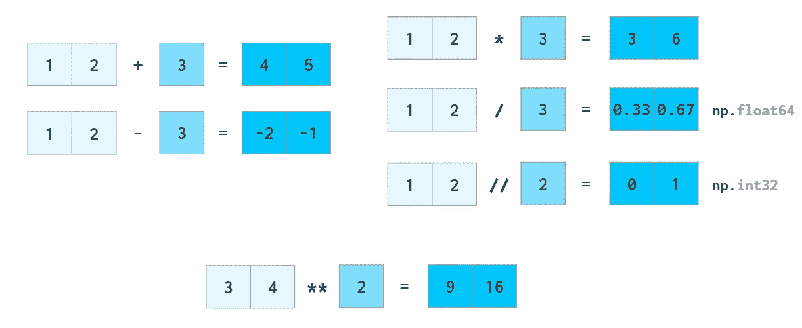

大多数`math`函数都有可以处理向量的对应函数:

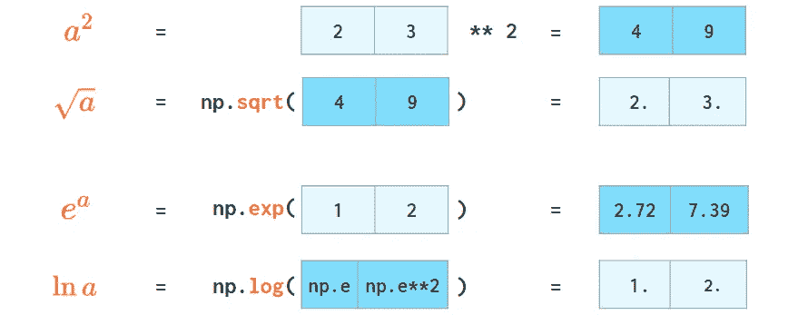

标量积有自己的运算符:

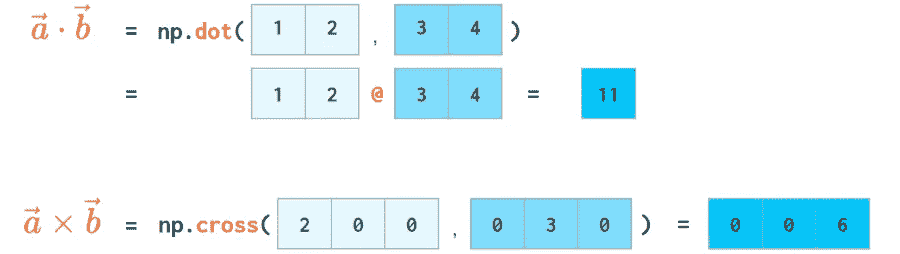

三角学也不需要循环:

反函数的命名不同于“math ”: NP。 [arcsin](https://numpy.org/doc/stable/reference/generated/numpy.arcsin.html) 但是数学。[阿辛](https://docs.python.org/3/library/math.html#math.asin)

数组可以整体舍入:

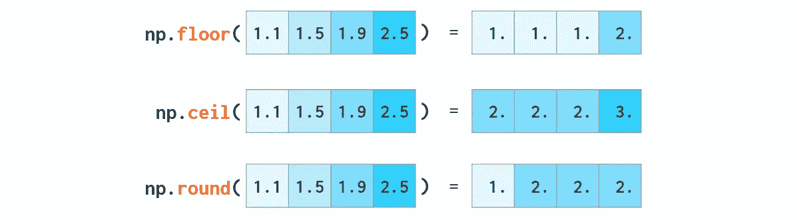

`[floor](https://numpy.org/doc/stable/reference/generated/numpy.floor.html)`舍入到-∞, `[ceil](https://numpy.org/doc/stable/reference/generated/numpy.ceil.html)`舍入到+∞，而[舍入到](https://numpy.org/doc/stable/reference/generated/numpy.around.html)附近——舍入到最接近的整数(. 5 到偶数)

名字`np.around`只是`np.round`的别名，引入它是为了避免在编写`from numpy import *`时遮蔽 Python `round`(相对于更常见的`import numpy as np`)。也可以用`a.round()`。

NumPy 还能够进行基本的统计:

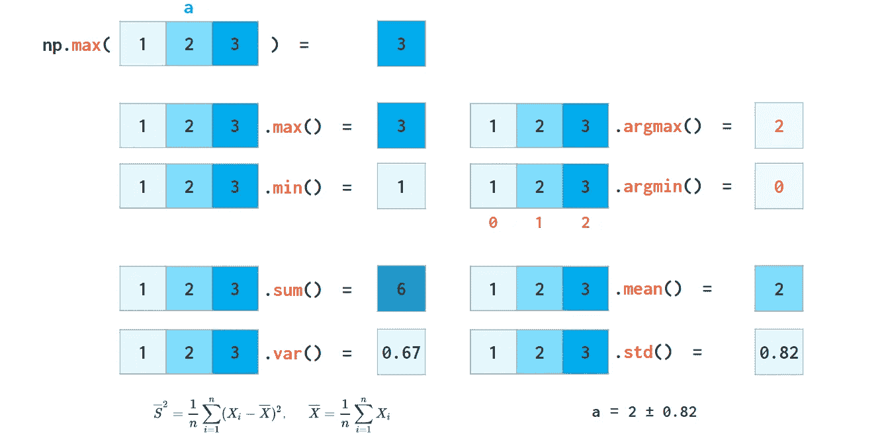

这些函数中的每一个都有一个抗 nan 变量:例如 [nansum](https://numpy.org/doc/stable/reference/generated/numpy.nansum.html) 、 [nanmax](https://numpy.org/doc/stable/reference/generated/numpy.nanmax.html) 等

从上面的公式中可以看出，`[std](https://numpy.org/doc/stable/reference/generated/numpy.std.html)`和`[var](https://numpy.org/doc/stable/reference/generated/numpy.var.html)`都忽略了 [Bessel 的修正](https://en.wikipedia.org/wiki/Bessel%27s_correction)，在总体均值未知的情况下，从样本中估计 std 的最典型用例中，给出了一个有偏差的结果。获得偏差较小的估计的标准方法是在分母中加入`n-1`，这是通过`ddof=1`(“自由度增量”)实现的:

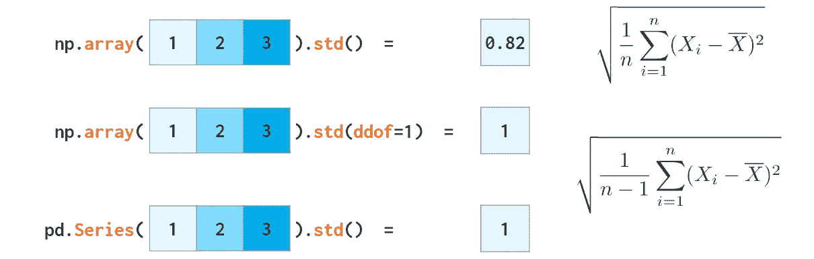

熊猫 [std](https://pandas.pydata.org/docs/reference/api/pandas.DataFrame.std.html) 默认使用贝塞尔校正

贝塞尔校正的效果随着样本量的增加而迅速减弱。此外，这不是一个放之四海而皆准的解决方案，例如对于正态分布`ddof=1.5` [更好](https://en.wikipedia.org/wiki/Unbiased_estimation_of_standard_deviation):

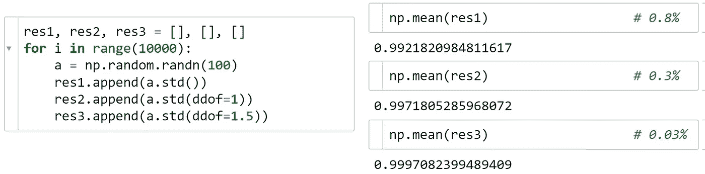

排序函数的功能比 Python 中的对应函数要少:

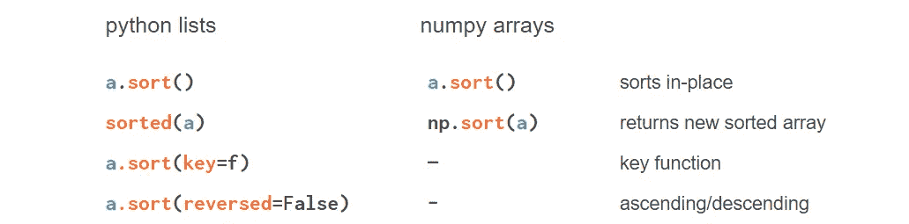

在 1D 的例子中，`reversed`关键字的缺失可以很容易地通过反转结果来弥补。在 2D 中，这有点棘手([特征请求](https://github.com/numpy/numpy/pull/14989) ⁵).

## 搜索向量中的元素

与 Python 列表相反，NumPy 数组没有`index`方法。相应的[功能要求](https://github.com/numpy/numpy/issues/2269) ⁶已经挂在那里好一阵子了。

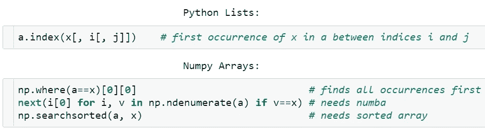

[索引](https://docs.python.org/3/library/stdtypes.html#common-sequence-operations)()定义中的方括号表示 j 或者 I 和 j 都可以省略

*   寻找元素的一种方法是`np.where(a==x)[0][0]`，它既不优雅也不快速，因为它需要遍历数组的所有元素，即使要寻找的元素在最开始。
*   更快的方法是通过用[数字](https://numba.pydata.org/) ⁷加速`next((i[0] for i, v in np.[ndenumerate](https://numpy.org/doc/stable/reference/generated/numpy.ndenumerate.html)(a) if v==x), -1)`(否则在最坏的情况下会比`where`慢)。
*   一旦数组被排序，情况会变得更好:`v = np.[searchsorted](https://numpy.org/doc/stable/reference/generated/numpy.searchsorted.html)(a, x); return v if a[v]==x else -1`非常快，复杂度为 O(log N ),但是首先排序需要 O(N log N)的时间。

其实用 c 实现加速搜索不是问题，问题是浮点比较。对于任意数据，这是一项不能开箱即用的任务。

## 比较浮动

函数`np.[allclose](https://numpy.org/doc/stable/reference/generated/numpy.isclose.html)(a, b)`将浮点数组与给定的容差进行比较

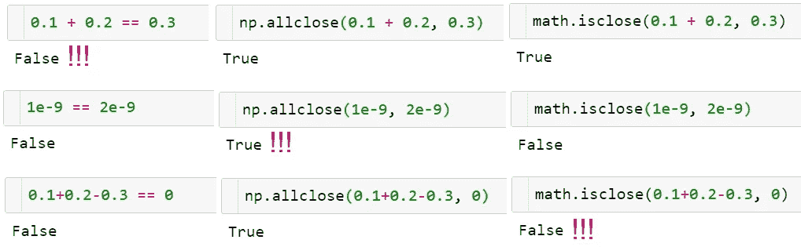

没有什么灵丹妙药！

*   `np.allclose`假设所有比较的数字都是典型的 1。例如，如果使用纳秒，则需要将默认的`atol`参数值除以 1e9: `np.allclose(1e-9, 2e-9, atol=1e-17) == False`。
*   `math.[isclose](https://docs.python.org/3/library/math.html#math.isclose)`对要比较的数字不做任何假设，而是依赖用户给出一个合理的`abs_tol`值(采用默认的`np.allclose` `atol`值 1e-8 对于典型标度为 1 的数字来说已经足够):`math.isclose(0.1+0.2–0.3, abs_tol=1e-8)==True`。

除此之外，`np.allclose`在绝对和相对公差的公式中有一些小问题，例如，对于某些 a，b `allclose(a, b) != allclose(b, a)`。这些问题在(标量)函数`math.isclose`(稍后介绍)中得到解决。要了解更多，请看一下 GitHub 上优秀的[浮点指南](https://floating-point-gui.de/errors/comparison/) ⁸和相应的 NumPy [issue](https://github.com/numpy/numpy/issues/10161) ⁹。

# 2.矩阵，2D 阵列

*NumPy 中曾经有一个专门的* `matrix` *类，现在已经弃用了，我就把*矩阵*和* 2D 数组*这两个词互换使用。*

矩阵初始化语法类似于向量的语法:

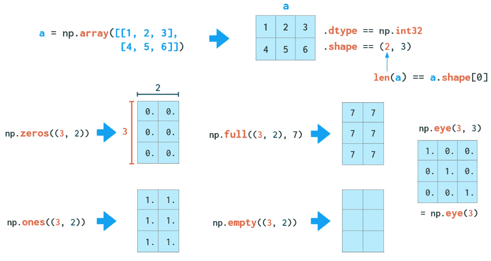

这里双括号是必要的，因为第二个位置参数是为(可选)`dtype`(也接受整数)保留的。

随机矩阵的生成也类似于向量的生成:

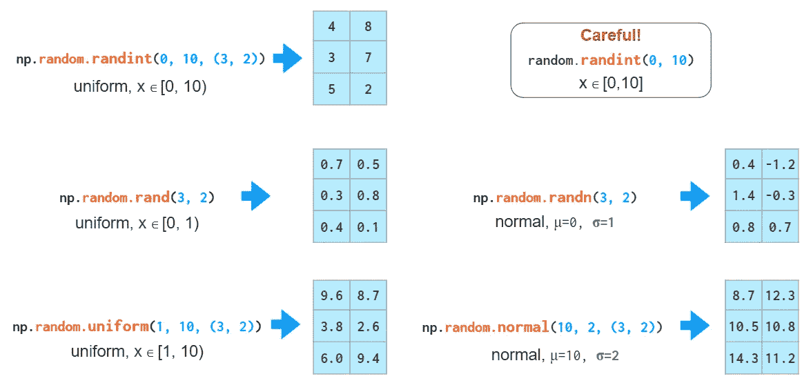

旧式随机数生成

无处不在的双圆括号找到了它们在新型(参见上面 1D 部分的细节)数字生成例程的接口上的道路，因此到今天为止，只有在`np.[eye](https://numpy.org/doc/stable/reference/generated/numpy.eye.html)`中，美观取代了传递形状的严格性和方便性:

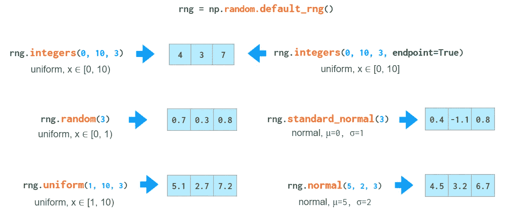

新型随机数生成

二维索引语法比嵌套列表更方便:

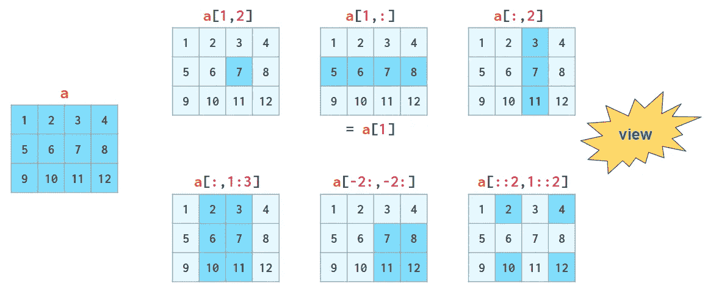

“view”符号表示在对数组切片时，实际上没有进行任何复制。当阵列被修改时，这些更改也会反映在切片中。

## 轴参数

在许多操作中(如`[sum](https://numpy.org/doc/stable/reference/generated/numpy.sum.html)`)，你需要告诉 NumPy 你是否想要跨行或列操作。为了有一个适用于任意维数的通用符号，NumPy 引入了轴的概念:`axis`参数的值实际上是所讨论的索引号:第一个索引是`axis=0`，第二个是`axis=1`，依此类推。所以在 2D，`axis=0`是按列的，而`axis=1`是按行的。

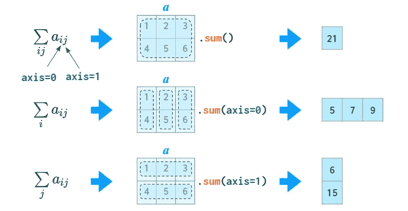

一般来说，第一维度`i` (axis=0)负责对行进行索引，因此`sum(axis=0)`应该理解为“对其所有行的任何给定列求和”，而不仅仅是“按列”。2D 的例子有些反直觉:你需要指定要消除的尺寸*，而不是你通常会想到的剩余尺寸*。然而，在更高维的情况下，这更自然:如果你只需要对一个维度求和，那么列举所有剩余维度将是一个负担。**

*“轴”参数的概念(在 MATLAB 中称为“维度”)实际上非常简单:它只是您希望操作继续执行的索引号。它在 NumPy 的许多函数中使用，所以理解它是值得的，但是如果出于某种原因它不适合你，在这种特殊情况下，你可以使用爱因斯坦求和——这是一种不用“轴”进行求和的方法:`np.einsum(‘ij->j’, a)`是按列求和的(与上图中的`sum(axis=0)`相同),而`np.einsum(‘ij->i’, a)`是按行求和的(与`sum(axis=1)`相同)。*

## *矩阵运算*

*除了按元素工作的普通运算符(如+、-、*、/、//和**)之外，还有一个@运算符可以计算矩阵乘积:*

*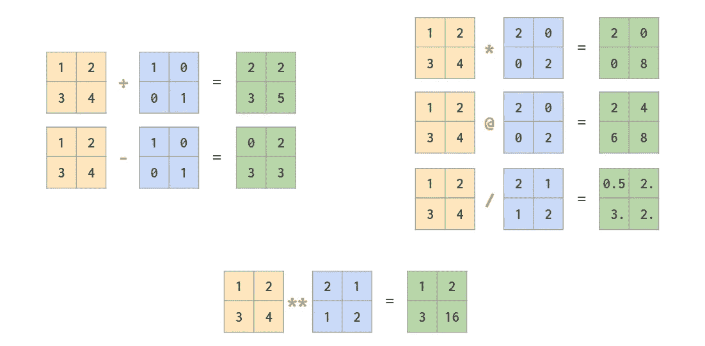*

*作为我们在第一部分已经看到的标量广播的推广，NumPy 允许在向量和矩阵之间，甚至在两个向量之间进行混合运算:*

*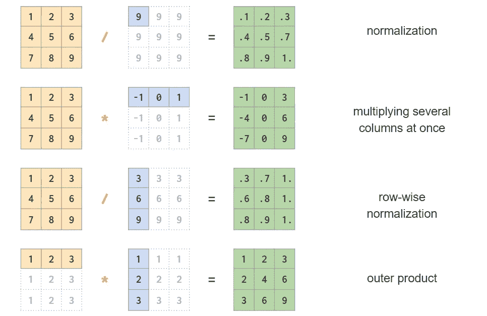*

*请注意，在最后一个示例中，这是一个对称的每元素乘法。要使用非对称线性代数矩阵乘法计算外积，操作数的顺序应该颠倒过来:*

*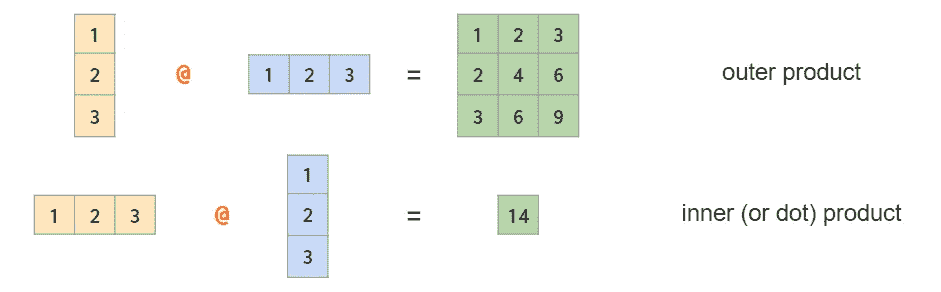*

## *行向量和列向量*

*从上面的例子可以看出，在 2D 上下文中，行和列向量被不同地对待。这与通常尽可能使用一种类型的 1D 数组的 NumPy 实践形成对比(例如，`a[:,j]`—2D 数组的第 j 列`a` —是 1D 数组)。默认情况下，1D 数组在 2D 运算中被视为行向量，因此当矩阵乘以行向量时，您可以使用 shape (n，)或(1，n) —结果将是相同的。如果你需要一个列向量，有几种方法可以从 1D 数组中得到它，但是令人惊讶的是`transpose`不在其中:*

*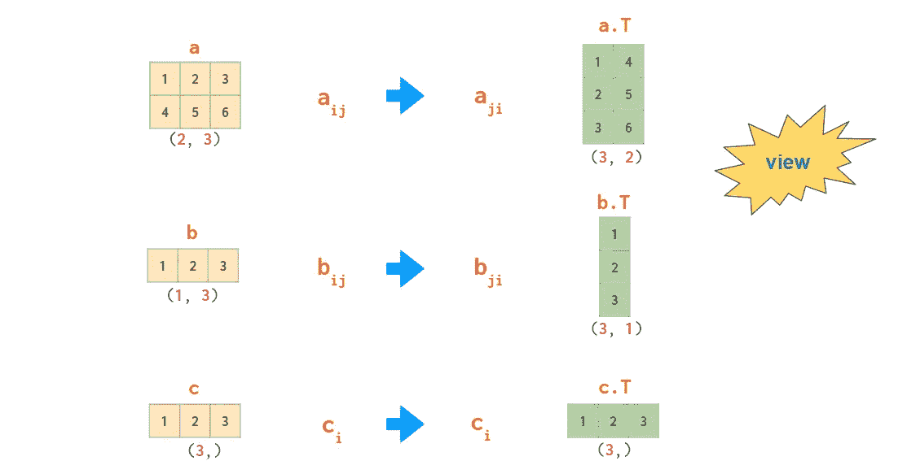*

**和*能够从 1D 数组中生成 2D 列向量的两个操作是用`[newaxis](https://numpy.org/doc/stable/reference/constants.html#numpy.newaxis)`整形和索引:*

*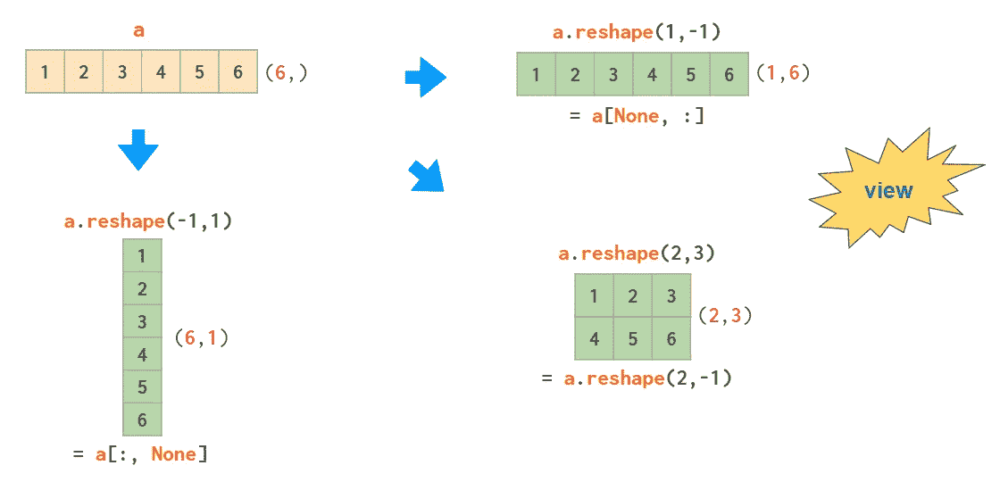*

*这里-1 参数告诉`reshape`自动计算一个尺寸大小，方括号中的`None`作为`np.newaxis`的快捷方式，在指定位置添加一个空轴。另一种方法是通过`np.[expand_dims](https://numpy.org/doc/stable/reference/generated/numpy.expand_dims.html)(a, axis=0)`，其中 0 告诉 NumPy 您希望新轴出现的位置。*

*因此，NumPy 中总共有三种类型的向量:1D 数组、2D 行向量和 2D 列向量。下面是这两者之间显式转换的示意图:*

*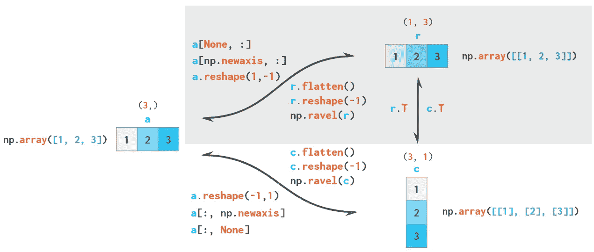*

*[展平](https://numpy.org/doc/stable/reference/generated/numpy.ndarray.flatten.html)始终是一个副本，[整形](https://numpy.org/doc/stable/reference/generated/numpy.reshape.html) (-1)始终是一个视图，[散开](https://numpy.org/doc/stable/reference/generated/numpy.ravel.html)可能时是一个视图*

*根据广播规则，1D 数组被隐式解释为 2D 行向量，因此通常不需要在这两者之间进行转换——因此相应的区域是有阴影的。*

**严格来说，任何一个数组，除了一维以外都是一维的，都是一个向量(例如* `a.shape==[1,1,1,5,1,1]` *)，所以 numpy 中有无限多种向量类型，但常用的只有这三种。你可以使用* `np.reshape` *将一个“正常的”1D 矢量转换成这种形式，并使用* `np.[squeeze](https://numpy.org/doc/stable/reference/generated/numpy.squeeze.html)` *将其恢复。这两个函数都充当视图。**

## *矩阵操作*

*连接阵列有两个主要功能:*

*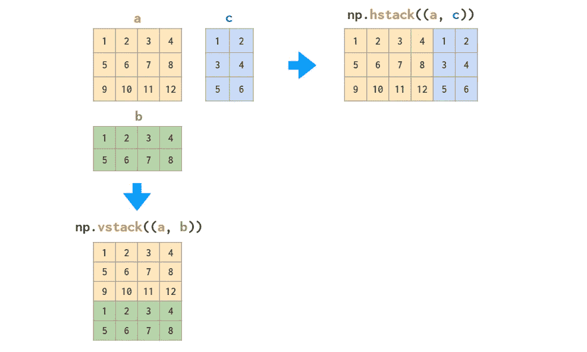*

*这两种方法只适用于堆叠矩阵或向量，但是当混合堆叠 1D 数组和矩阵时，只有`[vstack](https://numpy.org/doc/stable/reference/generated/numpy.vstack.html)`能按预期工作:`[hstack](https://numpy.org/doc/stable/reference/generated/numpy.hstack.html)`会产生维度不匹配错误，因为如上所述，1D 数组被解释为行向量，而不是列向量。解决方法是将其转换为行向量，或者使用专门的`[column_stack](https://numpy.org/doc/stable/reference/generated/numpy.column_stack.html)`函数自动完成:*

*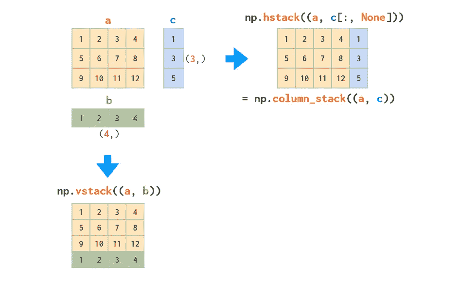*

*堆叠的逆过程是分裂:*

*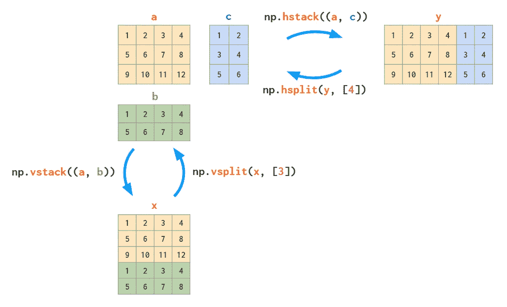*

*所有的`[split](https://numpy.org/doc/stable/reference/generated/numpy.split.html)`风格要么接受一个要分割的索引列表，要么接受一个整数，即相同大小部分的数量:*

*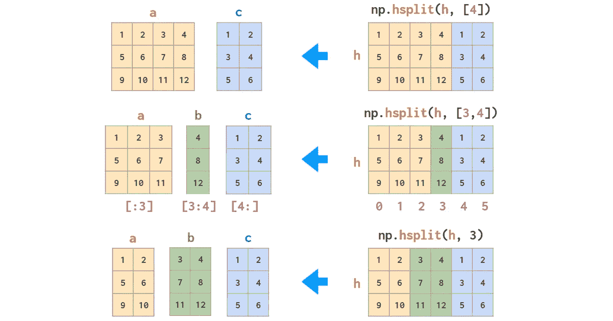*

*矩阵复制有两种方式:`[tile](https://numpy.org/doc/stable/reference/generated/numpy.tile.html)`类似于复制粘贴，`[repeat](https://numpy.org/doc/stable/reference/generated/numpy.repeat.html)`类似于分页打印:*

*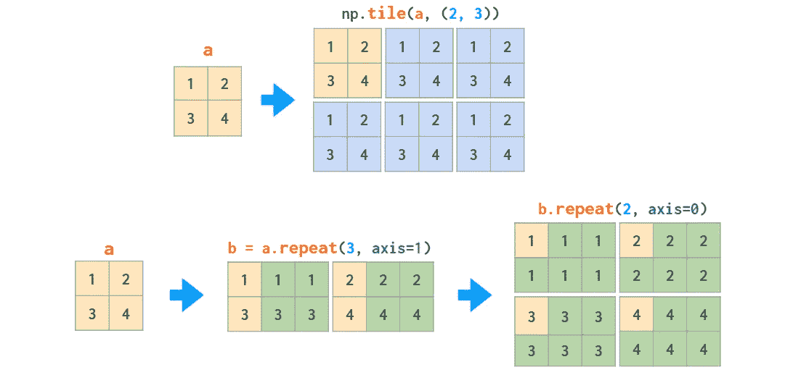*

*特定的列和行可以是这样的:*

*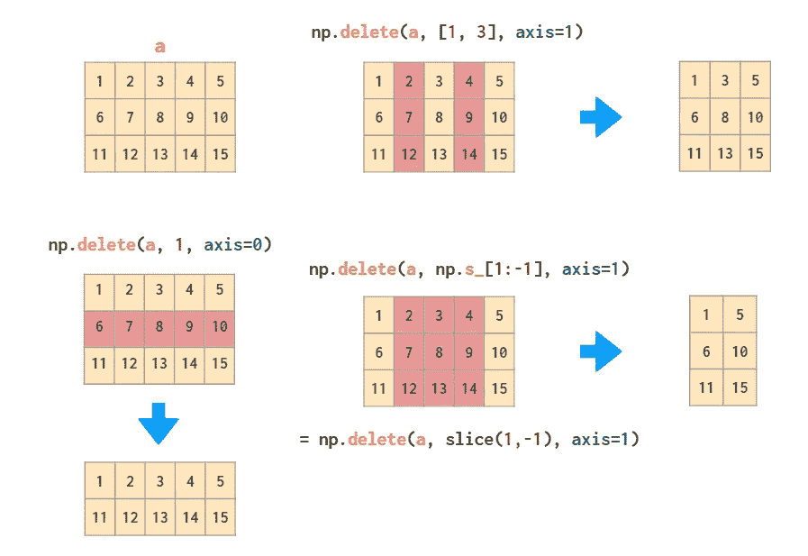*

*反向操作是`[insert](https://numpy.org/doc/stable/reference/generated/numpy.insert.html)`:*

*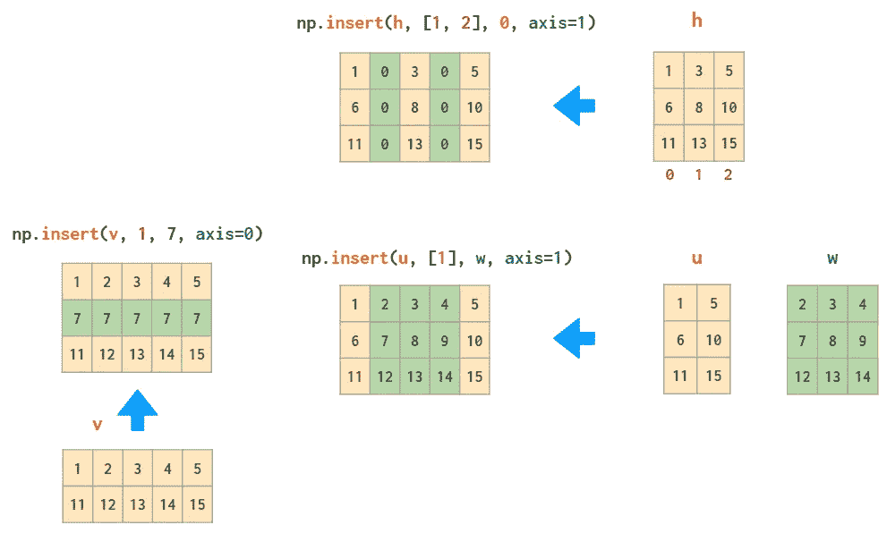*

*`[append](https://numpy.org/doc/stable/reference/generated/numpy.append.html)`函数，就像`hstack`一样，不能自动转置 1D 数组，所以再次强调，要么需要对向量进行整形，要么增加一个维度，要么需要使用`column_stack`:*

*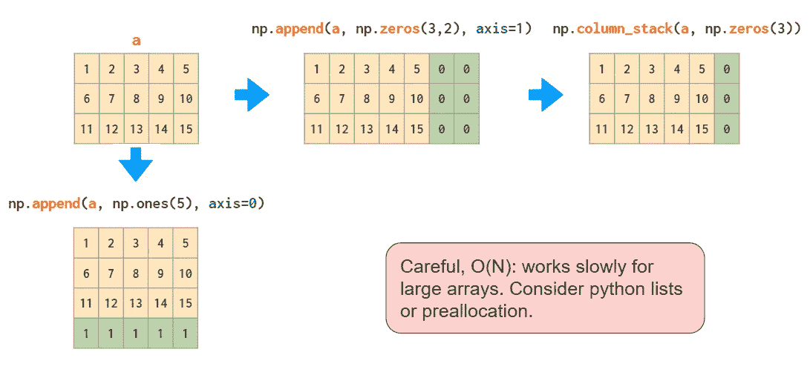*

*实际上，如果您所要做的就是向数组的边界添加常量值，那么`[pad](https://numpy.org/doc/stable/reference/generated/numpy.pad.html)`函数就足够了:*

*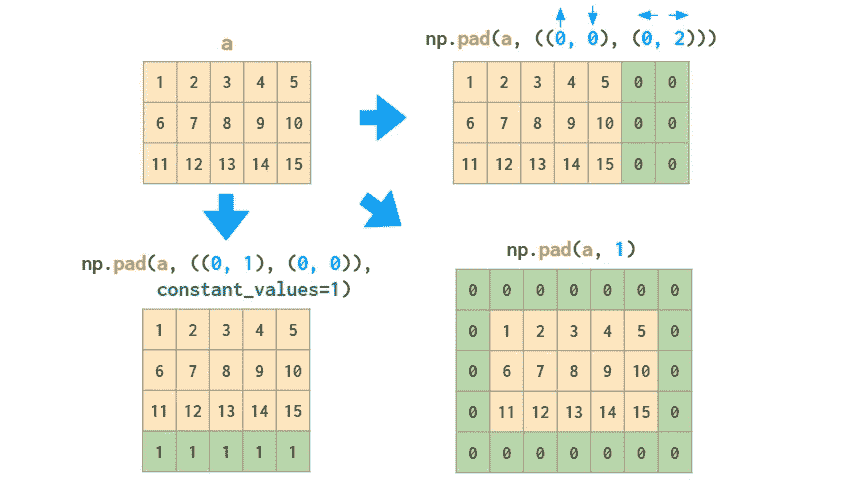*

## *网格*

*广播规则使得使用网格更加简单。假设，您需要下面的矩阵(但是非常大):*

**

*两种明显的方法很慢，因为它们使用 Python 循环。MATLAB 处理这类问题的方法是创建一个网格:*

*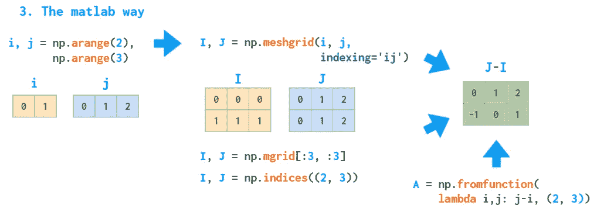*

*`[meshgrid](https://numpy.org/doc/stable/reference/generated/numpy.meshgrid.html)`函数接受一组任意的索引，`[mgrid](https://numpy.org/doc/stable/reference/generated/numpy.mgrid.html)` —只是切片，而`[indices](https://numpy.org/doc/stable/reference/generated/numpy.indices.html)`只能生成完整的索引范围。`[fromfunction](https://numpy.org/doc/stable/reference/generated/numpy.fromfunction.html)`使用如上所述的 I 和 J 参数调用所提供的函数一次。*

*但实际上，在 NumPy 中有更好的方法。没有必要在整个 I 和 J 矩阵上花费内存(即使`meshgrid`足够聪明，可能的话只存储对原始向量的引用)。只存储正确形状的向量就足够了，其余的由广播规则处理:*

*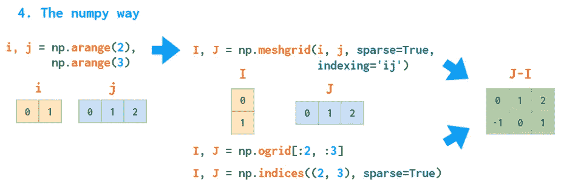*

*如果没有`indexing=’ij’`参数，`meshgrid`将改变参数的顺序:`J, I= np.meshgrid(j, i)` —这是一种“xy”模式，用于可视化 3D 绘图(参见文档中的[示例)。](https://numpy.org/doc/stable/reference/generated/numpy.meshgrid.html)*

*除了在二维或三维网格上初始化函数之外，网格还可以用于索引数组:*

*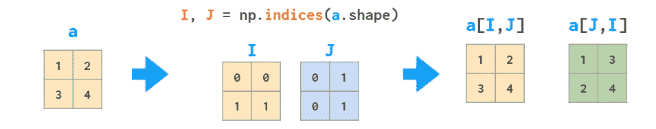*

*也适用于稀疏网格*

## *矩阵统计*

*就像`sum`一样，所有其他统计函数(`[min](https://numpy.org/doc/stable/reference/generated/numpy.ndarray.min.html)/[max](https://numpy.org/doc/stable/reference/generated/numpy.ndarray.max.html)`、`[argmin](https://numpy.org/doc/stable/reference/generated/numpy.argmin.html)/[argmax](https://numpy.org/doc/stable/reference/generated/numpy.argmax.html)`、`[mean](https://numpy.org/doc/stable/reference/generated/numpy.mean.html)/[median](https://numpy.org/doc/stable/reference/generated/numpy.median.html)/[percentile](https://numpy.org/doc/stable/reference/generated/numpy.percentile.html)`、`[std](https://numpy.org/doc/stable/reference/generated/numpy.std.html)/[var](https://numpy.org/doc/stable/reference/generated/numpy.var.html)`)都接受`axis`参数并相应地执行:*

*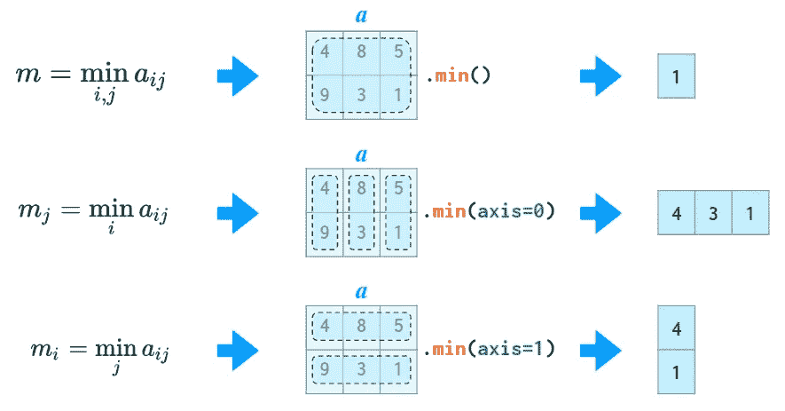*

*np。 [amin](https://numpy.org/doc/stable/reference/generated/numpy.amin.html) 只是 np.min 的别名，以避免在编写'`from numpy import *'`时遮蔽 Python min*

*2D 和更高版本中的`argmin`和`argmax`函数有一个麻烦，就是返回扁平化的索引(最小值和最大值的第一个实例)。要将其转换为两个坐标，需要一个`[unravel_index](https://numpy.org/doc/stable/reference/generated/numpy.unravel_index.html)`函数:*

*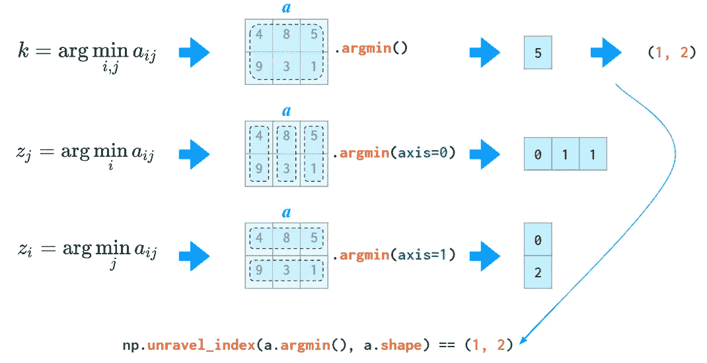*

*量词`[all](https://numpy.org/doc/stable/reference/generated/numpy.all.html)`和`[any](https://numpy.org/doc/stable/reference/generated/numpy.any.html)`也知道`axis`这个参数:*

*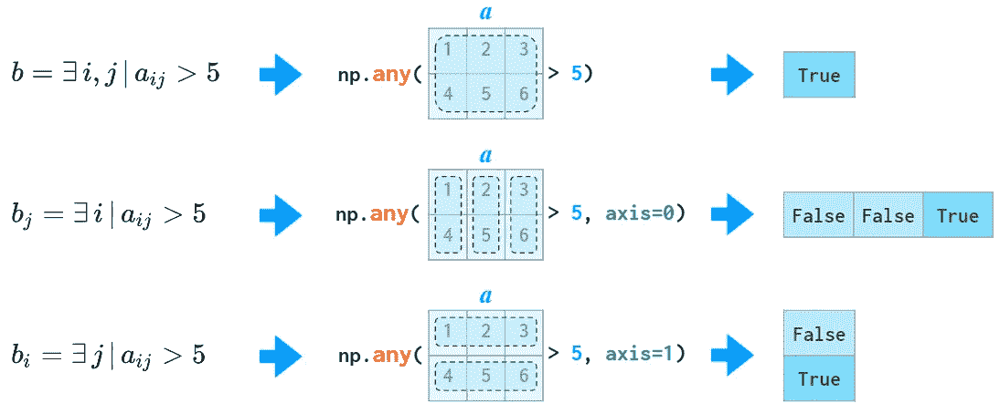*

## *矩阵排序*

*尽管`axis`参数对上面列出的函数很有帮助，但它对 2D 排序毫无帮助:*

*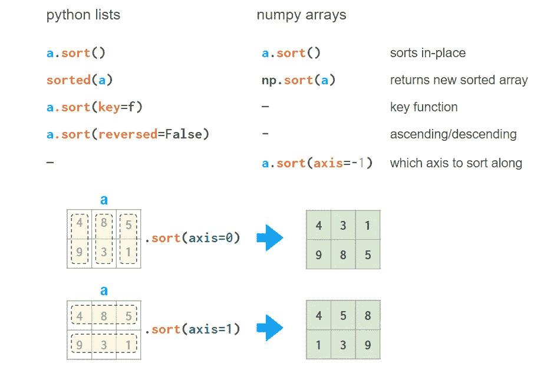*

*这不是你通常想要的对矩阵或电子表格排序:`axis`不能代替`key`参数。但是幸运的是，NumPy 有几个助手函数，允许按一列排序——如果需要，也可以按几列排序:*

*1.`a[a[:,0].[argsort](https://numpy.org/doc/stable/reference/generated/numpy.argsort.html)()]`按第一列对数组排序:*

*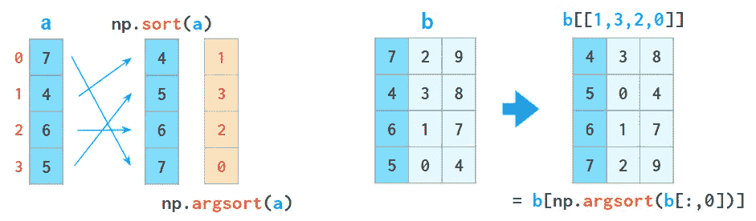*

*这里`[argsort](https://numpy.org/doc/stable/reference/generated/numpy.argsort.html)`返回排序后的原数组的索引数组。*

*这个技巧可以重复，但是必须小心，不要让下一个排序弄乱前一个排序的结果: `a = a[a[:,2].argsort()]
a = a[a[:,1].argsort(kind='stable')]
a = a[a[:,0].argsort(kind='stable')]`*

*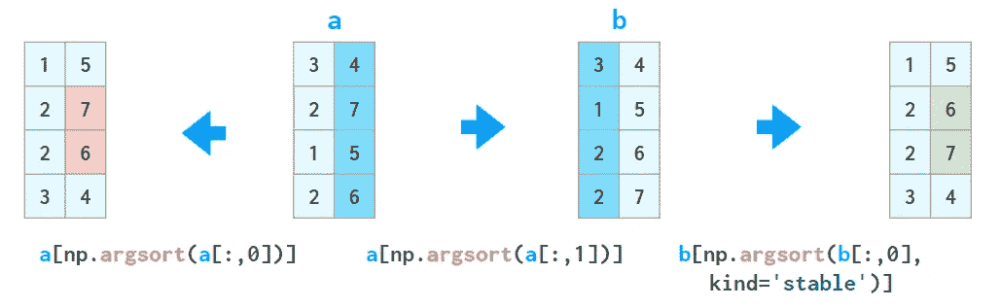*

*2.有一个助手函数`[lexsort](https://numpy.org/doc/stable/reference/generated/numpy.lexsort.html)`，它按照上面描述的方式对所有可用的列进行排序，但是它总是按行执行，并且要排序的行的顺序是颠倒的(即从下到上)，所以它的用法有点做作，例如
–`a[np.lexsort(np.rot90(a))]`按照从左到右的顺序对所有列进行排序。*

*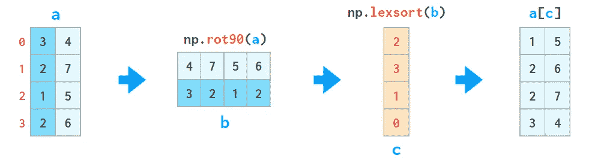*

*–`a[np.lexsort(np.rot90(a[:,[2,5]]))]`先按第 2 列排序，然后(当第 2 列中的值相等时)按第 5 列排序。另一种形式是`a[np.lexsort(np.flipud(a.T[[2,5]]))]`*

*这里`[flipud](https://numpy.org/doc/stable/reference/generated/numpy.flipud.html)`在上下方向翻转矩阵(准确地说，在`axis=0`方向，与`a[::-1,...]`相同，其中三个点表示“所有其他维度”——所以是突然的`flipud`，而不是`[fliplr](https://numpy.org/doc/stable/reference/generated/numpy.fliplr.html)`，翻转 1D 数组)，而`[rot90](https://numpy.org/doc/stable/reference/generated/numpy.rot90.html)`在正方向(即逆时针)旋转矩阵 90 度。翻转和旋转 90°都返回视图。*

*3.要使用`sort`的`order`参数，首先将数组转换为结构化形式，然后对其进行排序，最后将其转换回普通(“非结构化”)形式:*

*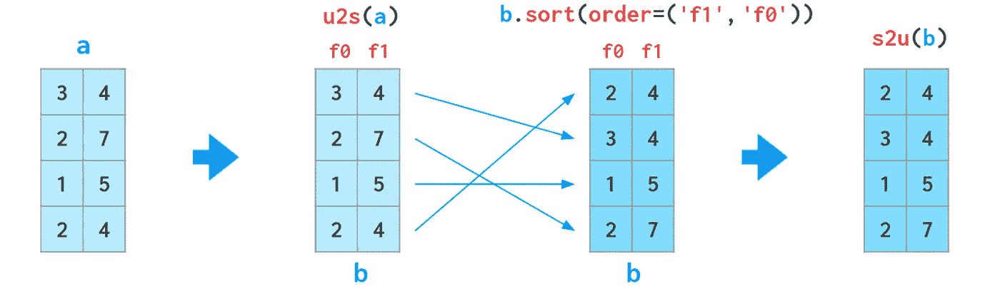*

*这两种转换实际上都是视图，因此速度很快，不需要任何额外的内存。但是函数`u2s`和`s2u`需要先导入恐怖的`from numpy.lib.recfunctions import unstructured_to_structured as u2s, structured_to_unstructured as s2u`*

*4.在 Pandas 中这样做可能是一个更好的选择，因为这个特定的操作可读性更好，不容易出错:
–`pd.DataFrame(a).[sort_values](https://pandas.pydata.org/pandas-docs/stable/reference/api/pandas.DataFrame.sort_values.html)(by=[2,5]).to_numpy()`先按列 2 排序，然后按列 5 排序。
–`pd.DataFrame(a).sort_values().to_numpy()`按所有列从左到右的顺序排序。*

# *3.3D 及以上*

*通过重塑 1D 矢量或转换嵌套 Python 列表来创建 3D 数组时，索引的含义为(z，y，x)。第一个索引是飞机的编号，然后是飞机的坐标:*

*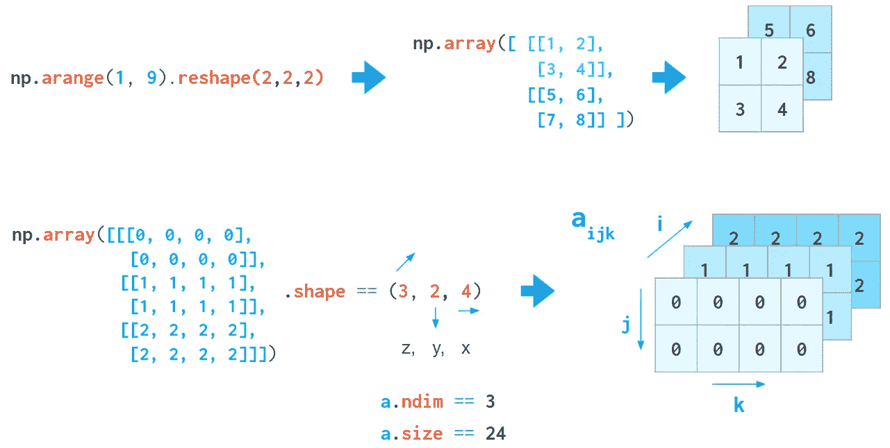*

*通用 3D 阵列*

*这种索引顺序很方便，比如保存一堆灰度图像:`a[i]`是引用第 I 张图像的快捷方式。*

*但是这种索引顺序并不通用。当处理 RGB 图像时，通常使用(y，x，z)顺序:首先是两个像素坐标，最后一个是颜色坐标(RGB 在 [Matplotlib](https://matplotlib.org/) 中，BGR 在 [OpenCV](https://opencv.org/) ):*

*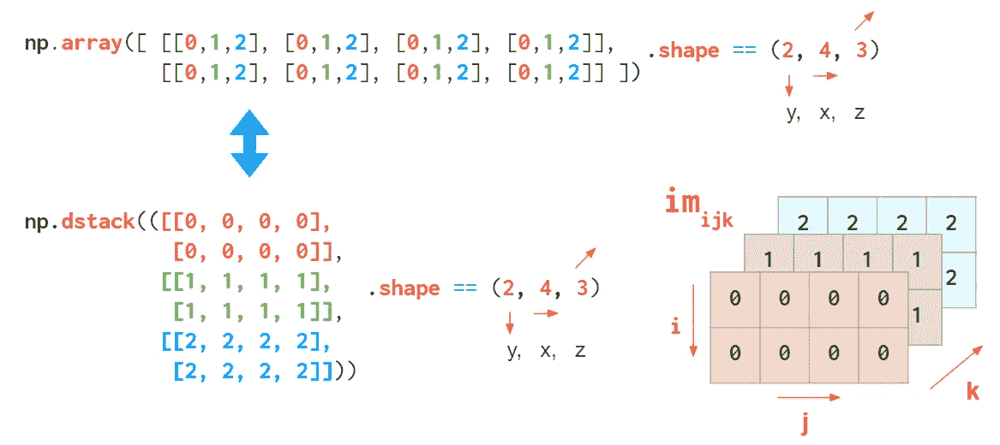*

*RGB 图像*

*这样引用一个特定的像素很方便:`a[i,j]`给出了一个`(i,j)`像素的`(r,g,b)`元组。*

*因此，创建特定几何形状的实际命令取决于您正在处理的领域的约定:*

*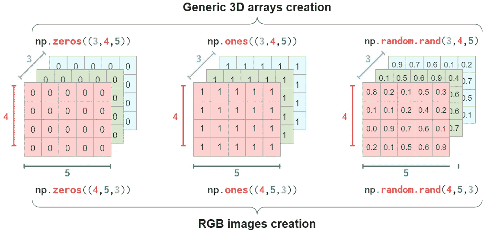*

*显然，像`hstack`、`vstack`或`[dstack](https://numpy.org/doc/stable/reference/generated/numpy.dstack.html)`这样的 NumPy 函数并不知道这些约定。其中硬编码的索引顺序为(y，x，z)，RGB 图像顺序为:*

*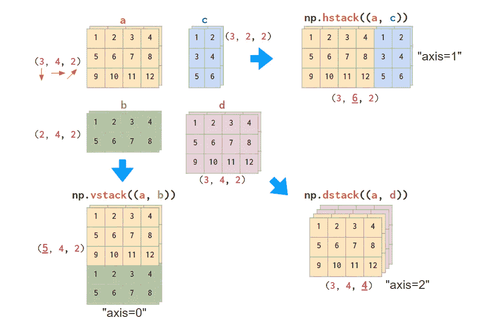*

*堆叠 RGB 图像(此处只有两种颜色)*

*如果您的数据布局不同，使用`[concatenate](https://numpy.org/doc/stable/reference/generated/numpy.concatenate.html)`命令堆叠图像会更方便，在`axis`参数中输入明确的索引号:*

*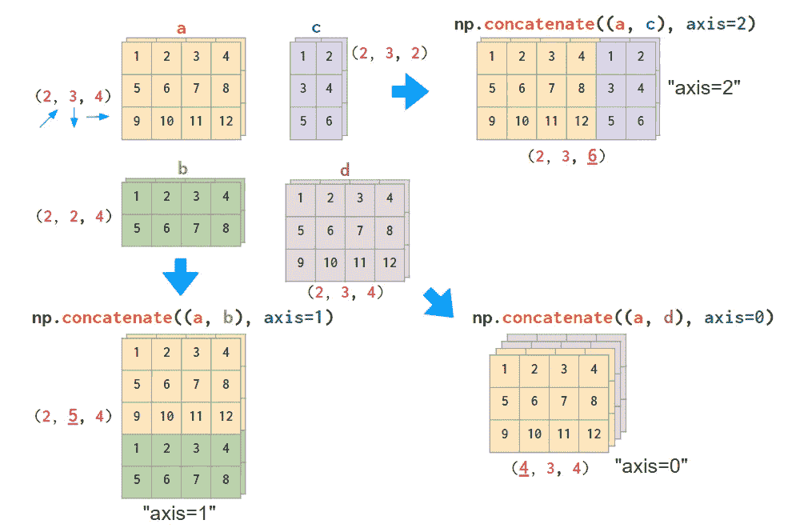*

*堆叠通用 3D 阵列*

*如果考虑轴数对您不方便，您可以将数组转换为硬编码为`hstack`和 co:*

*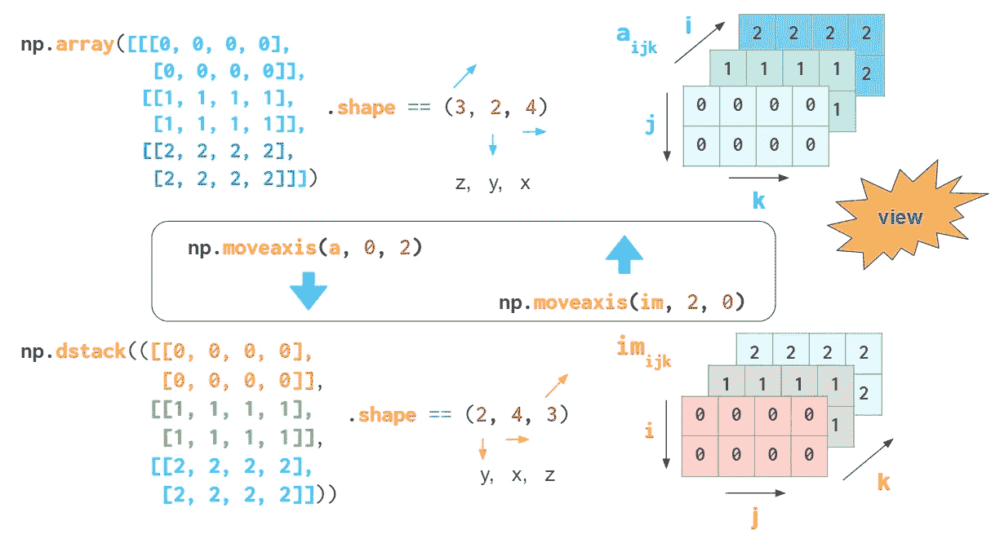*

*这种转换是廉价的:没有实际的复制发生；它只是动态地混合了索引的顺序。*

*另一种混合索引顺序的操作是数组转置。查看它可能会让您对 3D 数组更加熟悉。根据您决定的轴的顺序，转置阵列所有平面的实际命令会有所不同:对于通用阵列，它交换索引 1 和 2，对于 RGB 图像，它交换索引 0 和 1:*

*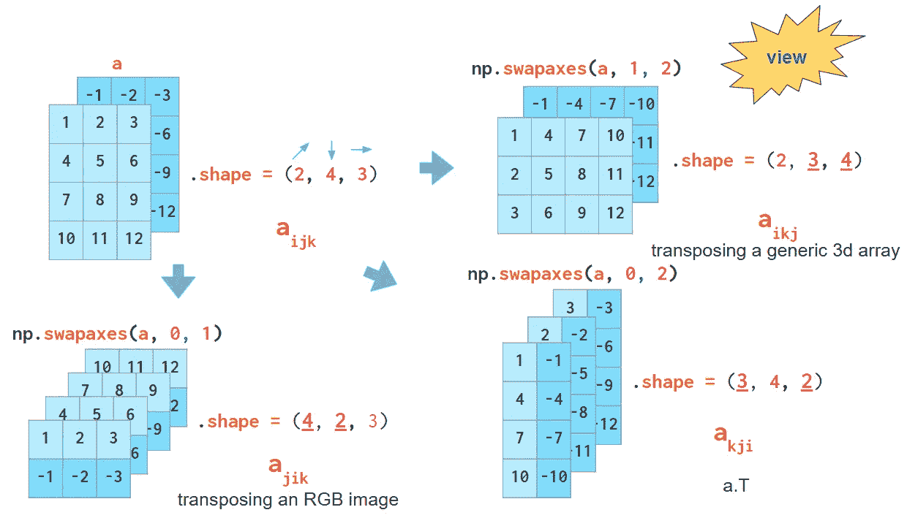*

*有趣的是，`[transpose](https://numpy.org/doc/stable/reference/generated/numpy.transpose.html)`的默认`axes`参数(也是唯一的`a.T`操作模式)颠倒了索引顺序，这与上面描述的索引顺序惯例都不一致。*

*更高维度的广播作品也一样，详见我的短文《NumPy 中的[广播》。](https://towardsdatascience.com/broadcasting-in-numpy-58856f926d73?sk=d3f8527b160fba2ad87e201369279e52)*

*最后，在处理多维数组时，这里有一个函数可以帮你省去很多 Python 循环，并且可以让你的代码更整洁— `[einsum](https://numpy.org/doc/stable/reference/generated/numpy.einsum.html)`(爱因斯坦求和):*

*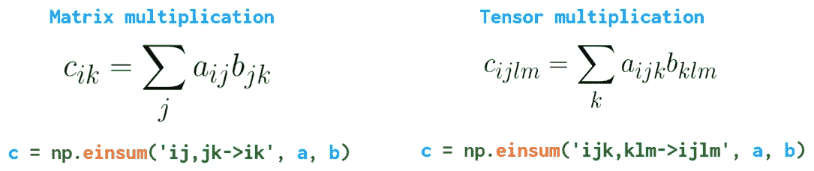*

*它沿着重复的索引对数组求和。在这个特殊的例子中，`np.[tensordot](https://numpy.org/doc/stable/reference/generated/numpy.tensordot.html)(a, b, axis=1)`在两种情况下都足够了，但是在更复杂的情况下，`einsum`可能工作得更快，并且通常更容易读写——一旦你理解了它背后的逻辑(参见我的新的 [Einsum Visualized](/einsum-visualized-c050903145ef?sk=e05c7d70e150f91e29f3d0a37326e087) 指南了解详情)。*

*如果你想测试你的数字技能，GitHub 上有一套巧妙的众包 [100 数字练习](https://github.com/rougier/numpy-100) ⁰。*

*如果我错过了你最喜欢的 NumPy 功能，请让我知道(在 [reddit](https://www.reddit.com/r/MachineLearning/comments/kibblu/p_numpy_illustrated_the_visual_guide_to_numpy/) 、 [hackernews](https://news.ycombinator.com/item?id=25550393) 或 [twitter](https://twitter.com/LevMaximov) )，我会尽量把它放进去！*

# *参考*

1.  *斯科特·希沃特， [NumPy GPU 加速](https://stsievert.com/blog/2016/07/01/numpy-gpu)*
2.  *Jay Alammar，[NumPy 和数据表示的可视化介绍](http://jalammar.github.io/visual-numpy/)*
3.  *[Big-O 备忘单网站](https://www.bigocheatsheet.com/)*
4.  *[Python 时间复杂度 wiki 页面](https://wiki.python.org/moin/TimeComplexity)*
5.  *NumPy 问题#14989，[排序函数中的反向参数](https://github.com/numpy/numpy/pull/14989)*
6.  *NumPy 问题#2269，[第一个非零元素](https://github.com/numpy/numpy/issues/2269)*
7.  *[数字图书馆主页](https://numba.pydata.org/)*
8.  *[浮点引导，比较](https://floating-point-gui.de/errors/comparison/)*
9.  *NumPy 问题#10161，[NumPy . is close vs math . is close](https://github.com/numpy/numpy/issues/10161)*
10.  *[GitHub 上的 100 个 NumPy 练习](https://github.com/rougier/numpy-100)*

# *许可证*

*保留所有权利。未经作者许可)。*