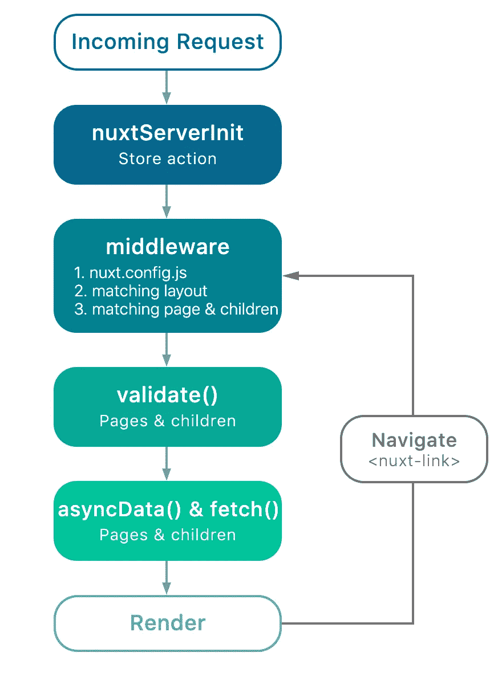
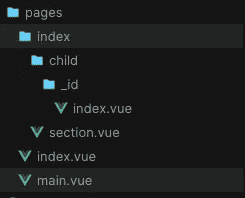

# Vue.js 开发人员的 Nuxt 基础

> 原文：<https://betterprogramming.pub/nuxt-explained-for-vuejs-devs-2df264927316>

## 深入探究如何使用 Nuxt

照片由[安妮·登科娃](https://unsplash.com/@annidenkova?utm_source=unsplash&utm_medium=referral&utm_content=creditCopyText)在 [Unsplash](https://unsplash.com/s/photos/java?utm_source=unsplash&utm_medium=referral&utm_content=creditCopyText) 上拍摄

我已经和 Vue 一起工作好几年了，也听说过很多关于 Nuxt 的事情，但是我从来没有真正接触过它。感谢我在 S [harenow](https://medium.com/sharenowtech) 的新工作，我终于开始每天使用 Nuxt 了！

在这篇文章中，我假设你精通 Vue，并且想开始使用 Nuxt。我们的目标是让开始阅读官方文档变得轻而易举。

# Nuxt 简介

如果我们要学习 Nuxt，那么我们需要先掌握基础知识。Nuxt 是 Vue 的一个框架。从这个意义上说，这是一个框架的框架。

记住这一点，这意味着无论你对 Vue 了解多少，你可能也会发现对 Nuxt 也是如此。

理解 Nuxt 是建立在 Vue 的 *之上* 是很重要的。本质上，你有一套由惊人的 Vue 开发者为几千字节编写的功能。

与 Vue 非常相似，我们将只关注与 Nuxt 相关的内容。

# Nuxt 的不同模式

## 1.服务器端呈现(SSR)

这是目前为止使用 Nuxt 最流行的模式。您得到一个节点服务器，它提供从 Vue 组件生成的 HTML。

通过使用 SSR，您可以获得很多好处，比如 SEO、性能提升，以及更多的灵活性和功能，因为您有一个受您控制的节点服务器。

如果您不确定是否需要 SSR 应用程序，这里有一个关于 Vue SSR 的深入信息指南:

 [## Vue.js 服务器端渲染指南 Vue SSR 指南

### Vue.js 服务器端渲染指南

Vue SSR Guide Vue.js 服务器端渲染 Guidessr.vuejs.org](https://ssr.vuejs.org/#ssr-vs-prerendering) 

## 2.静态生成(JAMstack)

如果 SSR 对您的需求来说是多余的，同时，您仍然想要预渲染的好处，那么您可能会选择这个选项。

这基本上就是最近被称为 JAMstack 的东西，但以 Vue 的方式完成。你可能很熟悉诸如 [Gatbsy](https://www.gatsbyjs.org/) 或 [Jekyll](https://jekyllrb.com/) 这样的替代词

Nuxt 为您提供了`nuxt generate`，一个将您的路径(页面组件)预呈现到 HMTL 页面的命令，这些页面准备好被[部署到您选择的任何主机](https://vueschool.io/lessons/how-to-deploy-nuxtjs-to-netlify?friend=nuxt)。

 [## JAMstack 和 CD 管道:用 Nuxt、Netlify CMS 和 Netlify 创建一个博客

### TL；DR:了解如何建立一个用 Vue.js 构建，用 Nuxt.js 编译的静态网站的指南，包括…

以色列穆卡](https://israelmuca.dev/blog/jamstack-and-cd-pipelines-create-a-blog-with-nuxt-netlify-cms-and-netlify/) 

## 3.单页应用程序(SPA)

这和你已经熟悉的差不多。这是一个常规的 Vue 应用程序，但构建了 Nuxt 功能和配置，支持快速开发和更多开箱即用的功能。

# Nuxt 包含哪些内容？

Nuxt 是一个固执己见的框架，它会为你做出一些很好的决定。此外，它还为您的应用程序提供了基本的架构指南。

已经包括的一些软件包有:

*   某视频剪辑软件
*   Vue 路由器
*   Vuex(可配置)
*   Vue 服务器端
*   Vue Meta
*   Webpack (Vue-loader，babel-loader)

正如您所看到的，这里没有魔法—它为我们做了冗长/复杂的工作，同时让我们在需要时进行配置。

# 加深你的理解

现在你已经对 Nuxt 有了一个大概的了解，并且知道了它与 Vue 的区别，是时候让我们深入了解 Nuxt 的内部了。

在这一节中，我们将讨论 Nuxt 模式、目录结构和路由。

## Nuxt 模式

还记得 Vue 的组件生命周期吗？Nuxt 模式是类似的。它为您提供了一个当请求到达您的 Nuxt 应用程序时会发生什么的顶层视图。

Schema by [Nuxt](https://nuxtjs.org/guide)

从这个图中最重要的收获是理解请求在到达客户机之前要经过服务器上的几个钩子。

有了这个概念，我们可以将大量操作转移到我们的服务器上，并利用这种能力为客户提供更好的用户体验。

## 目录结构

不像在 Vue 中，使用`vue-cli`得到的目录结构只是一种看法，Nuxt 使用*约定而不是配置*，一些目录背后会有一些魔法。

> 如果您想更改这些名称中的任何一个，您还必须进行配置更改

*   **布局**
    在这里，你放置你的基本组件。例如，带有侧边栏、后台页面布局和错误页面(如 500 和 404)的页面。
*   **Pages**Pages
    Nuxt 将基于位于此处的组件自动生成您的应用程序路由。
*   **静态**
    这个目录是直接映射到服务器根目录的。你可以在这里存储像`favicons`和`robot.txt`这样的静态文件。
*   **存储**
    这是你的 Vuex 存储文件将被包含的地方，要启用 Vuex，你需要在里面创建一个索引文件。
*   **nuxt.config.js**
    相当于你的`vue.config.js`，你可以配置你的 nuxt 应用，扩展 Webpack 配置。

其他目录不是约定的一部分——它们在那里提供指导并支持您做出架构决策。

## 按指定路线发送

Nuxt 路由建立在 vue 应用的标准 go-to 路由解决方案 [vue-route](https://router.vuejs.org/) 之上。

我假设在开发 Vue 应用程序时，您已经创建了一百次路由器文件，所以您可能已经看到了这个过程是多么的多余。

这就是为什么 Nuxt 自动为我们做这件事，并为页面目录中的每个组件创建一个路径。

简单路由

这将自动创建一个`/`路径来呈现`index.vue`组件和`/about`哪个`about.vue`组件

## **动态路由**

您还可以通过使用嵌套目录和通配符来创建更高级的路由结构。

高级路由

如你所见，`/child/1`将渲染`index/child/_id/index.vue`

令人印象深刻的是，你可以用这个惯例走多远——你可以做一些相当复杂的路由。如果您想要更多的控制，您可以参考 Nuxt 配置中的任何路由器配置文件。

# Nuxt 中的新概念

## 1.中间件

这些相当于 Vue 中的导航卫士。我写了一篇关于这个的文章作为深入的指导:

> 导航守卫可以定义在应用程序，页面或组件级别，给你几层控制。它们可以为您提供一种非常简单的方法来共享功能、逻辑并在您的应用程序中做出路由决策。

 [## Nuxt 中使用中间件的全球导航卫士

### 共享功能并决定路由 Nuxt 的中间件

medium.com](https://medium.com/@seif.sayed/global-navigation-guards-in-nuxt-using-middlewares-43ae9dc131b4) 

## 2.异步数据

这是一个仅在`pages`组件中可用的方法，在第一次请求时在服务器上调用一次，在客户端的进一步页面导航中调用一次。

返回的对象将自动与组件中的`data`对象合并。如果您希望在服务器上预先填充组件的初始数据，这将非常有用。

## 3.获取方法

类似于`async`方法，但是返回的对象不与`page`组件的数据对象合并。此方法可用于获取服务器上的数据，并将其存储在您的存储中。

## 4.插件

和 Vue 的插件不完全一样。一种在应用程序间共享通用功能的方式。你可以编写自己的插件或者使用现有的 Vue 插件。

这里需要注意的一点是，Nuxt 允许你选择是在*纯客户端*、*纯服务器*上运行你的插件，还是两者都运行。这对不支持 SSR 的插件很有用。

## 5.模块

与插件类似，模块是代码重用的一种形式。模块允许您扩展 Nuxts 核心，并在应用程序的几个部分重用功能。

Nuxt 的模块化允许您编写可以覆盖模板、配置 webpack 加载器、添加 CSS 库和执行许多其他有用任务的模块。

生态系统中有几个现有的模块，包括谷歌标签管理器，字体真棒，和哨兵。

 [## nuxt-社区/模块

### ⚠️这是一些较小的 nuxt 模块的 mono 库。👉你可能想看更多精彩的 Nuxt

github.com](https://github.com/nuxt-community/modules) 

## 6.服务器中间件

不要与中间件混淆，这些是在`vue-server-renderer`之前在服务器上运行的方法，可以用来处理 API 请求(日志)或服务资产。

## 7.nuxtServerInit

这是一个可以在 vuex 商店中定义的操作。Nuxt 在服务器上自动调度这个动作，将[上下文](https://nuxtjs.org/api/context)对象作为第二个参数。

当您希望将数据从服务器传递到客户端时，如会话信息或环境配置，这很有用。

# 完整的类型脚本支持

与 Vue 不同，Nuxt 提供了完整的 Typescript 支持。这不是现成的，您必须在自己的 Nuxt 2.8 上实现它。集成`nuxt/typescript-build`非常简单。

 [## 设置

### Nuxt TypeScript 支持主要来自一个 Nuxt 模块@nuxt/typescript-build。以下是安装指南…

typescript.nuxtjs.org](https://typescript.nuxtjs.org/guide/setup.html) 

# 入门指南

如果你已经做到了这一步，那么恭喜你。现在您已经准备好开始开发您的第一个 Nuxt 应用程序了。

你可以使用`create-nuxt-app` *、N* uxt 的 CLI，按照这里的步骤[操作，几分钟后你就可以设置好了。](https://nuxtjs.org/guide/installation/#using-code-create-nuxt-app-code-)

# 现实生活中的例子

一旦您构建了您最喜欢的启动应用程序(todo/blog/shop)，您可以进一步挖掘。

 [## nuxt/黑客新闻

### 用 Nuxt.js 构建的 HackerNews 克隆。

github.com](https://github.com/nuxt/hackernews)  [## nuxt/示例-auth0

### 一个简单的例子展示了如何使用 Nuxt.js 和 Auth0 你可以在这里访问一个简单的演示:https://auth0.nuxtjs.org…

github.com](https://github.com/nuxt/example-auth0)  [## nuxtjs.org

### 使用 Nuxt.js 的异步数据示例

nuxtjs.org](https://nuxtjs.org/examples/async-data) 

# Nuxt 很牛逼

我一直很喜欢 Nuxt 应用程序的开发，并且觉得作为一名前端开发人员，我可以做得更多。以下是令人惊叹的 Nuxt 资源列表:

 [## nuxt-社区/awesome-nuxt

### 与 Nuxt.js 相关的令人敬畏的事物的精选列表。Nuxt.js 是用于创建通用 Vue.js 应用程序的框架…

github.com](https://github.com/nuxt-community/awesome-nuxt) 

感谢阅读。我希望你喜欢阅读，并准备好深入 Nuxt 的世界。这是一个强大的前端开发体验！