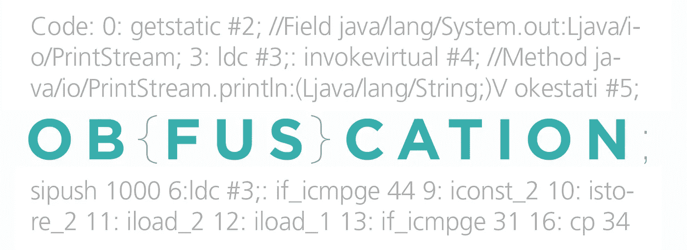
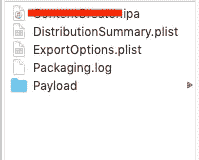
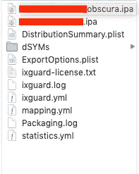
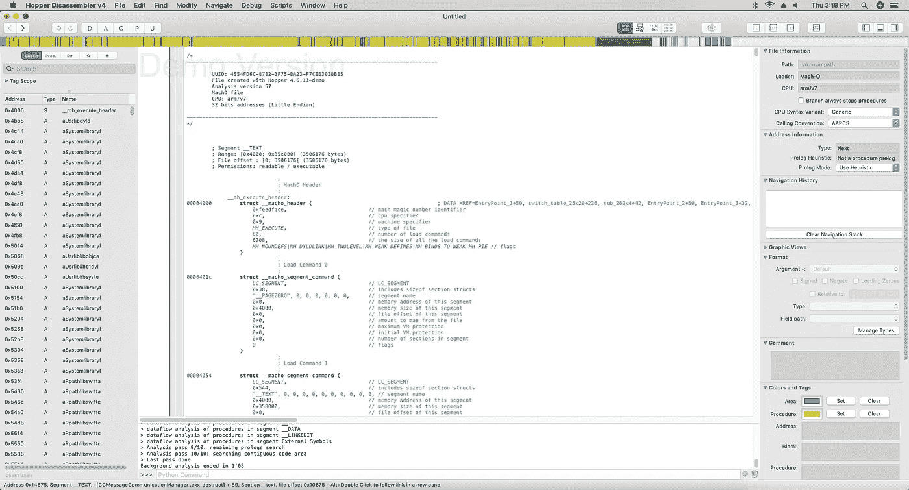
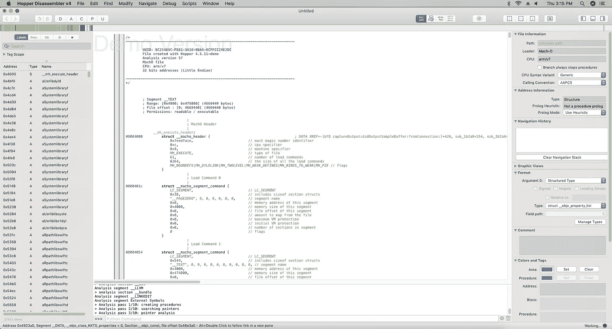

# 使用 Hopper 反汇编器对 IPA (iXGuard)进行混淆验证

> 原文：<https://betterprogramming.pub/obfuscation-verification-of-ipa-ixguard-using-hopper-disassembler-d86f7d65347c>

安全性是移动应用程序开发的一个重要方面。安全工具箱中有多种工具，如 SSL 锁定、数据库加密、双因素身份验证或设备间的端到端加密。

这些技术侧重于防止用户数据被拦截或窃取。

而且，虽然不可能完全阻止像 [Hopper 反汇编器](https://www.hopperapp.com/)这样的 IPA 反汇编工具理解你的应用程序的逻辑，但有时减慢它们的速度是值得的。

它还可以防止自动机器人搜索您的代码，寻找容易发现的模式。有助于此的常用技术是[代码混淆](https://en.wikipedia.org/wiki/Obfuscation_software)。

一种特殊的代码混淆技术使用[iXGuard](https://www.guardsquare.com/en/)——一种用于混淆 iOS 应用程序中代码的安全工具。详见[我之前的帖子](https://medium.com/@tejeshwargill/getting-started-with-ixguard-an-obfuscation-app-shrinking-tool-85e1342a5572)**。**

这篇文章是关于验证一个 IPA 是否已经被 iXGuard 工具和一个 IPA 反汇编工具——Hopper 反汇编器正确地混淆了。

这是对模糊 IPA 执行验证的过程:

在使用模糊处理构建了 IPA 之后，我们需要将其与原始的非模糊 IPA 进行比较。

我已经迭代了一些方法来轻松地比较这两个，没有太多事情要做。这将有助于简单地验证比较。

# 开始比较

以下是两种开始比较的方法:

1.  文件夹差异。
2.  反汇编差异。

# 1.非混淆 IPA 与混淆 IPA —文件夹差异

**非混淆 IPA vs 混淆 IPA**

当我们比较这两个文件夹时，第一个文件夹包含 IPA 的标准构建，其中包含 plist、打包日志等。

但是，如果我们检查第二个文件夹，它是使用 iXGuard 工具和位代码加密为混淆的 IPA 构建的，我们会看到生成了一个新的 *obscura IPA* ，其中包括由 iXGuard 生成的`yml`文件、统计数据和日志。

这是你的混淆的 IPA 已经成功构建完成的第一个迹象！

# 2.非混淆 IPA 与混淆 IPA- Hopper 反汇编程序的区别

模糊验证可以通过 Hopper 反汇编程序来验证。

Hopper 反汇编器是一个逆向工程工具，可以让您反汇编、反编译和调试您的应用程序。

Hopper 使用不同的表示法显示代码。我们可以同时查看程序的汇编、CFG 和伪代码。

下面是来自 Hopper 反汇编程序的截图，这有助于了解模糊处理应用于 IPA 的不同之处，从而为 IPA 带来无法被反汇编程序破解的完整加密。

让我们检查一下下面的非混淆 IPA 拆卸料斗。

就在程序集的上方，您会发现导航栏。

Hopper 反汇编程序导航栏

此栏用于快速导航到文件。颜色方案用于指示文件字节的各种类型。

*   **黄色**部分代表程序。
*   **绿色的**部分代表 ASCII 字符串。
*   **紫色**部分代表数据。
*   **灰色**零件未定义。
*   **蓝色**部分代表代码。

一个红色小箭头指示光标当前所在的位置。

现在，如果我们检查下面模糊的 IPA，我们可以看到导航栏中的一个主要变化，根据颜色，过程和 ASCII 字符串显示得很少！

这表明加密已经应用于 IPA 并且 IPA 已经被成功混淆的事实。

让我们检查一下模糊的 IPA——下面由 Hopper 分解

因此，当我们检查比较时，Hopper 反汇编程序无法反汇编 iXGuard 加密的 IPA。

这显示了 iXGuard 工具是如何成功地帮助加密 IPA 的。

务必阅读并分享！！