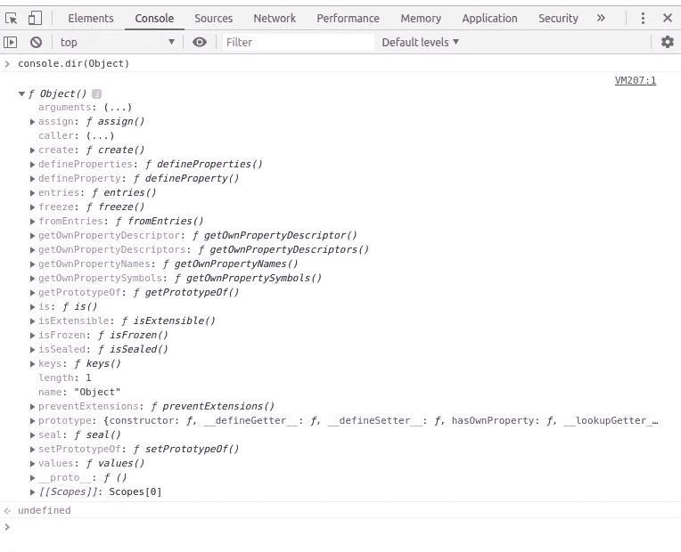
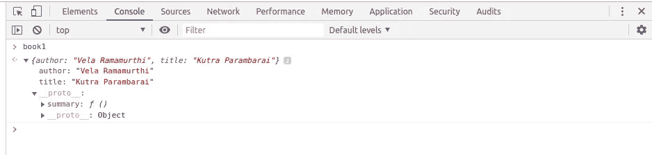
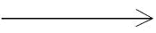
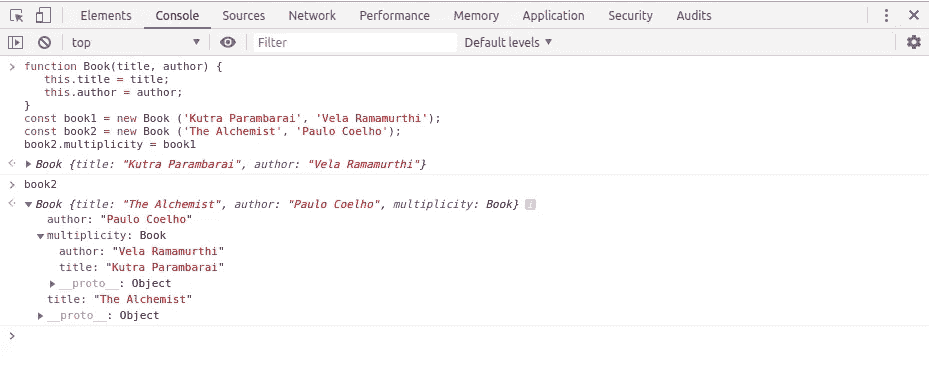
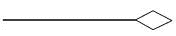
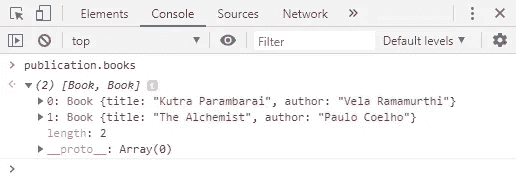

# JavaScript 面向对象编程指南

> 原文：<https://betterprogramming.pub/object-oriented-programming-in-javascript-b3bda28d3e81>

## 对象、类、封装、多态等等！


一切都从一个物体开始。

对象是我们与之交互的东西，它有属性和方法。对象是面向对象编程的核心，不仅对 JavaScript 如此，对 Java、C、C++和其他语言也是如此。停止考虑单个变量和函数，开始考虑自给自足的对象。

这里列出了在谈论面向对象编程(OOP)时最常用的概念:

*   对象、属性和方法
*   班级
*   包装
*   抽象
*   可重用性/继承性
*   多态性
*   联合
*   聚合
*   作文

# 对象、属性和方法

## **对象文字**

通过在花括号内设置属性，在 JavaScript 中创建新对象。对象文字属性值可以是任何数据类型，如函数文字、数组、字符串、数字或布尔值。

让我们用一本书创建一个对象，属性包括作者、出版年份、标题和一个方法— `summary`。

```
const book = {
   title: "Hippie",    
   author: "Paulo Coelho",  
   year: "2018"
}
```

在创建一个对象后，你可以用点符号得到它的值。比如我们可以用`book.title`得到标题的值。我们也可以用方括号访问属性:`book[‘title’]` *。*

## **对象构造器**

对象构造函数与常规函数相同。每次创建对象时都会调用它。我们可以用关键字`new`来使用它们。当我们想要创建多个具有相同属性和方法的对象时，对象构造函数非常有用。

```
const book = {
   title: "Hippie",    
   author: "Paulo Coelho",  
   year: "2018"
}const book1 = {
   title: "The Alchemist",    
   author: "Paulo Coelho",  
   year: "1988", 
}
```

如果我们想要创建多个 book 对象，我们必须为每本书复制代码。我们可以继续创建书籍，但这有点痛苦——对象构造函数帮助我们重用对象文字。

```
function Book(title, author, year) { 
   this.title = title; 
   this.author = author; 
   this.year = year;
}const book1 = new Book ('Hippie', 'Paulo Coelho', '2018');console.log(book1);
> Book {
     title: "Hippie", 
     author: "Paulo Coelho", 
     year: "2018"
  }// if we want to create more than one book just we call function book with new keyword.const book2 = new Book ('The Alchemist', 'Paulo Coelho', '1988');
```

`book1`和`book2`创建一个`Book`的实例，并将其赋给一个变量。确定一个对象是否是另一个对象的实例。我们可以用`instanceof`。

```
book1 instanceof Book
> true
```

## **Object.create()**

JavaScript 中的每个对象都将从主对象`Object`创建。每当我们使用带大写字母“O”的对象时，它指的是主对象。我们可以在控制台中打印主对象。主对象有许多方法，这里我们将看到`Object.create()`方法。



`Object.create()`方法创建一个新的对象，使用一个现有的对象作为原型。下面是基本语法:

```
Object.create(proto, [propertiesObject])
```

`proto`是新创建对象的原型。`propertiesObject`是可选的。

让我们举一个简单的例子:

```
const Book = { 
   summary : function() { 
      console.log(`${this.title} is written by ${this.author}.`)
   }
}const book1 = Object.create(Book);
book1.author = "Paulo Coelho";
book1.title = "Hippie";console.log(book1.summary());
> Hippie is written by Paulo Coelho.
```

在上面的例子中，我们创建了一个原型对象`book1`，并为 author 和 title 赋值。我们可以看到 proto 对象内部的汇总函数:



下面我们将详细看看`Object.create()`方法。

# 班级

类不是对象——它是对象的*蓝图。类是特殊的函数。您可以使用函数表达式和声明来定义函数，也可以用这种方式定义类。我们可以使用蓝图创建对象的数量。*

您可以使用 class 关键字和类名。语法类似于 Java。

类语法是使用面向对象编程和管理原型的好方法:

```
let Book = function(name) { 
   this.name = name
}let newBook = function(name) {
   Book.call(this, name)
} newBook.prototype = Object.create(Book.prototype);
const book1 = new newBook("The Alchemist");
```

这是使用 ES6 类语法:

```
class Book {
   constructor(name) {
      this.name = name
   }
}class newBook extends Book { 
   constructor(name) {
      super(name);
   }
}const book1 = new newBook("The Alchemist");
```

类语法是语法糖——在幕后，它仍然使用基于原型的模型。类是函数，函数是 JavaScript 中的对象。

```
class Book {
   constructor(title, author){ 
      this.title = title;
      this.author = author;
   } 
   summary() {
      console.log(`${this.title} written by ${this.author}`);
   }
}const book1 = new Book("", "");console.log(typeof Book); 
> "function"console.log(typeof book1);
> "object"
```

# **封装**

封装意味着隐藏信息或数据。它指的是对象执行其功能而不向调用者透露任何执行细节的能力。换句话说，私有变量仅对当前函数可见，对全局范围或其他函数不可访问。

```
const Book = function(t, a) {
   let title = t; 
   let author = a; 

   return {
      summary : function() { 
        console.log(`${title} written by ${author}.`);
      } 
   }
}
const book1 = new Book('Hippie', 'Paulo Coelho');book1.summary();
> Hippie written by Paulo Coelho.
```

在上面的代码中，标题和作者只在函数`Book`的范围内可见，方法`summary`对`Book`的调用者可见。所以标题和作者都封装在`Book`里面。

# 抽象

抽象意味着实现隐藏。这是一种隐藏实现细节的方式，只向调用者显示基本特性。换句话说，它隐藏了不相关的细节，只显示了对外部世界必要的东西。缺乏抽象会导致代码可维护性的问题。

```
const Book = function(getTitle, getAuthor) { 
   // Private variables / properties  
   let title = getTitle; 
   let author = getAuthor;// Public method 
   this.giveTitle = function() {
      return title;
   }

   // Private method
   const summary = function() {
      return `${title} written by ${author}.`
   }// Public method that has access to private method.
   this.giveSummary = function() {
      return summary()
   } 
}const book1 = new Book('Hippie', 'Paulo Coelho');book1.giveTitle();
> "Hippie"book1.summary();
> Uncaught TypeError: book1.summary is not a functionbook1.giveSummary();
> "Hippie written by Paulo Coelho."
```

# **可重用性/继承性**

JavaScript 继承是一种允许我们使用现有类创建新类的机制。这意味着子类继承了父类的所有属性和行为。

通常，JavaScript 不是基于类的语言。关键字 *class* 是在 ES6 中引入的，但在语法上是糖，JavaScript 仍然是基于原型的。在 JavaScript 中，继承是通过使用原型实现的。这种模式被称为*行为委托模式*或原型继承。

让我们考虑一下我们的书的例子:

```
function Book(title, author, year) { 
   this.title = title; 
   this.author = author; 
   this.year = year;
   this.summary = function() { 
      console.log(`${this.title} is written by ${this.author}.`)
   }
}
const book1 = new Book ('Hippie', 'Paulo Coelho', '2018');const book2 = new Book ('The Alchemist', 'Paulo Coelho', '1988');
```

## **原型继承**

对于每个`Book`实例，我们为基类的方法重新创建内存。这些方法必须在所有实例间共享——它们不应该是特定于实例的。这里，原型出现了:

```
let Corebook = function(title) {
  this.title = title
}Corebook.prototype.title = function() {
  console.log(`name of the book is ${this.title}`);
}Corebook.prototype.summary = function(author) {
  console.log(`${this.title} is written by ${this.author}`);
}let Book = function(title, author) {
  Corebook.call(this, title, author)
}Book.prototype = Object.create(Corebook.prototype);let book1 = new Book('The Alchemist', 'Paulo Coelho');book1.title();
> name of the book is The Alchemistbook1.summary();
> The Alchemist is written by Paulo Coelho
```

在上面的代码中，`Book`的实例有一个原型的副本，它链接到`Book`的原型，后者又链接到`Corebook`的原型。

# **多态性**

对不同的对象调用相同的方法并让每个对象以自己的方式响应的能力被称为多态性。

```
let book1 = function () {}
book1.prototype.summary = function() {
   return "summary of book1"
}let book2 = function() {}
book2.prototype = Object.create(book1.prototype);
book2.prototype.summary = function() {                 
   return "summary of book2"
}let book3 = function() {}
book3.prototype = Object.create(book1.prototype);
book3.prototype.summary = function() {
   return "summary of book3"
}

var books = [new book1(), new book2(), new book3()];
books.forEach(function(book){
   console.log(book.summary());
});> summary of book1
> summary of book2
> summary of book3
```

对象之间的关系将通过关联、聚合和组合来定义。

# 联合

关联是两个或多个对象之间的关系。每个`Object`都是独立的。换句话说，关联定义了对象之间的多重性:一对一、一对多、多对一、多对多。



```
function Book(title, author) { 
   this.title = title; 
   this.author = author; 
}const book1 = new Book ('Hippie', 'Paulo Coelho');const book2 = new Book ('The Alchemist', 'Paulo Coelho');book2.multiplicity = book1
```

`book1`被赋予多重性的属性给对象`book2`。它显示了对象`book1`和`book2`之间的关系。两者都可以独立添加和删除。



# 聚合

聚合是关联的一个特例。在两个对象之间的关系中，一个对象可能比另一个对象具有更重要的作用。换句话说，当一个对象比另一个对象拥有更多所有权时，这就是聚合。所有者对象通常被称为集合，拥有的对象被称为组件。聚合也称为“有-有”关系。



```
function Book(title, author) { 
   this.title = title; 
   this.author = author; 
}const book1 = new Book ('Hippie', 'Paulo Coelho');const book2 = new Book ('The Alchemist', 'Paulo Coelho');let publication = {
   "name": "new publication Inc", 
   "books": []
}publication.books.push(book1);
publication.books.push(book2);
```

`book1`和`book2`被添加到出版对象下的书籍中。如果发布对象在`book1`和`book2`可用之前被删除，那么`Book`和`publication`都独立存在。



# **作文**

合成是聚合的一个特例。组合是指一个对象包含另一个对象，而被包含的对象离不开容器对象。


```
let Book = {
   "title": "The Alchemist", 
   "author": "Paulo Coelho",
   "publication": {
      "name": "new publication Inc",
      "address": "chennai"
   }
}
```

这里属性 publication 与`Book`对象严格绑定，publication 离不开`Book`对象。如果删除了`Book`对象 id，那么发布也将被删除。

# 继承之上的组合

继承是指一个对象基于另一个对象。例如，book1 继承了图书的属性和方法，如标题、作者和摘要。于是就产生了`book1` ***是-* 一本**的关系。

组合就是收集简单的对象，然后将它们组合起来，构建更复杂的对象。为了建造，我们需要方法，像纸和笔。因此它创建了一个关系，即 book1 ***拥有-* 一张**纸和一支笔:

```
const getTitle = (data) => ({
   title : () => console.log(`title : ${data.title}`)
});const getAuthor = (data) => ({
   author : () => console.log(`author: ${data.author}`)
});const getSummary = () =>  ({
   summary :() => console.log(`book summary need to update.`)
});const Book = (title, author) => {
   const data = { 
      title, 
      author  
   }

   return Object.assign({},
             getTitle(data), 
             getAuthor(data), 
             getSummary()
   )
}let book1 = Book('The Alchemist', 'Paulo Coelho');book1.title();
>   "title : The Alchemist"
```