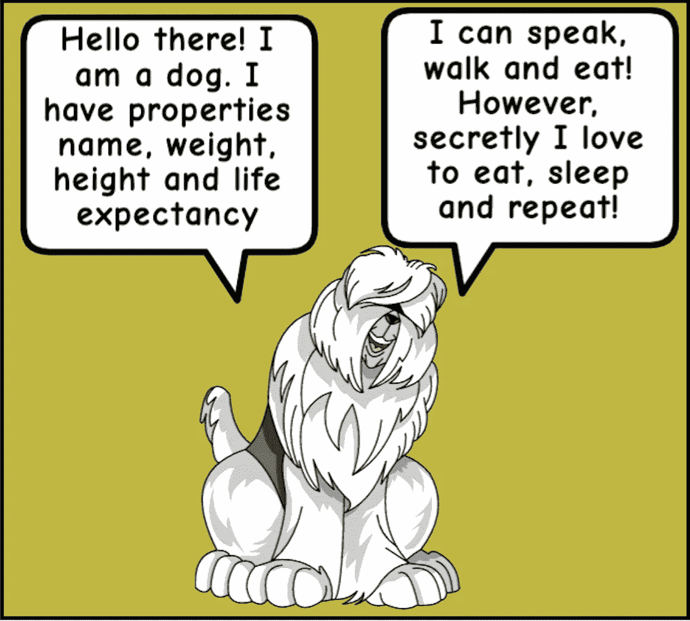
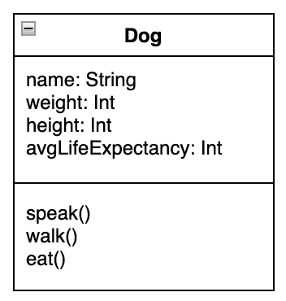
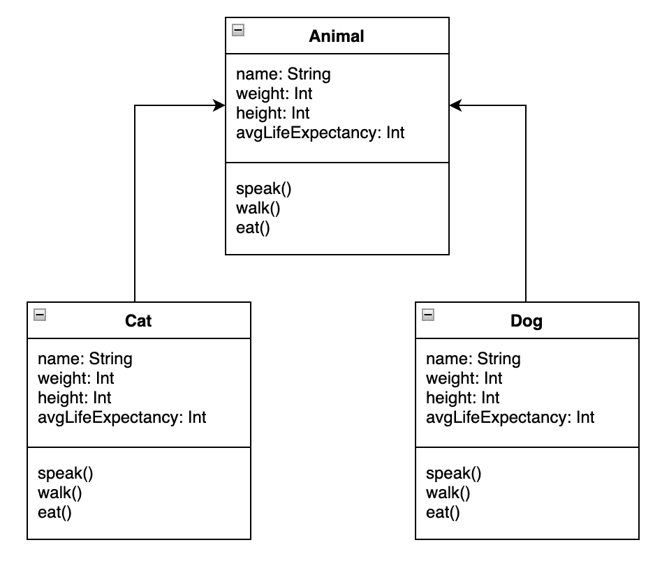
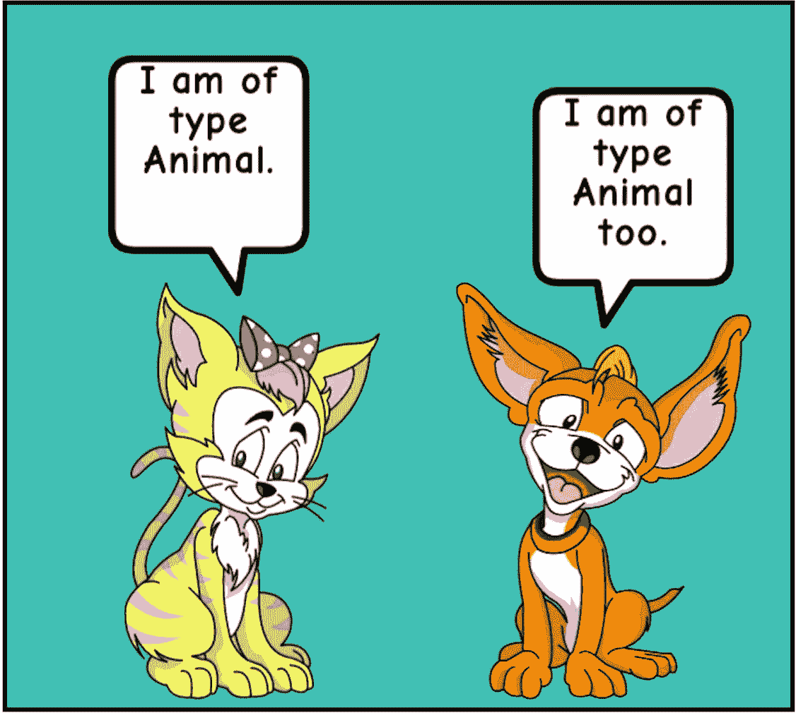
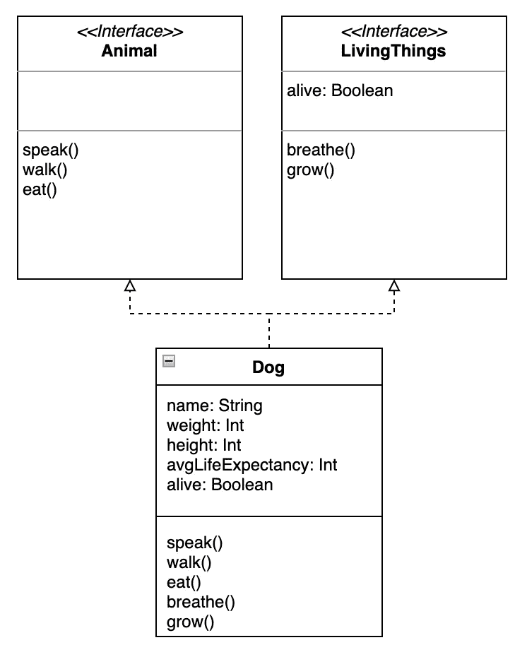

# Kotlin 中的面向对象编程

> 原文：<https://betterprogramming.pub/object-oriented-programming-in-kotlin-1e8b9a95adbe>

## 如代码示例和插图所解释的


照片由 [Ayla Verschueren](https://unsplash.com/@moob?utm_source=medium&utm_medium=referral) 在 [Unsplash](https://unsplash.com?utm_source=medium&utm_medium=referral) 上拍摄

[Kotlin](https://kotlinlang.org/) 是用于 Android 和后端开发的流行编程语言之一。像 [Meta](https://en.wikipedia.org/wiki/Meta_Platforms) 、 [Google](https://en.wikipedia.org/wiki/Google) 和 [Apple](https://en.wikipedia.org/wiki/Apple_Inc.) 这样的热门科技公司已经将 Kotlin 纳入了他们的科技堆栈。

在这个博客中，我们将讨论 Kotlin 的面向对象编程主题，如类、抽象类、接口等。

Kotlin 支持基本类型，如 int、long、string 等。

然而，类让用户定义他们自己的类型和属性。像其他编程语言一样，Kotlin 中的类由函数和属性(变量)组成。让我们创建一个类*狗。*



作者插图

下面的 UML 图描述了一个类`Dog`，它有属性`name`、`weight`、`height`和`avgLifeExpectancy`。

它还具有定义类`Dog`可以执行的动作的功能，如`speak`、行走和`eat`。



下面是类定义的代码片段:

程序的输出示例:

```
woof!
nom nom!
I love walking with my hooman. And occasional zoomies!
nora has following properties,
Weight is 10
Height is 22
Average life expectancy is 10
```

在上面的代码中，`myDog`是类`Dog`的一个对象。这个对象可以用来访问类中定义的函数和变量。有趣的是，变量是使用关键字`var`和`val`定义的。

用关键字`var`定义的变量是可变的，而用关键字`val`定义的变量是不可变的。

在上面的例子中，像其他编程语言一样，类属性可以像`classObject.property`一样被访问。

它有一个警告，负值可以赋给像`weight`和`height`这样的属性。为了避免这种情况，我们可以在给类属性赋值之前使用 setters 来净化输入。

Kotlin 定义了`init` 块，该块在类初始化时被执行。当我们对类的主要功能有任何先决条件时，这是很有用的。

下面是说明这一点的代码片段:

程序的输出示例是:

```
This is init block. Notice where it's getting executed!
woof!
nom nom!
I love walking with my hooman. And occasional zoomies!
Nora has following properties,
Weight is 10
Height is 22
Average life expectancy is 10
Weight = 10
Changing weight to 30
New weight is 30
Changing weight to -30
Weight after assigning negative value is 30
```

有趣的是，当我们试图这样做时， *weight* 属性没有用负值更新。这是因为在 setter 中检查了`weight`属性。

我希望我们能适应科特林的课程。让我们扩大范围来理解继承。为此，我们将设置`Animal`、`Cat`和`Dog`三个等级。`Animal`类是一个抽象类，将被类`Cat`和`Dog`继承。遵循这个 UML 图:



下面是它的代码片段:

示例代码输出:

```
woof!
nom nom!
I love walking with my hooman. And occasional zoomies!
meow!
nom nom!
Hooman, you better not leash me!
```

在上面的代码示例中，类`Animal`是抽象类。函数`speak`和`walk`被类`Dog`和类`Cat`覆盖。这是通过使用关键字`override`来完成的。



作者图片

抽象类使代码更具可扩展性，但它有一个限制，即子类只能有一个父类。接口可以用来支持多重继承，这意味着一个类可以实现多个接口。下面是一个示例界面 *:* 的 UML 图



正如 UML 图所描述的，类`Dog`实现了接口`Animal`和`LivingThings`。下面是它的代码片段:

样本输出:

```
woof!
nom nom!
I love walking with my hooman. And occasional zoomies!
I might be an Airbender! May be. Just May be.
Growing with the time.
```

从上面的代码中我们可以看到，变量`alive`和函数`speak`、`walk`和`breath`是在类`Dog`中使用关键字`override`实现的。

接口和抽象类听起来非常相似，但略有不同。

接口提供了类的蓝图，换句话说，它定义了一个关于它将交付的功能和实现它的类负责交付这些承诺的契约。

然而，抽象类是由子类扩展的不完整的实现。

我希望你和我一起学习 Kotlin 面向对象编程有一段美好的时光。感谢您的阅读。