# Python 与 Java 中的面向对象编程

> 原文：<https://betterprogramming.pub/object-oriented-programming-in-python-vs-java-e3b2c5fe38e0>

## Python 的神奇之处


布鲁斯·沃林顿在 [Unsplash](https://unsplash.com?utm_source=medium&utm_medium=referral) 上拍摄的照片

Python 的 OOP(面向对象编程)可能与您可能习惯的其他编程略有不同。从 Java 来看，这两者似乎几乎没有关联。

本文将从 Java 的角度来看 Python 的 OOP。随着 Java 成为最流行的面向对象编程语言之一，这将使它适用于所有这些 Python 例子。

让我们先看一个标准的 Java 类，代码如下:

从上面的代码中，您可以看到这是您的标准 Java 类。这是一个学生班。它有三个属性:`school`、`name` 和`age`。这些都是私有属性。我们应该知道，私有属性的目的是为了封装。这是只允许通过方法(通常是 getter 和 setter)修改属性的原则。

Python 来了。

我已经用 Python 创建了一个 Java 类的等效版本。您可能会注意到语法上的一些差异，但都是一样的。

# 构造器

## **Java**

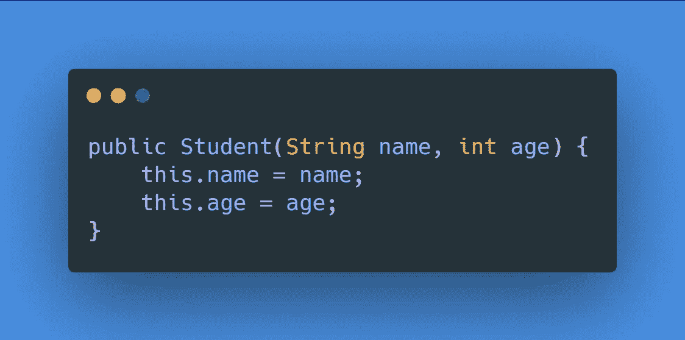

对于 Java，您可以使用类名来创建您的构造函数`public **Student**(String name, int age)`。`this`指该类的当前实例。因此使用`this.<variable name>`指的是在 Java 代码顶部声明的属性。

## **Python**

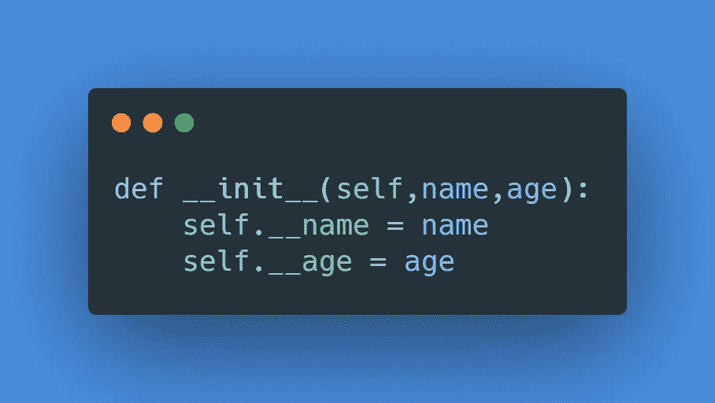

对于 Python，我们对构造函数使用`__init__`方法。您稍后会注意到一种趋势，方法的两端都有双下划线。

您会注意到位于构造函数开头的`self`参数。`self`告诉 Python 这是一个方法。它让方法的其余部分可以访问该类的实例变量和方法。当您调用该方法时，Python 自动将第一个参数作为`self`传递。

在构造函数内部，我们分配了两个实例变量。`__name`和`__age`。注意，我们必须使用`self`来指定它是一个实例变量，不像 Java，我们不必事先声明变量，因为 Python 是一种动态类型语言。

# 属性

## **Java**

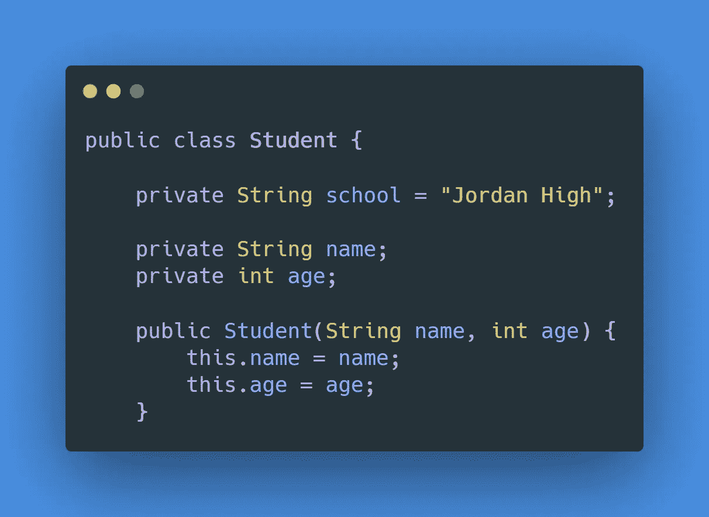

对于 Java，您将希望属性拥有的特定访问类型放在声明变量的开头。有三种类型的访问修饰符:`public`、`private`和`protected`。

*   公共—可以从任何地方访问。
*   private 只能在当前类中访问。
*   受保护-只能由当前类及其子类访问。

在上面的类中，所有的属性(`age`、`name`、`school`)都是私有的。

## **Python**

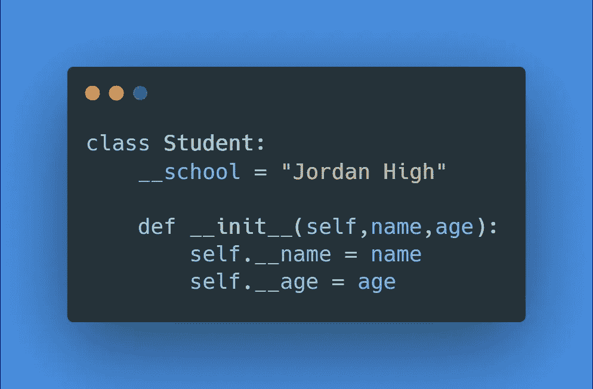

对于 Python，没有明确的方法来强制私有或受保护的访问修饰符。一切永远是公开的。然而，Python 有通用的约定，无论什么时候看到你都能立刻知道具体的访问修饰符。

Python 使用下划线`_`来表示不同类型的访问。在上面的代码中，由于开头有双下划线，所以访问当前为`private`。

*   公共-无下划线。
*   受保护-单下划线。
*   私有-双下划线。

让我们看看下面显示不同访问类型的代码。

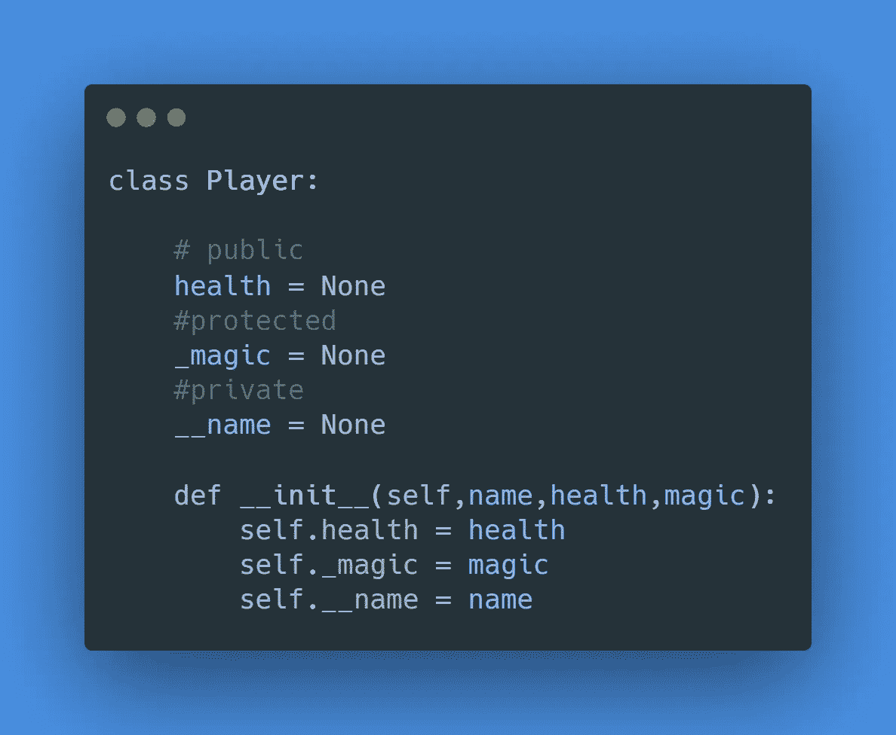

为了方便起见，我将这些变量初始化为`None`。这是完全可选的，因为正如我前面所说的，Python 是一种动态语言，变量可以在构造函数中定义。

让我们实例化我们的对象，看看这些访问约定。

我们看到`health`和`_magic`都很容易通过调用它们各自的变量来访问。`health`成为公共的通常可以被访问，但是`_magic`通常被保护的不应该被轻易访问，因为只有类或者它的子类可以访问它。单个下划线' _ '告诉试图访问的人，这应该只由该类及其子类访问。

对于私有访问(双下划线)，Python 的处理略有不同。

请注意，当我试图访问`__name`时，我得到了一个错误。这是因为 Python 试图隐藏这个变量以防止被访问。然而，正如我之前所说的，Python 中的所有变量都是公共的，可以被访问。

我们来看看为什么。

在这里，我们可以看到我们能够访问我们的价值。但是由于某种原因，变量名变了。这是 Python 展示这个值不应该在类之外被访问的方式(*是私有的，所有的*)。这是通过将名称改为`_<class name>__<variable name>`来实现的。

为变量分配访问权限的相同原则也适用于方法。

# 字符串表示

## **Java**


对于 Java，`toString`继承自`Object`类，默认情况下，每个 Java 类都继承自该类。默认情况下，`toString`方法返回对象的类名和散列码。这通常不是很有用，因此我们使用它的覆盖来产生更有价值的输出。

```
Student student = new Student("Jordan", 22);System.out.println(student);
```

输出:

```
Student [age=22, name=Jordan, school=Jordan High]
```

## **Python**

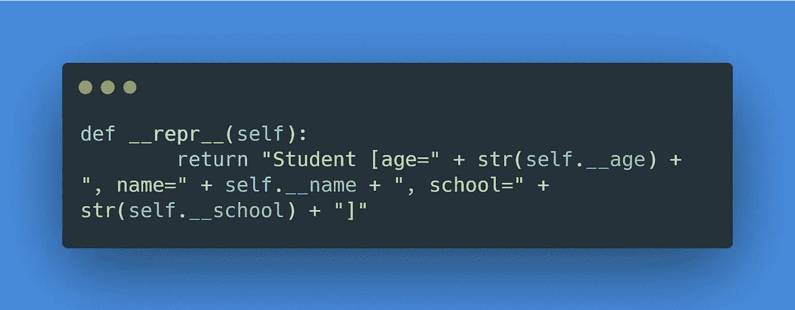

为了产生相同的效果，Python 使用了`__repr__`(另一种两端带有双下划线的方法)。`__repr__`也是所有 Python 对象继承的默认类。

# Getter 和 Setter 函数

虽然我们创建了 getters 和 setters，但是 Python 有自己的创建方式。

当前的实现:

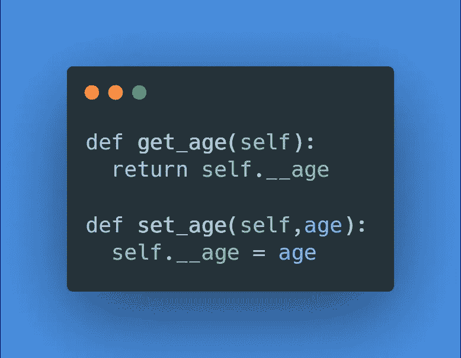

蟒道:

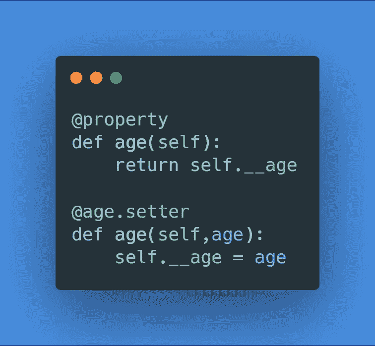

通过将`@property`装饰器添加到一个方法中，它将被指定为一个 getter。在指定之后，您将使用该方法的名称(成为 decorator)来分配相应的 setter。这是通过添加`<name>.setter`来完成的。

为了让我们的 setter 更有意义，让我们给它添加一个约束。每当年龄将被设置为低于 0 时，我们将引发一个异常。

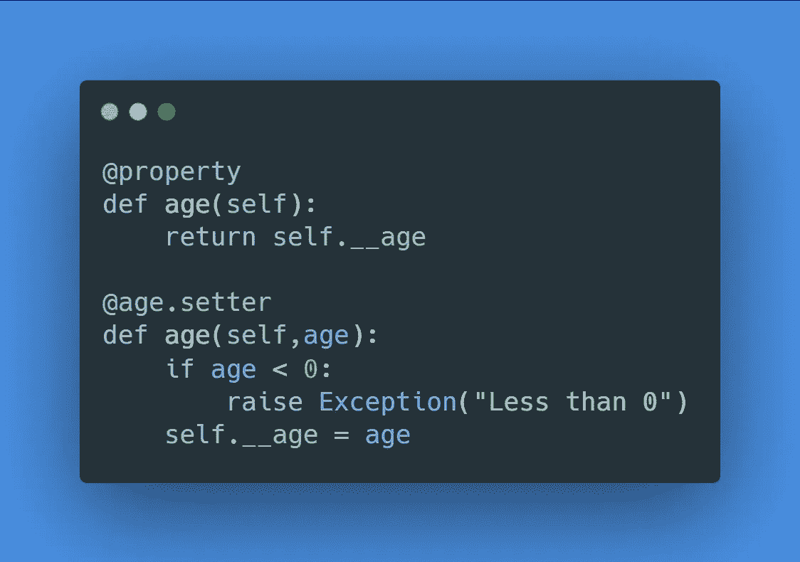

上面的代码现在实现了这一点。让我们试一试，以确保:

现在，您可以像访问普通属性一样访问它。通过调用`age`属性，我们只是通过访问私有变量`__age`来创建我们的对象。

接下来让我们试试我们的 setter:

我们可以通过直接给它赋值一个变量来设置我们的`age`，类似于一个普通的变量，我们也可以保留它的约束。

请注意，每当我们试图将-1 赋给`age`时，它所经历的属性都是一个异常。

记住，我们仍然可以通过使用`_<class name>__<variable name>`来访问我们的私有变量`__age`、`__name`和`__school`。

请记住，我们在 OOP ( *面向对象编程*)中使用 getters 和 setters 的原因是封装。我们将变量保持私有，以确保访问和修改它们的唯一方式是通过 getters 和 setters。有了这个，我们可以控制它们是如何被看到和修改的。

想象你有一门课。它有一个`cardnumber`属性，因为卡号是非常敏感的数据。每当我们调用 getter 时，它总是屏蔽掉卡号的所有部分，只保留最后四(4)位。我们只允许我们的 setter 允许 16 位数的卡号，因为这是卡号的正常长度。

现在，让我们将所有的 getters 转向 Pythonic 方式:

为了保持一致，让我们用对 age setter 所做的更改来修改 Java 类:

# 静态方法

是的，静态方法。至于静态变量，Python 不支持(据我所知)。

静态方法是无需实例化类就可以调用的方法。从类名本身直接调用它们。静态方法通常用于不需要实例化的方法，例如平方根函数。

这些方法由`<name of class>.<static method>`访问。

## **Java**

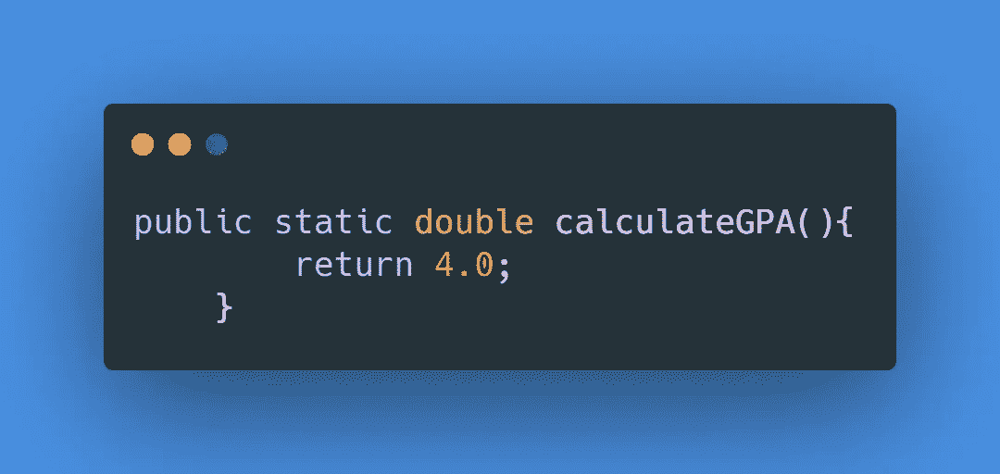

对于 Java，需要将`static`修饰符添加到方法定义中。

## **Python**

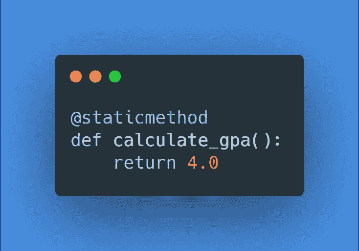

对于 Python，需要在方法中添加`staticmethod`修饰。不需要`self`参数。这是因为`self`将方法绑定到类的当前实例，并提供对实例变量和方法的访问。这些都是我们不需要的。

***提醒*** :在整篇文章中，我一直对 Java 方法和变量使用 camel case( `calculateGPA`)，对 Python 函数和变量使用 snake case( `calculate_gpa`)。这是两种语言的标准命名约定。

请点击下面的链接，通过它的文档了解更多关于 Python 的命名约定。

[关于命名约定的 Python 文档](https://www.python.org/dev/peps/pep-0008/#method-names-and-instance-variables)。

# **魔法方法**

Python 魔术方法是抽象常见 Python 操作的特殊内部方法。这些方法发生在幕后。

上面的代码片段显示了两(2)个数字之间的简单加法。这是一个简单的操作，在内部被一个神奇的方法修改。

上面的片段显示了内部真正发生的事情。每当执行添加时，Python 都使用`__add__`方法。请注意双下划线。这些被称为**魔法方法**。或者，它们也被称为 **Dunder** 方法(**D**double**Under**score)。

在整篇文章中，我们使用了不少这种神奇的方法。`__init__`和`__repr__`就是其中的一些方法。请注意，我们实际上从未具体调用过这些方法，但它们在内部使用过。

回到我们的加法示例，`num1`和`num2`都是整数，都继承自`int`类。

再来看`int`班。

函数显示了一个对象或类的所有方法和变量。你也可以在这里看到许多其他的魔法方法。所有这些神奇的方法都抽象了一些在后台发生的操作。乘法、除法和乘方的每一个运算都是用魔法方法完成的。

我们甚至可以将这些方法添加到我们的自定义类中。

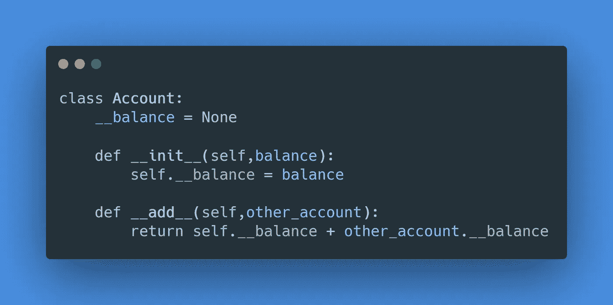

这是一个存储账户余额的`Account`类。我们添加了神奇的方法`__add__`，它将允许我们根据余额对`Account`对象执行加法。

在这里，我们能够用加号(+)操作符添加两(2)个 Account 对象。相当于`a.__add__(b)`。

我们不限于加法。有许多不同的魔术运营商，你可以在你的业余时间尝试。其中一些包括但不限于以下内容:

*   `__mul__`
*   `__sub__`
*   `__pow__`

每个操作都有一个神奇的方法。许多 Python 内置函数甚至使用神奇的方法。

在上面的代码片段中，我们使用了 Python 内置函数`len`。这个函数只是调用`.__len__()`方法的抽象。再一次，所有这些神奇的方法都在幕后工作。

上例中的 name 变量继承自 string ( `str`)类。看下面`str`类的内容。

您可以看到`__len__`方法以及许多其他您已经习惯的字符串方法。对变量名运行`dir`会产生类似的结果。

另外一个我个人比较喜欢的魔术方法是`__call__`法。这允许对象像函数一样工作。这意味着你可以像调用函数一样调用你的对象。

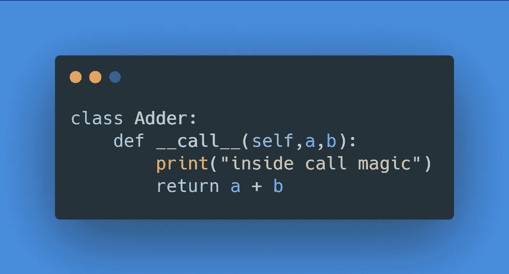

我们用上面的调用方法实现了一个类。

我们首先将对象实例化为`add`变量。在类定义中没有设置任何构造函数或参数，因此在构造函数中没有放置任何参数。实例化之后，我们将该对象用作一个函数。

调用`add(10,20)`对 10 和 20 进行加法运算，并存储在变量`value`中。这种行为就像一个函数。

让我们把它比作一个函数。

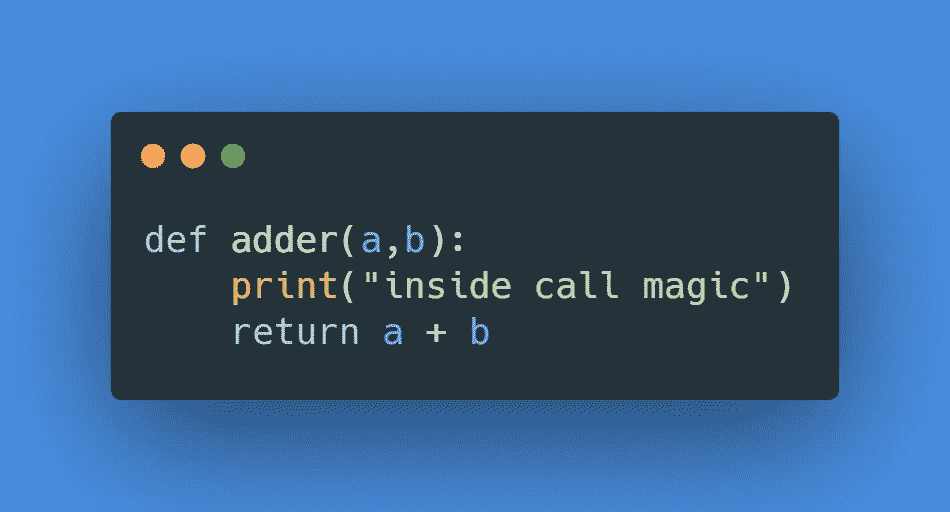

我们实现了上一个类例子的功能版本。

如你所见，它们的工作原理是一样的。

Python 的许多内置类都是这样的。我们经常混淆它们的功能，但它们不是。`int`和`str`都遵循这个原则。

如你所见`str`和`int`都是类。它们都具有将值转换为其类型的功能。

# 摘要

在这里，您可以看到 Python 类的所有细微差别，以及它与 Java 实现的细微差别。Python 魔术方法可以让你更好地理解 Python 是如何在幕后工作的。当谈到魔法方法及其真正的能力时，我所展示的只是皮毛。