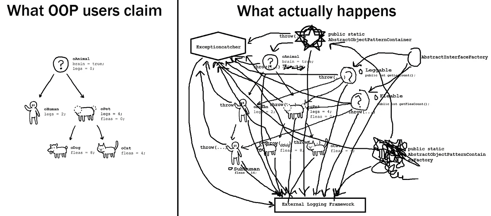

# 面向对象编程——万亿美元的灾难

> 原文：<https://betterprogramming.pub/object-oriented-programming-the-trillion-dollar-disaster-92a4b666c7c7>

## 为什么是时候离开 OOP 了

照片由 [Jungwoo Hong](https://unsplash.com/@oowgnuj?utm_source=unsplash&utm_medium=referral&utm_content=creditCopyText) 在 [Unsplash](https://unsplash.com/search/photos/improvement?utm_source=unsplash&utm_medium=referral&utm_content=creditCopyText) 上拍摄

OOP 被许多人认为是计算机科学皇冠上的宝石。代码组织的最终解决方案。我们所有问题的终结。编写程序的唯一正确方法。是编程之神赐予我们的…

直到…事实并非如此，人们开始屈服于抽象的重压，以及混杂共享的可变对象的复杂图形。宝贵的时间和脑力被花费在思考“抽象”和“T4”设计模式上，而不是解决现实世界的问题。

许多人批评面向对象编程，包括非常杰出的软件工程师。见鬼，连 OOP 的发明者本人都是现代 OOP 的知名批判者！

每个软件开发人员的最终目标应该是写出*可靠的*代码。如果代码有问题并且不可靠，其他的都不重要。编写可靠代码的最佳方式是什么？*简约*。简单是复杂的反义词。因此，作为软件开发人员，我们的首要责任应该是*降低代码复杂性。*

# 放弃

老实说，我不是面向对象的狂热爱好者。当然，这篇文章是要有失偏颇的。然而，我有充分的理由不喜欢 OOP。

我也理解对 OOP 的批评是一个非常敏感的话题——我可能会冒犯许多读者。然而，我在做我认为正确的事情。我的目标不是冒犯，而是提高对 OOP 引入的问题的认识。

我不是在批评艾伦·凯的 OOP——他是个天才。我希望 OOP 是按照他设计的方式实现的。我在批评面向对象的现代 Java/C#方法。

我认为 OOP 被许多人认为是代码组织的事实上的标准是不正确的，包括那些非常高级的技术职位。同样不可接受的是，许多主流语言除了面向对象编程之外，没有提供任何其他的代码组织方式。

见鬼，在从事 OOP 项目时，我自己也曾经挣扎过很多。我不知道为什么我会如此挣扎。也许我不够好？我不得不学习更多的设计模式(我想)！最终，我彻底精疲力竭了。

这篇文章总结了我十年来从面向对象到函数式编程的第一手经历。不幸的是，无论我如何努力，我再也找不到面向对象的用例。我个人看到过 OOP 项目失败，因为它们变得太复杂而难以维护。

# TLDR

> 面向对象的程序是作为正确程序的替代品提供的…
> 
> ——[**埃德格·w·迪克斯特拉**](https://en.wikipedia.org/wiki/Edsger_W._Dijkstra) **，计算机科学的先驱**

塞巴斯蒂安·赫尔曼在 [Unsplash](https://unsplash.com/?utm_source=unsplash&utm_medium=referral&utm_content=creditCopyText) 上的照片

创建面向对象编程的目的只有一个——管理过程代码库的复杂性。换句话说，它应该*改进代码组织。没有客观公开的证据表明 OOP 比简单的过程化编程更好。*

痛苦的事实是 OOP *在它唯一想要解决的任务上失败了。理论上看起来不错——我们对动物、狗、人类等有清晰的等级划分。然而，一旦应用程序的复杂性开始增加，它就变得平淡无奇了。它没有减少复杂性，而是鼓励混杂的*共享* [*可变状态*](https://suzdalnitski.com/terrible-coding-mistake-aa1fbebd83b4) ，并以其众多的*设计模式引入了额外的复杂性。OOP 使得常见的开发实践，如重构和测试，变得不必要的困难。**

*有些人可能不同意我的观点，但事实是现代的 Java/C# OOP 从来没有被恰当地设计过。它从未出自一个合适的研究机构(与 Haskell/FP 相反)。Lambda 演算为函数式编程提供了完整的理论基础。OOP 没有与之匹配的东西。*

*使用 OOP 在短期内似乎是无辜的，尤其是在绿地项目上。但是使用 OOP 的*长期*后果是什么？OOP 是一颗定时炸弹，当代码库变得足够大时，它会在未来某个时候爆炸。*

*项目被推迟，最后期限被错过，开发人员筋疲力尽，添加新功能变得几乎不可能。组织将代码库标记为*“遗留代码库”*，开发团队计划*重写*。*

*OOP 对于人类大脑来说并不自然，我们的思维过程是围绕着“做”事情——去散步，和朋友聊天，吃披萨。我们的大脑已经进化到可以做事，而不是将世界组织成抽象物体的复杂层级。*

*OOP 代码是不确定的——与函数式编程不同，我们不能保证在相同的输入下得到相同的输出。这使得对程序的推理非常困难。作为一个过于简单的例子，`2+2`或`calculator.Add(2, 2)` 的输出通常等于 4，但有时也可能等于 3、5，甚至可能是 1004。`Calculator`对象的依赖性可能会以微妙但深刻的方式改变计算的结果。哎呀…*

# *对弹性框架的需求*

*好的程序员写出好的代码，坏的程序员写出坏的代码，无论编程模式如何。然而，编程范例应该约束糟糕的程序员不要做太多的破坏。当然，这不是你，因为你已经在读这篇文章，并在努力学习。糟糕的程序员从来没有时间去学习，他们只会疯狂地按键盘上的随机按钮。不管你喜不喜欢，你都会和糟糕的程序员一起工作，他们中的一些人真的非常糟糕。不幸的是，OOP 没有足够的约束来防止糟糕的程序员造成太大的破坏。哎呀…*

*我不认为自己是一个糟糕的程序员，但是如果没有一个强大的框架作为我工作的基础，即使是我也无法写出好的代码。是的，有一些框架关注一些非常特殊的问题(例如 Angular 或 ASP。网)。*

*我不是在谈论软件框架。我说的是框架的更抽象的*字典定义*:“基本的*支持结构*”——框架关心更抽象的事情，比如代码组织和处理代码复杂性。尽管面向对象和函数式编程都是编程范例，但它们都是非常高级的框架。*

## *限制我们的选择*

> *C++是一种可怕的[面向对象]语言……将你的项目限制为 C 意味着人们不会用任何白痴的“对象模型”C & @ p .
> ——Linus Torvalds，Linux 的创造者*

*Linus Torvalds 因公开批评 C++和 OOP 而广为人知。他 100%正确的一点是**限制了**程序员可以做出的选择。事实上，程序员的选择越少，他们的代码就越有弹性。在上面的引用中，Linus Torvalds **强烈推荐**拥有一个好的框架作为我们代码的基础。*

**

*由[spec phops](https://unsplash.com/@specphotops?utm_source=unsplash&utm_medium=referral&utm_content=creditCopyText)在 [Unsplash](https://unsplash.com/?utm_source=unsplash&utm_medium=referral&utm_content=creditCopyText) 上拍摄的照片*

*许多人不喜欢道路上的速度限制，但这对于防止人们撞车死亡是必不可少的。类似地，一个好的编程框架应该提供防止我们做愚蠢事情的机制。*

*好的编程框架有助于我们编写可靠的代码。首先，它应该通过提供以下功能来帮助降低复杂性:*

1.  *模块化和可重用性*
2.  *适当的状态隔离*
3.  *高信噪比*

*不幸的是，OOP 为开发者提供了太多的工具和选择，却没有施加正确的限制。尽管 OOP 承诺解决模块化问题并提高可重用性，但它并没有兑现它的承诺(稍后将详细介绍)。OOP 代码鼓励使用共享的可变状态，这已经被一次又一次地证明是不安全的。OOP 通常需要大量样板代码(低信噪比)。*

## *函数式编程*

*到底什么是函数式编程？有些人认为它是一种高度复杂的编程范式，只适用于学术界，不适合“现实世界”。这与事实相去甚远！*

*是的，函数式编程有很强的数学基础，并且植根于λ演算。然而，它的大多数想法都是对主流编程语言的弱点的回应。*函数*是函数式编程的核心抽象。正确使用时，函数提供了 OOP 中从未有过的代码模块化和可重用性。它甚至以解决可空性问题的设计模式为特色，并提供了一种更好的错误处理方式。*

*函数式编程做得非常好的一件事是它帮助我们编写可靠的 T21 软件。对调试器的需求几乎完全消失了。是的，不需要单步调试代码和观察变量。我个人已经很久没有接触过调试器了。*

*最精彩的部分？如果你已经知道如何使用函数，那么你已经是一个函数式程序员了。你只需要学习如何充分利用这些功能！*

*我不是在鼓吹函数式编程，我真的不在乎你用什么样的编程范式来写你的代码。我只是试图传达函数式编程提供的解决 OOP/命令式编程固有问题的机制。*

# *我们完全弄错了*

> *很抱歉，我很久以前就为这个话题创造了“对象”这个术语，因为它让许多人把注意力集中在次要的想法上。最大的想法是信息传递。
> ——艾伦·凯，OOP 的发明者*

*Erlang 通常不被认为是面向对象的语言。但很可能 Erlang 是 [***中唯一的***](https://stackoverflow.com/questions/3431509/is-erlang-object-oriented/3433808#3433808) 主流面向对象语言。是的，当然 Smalltalk 是一种合适的 OOP 语言——然而，它并没有被广泛使用。Smalltalk 和 Erlang 都按照 OOP 发明者 Alan Kay 最初的意图来使用 OOP。*

## *信息发送*

*艾伦·凯在 20 世纪 60 年代创造了“面向对象编程”这个术语。他有生物学背景，试图让计算机程序像活细胞一样交流。*

**

*[Muukii](https://unsplash.com/@muukii?utm_source=unsplash&utm_medium=referral&utm_content=creditCopyText) 在 [Unsplash](https://unsplash.com/?utm_source=unsplash&utm_medium=referral&utm_content=creditCopyText) 上拍摄的照片*

*艾伦·凯的伟大想法是让独立的程序(细胞)通过互相发送消息来交流。独立程序的状态永远不会与外界共享(封装)。*

*就是这样。OOP 曾经是*从未打算*拥有继承、多态、“新”关键字以及无数的[设计模式](https://suzdalnitski.com/oop-design-patterns-bd2c4fb3014c)。*

## *最纯粹的面向对象程序设计*

*Erlang 是 OOP 最纯粹的形式。与更主流的语言不同，它专注于 OOP 的核心思想——消息传递。在 Erlang 中，对象通过在对象之间传递不可变的消息来进行通信。*

*与方法调用相比，有证据证明不可变消息是一种更好的方法吗？*

****地狱是的！*** 二郎语可能是世界上最*可靠的*语言。它为世界上大多数电信(以及互联网)基础设施提供动力。用 Erlang 编写的一些系统具有 99.9999999%的可靠性(你没看错——九个九)。*

# *代码复杂性*

> *有了 OOP 风格的编程语言，计算机软件变得更加冗长，可读性更差，描述性更差，并且更难修改和维护。*
> 
> *理查德·曼斯菲尔德*

*软件开发最重要的方面是降低代码复杂度。句号。如果代码库变得无法维护，那么任何花哨的特性都没有用。如果代码库变得过于复杂和不可维护，那么即使 100%的测试覆盖率也毫无价值。*

*是什么让代码库变得复杂？有许多事情需要考虑，但在我看来，最大的问题是:共享的[可变状态](https://suzdalnitski.com/terrible-coding-mistake-aa1fbebd83b4)、错误的抽象和低信噪比(通常由样板代码引起)。它们在 OOP 中都很普遍。*

# *国家的问题*

**

*照片由[米卡·鲍梅斯特](https://unsplash.com/@mbaumi?utm_source=unsplash&utm_medium=referral&utm_content=creditCopyText)在 [Unsplash](https://unsplash.com/?utm_source=unsplash&utm_medium=referral&utm_content=creditCopyText) 上拍摄*

*什么是状态？简单地说，状态是存储在内存中的任何临时数据。想想 OOP 中的变量或字段/属性。命令式编程(包括 OOP)根据程序状态和状态变化*来描述计算。声明式(函数式)编程描述的是*期望的结果*，而不是明确指定状态的变化。**

## **易变的状态——精神杂耍的行为**

> **我认为大型面向对象程序在构建可变对象的大型对象图时，会与不断增加的复杂性作斗争。你知道，试着理解并记住当你调用一个方法时会发生什么，副作用会是什么。**
> 
> **—[clo jure 的创造者 Rich Hickey](http://www.se-radio.net/2010/03/episode-158-rich-hickey-on-clojure/)**

****

**图片来源:[https://www.flickr.com/photos/48137825@N05/8707342427](https://www.flickr.com/photos/48137825@N05/8707342427)**

**状态本身是无害的。然而，可变状态是罪魁祸首。尤其是当它被分享的时候。到底什么是易变状态？任何可以改变的状态。考虑 OOP 中的变量或字段。**

*****请真实例子！*****

**你有一张白纸，你在上面写一张纸条，最后你得到的是不同状态(文本)的同一张纸。你有效地改变了那张纸的状态。**

**这在现实世界中完全没问题，因为*没有人*会关心那张纸。除非这张纸是蒙娜丽莎的真迹。**

****人类大脑的局限性****

**为什么可变状态是一个如此大的问题？人脑是已知宇宙中最强大的机器。然而，我们的大脑真的不擅长处理状态，因为我们在工作记忆中一次只能容纳大约 5 个项目。如果你只考虑*代码做了什么*，而不是它改变了代码库中的哪些变量，那么对一段代码进行推理会容易得多。**

**用[可变状态](https://suzdalnitski.com/terrible-coding-mistake-aa1fbebd83b4)编程是精神 juggling️.的行为我不知道你怎么样，但我可能会玩两个球。给我三个或更多的球，我一定会把它们都扔掉。那么，为什么我们每天在工作中都要努力进行这种精神杂耍呢？**

**不幸的是，可变状态的心理杂耍是 OOP 的核心。对象上存在方法的唯一目的是改变同一对象。**

## **分散状态**

****

**马库斯·斯皮斯克在 [Unsplash](https://unsplash.com/?utm_source=unsplash&utm_medium=referral&utm_content=creditCopyText) 上拍摄的照片**

**OOP 将状态分散在整个程序中，使得代码组织的问题变得更加糟糕。然后，分散的状态在各种对象之间被杂乱地共享。**

**请给出真实的例子！**

**让我们暂时忘记我们都是成年人，假装我们正在组装一辆很酷的乐高卡车。**

**然而，有一个问题——所有的卡车零件都随机与其他乐高玩具的零件混合在一起。它们被随机放在 50 个不同的盒子里。而且你不允许把你的卡车零件组合在一起——你必须记住各种卡车零件在哪里，并且只能一个一个地取出它们。**

**是的，你最终会组装那辆卡车，但是你需要多长时间？**

**这和编程有什么关系？**

**在函数式编程中，状态通常被*隔离。你总是知道某个状态来自哪里。状态永远不会分散在不同的功能中。在面向对象程序设计中，每个对象都有自己的状态，在构建程序时，你必须记住你当前正在处理的所有对象的*的状态。****

**为了使我们的生活更容易，最好只有很小一部分代码库处理状态。让你的应用程序的核心部分是无状态和纯粹的。这实际上是前端通量模式取得巨大成功的主要原因(又名 [Redux](https://en.wikipedia.org/wiki/Redux_(JavaScript_library)) )。**

## **混杂共享状态**

**似乎我们的生活因为有分散的可变状态还不够艰难，OOP 更进了一步！**

****请举例说明！****

**现实世界中的可变状态几乎从来都不是问题，因为事物都是私有的，从不共享。这就是“恰当的封装”在起作用。想象一个正在画下一幅蒙娜丽莎的画家。他独自创作这幅画，最后完成，然后以数百万的价格出售他的杰作。**

**现在，他厌倦了所有的钱，决定做一些不同的事情。他认为举办一个绘画聚会是个好主意。他邀请他的朋友精灵、甘道夫、警察和僵尸来帮助他。团队合作！他们都同时开始在同一块画布上绘画。当然，没什么好结果——这幅画完全是一场灾难！**

**共享可变状态在现实世界中毫无意义。然而这正是 OOP 程序中发生的事情——状态在不同的对象之间杂乱地共享，并且它们以它们认为合适的任何方式改变它。随着代码库的不断增长，这反过来使得对程序的推理变得越来越困难。**

## **并发问题**

**OOP 代码中可变状态的混杂共享使得并行化这样的代码几乎不可能。为了解决这个问题，已经发明了复杂的机制。已经发明了线程锁定、互斥和许多其他机制。当然，这种复杂的方法也有自己的缺点——死锁、缺乏可组合性、调试多线程代码非常困难且耗时。我甚至还没有谈到使用这种并发机制所增加的复杂性。**

## **并非所有的国家都是邪恶的**

**所有的国家都是邪恶的吗？不，艾伦凯州大概并不邪恶！如果状态突变是真正隔离的(不是“OOP 方式”隔离的)，它可能是好的。**

**拥有不可变的数据传输对象也完全没问题。这里的关键是“不可改变”。这样的对象然后被用来在函数之间传递数据。**

**然而，这样的对象也会使 OOP 方法和属性变得完全多余。如果一个对象不能被改变，那么它拥有方法和属性又有什么用呢？**

## **可变性是面向对象程序设计所固有的**

**有些人可能会认为可变状态是 OOP 中的一种设计选择，而不是一种义务。这种说法有问题。这不是一个设计选择，但几乎是唯一的选择。是的，在 Java/C#中可以将不可变的对象传递给方法，但这很少做到，因为大多数开发人员默认使用数据突变。即使开发人员试图在他们的 OOP 程序中恰当地使用不变性，这些语言也没有为不变性和有效地处理不可变数据(即持久数据结构)提供内置机制。**

**是的，我们可以确保对象只通过传递不可变的消息进行通信，而从不传递任何引用(很少这样做)。这样的程序会比主流的 OOP 更加可靠。然而，一旦接收到消息，对象仍然必须改变它们自己的状态。信息是一种副作用，它唯一的目的就是引起变化。如果消息不能改变其他对象的状态，它们将毫无用处。**

**利用 OOP 而不引起状态突变是不可能的。**

# **封装的特洛伊木马**

****

**杰米·麦克纳尔从[派克斯](https://www.pexels.com/photo/grayscale-photography-of-the-kelpies-906797/?utm_content=attributionCopyText&utm_medium=referral&utm_source=pexels)拍摄的照片**

**我们被告知封装是 OOP 最大的好处之一。它应该是*保护* 对象的内部状态不受外界访问。不过，这有一个小问题。它不起作用。**

**封装是 OOP 的*木马*。它通过使*看起来*安全来推销共享可变状态的概念。封装允许(甚至鼓励)不安全的代码潜入我们的代码库，使代码库从内部腐烂。**

## **全球国家问题**

**我们被告知*全球状态*是万恶之源。应该不惜一切代价避免。我们从未被告知的是，封装实际上是美化了的全球状态。**

**为了使代码更有效，对象不是通过它们的值传递，而是通过它们的*引用*传递。这就是“依赖注入”失败的地方。**

**让我解释一下。每当我们在 OOP 中创建一个对象时，我们将对其依赖关系的引用*传递给*构造函数*。那些依赖关系也有它们自己的内部状态。新创建的对象高兴地将对那些依赖关系的引用存储在它的内部状态中，然后高兴地以它喜欢的任何方式修改它们。它还将这些引用传递给它最终可能会用到的任何东西。***

*这创建了一个混杂共享对象的复杂图形，这些对象最终都会改变彼此的状态。这反过来导致了巨大的问题，因为几乎不可能看到是什么导致了程序状态的改变。试图调试这样的状态变化可能会浪费几天时间。如果您不必处理并发性，那么您是幸运的(稍后将详细介绍)。*

## *方法/属性*

*提供对特定字段访问的方法或属性并不比直接改变字段的值更好*。不管你是否使用一个奇特的属性或方法来改变一个对象的状态——*的结果都是一样的:改变的状态。***

# **现实世界建模的问题是**

****

**由[马库斯·斯皮斯克](https://unsplash.com/@markusspiske?utm_source=unsplash&utm_medium=referral&utm_content=creditCopyText)在 [Unsplash](https://unsplash.com/?utm_source=unsplash&utm_medium=referral&utm_content=creditCopyText) 上拍摄**

**有人说 OOP 试图对现实世界建模。这是完全不正确的——OOP 与现实世界毫无关系。试图将程序建模为对象可能是最大的 OOP 错误之一。**

## **现实世界没有等级之分**

**OOP 试图将一切建模为对象的层次结构。不幸的是，现实世界并非如此。现实世界中的对象使用消息相互交互，但它们大多是相互独立的。**

## **现实世界中的继承**

**OOP 继承不是模仿现实世界的。现实世界中的父对象不能在运行时改变子对象的行为。即使你从父母那里继承了你的 DNA，他们也不能随心所欲地改变你的 DNA。你不会从父母那里继承“行为”，你会发展自己的行为。你不能“无视”你父母的行为。**

## **现实世界没有方法**

**你正在写的那张纸有“写”的方法*吗*？不要！你拿一张空白纸，拿起一支笔，写一些文字。作为一个人，你也没有“写”的方法——你根据外部事件或内部想法决定写一些文字。**

# **名词的王国**

> **对象将函数和数据结构绑定在不可分割的单元中。我认为这是一个根本性的错误，因为函数和数据结构属于完全不同的世界。**
> 
> **——[二郎的创造者乔·阿姆斯特朗](http://harmful.cat-v.org/software/OO_programming/why_oo_sucks)**

****

**照片由 [Cederic X](https://unsplash.com/@cedericx?utm_source=unsplash&utm_medium=referral&utm_content=creditCopyText) 在 [Unsplash](https://unsplash.com/?utm_source=unsplash&utm_medium=referral&utm_content=creditCopyText) 上拍摄**

**对象(或名词)是 OOP 的核心。OOP 的一个基本限制是它把所有东西都变成名词。也不是所有的东西都应该被建模成名词。操作(功能)不应该被建模为对象。当我们所需要的只是一个将两个数相乘的函数时，为什么我们要被迫创建一个`Multiplier`类呢？简单来个`Multiply`函数，让数据是数据，让函数是函数！**

**在非面向对象的语言中，做一些琐碎的事情，比如将数据保存到文件中，是很简单的——非常类似于用简单的英语描述一个动作。**

****请真实例子！****

**当然，回到画家的例子，画家拥有一辆`PaintingFactory`。他已经雇了一个专用的`BrushManager`、`ColorManager`、一个`CanvasManager`和一个`MonaLisaProvider`。他的好朋友僵尸利用了一个`BrainConsumingStrategy` 。这些对象依次定义了以下方法:`CreatePainting`、`FindBrush`、`PickColor`、`CallMonaLisa`和`ConsumeBrainz`。**

**当然，这纯粹是愚蠢，在现实世界中不可能发生。为画一幅画这个简单的行为创造了多少不必要的复杂性？**

**当允许它们独立于对象存在时，没有必要发明奇怪的概念来保存你的功能。**

# **单元测试**

****

**在 [Unsplash](https://unsplash.com/search/photos/scientist?utm_source=unsplash&utm_medium=referral&utm_content=creditCopyText) 上由 [Ani Kolleshi](https://unsplash.com/@anikolleshi?utm_source=unsplash&utm_medium=referral&utm_content=creditCopyText) 拍摄的照片**

**自动化测试是开发过程的一个重要部分，对于防止回归(例如，将错误引入到现有代码中)有很大的帮助。*单元测试* 在自动化测试过程中起着巨大的作用。**

**有些人可能不同意，但是众所周知，OOP 代码很难进行单元测试。单元测试假设孤立地测试事物，为了使一个方法是单元可测试的:**

1.  **它的依赖项必须被提取到一个单独的类中。**
2.  **为新创建的类创建接口。**
3.  **声明字段来保存新创建的类的实例。**
4.  **利用模仿框架来模仿依赖性。**
5.  **利用依赖注入框架来注入依赖。**

**仅仅为了使一段代码可测试，还要增加多少复杂性？仅仅为了使一些代码可测试就浪费了多少时间？**

**PS 为了测试一个方法，我们还必须实例化整个类。这也将引入来自其所有父类的代码。**

**使用 OOP，为遗留代码编写测试更加困难——几乎不可能。围绕测试遗留 OOP 代码的问题，整个公司都被创建起来了( [TypeMock](https://www.typemock.com/) )。**

## **样板代码**

**就信噪比而言，样板代码可能是最大的罪犯。样板代码是让程序编译所需的“噪音”。样板代码需要花费时间来编写，并且由于添加了噪声，使得代码库可读性较差。**

**虽然“面向接口编程，而不是面向实现编程”是 OOP 中推荐的方法，但并不是所有东西都应该成为接口。为了可测试性的唯一目的，我们不得不求助于在整个代码库中使用接口。我们还可能不得不利用依赖注入，这进一步引入了不必要的复杂性。**

## **测试私有方法**

**有人说私有方法不应该被测试……我倾向于不同意，单元测试被称为“单元”是有原因的——孤立地测试小单元的代码。然而在 OOP 中测试私有方法几乎是不可能的。我们不应该仅仅为了可测试性而开发私有方法。**

**为了实现私有方法的可测试性，它们通常必须被提取到一个单独的对象中。这反过来引入了不必要的复杂性和样板代码。**

# **重构**

**重构是开发人员日常工作的重要组成部分。具有讽刺意味的是，众所周知，OOP 代码很难重构。重构应该使代码更简单，更易于维护。相反，重构的 OOP 代码变得更加复杂——为了使代码可测试，我们必须利用依赖注入，并为重构的类创建一个接口。即使这样，如果没有 Resharper 这样的专用工具，重构 OOP 代码真的很难。**

**在上面这个简单的例子中，仅仅为了提取一个方法，行数就增加了一倍多。当为了降低复杂性而重构代码时，为什么重构会制造更多的复杂性呢？**

**与 JavaScript 中类似的非 OOP 代码重构形成对比:**

**代码实际上保持不变——我们只是将`isValidInput`函数移动到不同的文件中，并添加一行代码来导入该函数。为了便于测试，我们还在函数签名中添加了`_isValidInput`。**

**这是一个简单的例子，但在实践中，随着代码库变得越来越大，复杂性会呈指数级增长。**

**这还不是全部。重构 OOP 代码是*极其危险的*。复杂的依赖图和状态分散在 OOP 代码库中，使得人脑不可能考虑所有的潜在问题。**

# **创可贴**

****

**图片来源:图片由 [Pixabay](https://www.pexels.com/@pixabay?utm_content=attributionCopyText&utm_medium=referral&utm_source=pexels) 从 [Pexels](https://www.pexels.com/photo/brown-and-white-bear-plush-toy-42230/?utm_content=attributionCopyText&utm_medium=referral&utm_source=pexels) 拍摄**

**当某些东西不起作用时，我们该怎么办？很简单，我们只有两个选择——扔掉它或者试着修理它。OOP 是不能轻易抛弃的东西，数百万开发人员接受了 OOP 培训。全世界数百万的组织正在使用 OOP。**

**你现在可能看到 OOP *并不真正工作*，它使我们的代码变得复杂和不可靠。你不是一个人！几十年来，人们一直在努力解决 OOP 代码中普遍存在的问题。他们提出了无数的 [*设计模式*](https://suzdalnitski.com/oop-design-patterns-bd2c4fb3014c) *。***

## **设计模式**

**OOP 提供了一套指导原则，理论上允许开发人员逐步构建越来越大的系统:坚实的原则、依赖注入、设计模式等等。**

**不幸的是，设计模式只不过是创可贴。它们的存在仅仅是为了解决 OOP 的缺点。无数的书籍甚至已经写了这个主题。如果不是他们给我们的代码库带来了巨大的复杂性，他们也不会如此糟糕。**

## **问题工厂**

**事实上，编写好的、可维护的面向对象代码是不可能的。**

**一方面，我们有一个不一致的 OOP 代码库，看起来不符合任何标准。另一方面，我们有一堆过度设计的代码，一堆错误的抽象一个接一个地建立起来。设计模式非常有助于构建这样的抽象之塔。**

**很快，添加新功能，甚至理解所有的复杂性，变得越来越难。代码库将充满类似于`SimpleBeanFactoryAwareAspectInstanceFactory`、`AbstractInterceptorDrivenBeanDefinitionDecorator`、`TransactionAwarePersistenceManagerFactoryProxy`或`RequestProcessorFactoryFactory`的东西。**

**宝贵的脑力不得不浪费在试图理解开发者自己创造的抽象之塔上。在很多情况下，没有结构比结构糟糕要好(如果你问我的话)。**

****

**图片来源:[https://www . Reddit . com/r/programmer humor/comments/418 x95/theory _ vs _ reality/](https://www.reddit.com/r/ProgrammerHumor/comments/418x95/theory_vs_reality/)**

**延伸阅读:[fizzbuzzenterprise edition](https://github.com/EnterpriseQualityCoding/FizzBuzzEnterpriseEdition)**

# **OOP 四大支柱的倒下**

**OOP 的四大支柱是:抽象、继承、封装和多态。**

**让我们一个一个地看看他们到底是什么。**

****

## **遗产**

> **我认为可重用性的缺乏来自于面向对象的语言，而不是函数式语言。因为面向对象语言的问题是它们有所有这些隐含的环境。你想要一个香蕉，但你得到的是一只大猩猩拿着香蕉和整个丛林。**
> 
> **——二郎的创造者乔·阿姆斯特朗**

**OOP 继承与现实世界无关。事实上，继承是实现代码可重用性的一种低劣方式。“四人帮”曾明确建议重组合轻继承。一些现代编程语言完全避免继承。**

**继承有几个问题:**

1.  **引入了很多你的类根本不需要的代码(香蕉和丛林问题)。**
2.  **将类的一部分定义在其他地方会使代码难以推理，尤其是在多层次继承的情况下。**
3.  **在大多数编程语言中，多重继承甚至是不可能的。这使得继承作为代码共享机制毫无用处。**

## **OOP 多态性**

**多态很棒，它允许我们在运行时改变程序行为。但是，它是计算机编程中一个非常基本的概念。我不太确定为什么 OOP 如此关注多态性。OOP 多态性完成了工作，但是它又一次导致了精神杂耍的行为。这使得代码库变得非常复杂，并且对被调用的具体方法的推理变得非常困难。**

**另一方面，函数式编程允许我们以更优雅的方式实现相同的多态性…只需传入一个定义所需运行时行为的函数。还有比这更简单的吗？不需要在多个文件(和接口)中定义一堆重载的抽象虚方法。**

## **包装**

**正如我们前面讨论的，封装是 OOP 的特洛伊木马。它实际上是一种美化了的全局可变状态，使不安全的代码看起来安全。不安全的编码实践是 OOP 程序员在日常工作中依赖的支柱…**

## **抽象**

**OOP 中的抽象试图通过对程序员隐藏不必要的细节来解决复杂性。*理论上*，它应该允许开发者思考代码库，而不必考虑隐藏的复杂性。**

**我甚至不知道该说什么…一个简单概念的花哨词。在过程/函数语言中，我们可以简单地将实现细节“隐藏”在相邻的文件中。没必要把这个基本行为称为“抽象”。**

***关于 OOP 支柱倒下的更多细节，请阅读* [*再见，面向对象编程*](https://medium.com/@cscalfani/goodbye-object-oriented-programming-a59cda4c0e53)**

# **OOP 为什么会主导行业？**

**答案很简单，爬虫类外星种族已经与美国国家安全局(和俄罗斯)合谋折磨美国程序员到死…**

****

**照片由 [Gaetano Cessati](https://unsplash.com/@gaetanocessati?utm_source=unsplash&utm_medium=referral&utm_content=creditCopyText) 在 [Unsplash](https://unsplash.com/?utm_source=unsplash&utm_medium=referral&utm_content=creditCopyText) 上拍摄**

**不过说真的， [Java](/modern-languages-suck-ad21cbc8a57c) 大概就是答案了。**

> **Java 是自 MS-DOS 以来最令人苦恼的事情。**
> 
> **-艾伦·凯，面向对象编程的发明者**

## **Java 很简单**

**当它在 1995 年第一次被引入时，与其他语言相比，Java 是一种非常简单的编程语言。当时写桌面应用的准入门槛很高。开发桌面应用程序需要用 C 编写低级的 win32 APIs，开发人员还必须关心手动内存管理。另一个选择是 Visual Basic，但是许多人可能不想把自己锁在微软的生态系统中。**

**当 Java 被引入时，对许多开发人员来说是显而易见的，因为它是免费的，可以跨所有平台使用。内置垃圾收集、友好命名的 API(与晦涩的 win32 APIs 相比)、适当的名称空间和熟悉的类似 C 的语法使 Java 变得更加平易近人。**

**GUI 编程也变得越来越流行，似乎各种 UI 组件都很好地映射到了类。ide 中的方法自动完成也让人们宣称 OOP APIs 更容易使用。**

**如果 Java 没有把 OOP 强加给开发者的话，也许它不会这么糟糕。Java 的其他一切看起来都很好。它的垃圾收集、可移植性、异常处理特性，这些都是其他主流编程语言所缺乏的，在 1995 年真的很棒，**

## **然后 C#出现了**

**最初，微软非常依赖 Java。当事情开始变糟时(在与 Sun Microsystems 就 Java 许可进行了长期的法律斗争后)，微软决定投资自己的 Java 版本。那就是 [C# 1.0](/modern-languages-suck-ad21cbc8a57c) 诞生的时候。C#作为一种语言，一直被认为是“更好的 Java”。然而，有一个巨大的问题——它是同样的 OOP 语言，有同样的缺陷，隐藏在稍微改进的语法之下。**

**微软一直在大力投资其。NET 生态系统，其中也包括良好的开发工具。多年来，Visual Studio 可能是最好的 ide 之一。这反过来又导致了广泛采用。NET 框架，尤其是在企业中。**

**最近，微软一直在大力投资浏览器生态系统，推出了 TypeScript。TypeScript 很棒，因为它可以编译纯 JavaScript，并添加了静态类型检查之类的功能。不太好的是，它没有对函数构造的适当支持——没有内置的不可变数据结构，没有函数组合，没有适当的模式匹配。TypeScript 是面向对象优先的，主要是浏览器的 C#。[安德斯·海尔斯伯格](https://en.wikipedia.org/wiki/Anders_Hejlsberg)甚至负责 C#和打字稿的设计。**

## **函数式语言**

**[另一方面，函数式语言](/modern-languages-suck-ad21cbc8a57c)从来没有得到像微软这样的大公司的支持。F#不算，因为投资很少。函数式语言的开发主要是由社区驱动的。这大概解释了 OOP 和 FP 语言流行程度的差异。**

# **是时候向前看了。**

> **我们现在知道 OOP 是一个失败的实验。是时候继续前进了。现在是我们作为一个社区承认这个想法辜负了我们的时候了，我们必须放弃它。**
> 
> **劳伦斯·克鲁勃纳**

****

**由 [SpaceX](https://unsplash.com/@spacex?utm_source=unsplash&utm_medium=referral&utm_content=creditCopyText) 在 [Unsplash](https://unsplash.com/?utm_source=unsplash&utm_medium=referral&utm_content=creditCopyText) 拍摄的照片**

**为什么我们坚持使用从根本上来说是次优的方法来组织程序？这是赤裸裸的无知吗？我对此表示怀疑，从事软件工程的人并不愚蠢。我们是否更担心通过使用诸如“设计模式”、“抽象”、“封装”、“多态”和“接口隔离”等花哨的 OOP 术语，在我们的同行面前“看起来很聪明”？大概不会。**

**我认为继续使用我们已经使用了几十年的东西真的很容易。大多数人从未真正尝试过函数式编程。那些有过(比如我自己)的人永远无法回去写 OOP 代码。**

**亨利·福特曾经说过一句名言——“如果我问人们想要什么，他们会说更快的马”。在软件领域，大多数人可能想要一种“更好的 OOP 语言”。人们可以很容易地描述他们遇到的一个问题(让代码库更有条理，更简单)，但不是最好的解决方案。**

# **有哪些替代方案？**

***扰流板警告:功能编程*。**

****

**[哈雷戴维森](https://unsplash.com/@harleydavidson?utm_source=unsplash&utm_medium=referral&utm_content=creditCopyText)在 [Unsplash](https://unsplash.com/?utm_source=unsplash&utm_medium=referral&utm_content=creditCopyText) 上拍摄的照片**

**如果像函子和单子这样的术语让你有点不安，那么你并不孤单！如果函数式编程的一些概念有了更直观的名称，它就不会那么可怕了。函子？想想`list.map`，这只是我们可以用一个函数来转换的东西。单子？可以链接的简单计算！**

**尝试函数式编程会让你成为更好的开发人员。您将最终有时间编写解决现实世界问题的真正代码，而不是将大部分时间花在思考抽象和设计模式上。**

**您可能没有意识到这一点，但是您已经是一名函数式程序员了。你在日常工作中使用函数吗？什么事？那么你已经是一个函数式程序员了！你只需要学会如何充分利用这些功能。**

**两种学习曲线非常平缓的函数式语言是 [Elixir](https://elixir-lang.org/) 和 [Elm](https://elm-lang.org/) 。它们让开发人员专注于最重要的事情——编写可靠的软件，同时消除传统函数式语言的所有复杂性。**

**其他选择是什么？你的组织已经在使用 C#了吗？试试 F#吧——它是一种令人惊叹的函数式语言，提供了与现有语言的良好互操作性。NET 代码。用 Java？那么使用 Scala 或 Clojure 都是非常好的选择。使用 JavaScript？有了正确的指导和林挺，JavaScript 可以成为一种很好的函数式语言。**

# **面向对象的捍卫者**

****

**照片由 [Pexels](https://www.pexels.com/photo/medieval-armor-2046779/?utm_content=attributionCopyText&utm_medium=referral&utm_source=pexels) 的 [Ott Maidre](https://www.pexels.com/@otutotu?utm_content=attributionCopyText&utm_medium=referral&utm_source=pexels) 拍摄**

**我期望 OOP 的捍卫者会有某种反应。他们会说这篇文章全是不准确的。有些人甚至开始骂人。他们甚至可能称我为没有实际 OOP 经验的“初级”开发人员。有些人可能会说我的假设是错误的，例子是无用的。随便啦。**

**他们有权发表自己的意见。然而，他们为 OOP 辩护的论据通常是相当无力的。具有讽刺意味的是，他们中的大多数人可能从未真正用真正的函数式语言编程过。如果你从来没有真正尝试过两个事物，怎么会有人把它们相提并论呢？这样的比较没有多大用处。**

**德米特里定律不是很有用——它没有解决非确定性的问题，共享的[可变状态](https://suzdalnitski.com/terrible-coding-mistake-aa1fbebd83b4)仍然是共享的可变状态，无论你如何访问或改变该状态。`a.total()`比`a.getB().getC().total()`好不了多少。它只是掩盖了问题。**

**领域驱动设计？这是一个有用的设计方法，它有助于降低复杂性。然而，它仍然没有解决共享可变状态的基本问题。**

## ****只是工具箱中的一个工具……****

**我经常听到人们说 OOP 只是工具箱中的另一个工具。是的，它是工具箱中的一个工具，就像马和汽车都是交通工具一样……毕竟，它们都有相同的用途，对吗？既然我们可以继续骑老马，为什么还要使用汽车呢？**

## **历史会重演**

**这其实让我想起了[某件事](https://99percentinvisible.org/article/cities-paved-dung-urban-design-great-horse-manure-crisis-1894/)。20 世纪初，汽车开始取代马匹。在 1900 年，纽约只有很少的汽车在路上行驶，人们一直用马作为交通工具。1917 年，马路上再也没有马了。一个巨大的产业以马匹运输为中心。围绕着像粪便清理这样的事情，整个行业都被创造出来了。**

**人们抵制变革。他们称汽车为另一种最终会消失的“时尚”。毕竟马在这里已经有几个世纪了！有些人甚至要求政府干预。**

**这有什么关系？软件业是以面向对象程序设计为中心的。数百万人接受了 OOP 培训，数百万公司在其代码中使用了 OOP。当然，他们会试图诋毁任何威胁到他们生计的东西！这只是常识。**

**我们清楚地看到历史在重演——20 世纪是马对汽车，21 世纪是面向对象对函数式编程。**

# **下一步是什么？**

*   **[面向对象编程是计算机科学最大的错误](https://suzdalnitski.com/oop-will-make-you-suffer-846d072b4dce)**
*   **[讨厌虫子？使用这个简单的技巧成为一名出色的程序员](https://suzdalnitski.com/terrible-coding-mistake-aa1fbebd83b4)**
*   **[函数式编程？别烦了，这是个愚蠢的玩具](/fp-toy-7f52ea0a947e)(讽刺)**
*   **[被认为有害的 OOP 设计模式](https://suzdalnitski.com/oop-design-patterns-bd2c4fb3014c)**
*   **[这些现代编程语言会让你吃苦头](/modern-languages-suck-ad21cbc8a57c)**