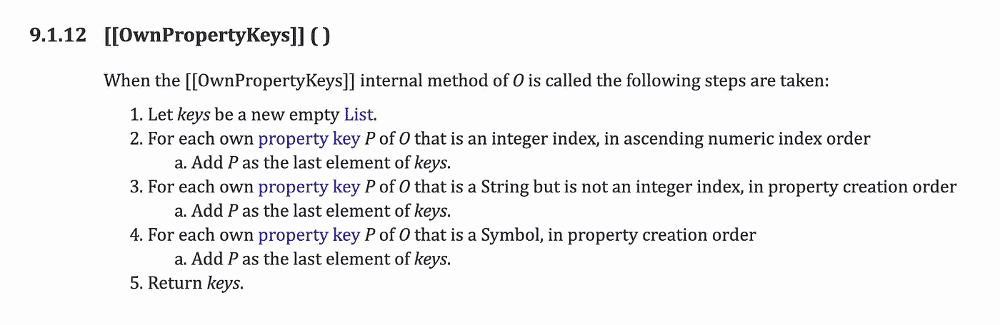

# JavaScript 中的对象顺序

> 原文：<https://betterprogramming.pub/objects-order-in-javascript-faed6b35de0e>

## 简短的教程

一周前，我在 JavaScript 中做了一个依赖于对象顺序的算法。如果你来自一种没有预期对象顺序的语言，你可能会说“什么？!"就现在。

如果您熟悉 JavaScript 及其特性，我仍然希望得到相同的回应，因为它有些细微差别，似乎并不广为人知。让我们来看看我使用的对象:

太好了，我们按照定义的顺序收到了我们的对象。然后我们可以使用`for (let coin in Coins) {/*do work*/}`遍历这个对象。如果我们通过返回时间顺序来分别定义每个键，这就可以了:

但是，有一个特定的情况是这个经验法则失效的:如果你试图使用符号或者整数值作为键(是的，甚至是解释的整数值)。

这是您可以从为 2015 版 Javascript 制定的 ES6 标准的任何实现中期待的回报。

这种行为上的变化是由于内部方法`ownPropertyKeys`(保证顺序)的实现发生了变化，这些方法`Reflect.ownKey`、`Object.getOwnPropertyNames`和`Object.keys`都使用但都有(不保证顺序)。枚举它们的方法是使用`Reflect.enumerate`或`for-in loop`。

[http://www . ECMA-international . org/ECMA-262/8.0/# sec-普通-对象-内部-方法-和-内部-插槽-枚举](http://www.ecma-international.org/ecma-262/8.0/#sec-ordinary-object-internal-methods-and-internal-slots-enumerate)

# 一些笔记…

*   虽然这是可预测和预期的行为，但用户可能正在使用旧版本的 JavaScript，虽然这是一种常见的实现，但这并不是标准的。
*   为了更加灵活和健壮地处理键值对及其顺序，请尝试 JavaScript 的更新的 [Map 对象](https://developer.mozilla.org/en-US/docs/Web/JavaScript/Reference/Global_Objects/Map)。

# 资源

*   [https://tc39.es/ecma262/#sec-ordinaryownpropertykeys](https://tc39.es/ecma262/#sec-ordinaryownpropertykeys)
*   [https://2 ality . com/2015/10/property-traversal-order-es6 . html # traversing-the-own-keys-of-an-object](https://2ality.com/2015/10/property-traversal-order-es6.html#traversing-the-own-keys-of-an-object)
*   [https://hacker noon . com/out-of-order-keys-in-es6-objects-D5 cede 7 DC 92 e](https://hackernoon.com/out-of-order-keys-in-es6-objects-d5cede7dc92e)
*   [https://developer . Mozilla . org/en-US/docs/Web/JavaScript/Reference/Global _ Objects/Map](https://developer.mozilla.org/en-US/docs/Web/JavaScript/Reference/Global_Objects/Map)