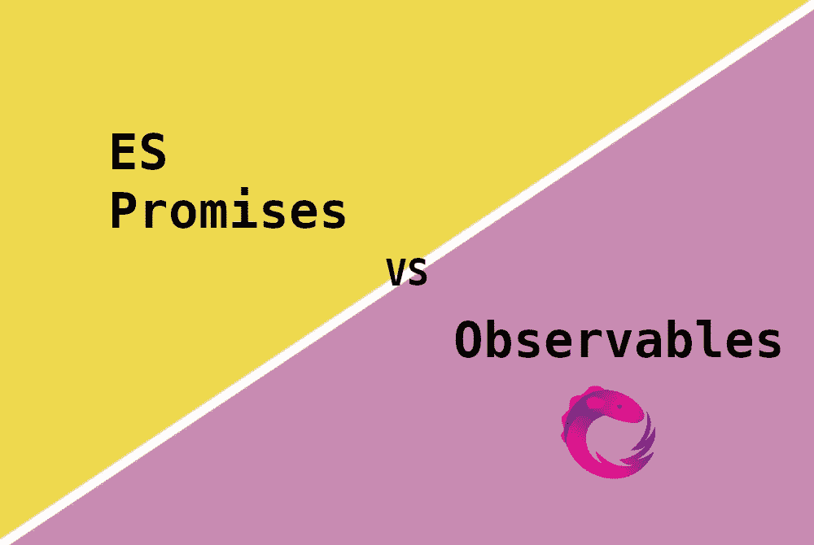
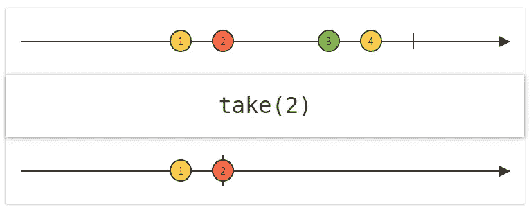

# 可观察与承诺——你应该使用哪一个？

> 原文：<https://betterprogramming.pub/observables-vs-promises-which-one-should-you-use-c19aef53c680>

## 比较可观察和承诺的关键特征



作者图片

JavaScript 是一种单线程、非阻塞、异步的并发语言。这意味着 JavaScript 的引擎不会等待语句结束。而是移动到下一条语句。

我们如何依赖异步函数的结果？在早期阶段，回调是唯一可用的方法。然而，他们使得代码难以阅读，这导致了众所周知的回调地狱。

观察和承诺就是为了精确解决这个问题而诞生的。它们的实现帮助我们以更简洁的方式处理异步代码。它们有不同的 API，动机也略有不同。

我们如何知道哪一个适合我们？在这里，我们将看到每个实现之间的差异。这将帮助我们为正确的工作选择正确的工具。

# 主要差异

如前所述，承诺和可观察有完全不同的方法来处理异步代码。在这里，我们将检查四个最显著的差异。

为了跟随示例，您可以使用 [rxjs web dev](https://rxjs.dev/) 浏览器 web 控制台。

## 1.一个值与多个值

最大的区别在于，承诺一旦兑现就不会改变其价值。它们只能发出(拒绝、解析)一个值。另一方面，可观测量可以产生多种结果。订阅者将收到结果，直到观察者完成或取消订阅。下面的代码向您展示了这些差异:

这使得 Observables 成为监听数据流的绝佳工具。甚至还有一种双向的可观察性:`Subjects`。一个完美的用例是`web sockets`。`RxJS`库在 web 套接字上附带了一个薄薄的包装。

```
import { webSocket } from "rxjs/webSocket";
```

## 2.可观察订阅是可取消的；承诺不是

一旦你开始承诺，你就不能取消它。传递给`Promise`构造器的`callback`将负责解决或拒绝承诺。订户是被动的；一旦被激发，它只能对结果做出反应。

可观察的不那么被动。一旦创建了订阅者，它可以随时退出观察器。这使得它们在我们对反应不再感兴趣的情况下很有用。例如，当用户离开页面时。

有许多方法可以取消/完成订户。让我们来看看最常见的三种:

*   `unsubscribe`:手动取消观察对象的订阅
*   `take`:取 X 个元素并取消订阅的运算符
*   `takeUntil`:一直取值直到被传递的可观测值发出任何值的算子。

让我们来看看上述每一项的示例:

可观测的算子是必不可少的。它们让我们以声明的方式组合复杂的异步操作。在上面的例子中，很明显`take`和`takeUntil`操作符是多么的重要和易读。

有时候，它们并不是微不足道的。为了更好地理解它们，有必要看看它们的大理石图形表示。您可以在此找到所有运营商的陈述[。](https://rxmarbles.com/)

让我们检查一下`take`操作员表示:



从 rxmarbles.com 俘获

我们有一个运算符流的`input`和`output`的表示。

## 3.渴望与懒惰的执行

观察和承诺的执行方式是不同的。承诺被热切地执行，而可观察的东西被懒散地执行。那是什么意思？

**Eagar:** 承诺回调将在构造函数级别立即执行。

**懒惰:**生产者功能只有在为可观察对象创建了订阅后才会触发。否则，它将处于闲置状态。

让我们来看两者的例子:

在上面的例子中，我们可以看到记录的语句`1\. Callback execution`和`1\. Execution of observable body`是如何以不同的顺序出现的。

## 4.运行时执行

ES 承诺，一旦解决，将在微任务队列中对回调进行排队。这意味着它们将在当前宏任务完成后执行。

让我们看一个例子:

以上行为你是改变不了的。

有了 Observables，您可以使用调度器来微调运行时执行。计划程序控制订阅开始的时间和通知传递的时间。

*   `null`:默认情况下，通知是同步递归传递的。
*   `queueScheduler`:当前事件帧中队列上的调度。
*   `asapScheduler`:微任务队列上的调度。与承诺使用的队列相同。
*   `asyncScheduler`:类似于使用`setInterval`调度任务。因此，它将被安排在宏任务队列中。
*   `animationFrameScheduler`:依赖`requestAnimationFrame` API。

让我们看一个`asapScheduler`的例子:

# 互用性

鉴于他们之间有相当多的差异，他们可以一起工作吗？我们必须在他们中选择一个吗？绝对不行。

你可以从承诺中创造出可观的结果，也可以将可观的结果转化为承诺。然而，在后一种情况下，由于承诺只接受一个值，您必须选择是将第一个值还是最后一个值转储到承诺中。`rxjs`库为那个特定的用例提供了一个`firstValueFrom`和`lastValueFrom`。

让我们看一些例子:

# 最后的想法

我们已经看到了两者之间的差异。何时使用其中一个是偏好和用例的问题。两者都擅长解决 JavaScript 中的异步范式。

要知道，可观是有代价的。浏览器本身不支持它们。最常用的库实现是 RxJS。其束尺寸可达`17.4kb`。因为它可以摇树，你肯定会看到比这少的东西。这不是一个很大的捆绑包，但是承诺本身得到了支持。这意味着你将为自己省下一笔可观的税费。

干杯。

不是中等会员？支持我[成为这里的一员](http://dioxmio.medium.com/membership)。

# 有关系的

[](/how-to-write-readable-code-bf1fa656673e) [## 如何写出可读的代码？

### 提高代码可读性的 6 个技巧

better 编程. pub](/how-to-write-readable-code-bf1fa656673e) [](/javascript-es2021-a-look-at-the-new-features-7d5770288648) [## JavaScript ES2021:看看新特性

### 新 ES12 规格概述

better 编程. pub](/javascript-es2021-a-look-at-the-new-features-7d5770288648)