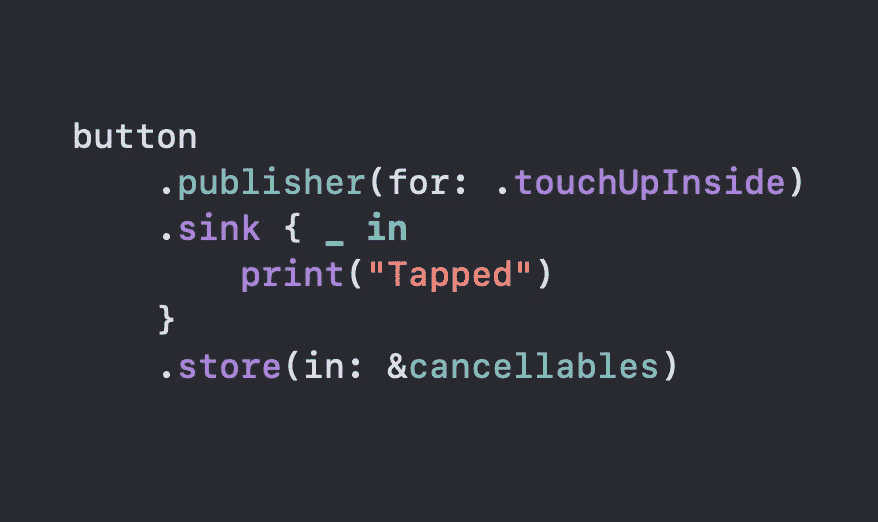

# 在 Swift 5 中使用 Combine 观察 UIButton 事件

> 原文：<https://betterprogramming.pub/observe-uibutton-events-using-combine-in-swift-5-63c1a4e0a0c1>

## 创建和利用您自己的可重用发布者

马克西姆·霍普曼在 [Unsplash](https://unsplash.com?utm_source=medium&utm_medium=referral) 上拍摄的照片

在本教程中，我们将学习如何在 Combine 中创建我们自己的`Publisher`,您可以很容易地在您的应用程序中重用它。

我们的计划是尽可能简单地观察`UIButton`抽头。这是我们在本文结尾时将拥有的功能:

Xcode Playground 的源代码可以在文章的底部找到。

# 我们开始吧

首先，我们导入`Combine`，并在`UIControl`上创建一个扩展:

为了实现我们的目标，我们需要实现三件事:

*   自定义订阅
*   自定义发布者结构
*   方便的`publisher()`方法

让我们从订阅开始:

如您所见，我们在扩展中创建了`InteractionSubscription`类。这个类符合`Subscription`协议。我们使用 where `S.Input == Void`来表示一旦点击一个按钮，我们将向订阅者发送`Void`值。

*   我们创建了三个属性:`subscriber`、`control`和`event`。稍后我们将使用`subscriber`属性来通知用户点击了一个按钮。属性将被赋予一个目标和一个处理程序。这是我们实际通知订户事件的地方。我们计划使用`event`属性来指定触发通知的实际事件。一旦我们使用了 publisher，这一点就更清楚了。
*   我们添加了一个初始化器，这样我们就可以在即将创建的发布器中实例化这个`InteractionSubscription`。
*   `request(_ demand:`和`cancel()`方法是`Subscription`协议所要求的。

现在，让我们给`control`属性附加一个处理程序，一旦执行了某个事件就通知`subscriber`:

*   当用户点击按钮时，会触发`handleEvent(_ sender:)`方法。
*   在该方法中，我们通知发布者发生了一个事件。正如我之前解释的，我们发出`Void`值。这就是为什么我们的订户只收到一个`()`值。

订阅完成后，现在我们需要实现一个定制的`Publisher`和一个获取它的方便方法。

*   我们添加符合`Publisher`协议的`InteractionPublisher`结构。
*   我们指定这个`Publisher`发出`Void`值并且从不失败。
*   类似于我们在`InteractionSubscription`中所做的，这里我们依赖于`UIControl`和`UIControl.Event`属性。我们将使用它们来初始化我们先前定义的订阅，并将其附加到订阅者。
*   `receive<S>(subscriber:)`方法是`Publisher`协议所需要的。我们现在要用内容填充它。

接下来，我们修改`receive<S>(subscriber:)`方法如下:

*   我们创建一个`InteractionSubscription`，并为它提供一个订阅者、`UIControl`和一个触发事件。
*   我们通知订阅者，它成功订阅了发布者，现在可以观察事件了。

太好了，我们现在有一个工作的出版商了。最后，让我们添加一个使用`InteractionPublisher`的便捷方法:

这里，我们简单地将一个`UIControl`和一个特定事件附加到一个`InteractionPublisher`上并返回它。

我们终于准备好使用我们创造的东西了。

# 用法示例

*   我们创建`cancellabels`属性来存储我们未来的订阅。
*   我们实现了一个简单的`UIButton`来显示“Tap！”标题。
*   在`observeForButtonTaps()`方法中，我们观察`.touchUpInside`事件。一旦用户点击按钮，我们将看到控制台上打印的“Tapped”。
*   最后我们调用`viewDidLoad()`里面的方法。

我们已经成功扩展了`UIControl`，现在有了一个可重复使用的`Publisher`，你可以复制并粘贴到你的应用程序中来观察`UIButton`事件。

# 资源

Xcode 游乐场的源代码可以在[要点](https://gist.github.com/zafarivaev/d5864857cd18bc21982a066396368c6a)中找到。

# 包扎

我建议你看一下这篇[文章](https://medium.com/flawless-app-stories/swift-combine-custom-publisher-6d1cc3dc248f)，其中 [Dmitry Lupich](https://medium.com/u/70542c958f08?source=post_page-----63c1a4e0a0c1--------------------------------) 创建了一个类似的`Publisher`来从远程服务器获取`Data`。

我希望这篇文章对你有用。感谢阅读！