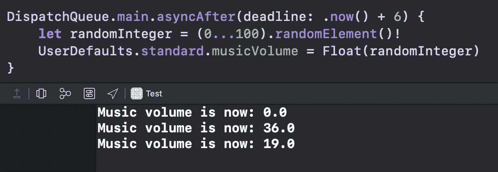

# 在 Swift 5 中使用 Combine 观察用户默认值

> 原文：<https://betterprogramming.pub/observe-userdefaults-using-combine-in-swift-5-4177ae62360d>

## 使用简单的扩展和内置的发布器

[威廉·胡克](https://unsplash.com/@williamtm?utm_source=medium&utm_medium=referral)在 [Unsplash](https://unsplash.com?utm_source=medium&utm_medium=referral) 上拍照。

在本教程中，我们将学习如何使用 Combine publisher 轻松观察`UserDefaults`。

事不宜迟，我们开始吧。

# 我们开始吧

考虑这样一种情况，你想在`UserDefaults`中保持一个游戏的音乐音量。你也想观察变化并做出相应的反应。所以我们的第一步是定义以下扩展:

正如我们所看到的，getter 返回`music_volume`键的`Float`值，setter 为该键设置新值。

接下来，让我们导入 Combine 并添加`subscriptions`属性来存储我们未来的订阅:

现在我们可以在`viewDidLoad()`方法中添加实际的订阅:

使用`UserDefaults`键路径，我们观察`musicVolume`属性。在`handleEvents(receiveOutput:)`操作符中，我们简单地打印一条包含最新卷的消息。

现在让我们测试订阅。将这两个预定的修改添加到`musicVolume`属性中:

我们生成一个随机的`Float`值，并延迟两次对其赋值。现在，如果我们构建并运行应用程序，我们将看到音乐音量打印三次:一次用于初始值，最后两次用于修改(经过一些延迟):

我们已经成功观测到了`UserDefaults`。

# 包扎

感谢阅读！我希望这能对你有所帮助。