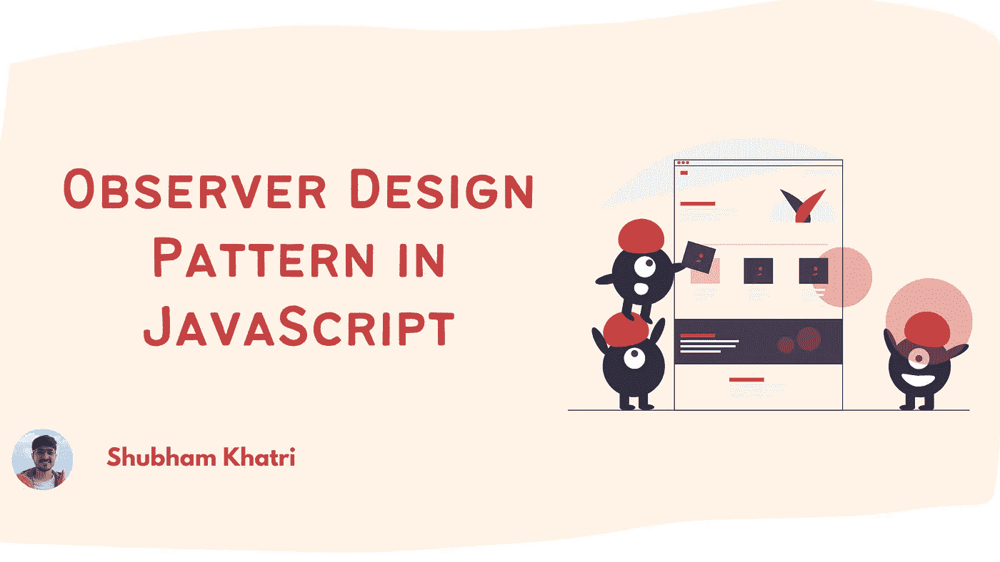
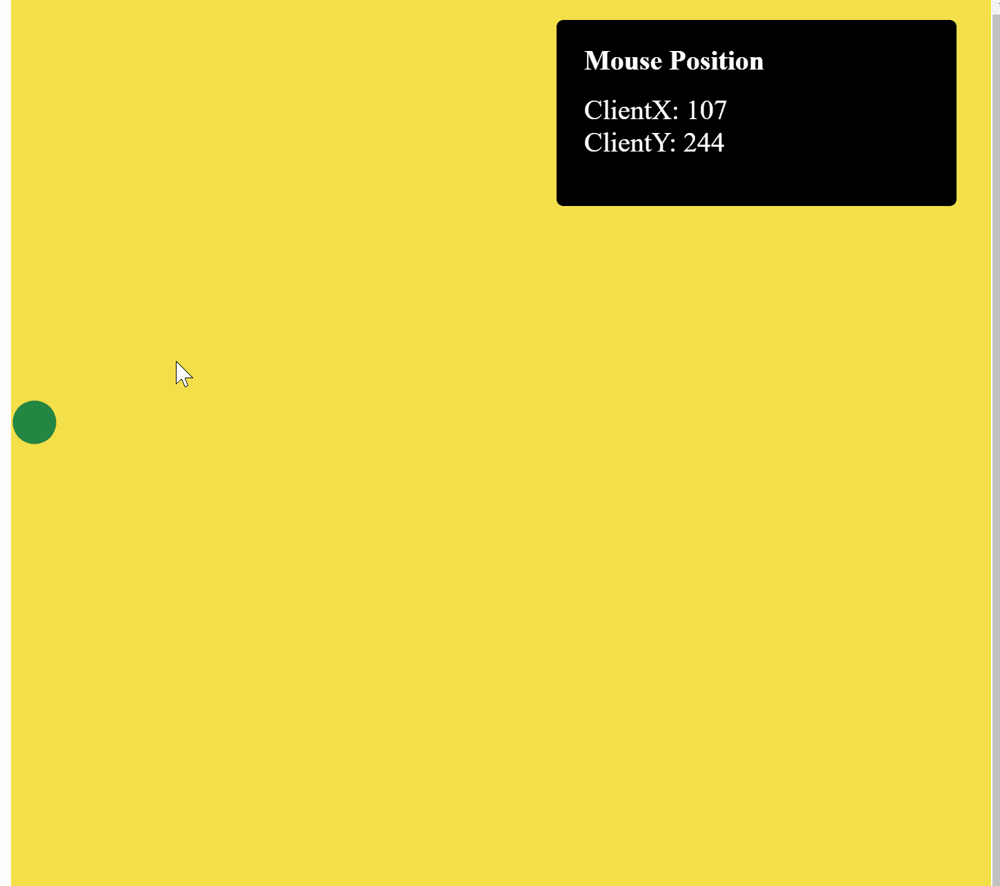

# JavaScript 中的观察者设计模式

> 原文：<https://betterprogramming.pub/observer-design-pattern-in-javascript-c839ee49add4>

## 关于 JavaScript 中的观察者设计模式，您需要知道的一切

在使用任何语言时，我们倾向于使用几种可重用的设计解决方案来解决常见的问题。在 JavaScript 中，我们也混合了定义良好的模式。

观察者模式就是其中之一。

在本文中，我们将更多地了解 JavaScript 中的观察者设计模式，并用普通 JavaScript 实现一个小例子。

# 什么是观察者设计模式？

观察者模式遵循订阅模型，订阅者(通常称为*或*观察者*)订阅由发布者(通常称为*或* *主体*)处理的事件或动作，并在事件或动作发生时得到通知。*

主体向所有观察者广播事件或动作的发生。

当观察者不再希望收到主题的变更通知时，它会取消订阅该主题，然后该主题会将其从订阅者列表中删除。

观察者设计模式与发布者/订阅者模式非常相似，只是发布者/订阅者模式也指定了它想要订阅的主题。例如，当检测键盘快捷键时，订阅者可以选择指定它希望在发布者/订阅者模型中收听的组合键。

# 观察者模式的实现

作为观察者模式的一个例子，我们将实现一个简单的交互，其中多个元素监听屏幕上的鼠标位置并执行不同的动作。

下面是我们互动的一个例子:

在我们实现这个交互之前，让我们分析一下这个例子中鼠标位置改变时发生了什么。

*   右上角的文本框中的鼠标位置会立即更新。
*   延迟 1 秒后，圆圈跟随鼠标的轨迹。

从上面的描述中，我们看到多个组件需要关于同一事物的信息，但是行为不同。

从上面的例子中，我们发现**主题**监听窗口上的鼠标事件，并将其转发给任何想要它的人。上例中的**圆圈和**文本框是**观察者**。

因此，让我们现在就着手实施它。

## 第一步。实现一个 MousePositionObservable 类

作为第一步，让我们继续实现`MousePositionObservable`类。这个类需要做以下事情:

*   保留一份观察员回电清单。
*   公开一个`subscribe`方法，观察者将调用该方法来订阅变更。这个函数的返回值必须是一个函数，当这个函数被调用时，它会将`callback`从`subscriptions`的集合中移走。
*   监听`mouseMove`事件并触发所有订阅回调。

代码如下所示:

## 第二步。创建 HTML 元素

我们现在为`circle`和`textMessageBox`创建 HTML 元素，并为它们添加样式。

## 第三步。添加观察员

最后一步是创建我们的`MousePositionObservable`类的一个实例，并向其中添加观察者。

为此，我们将调用类实例上的`subscribe`方法，并传递一个回调。

我们的代码如下所示:

我们向`MousePositionObservable`实例添加了两个订阅，每个订阅对应一个需要监听鼠标值的元素。

`circle`元素的订阅回调获取 DOM 元素的引用并更新其`tranform`属性。transform 属性将在可能的情况下使用硬件加速，因此如果元素上还使用了任何动画或过渡，在位置顶部和左侧使用`translate()`将会看到性能优势。

元素的订阅回调通过使用属性更新它的 HTML 内容。

> 注意:当您想要取消订阅侦听器时，您所要做的就是存储 subscribe 函数调用的返回值，并像调用函数一样调用它

这就是我们演示所需的全部内容。

您可以在下面的代码栏中查看工作示例:

# 观察者设计模式的优点和缺点

观察者设计模式为我们提供了以下好处:

*   当我们想要对一个事件执行多个动作时，这是非常有用的。
*   它提供了一种分离功能的方法，同时保持相关对象之间的一致性。

这种模式的缺点源于它的优点:

*   由于观察者设计模式导致松散耦合的代码，有时很难保证应用程序的其他部分正常工作。例如，添加到主题的订阅可能有行为不正确的代码，但是发布者没有办法知道这一点。

# 现实世界的应用

在从事 web 开发时，我们看到，`Redux`和`React Context`都是基于观察者设计模式的实现示例。

在 redux 中，我们有一个`subscribe`方法，允许我们将观察者添加到充当主体的 Redux 状态中。当对存储进行任何更改时，订阅 redux 存储的任何人都会得到通知。

类似地，使用 React Context，每当更新`ContextProvider`的值时，所有通过`useContext`钩子或者通过`Context.Consumer`订阅上下文的组件都用更新的上下文值重新呈现。

# 结论

在本文中，我们介绍了观察者设计模式以及如何在我们的应用程序中使用它。我们还实现了一个基于这种模式的演示，并了解了使用这种方法设计交互的一些优点和缺点。

**感谢您的阅读。**

如果您对本文有任何问题或建议，请随时发表评论。