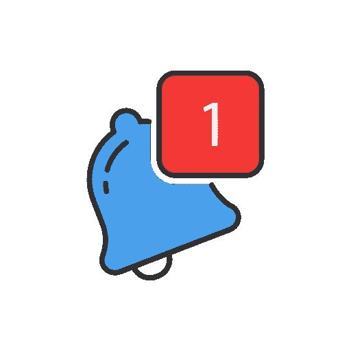

# 什么是观察者设计模式？

> 原文：<https://betterprogramming.pub/observer-pattern-in-php-2ba240f89fb2>

## 观察器使得组件之间的通信更加容易

观察器使组件之间的通信更容易，并减少了它们之间严格耦合的必要性(使它们彼此紧密相连)。客户端不需要知道谁会回复发送的通知，也不需要知道他们会如何回复。此外，每个通知可以触发不同独立成分的多个反应。

PHP 提供了一个现成的、方便的接口来支持在 SPL 内部实现 Observer。

例如，我们将创建一个简单的通信工具来向员工发送消息。客户是一个人力资源部门，可能会雇用新员工，解雇一些人，或者发送公司范围的信息。该模式由四个元素组成:

1.Subject ( `SplSubject`):定义一个接口，用于观察者
2 的交流和管理。Observer ( `SplObserver`):为订阅事件
3 的客户端定义一个接口。具体 Subject(`Communicator`):Subject
4 的具体实现。具体观察者(`Employee`):观察者的具体实现

让我们从流程的大脑开始:我们的沟通者。我们可以添加或删除将收到非常重要的消息通知的用户。

在这种情况下，使用`SplObjectStorage`很方便，因为它会自动防止添加重复项。如果您不想使用它，可以使用数组实现类似的行为。

应用程序的另一个重要部分是将接收消息的员工。

最后一部分是整个流程的委托人:人力资源部门。在开始时，可以添加所有的雇员，如果有任何变化，我们可以在以后添加或删除他们中的一些人。

现在，我们可以前所未有地愉快地雇佣和解雇新员工。

# 结论

观察者是一种非常有用和流行的模式。它真的可以让你的代码更好，更具扩展性。

在现实生活场景中，可能有许多不同类型的事件，这些事件有许多不同的独立订阅者。

完整的源代码和其他一些模式可以在这里找到:

 [## jkapuscik 2/设计-模式-php

### 这个项目是一组在现实世界中使用不同设计模式的简单例子。每个人都有一个…

github.com](https://github.com/jkapuscik2/design-patterns-php) 

如果您想了解一些更有用的设计模式，您可以在以下文章中找到它们:

*   [工厂方法](https://medium.com/@j.kapuscik2/getting-started-with-design-patterns-in-php-4d451ccdfb71)
*   [创作模式](https://medium.com/@j.kapuscik2/creational-design-patterns-in-php-db365d3245ce)
*   [迭代器](https://medium.com/@j.kapuscik2/iterator-pattern-in-php-b7624f6bdbcf)
*   [状态&策略](https://medium.com/@j.kapuscik2/state-strategy-design-patterns-by-example-f57ebd7b6211)
*   [模板法](https://medium.com/@j.kapuscik2/template-method-pattern-in-php-6116fd7e8ccc?source=friends_link&sk=ac4c483446bd5a5323c09a662bd54116)
*   [轻量级](https://medium.com/swlh/flyweight-design-pattern-in-php-edcda0486fb0?source=friends_link&sk=a0fa3083d5afd7e41af8a4f7a1df05f1)
*   [代理](https://medium.com/better-programming/proxy-design-pattern-and-how-to-use-it-acd0f11e5330)
*   [装潢师](https://medium.com/better-programming/decorator-c04fae63dfff)
*   [依赖注入](https://medium.com/better-programming/dependency-injection-8f09a93ec995)
*   [复合](https://medium.com/swlh/composite-908878748d0e)
*   [适配器](https://medium.com/swlh/building-cloud-storage-application-with-adapter-design-pattern-8b0105a1bda7)
*   [立面](https://medium.com/better-programming/what-is-facade-design-pattern-67cb09ce35d4)
*   [桥](https://medium.com/better-programming/what-is-bridge-design-pattern-89bfa581fbd3)
*   [责任链](https://medium.com/@j.kapuscik2/what-is-chain-of-responsibility-design-pattern-ff4d22abd124)
*   [访客](https://medium.com/@j.kapuscik2/what-is-visitor-design-pattern-8451fb75876)
*   [命令](https://medium.com/@j.kapuscik2/what-is-cqrs-command-design-pattern-5d400fd9f93a)
*   [空对象](https://medium.com/@j.kapuscik2/what-is-null-object-design-pattern-f3b4d3d28636)
*   [流畅的界面](https://medium.com/@j.kapuscik2/what-is-the-fluent-interface-design-pattern-2797645b2a2e)
*   [规格](https://medium.com/@j.kapuscik2/what-is-the-specification-design-pattern-4051dd9e71c3)