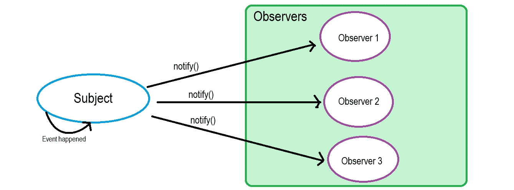
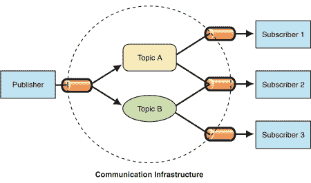
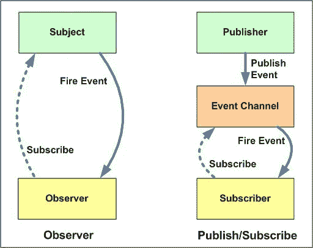

# 观察者 vs 发布-订阅模式

> 原文：<https://betterprogramming.pub/observer-vs-pub-sub-pattern-50d3b27f838c>

由[塞巴斯蒂安·赫尔曼](https://unsplash.com/@officestock?utm_source=unsplash&utm_medium=referral&utm_content=creditCopyText)在 [Unsplash](https://unsplash.com/search/photos/interview?utm_source=unsplash&utm_medium=referral&utm_content=creditCopyText) 上拍摄的照片

我曾经在一次采访中被问到:“观察者模式和发布订阅模式的区别是什么？”

我立刻意识到 pub-sub 的意思是*发布者-订阅者*，然后我生动地回忆起，从《 *头一个设计模式* *s* :

发布者+订阅者=观察者模式。

“我明白了，我明白了。你骗不了我。”，我想。

我带着胜利的微笑回答:“他们是一样的。”

但是面试官笑了笑，就像他得到了我，说:“不，他们不是。”我当时就想:“等等，什么？”

我错过了什么？怎么出问题了？

当我回到家，我决定通过谷歌搜索找到答案。这篇文章是关于我从那个问题中学到的。

在深入研究区别之前，让我们先讨论一下观察者和发布-订阅模式。

# 观察者设计模式

我想很多人都会同意我的观点，观察者设计模式是最简单的设计模式之一。我的意思是，不像其他的设计模式，当你第一次读到它的时候，你至少可以“感觉”到它的主要概念是什么。

> 观察者模式是一种软件设计模式，其中一个名为`subject`的对象维护一个名为`observers`的依赖对象列表，并自动通知它们任何状态变化，通常是通过调用它们的方法之一— [维基百科定义](https://en.wikipedia.org/wiki/Observer_pattern)

让我们通俗地解释一下。

假设你正在寻找一份软件工程师的工作，并且对一家名为 *Banana Inc.* 的公司感兴趣

所以，你联系了他们的招聘经理，给了他你的联系电话。他向你保证，如果有任何空缺，他们会让你知道。还有其他几个候选人也有兴趣。

他们会让所有的候选人都知道这个空缺，如果你回复了，他们可能会进行面试。

那么，这个场景与观察者设计模式有什么关系呢？

在这里，香蕉公司是`Subject` **，**维护所有`Observers` (像你一样的候选人)和将`notify` 的某个`event` 【空缺】的观察员。

观察者设计模式

因此，如果您需要在软件或应用程序中实现这个场景，您可以遵循这个过程，并说您已经实现了观察者设计模式。

我不打算通过展示任何代码示例来夸大我的文章，因为互联网上有很多可用的示例。

# 发布-订阅(发布者-订阅者)设计模式

是的，观察者模式中的`Subject`就像是一个`Publisher`**和`Observer` 完全可以关联到一个`Subscriber` **。****

**是的，`Subject`通知`Observers`，就像`Publisher`通常通知它的订户一样。这就是为什么大多数设计模式书籍或文章使用发布者-订阅者概念来解释观察者设计模式。**

**但是还有另一种流行的模式叫做*发布者-订阅者*，它在概念上与观察者模式非常相似。**

**(真正的)发布者-订阅者模式和观察者模式的主要区别在于:**

**在发布者-订阅者模式中，被称为*发布者*的消息发送者不将消息直接发送给被称为*订阅者* **的特定接收者。****

**这意味着发布者和订阅者不知道彼此的存在。**

**还有第三个组件，叫做*代理*、*消息代理*或*事件总线*，发布者和订阅者都知道。它过滤所有传入的消息并相应地分发它们。**

**换句话说，发布-订阅是一种用于在不同系统组件之间传递消息的模式，这些组件不知道彼此的身份。**

**代理如何过滤所有消息？实际上，邮件过滤有几个过程。最流行的方法是基于主题和基于内容的方法。**

**我们不会在这条路上走得更远，但是[维基百科解释得很好](https://en.wikipedia.org/wiki/Publish%E2%80%93subscribe_pattern#Message_filtering)。**

****

**发布订阅模式(图片来源: [MSDN 博客](https://msdn.microsoft.com/en-us/library/ff649664.aspx))**

**因此，简而言之，这两种模式之间的主要区别如下所示:**

****

**图片来源:[开发者俱乐部](http://developers-club.com/posts/270339/)**

**有道理？**

**让我们总结一下不同之处:**

*   **在观察者模式中，观察者知道`Subject`。`Subject`维护着`Observers`的记录。然而，在发布者-订阅者中，发布者和订阅者不需要相互了解。它们只是在消息队列或代理的帮助下进行通信。**
*   **在发布者-订阅者模式中，组件是松散耦合的，与观察者模式相反。**
*   **观察者模式大部分是同步实现的*，即`Subject`在事件发生时调用其所有观察者的适当方法。发布者-订阅者模式主要是异步实现的*(使用消息队列)。****
*   ****观察者模式需要在单应用程序地址空间中实现。另一方面，发布者-订阅者模式更像是一种跨应用程序的模式。****

****尽管这些模式之间存在差异，但有些人可能会说发布者-订阅者模式是观察者模式的变体，因为它们在概念上有相似之处。****

****他们不一定是错的；他们很相似，不是吗？****

****好了，暂时就这些了。希望你能明白。感谢阅读这篇文章。请让我知道是否有任何错误或是否需要任何修改。提前感谢。****