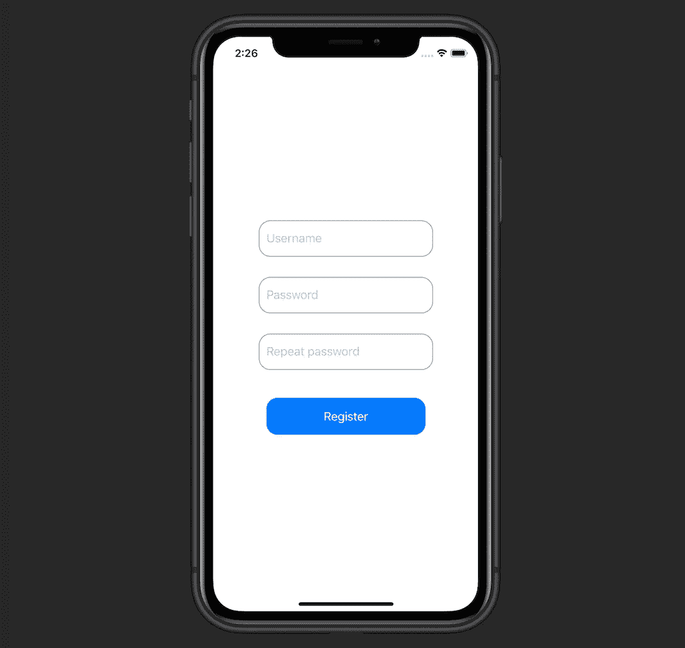
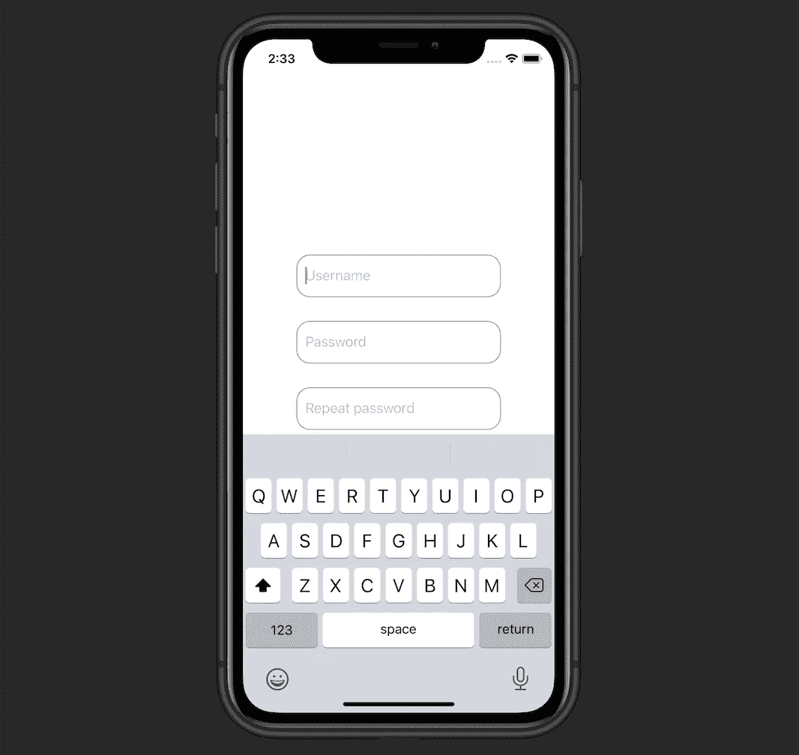
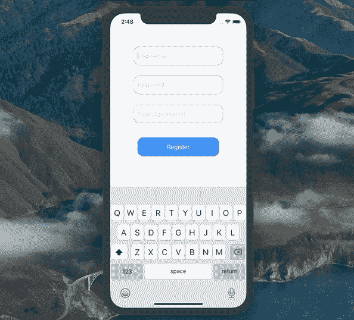

# 观察 SwiftUI 中的键盘变化

> 原文：<https://betterprogramming.pub/observing-keyboard-changes-in-swiftui-96dd06a2b952>

## 使用 Combine 的 ObservableObject 根据键盘的状态调整 UI

照片由[雅利安·迪曼](https://unsplash.com/@mylifeasaryan_?utm_source=medium&utm_medium=referral)在 [Unsplash](https://unsplash.com?utm_source=medium&utm_medium=referral) 上拍摄

在本教程中，我们将学习如何在 SwiftUI 中观察键盘，以及如何相应地调整我们的 UI。

# 我们开始吧

考虑一个简单的用户注册屏幕:

代码是这样的:

这里我们有一个主`VStack`，它包含一个`Button`和另一个由三个`TextField`组成的`VStack`

当我们点击一个`TextField`时，我们看到键盘与我们的用户界面部分重叠(在 iPhone X 上):

我们需要观察键盘，并在它出现时调整我们的 UI。让我们创建一个负责键盘观察的组件。

# 键盘管理器

从一个符合`[ObservableObject](https://medium.com/cleansoftware/what-is-the-observableobject-protocol-in-swifts-combine-b6ad3102ccd4)`协议的`KeyboardManager`类开始，它包含两个`Published`属性和一个`Cancellable`:

现在让我们将实际的观察逻辑添加到初始化器中:

如我们所见，我们获得了`keyboardWillShow`通知的发布者。然后我们获得键盘的框架，并设置我们的`keyboardHeight`和`isVisible`属性。

太好了，让我们把`KeyboardManager`放到`RegisterView`里面工作吧。

# 注册视图

我们更新`RegisterView.swift`文件如下:

首先，我们将一个`KeyboardManager`初始化为一个`ObservedObject`属性。然后，我们给主`VStack`添加了`.padding`和`.edgesIgnoringSafeArea`修改器。

需要修改符`.edgesIgnoringSafeArea`是因为我们需要考虑有安全区域的设备，比如 iPhone X。

结果正是我们想要实现的:

感谢阅读！