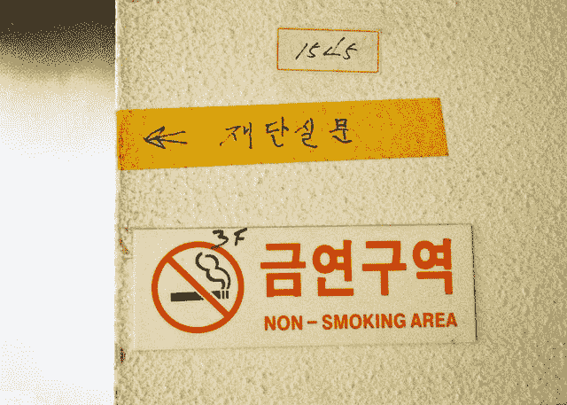

# 使用 EasyOCR 用几行代码创建自己的 OCR

> 原文：<https://betterprogramming.pub/ocr-in-few-lines-of-code-using-easyocr-24a960b9eca1>

## 轻松实现您自己的 OCR


马库斯·温克勒在 [Unsplash](https://unsplash.com/s/photos/korean-sign?utm_source=unsplash&utm_medium=referral&utm_content=creditCopyText) 上的照片

# 介绍

光学字符识别(OCR)是一种从图像中提取字符的计算机视觉任务。OCR 广泛用于许多应用中，例如翻译、发票提取、车牌号码识别等等。

实现 OCR 并不简单。管道本身包含许多预处理步骤，这还不包括建模本身。但是谢天谢地，EasyOCR 对我们来说是可用的！

EasyOCR 是一个基于 Python 的库，使用现成的 OCR 模型。有了这个库，您不必担心预处理和建模步骤。通过几行代码，您可以更准确地使用 OCR。更多细节，你可以通过链接[在这里](https://github.com/JaidedAI/EasyOCR)了解 EasyOCR。

在本文中，我将向您展示如何使用 EasyOCR 库实现 OCR 模型。事不宜迟，我们开始吧！

# 履行

## 安装 OCR

我们现在不能使用 EasyOCR 库。因此，我们需要先安装库。为了安装它，我们可以使用 pip 命令。下面是实现这一点的代码:

## 运行 OCR

安装完库之后，现在就可以实现 OCR 过程了。正如本文的标题所示，您只需要几行代码就可以实现 OCR。有了 EasyOCR，一切皆有可能！

例如，我们将从下图中提取文本:


亚历杭德罗·卢恩戈在 [Unsplash](https://unsplash.com/s/photos/traffic-sign?utm_source=unsplash&utm_medium=referral&utm_content=creditCopyText) 上的照片

从那张图片中，我们如何提取文本？使用 EasyOCR，代码如下所示:

使用不到五行的代码，您可以更容易地实现自己的 OCR！那么结果如何呢？请运行下面的代码:

从结果中，我们可以看到，该库可以更容易地提取图片中的几乎每个文本。令人难以置信的是 OCR 的准确性。太不可思议了！

> 如果您在运行 EasyOCR 时遇到任何问题，尤其是在 Google Colab 上运行时，您可以将 OpenCV 库重新安装到所需的版本。您可以运行以下命令来修复该问题:

## 多语言支持

除了拉丁字符，EasyOCR 库还支持其他语言，如朝鲜语、日语、阿拉伯语、印地语等。让我们从下面这张图片中取一个例子:



[BBiDDac](https://unsplash.com/@bbiddac?utm_source=unsplash&utm_medium=referral&utm_content=creditCopyText) 在 [Unsplash](https://unsplash.com/s/photos/korean-sign?utm_source=unsplash&utm_medium=referral&utm_content=creditCopyText) 上拍摄的照片

从该图片中，我们将同时提取韩文字符和拉丁文字符。

使用 EasyOCR，添加其他语言非常简单。你只需要在 easyocr 中添加另一个语言代码。读者对象。下面是实现这一点的代码:

从这段代码中，我们可以同时得到朝鲜语和英语的输出。令人惊讶的是，它能准确地检测出两种语言的文本。

## 简化输出

如果想简化结果，可以在 readtext 函数中添加一个参数，detail=0。

该参数将从输出中丢弃边界框和置信度得分。

下面是实现这一点的代码:

如果您想要统一彼此接近的文本，您可以编写下面这些代码行:

# 结论

干得好！您已经学习了如何使用 EasyOCR 实现 OCR。我希望这篇文章能帮助您用几行代码实现 OCR。

谢谢你看我的文章！

# 参考

[1]【https://github.com/JaidedAI/EasyOCR
【2】[https://x error . com/import error-cannot-import-name-_ registermattype-from-cv2-cv2/](https://exerror.com/importerror-cannot-import-name-_registermattype-from-cv2-cv2/)

```
Want to Connect?You can connect with me through [LinkedIn](https://www.linkedin.com/in/alghaniirfan/).
```