# 利用 Elo 分数和 sklearn 进行 ODI 匹配预测

> 原文：<https://betterprogramming.pub/odi-match-prediction-with-elo-scores-and-sklearn-b9dc60900ff5>

## 如何使用 sklearn 中的机器学习和超参数优化技术，将 ODI Elo 分数用于预测比赛结果


查理·索洛萨诺在 [Unsplash](https://unsplash.com/s/photos/chess?utm_source=unsplash&utm_medium=referral&utm_content=creditCopyText) 上的照片

# 介绍

Elo 评分系统由匈牙利裔美国物理学教授 Arpad Elo 创建，最初用于计算零和游戏(如国际象棋)中玩家的相对技能。该排名系统已被用于各种体育环境，自从“金钱球”革命以来变得越来越受欢迎，主要是因为 Elo 排名已被证明具有预测能力。

一个队的 Elo 分数由一个数字表示，该数字根据其他排名队之间的比赛结果而增加或减少。每场比赛后，赢的一方从输的一方那里拿分。胜负双方的评分之差决定了一场比赛后的总得分或总失分；失分和得分的数量根据球队的质量进行加权，这说明了意想不到的结果(也称为运动冷门)。虽然分配给一个团队的初始数字有些随意，但大多数以前的分析都使用 1500 作为起始数字。

我之前尝试过使用印度超级联赛(IPL)的比赛数据和二元逻辑回归，使用 [Elo 分数来预测比赛](https://googlyanalytics.sport.blog/2019/06/10/ipl-current-elo-rankings-probabilities/)结果。虽然这仍然有很好的效用，但是在 IPL 中球员被选中的方式和球队随赛季的变化意味着 Elo 分数在这种情况下使用时特别敏感。此外，IPL 从 2008 年才开始运行，所以数据有限，这可能导致相对虚假的发现。该模型可以根据团队之间 Elo 分数的巨大差异来预测胜利，但当对手更加势均力敌时则不行。

因此，我想对一天国际(ODI) Elo 分数进行类似的分析，因为这种形式的游戏(1972 年至 2019 年)有更多的数据。

此外，我希望评估各种机器学习技术，包括超参数优化和交叉验证，以确定最佳模型来估计 ODI 匹配结果，并将 Elo 作为主要预测因素。使用来自 Kaggle 的所有[ODI 匹配数据，我能够创建更多的特征变量来丰富模型并随后提高准确性。迭代方法将在下面讨论。](https://www.kaggle.com/jaykay12/odi-cricket-matches-19712017)

# **方法**

在执行任何实质性分析或机器学习之前，你将面临任何体育统计学家都非常熟悉的艰巨任务:电子表格维护。

我以前使用过 EPSNcricinfo API 来遍历数据，但是(如前所述)所有 ODI 匹配数据都可以在 Kaggle 中获得，并且采用适合计算 Elo 分数的格式。你可以在[谷歌分析](https://googlyanalytics.sport.blog/2019/06/07/ipl-elo-ranking-2008-2017/)上找到我的工作，它分解了用于计算国际板球 Elo 排名的公式和方法。

一旦你有了一个合适的系统，你就可以绘制一段时间内的 Elo 分数，这将让你感受到胜败是如何影响团队的整体表现的(图 1)。

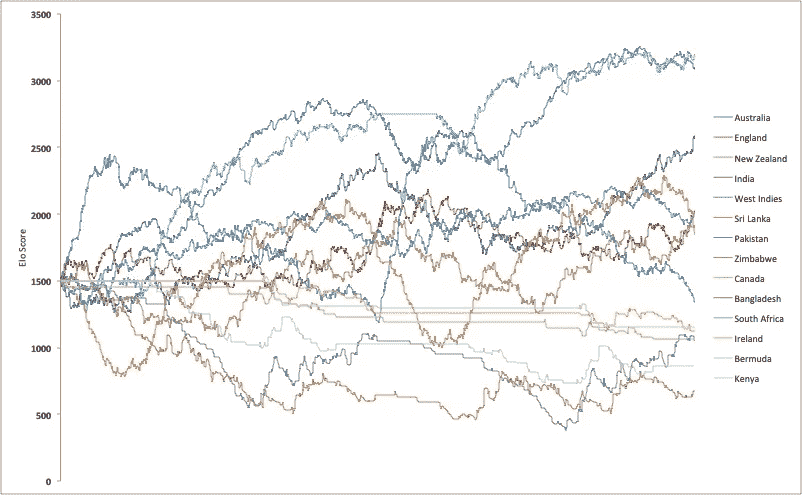

图 1:杰出 ODI 团队的 Elo 得分(1972-2019)

首先，打开 Jupyter Notebook 或您选择的 IDE，并安装必要的软件包:

```
import pandas as pd
import seaborn as sb
import matplotlib.pyplot as plt
import plotly.graph_objects as go
import plotly.express as px
import chart_studio
import chart_studio.plotly as py
from sklearn.model_selection import train_test_split
from sklearn.linear_model import LogisticRegression
from sklearn.model_selection import GridSearchCV
from sklearn import metrics
import numpy as np
from sklearn.impute import SimpleImputer
from pylab import rcParams
from sklearn.neural_network import MLPRegressor, MLPClassifier
from sklearn.metrics import accuracy_score
from sklearn.ensemble import RandomForestClassifier, RandomForestRegressor
import joblib
import pandas as pd
from sklearn.metrics import accuracy_score, precision_score, recall_score
from time import time
from sklearn.tree import export_graphviz
import pydot
```

读入您的 Excel 文件，将其存储为 Pandas 对象，并可视化数据格式:

```
local = ‘/.../.../.../Elo_pred.xlsx’
elo = pd.read_excel(local)
elo.head(100)
```


如上面的`DataFrame`所示，在导入 Excel 文件之前，我创建了一些变量。此`DataFrame`中的每一行都代表了 1972 年至 2019 年间发生的一场对决:

*   `Home_Elo`:主场球队在比赛当天的 Elo 得分
*   `Away_Elo`:比赛当天客场球队的 Elo 得分
*   `Elo_Diff`:主客场球队 Elo 的差异
*   `Home_Advantage`:主队是否获胜(`2` =是，`1` =否)
*   `Home_Team_Innings`:主队先击球还是先投球(`2` =击球，`1` =投球)
*   `Match_Outcome`:我们希望预测的变量；它代表了比赛的结果(`1` =主队赢了，`0` =主队输了)

您可能希望可视化一些预测变量的分布:

```
elo_dist = sb.distplot(elo['Home_Elo'])
```

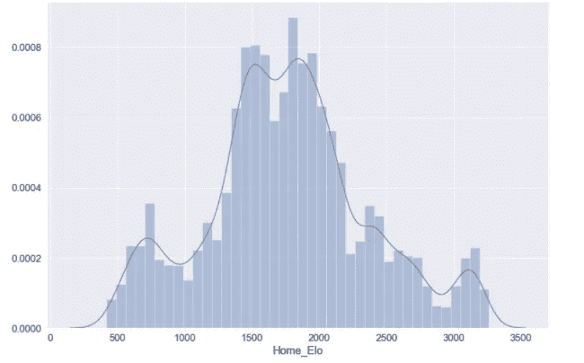

```
elo_dist = sb.distplot(elo['Elo_Diff'])
```

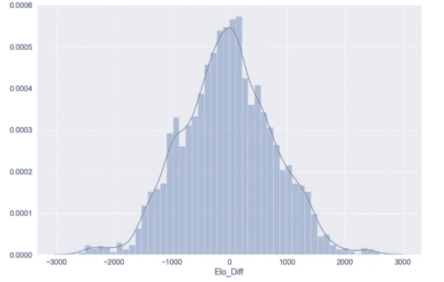

您现在需要将您的数据分成训练、测试和验证数据。训练数据将用于训练单个模型，而测试数据将用于评估我们训练的模型的准确性。

然后，我们将在最后使用一个验证数据集来评估模型性能，并与所有其他使用的模型进行比较。sklearn 没有将数据分成三部分的选项；以下语法将数据拆分为 60:40 的标准训练测试拆分，并将训练数据集进一步划分为训练和验证成分(20:20):

```
## Split features (x) and outcomes (y)features = df[['Elo_Diff','Home_Elo', 'Away_Elo', 'Home_Advantage','Home_Team_Innings']].copy()
labels = df['Match Outcome']## Train - testX_train, X_test, y_train, y_test = train_test_split(features, labels, test_size=0.4, random_state=42)## ValidationX_val, X_test, y_val, y_test = train_test_split(X_test, y_test, test_size=0.5, random_state=42)
```

要确保您的数据已正确分割:

```
for dataset in [y_train, y_val, y_test]:
    print(round(len(dataset) / len(labels), 2))> 0.6
> 0.2
> 0.2
```

# 逻辑回归

我们要训练的第一个模型是逻辑回归。由于我们有一个二元的结果测量，这通常是一个很好的起点；模型更容易训练，逻辑回归适合二元问题。

在拟合逻辑模型之前，重要的是要确保我们使用了将传递到 sklearn 模块中的最佳超参数。我们要优化的参数是`C`，它控制模型将使用的正则化程度。

低`C` 值等于高正则化程度和随后的较低复杂度，高`C`值等于低正则化程度和较高复杂度。由于该值本质上代表了逻辑模型与训练数据的拟合程度，因此较高的`C`值会导致过度拟合。

以下函数打印出您传递的参数的最佳输入值:

```
def print_results(results):
    print('BEST PARAMS: {}\n'.format(results.best_params_))means = results.cv_results_['mean_test_score']
    stds = results.cv_results_['std_test_score']
    for mean, std, params in zip(means, stds, results.cv_results_['params']):
        print('{} (+/-{}) for {}'.format(round(mean, 3), round(std * 2, 3), params))
```

然后，您可以存储想要评估的输入值:

```
lr = LogisticRegression()
parameters = {
    'C': [0.0001, 0.001, 0.01, 0.1, 1, 10, 100, 1000]
}
```

并在您的训练数据上使用`GridSearchCV()`来查看您的输入参数的交叉验证:

```
log_cv = GridSearchCV(lr, parameters, cv=5)
log_cv.fit(X_train, y_train.values.ravel())
print_results(log_cv)
```

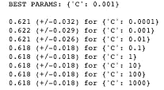

您可以看到`C`的推荐最佳输入值是`0.001`，这表明我们可以在相当高的规范化水平下实现约 62%的准确度；这非直觉地意味着数据拟合不太复杂。

我们应该存储这个最佳估计值，以便在我们对照所用的其他模型验证逻辑模型时使用:

```
joblib.dump(log_cv.best_estimator_, '/.../.../.../EloScores/LOG_model.pkl')
```

现在，我们可以使用推荐的超参数来拟合我们的逻辑模型:

```
logreg = LogisticRegression(C = 0.001)
model = logreg.fit(X_train,y_train)
log_y_pred=logreg.predict(X_test)
```

您可以打印模型的精确度:

```
print("Accuracy:",metrics.accuracy_score(y_test, log_y_pred))>> Accuracy: 0.6254467476769121
```

并打印出模型预测的混淆矩阵:

```
%matplotlib inline
rcParams['figure.figsize'] = 10, 7class_names=[0,1] # name  of classes
fig, ax = plt.subplots()
tick_marks = np.arange(len(class_names))
plt.xticks(tick_marks, class_names)
plt.yticks(tick_marks, class_names)# Create heatmap
sb.heatmap(pd.DataFrame(cnf_matrix), annot=True, cmap="YlGnBu" ,fmt='g')
ax.xaxis.set_label_position("top")
plt.tight_layout()
plt.title('Confusion matrix', y=1.1)
plt.ylabel('Actual label')
plt.xlabel('Predicted label')
```

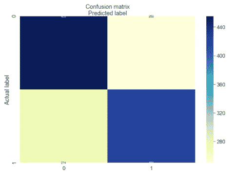

数组([[455，250]，
，[274，420]])

# 随机森林模型

如上所述，我们用一个基本的二元逻辑回归达到了大约 62%的准确率，这是一个很好的起点，但是还有很多需要改进的地方。我们要训练的下一个模型是随机森林模型。

顾名思义，随机森林由大量单独的决策树组成，这些决策树作为一个整体运行。每个独立的决策树提供一个分类结果，具有最高比例结果的类被选为该单独分类的预测(图 2)。

随机森林模型的工作前提是，大量的模型/决策树——看似不相关——仍将优于任何促成随机森林的独立模型。

与其他组成模型没有相关或线性关系的独立决策树可以得出比任何独立预测更准确和精确的集体预测，这表现为独立决策树保护其他起作用的模型免受其估计中的独立误差的影响。

出于这个原因，随机森林模型对于分类问题有很好的实用性，并将用于我们的二进制格式的匹配结果数据。

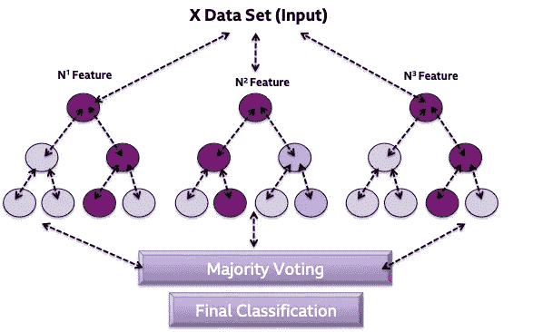

图 2:带有三个独立决策树、多数投票和最终分类的随机森林模型的示意图

在拟合我们的随机森林模型之前，我们将调整一些超参数，就像我们对逻辑模型所做的那样。

之前使用的`print_results()`函数将使用相同的训练数据为我们的随机森林打印最佳超参数。我们要优化的参数是`n_estimators`、*、*，这是森林中决策树的数量，以及`max_depth`，这是树的深度。`max_depth`的缺省值是`None`，这意味着节点被扩展，直到所有叶子都是纯的，或者直到所有叶子包含少于`min_samples_split`个样本:

```
rf = RandomForestClassifier()
parameters = {
    'n_estimators': [5, 50, 250,500],
    'max_depth': [2, 4, 8, 16, 32, 64, None]
}rf_cv = GridSearchCV(rf, parameters, cv=6)
rf_cv.fit(X_train, y_train.values.ravel())print_results(rf_cv)
```

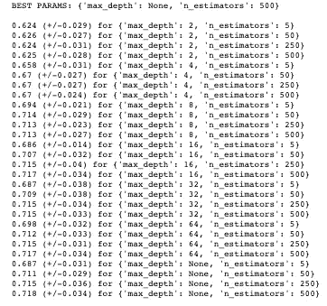

同样，我们应该存储这个最佳估计值，以便在我们对照所用的其他模型验证随机森林模型时使用:

```
joblib.dump(rf_cv.best_estimator_, '/.../.../.../EloScores/RF_model.pkl')
```

我们现在可以使用前面提到的参数来拟合我们的随机森林模型(因为推荐的`max_depth`是`None`，这被设置为默认值):

```
rf_model = RandomForestClassifier(n_estimators=500)
rf_model.fit(X_train, y_train)
rf_predicted_values = rf_model.predict(X_test)
```

我们现在可以打印模型的精确度:

```
print("Accuracy:",metrics.accuracy_score(y_test, log_y_pred))>>> 0.7055039313795568
```

要打印出随机森林模型中的各个决策树，您可以创建一个点文件并转换为 PNG，该文件将保存到您的本地驱动器:

```
# Create an individual decision treetree = rf_model.estimators_[5]# Export tree to a dot fileexport_graphviz(tree,
                feature_names=elo.columns,
                filled=True,
                rounded=True)# Save to local as pngos.system('dot -Tpng tree.dot -o tree.png')
```

生成的文件如下所示:

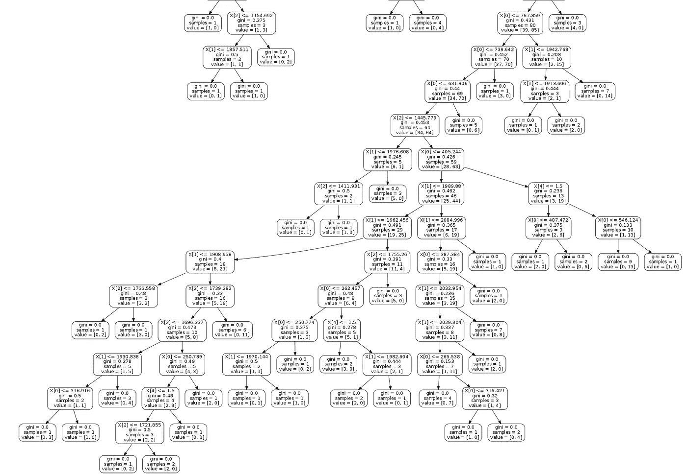

# 多层感知器

如您所见，我们将基线逻辑回归的准确性提高到了约 71%。

我们要拟合的最后一个模型是多层感知器(MLP)，这是一类前馈神经网络，旨在模拟大脑处理和存储信息的神经生理过程。MLP 通常用于监督学习问题，它们在一组输入-输出对上进行训练，并学习对它们之间的相关性进行建模。

训练通常包括调整模型的参数或权重和偏差，以减少期望结果和计算结果之间的误差。这种方法通常被称为*反向传播，*，在输入参数的每次前后传递后，随机分配的权重和偏差被重新校准以减少误差。

多层感知器由一个输入层、一个输出层和任意数量的隐藏层(将根据您可用的数据进行调整)组成。在你的输出层和所有的隐藏层，执行一个激活函数，将数据传递给下一个隐藏层或个体分类的最终结果(这就是*前馈*所涉及的；图 3)。

MLP 适用于分类和回归问题，但在较小的数据集上表现不佳。上面的描述被大量转述，我推荐阅读 Nitin Kumar Kain ，他更深入地解释了 MLP。

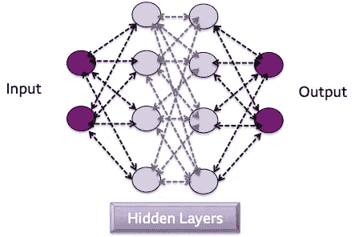

图 3:具有二元结果的 MLP 模型的例子，比如本文中用于 Elo 预测的模型

在拟合我们的 MLP 模型之前，我们将调整一些超参数，就像我们对逻辑和随机森林模型所做的那样。之前使用的`print_results()`函数将使用相同的训练数据为我们的 MLP 打印最佳超参数。

我们要优化的参数是`hidden_layer_sizes`，它是隐藏层中的节点数，以及*激活*，，它是隐藏层的激活函数。对于激活功能，我们将确定逻辑激活和 relu 激活之间哪个功能更好:

*   **逻辑**:使用 sigmoid 函数(如逻辑回归)；返回 *f(x) = 1 / (1 + exp(-x))*
*   **Relu** :整流后的线性单位函数，返回 *f(x) = max(0，x)* 。如果值为正，该函数输出输入值；否则，它传递一个零。

```
mlp = MLPClassifier()
parameters = {
    'hidden_layer_sizes': [(10,), (50,), (100,),(250)],
    'activation': ['relu', 'logistic'],
}mlp_cv = GridSearchCV(mlp, parameters, cv=5)
mlp_cv.fit(X_train, y_train.values.ravel())
print_results(mlp_cv)
```

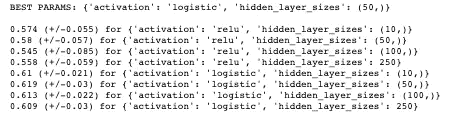

同样，我们应该存储这个最佳估计值，以便在我们用其他模型验证 MLP 模型时使用:

```
joblib.dump(rf_cv.best_estimator_, '/.../.../.../EloScores/MLP_model.pkl')
```

我们现在可以使用上述参数来拟合我们的 MLP 模型:

```
mlp_model = MLPClassifier(hidden_layer_sizes=(50,), activation='logistic')
mlp_model.fit(X_train, y_train) 
mlp_predicted_values = mlp_model.predict(X_test)
```

我们现在可以打印模型的精确度:

```
print("Accuracy:",metrics.accuracy_score(y_test, log_y_pred))>>> 0.6275911365260901
```

与所有这些模型一样，您可以微调任意数量的超参数，以便最适合您的数据。对于 MLP，这总是以过度拟合数据为代价。

与成功调整 MLP 相关的其他超参数包括历元数、批量大小和反向传播方法，这些都超出了本文的范围，但在训练 MLP 模型时应该加以考虑。

# 模型验证和总结

如上所述，我们对数据进行了分割，这样我们就有了一个验证集，可用于在评估的最后阶段对模型进行比较。该数据与验证阶段使用的任何模型都完全不同，因此它可以用作我们训练的模型的性能的有力衡量标准。此外，我们还存储了用于此目的的各种超参数的最佳估计量。

以下代码将遍历您存储的最佳估计值:

```
models = {}for mdl in ['LOG','MLP', 'RF']:
    models[mdl] = joblib.load('/Users/hopkif05/Desktop/EloScores/{}_model.pkl'.format(mdl))models
```

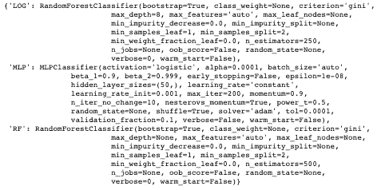

我们将使用三种方法来确定模型的性能:

*   **准确度:**总体正确分类数(正确预测数/总样本数)
*   **精度:**:正确预测的 1 数/预测的 1 总数
*   **回忆:**:正确预测的 1 的数量/实际 1 的总数

下面的代码将创建一个函数来评估和比较所使用的模型。正如所见，`model.predict()`函数存在于开始和结束时间函数之间，这意味着我们可以计算每个模型的延迟值，以评估它们计算预测需要多长时间:

```
def evaluate_model(name, model, features, labels):
    start = time()
    pred = model.predict(features)
    end = time()
    accuracy = round(accuracy_score(labels, pred), 3)
    precision = round(precision_score(labels, pred), 3)
    recall = round(recall_score(labels, pred), 3)
    print('{} -- Accuracy: {} / Precision: {} / Recall: {} / Latency: {}ms'.format(name,
                                                                                   accuracy,
                                                                                   precision,
                                                                                   recall,
                                                                                   round((end - start)*1000, 1)))
```

我们现在可以在这个函数中遍历我们的模型:

```
for name, mdl in models.items():
    evaluate_model(name, mdl, X_val, y_val)>>> LOG -- Accuracy: 0.693 / Precision: 0.686 / Recall: 0.779 / Latency: 44.1ms>>> MLP -- Accuracy: 0.619 / Precision: 0.656 / Recall: 0.593 / Latency: 1.8ms>>> RF -- Accuracy: 0.71 / Precision: 0.73 / Recall: 0.718 / Latency: 113.6ms
```

从上面可以看出，我们的随机森林模型在看不见的数据上表现最好，具有最好的准确度和精确度分数；然而，做出预测确实需要最长的时间。对于这个相对较小的数据集来说，这是可以的，但是如果数据集的大小增加，就可能出现问题。

另一个要考虑的权衡是精确度和召回率，因为两者通常是负相关的。逻辑模型在召回和延迟方面得分更高，但是，考虑到前面提到的小数据集，我们考虑到这一点，以便利用额外的准确性和精确度。与所有的验证一样，这归结于您试图解决的问题和模型的适用性。

可以看出，MLP 模型在所有性能指标中表现最差，这可以归结为几个因素。首先，MLP 在较小的数据集上表现不佳，可能不适合所用的 Elo 评分数据。其次，在当前评估中，MLP 的超参数优化相当简洁，给出了优化 MLP 模型可以调整的参数数量。未来的 MLP 模型可以考虑优化世代数和/或批量大小或反向传播方法。

最后，应该考虑输入变量的质量。如下面的关联图所示，与我们的比赛结果测量(`Match_Outcome`)仅有的远程关联变量与 Elo 得分(`Home_Elo`、`Away_Elo`和`Elo_Diff`)相关。

鉴于使用了额外的指标来丰富 Elo 相关数据，额外的特征变量(`Home_Advantage`和`Home_Team_Innings`)可能无法提高所用模型的性能，应考虑其他变量。

```
plt.figure(figsize=(12,10))
cor = df.corr()
sb.heatmap(cor, annot=True, cmap=plt.cm.Blues)
plt.show
```

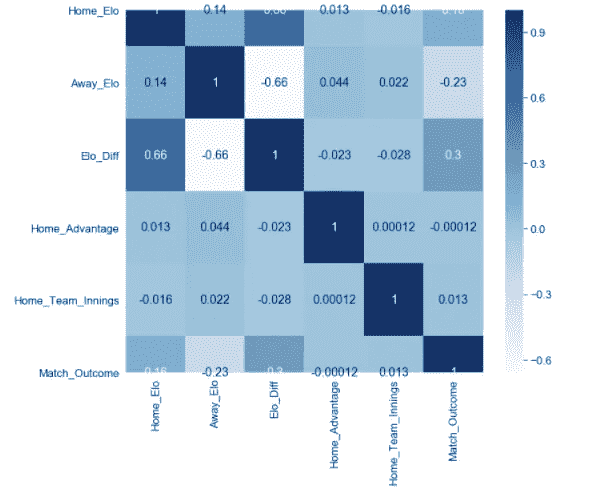

然而，可以确定的是，我们的随机森林模型能够使用 Elo 相关数据实现相对高水平的准确度(71%)、精确度(73%)和召回率(71%)，这在一定程度上验证了该给定上下文中的 Elo 排名系统。

用 Elo 计算中使用的 k 值[进行试验是值得的；这个系数反映了 Elo 分数对输赢的反应程度，应该根据体育环境进行调整。我使用了一个值`22`，它与我在 IPL 模型中使用的值一致，但这在 ODI cricket 中可能太保守了，ODI cricket 已经运行了更长一段时间，因此可以被认为是一种更可预测的游戏格式。](https://bnetcmsus-a.akamaihd.net/cms/content_entry_media/9c/9C72SY747QEM1534557019664.pdf)