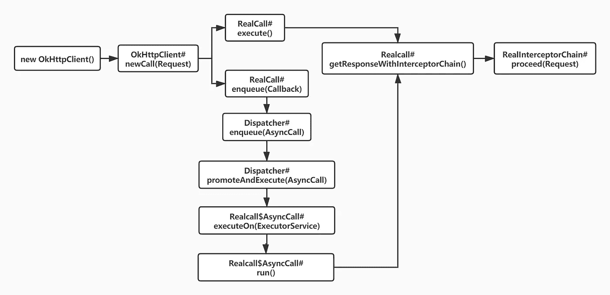
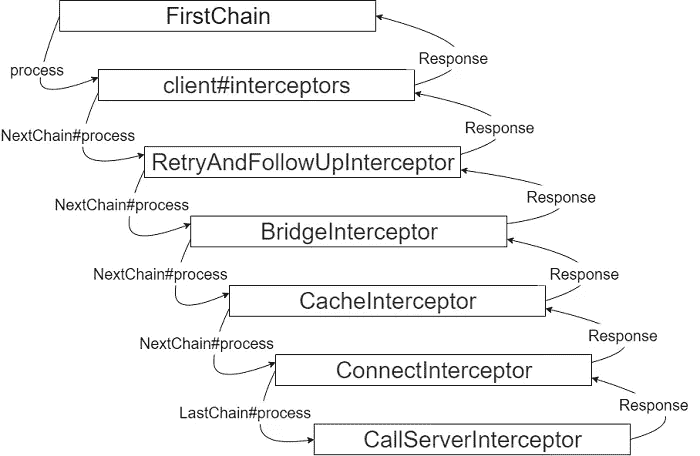

# OkHttp 源代码分析

> 原文：<https://betterprogramming.pub/okhttp-source-code-analysis-b9fe7d5b7b8a>

## 关于 OkHttp 框架的原理

[Goran Ivos](https://unsplash.com/@goran_ivos?utm_source=medium&utm_medium=referral) 在 [Unsplash](https://unsplash.com?utm_source=medium&utm_medium=referral) 上拍摄的照片

# 过程分析

我们从一个简单的 HTTP 请求开始:

上面的代码将启动两个简单的 HTTP 请求。下图显示了请求流。

上述流程图仅描述了责任链。在前面的介绍之后，将分别介绍责任链和每个拦截器的原理。

## OkHttpClient

我们使用 new `OkHttpClient()`来创建一个默认的`OkHttpClient`，我们也可以使用`OkHttpClient.Builder`来构建一个带有自定义参数的客户端。

稍后，当我们使用网络请求时，我们将使用这个客户端。可以理解为整个 OkHttp 的核心类。它封装了整体 OkHttp，并提供外部请求发起和一些参数配置接口。我们可以用`OkHttpClient`。构建器来设置，负责在内部协调各个类的操作，它实际上并不包含太多的代码。

## 请求

`Request`很好理解并负责组装请求。

## 呼叫(真实呼叫)

然后调用`client.newCall(request)`方法，意思是创建一个新的要执行的请求，通过`newCall`方法获得一个调用对象(实现为`RealCall`)。此时，我们使用 Call 的 execute/enqueue 来发起同步/异步请求。

所以每个`Request`最终都会封装成一个`RealCall`对象。`RealCall`和`Request`一一对应。Call 用于描述可以执行和中断的请求。每次发起请求时，我们都会创建一个`RealCall`对象。

最后调用`RealCall#getResponseWithInterceptorChain()`发起请求，这个方法会返回一个响应结果 response。

## 分配器

`Dispatcher`用于管理其对应的`OkHttpClient`的所有请求。从上面的流程图可以看出，当使用异步请求时，请求会委托给`Dispatcher`对象进行处理，`Dispatcher`对象是随着`OkHttpClient`的创建而创建的。

实际上，`Dispatcher`不仅用于管理异步请求，还负责管理同步请求。

当我们发起请求时，无论是异步还是同步，都会被`Dispatcher`记录下来。

我们可以通过`OkHtpClient#dispatcher()`获取 Dispatcher 对象，对请求进行统一控制，比如结束所有请求，获取线程池等等。
`Dispatcher`包含三个队列:

*   新的异步请求将首先被添加到队列中
*   `runningAsyncCalls`:当前运行的异步请求
*   `runningSyncCalls`:当前正在运行同步请求

Dispatcher 包含一个用于执行所有异步请求的默认线程池。还可以通过构造函数指定一个线程池，所有异步请求都将通过这个线程池执行。

和同步请求一样，异步请求最终也会调用`RealCall#getResponseWithInterceptorChain()`发起请求，但是一个是直接调用，一个是在线程池中调用。

通过上面的介绍，已经发现重点是名字比较长的方法，只要被调用就能返回响应，这个方法开始涉及到大家熟知的 OkHttp 责任链模型。

# OkHttp 责任链

这一切都是从一个名字很长的方法开始的。我们知道，在任何情况下，都会调用`RealCall#getResponseWithInterceptorChain()`来发起请求并得到最终的响应。

这个方法会根据用户设置的拦截器和几个默认的拦截器来组装拦截器列表，然后创建一个责任链。

责任链创建后，会调用其流程方法得到响应并返回，这涉及到两个概念:`**Interceptor**`和`**Chain**`。

## 拦截机

作为拦截器的抽象概念，拦截器接口被设计为观察、拦截和处理请求(如添加头、重定向、数据处理等)的责任链上的一个单元节点。

拦截器相互独立，每个拦截器只负责自己关注的任务，不联系其他拦截器。

拦截器接口只包含一个方法(OkHttp 现在用 Kotlin 重写):

intercept 方法接收一个`Chain`作为参数并返回一个响应。

在`RealCall`中，为了完成基本功能，下面的默认`Interceptors`将被添加到职责的`Chain`中:

*   用户设置拦截器
    `RetryAndFollowUpInterceptor`:重试失败重定向
*   `BridgeInterceptor`:处理网络头、cookies、gzip 等。
*   `CacheInterceptor`:管理缓存
*   `ConnectInterceptor`:连接服务器
*   如果是 WebSocket 请求，添加相应的拦截器
*   `CallServerInterceptor`:数据发送/接收

这些拦截器的具体含义和原理将在后面详细介绍。

责任链将按照它们被添加的顺序执行这些拦截器，因此顺序非常重要。

通过这些拦截器的处理，最终会将一个完美的`Response`返回给`RealCall`中名字比较长的方法，然后返回给下游用户。至此，一个完整的请求告一段落。

## 链子

Chain 用来描述责任链，流程方法通过它开始依次执行链上的各个节点，并返回处理后的响应。
Chain 的唯一实现是 RealInterceptorChain(以下简称 RIC)，RIC 可以称为拦截器责任链，其中的节点由 RealCall 中添加的拦截器组成。由于拦截器的独立性，RIC 还包含一些公共参数和共享对象。

`Interceptor`和`Chain`相互依赖，相互调用，共同发展，形成了一个完善的调用链。我们来看看他们的通话关系图:

从上图中可以清楚的看到，当我们在一个`Interceptor`中调用`Chain#process`方法来获取`Response`时，在调用当前位置后，请求将按照`Interceptor`进行处理。

处理完成后，`Response`会返回到当前的拦截器，然后处理完成后返回到上一级，直到遍历结束。

# 网络连接和数据发送与接收

上面已经介绍了 OkHttp 的基本概念、基本配置、线程控制、责任链。先说一个网络框架的灵魂:网络请求的建立和数据的发送接收。

`RealCall`中增加的几个不同的拦截器相互配合完成这些功能。只要你理解了这些基本的拦截器，你就理解了 OkHttp 的灵魂。

其实我不建议在看源代码的时候过多关注实现细节。只要了解设计思路，一般实现都差不多，否则很容易被负责任的细节所迷惑。

所以在介绍这些拦截器之前，我们先介绍一下 OkHttp 中的一些基本概念。

## 如何建立连接

我们之前看到的很多网络请求框架，比如凌空等。，都是通过底层的`HTTPURLConnection`连接到服务器，OkHttp 更好。因为 Http 协议是基于 TCP/IP 协议的，底层还在使用 Socket，OkHttp 直接使用 Socket 来完成 HTTP 请求。

## 途径

`route`是用来连接服务器的具体路由。它包含 IP 地址、端口、代理等参数。
由于代理或 DNS 可能返回多个 IP 地址，同一接口地址可能对应多个路由。

创建连接时，将直接使用路由而不是 IP 地址。

## 路由选择器

路由选择器，存储所有可用的路由，并在准备连接时通过`RouteSelector#next`方法获取下一条路由。

值得注意的是，`RouteSelector`包含了一个`routeDatabase`对象，存储连接失败的路由，`RouteSelector`会在最后存储最后一条连接失败的路由，以提高连接速度。

## 真实连接

`RealConnection`实现了`Connection`接口，该接口使用 Socket 建立 HTTP/HTTPS 连接并获取 I/O 流。**同一个**连接可以承载多个 HTTP 请求和响应。

其实大致可以理解为 Socket，I/O 流，以及一些协议的封装。这涉及到很多计算机网络相关的知识，比如 TLS 握手、HTTPS 验证等等。

## RealConnectionPool

这是用于存储`RealConnection`的池，在内部，双端队列用于存储。

在 OkHttp 中，一个连接(`RealConnection`)在用完之后不会立即被关闭和释放，而是存储在连接池(`RealConnectionPool`)中。

除了缓存连接，缓存池还负责定期清理过期的连接。在`RealConnection`中维护一个字段来描述连接的空闲时间。

每当一个新的连接被添加到连接池中时，就执行检测，遍历所有的`Connect`来找到当前未使用的并且具有最长空闲时间的连接。

如果连接空闲时间超过阈值，或者连接池已满，连接将被关闭。

另外，`RealConnection`还维护了一个`Transmitter`的弱引用列表来存储当前使用连接的`Transmitter`。当列表为空时，意味着该连接没有被使用。

## ExchangeCodec

`ExchangeCodec`负责对`Response`进行编码和解码，即写请求和读响应。我们的请求和响应数据通过它被读取和写入。

所以`Connection`负责建立连接，`ExchangeCodec`负责发送和接收数据。

`ExchangeCodec`接口有两个实现类:`Http1ExchangeCodec`和`Http2ExchangeCodec`，分别对应两个协议版本。

## 交换

`Exchange`功能与`ExchangeCodec`类似，但对应的是单个请求，在`ExchangeCodec`的基础上负责一些连接管理和事件分发功能。

具体来说，`Exchange`一一对应请求。当一个新的请求被创建时，一个`Exchange`被创建。`Exchange`负责发送请求和读取响应数据，`ExchangeCodec`用于发送和接收数据。

## 发射机

`Transmitter`是 OkHttp 网络层的桥梁。我们上面提到的概念，最终都是通过变送器集成，提供外部功能。

好了，现在介绍了基本概念，让我们开始看看拦截器。

## RetryAndFollowUpInterceptor

顾名思义，这个拦截器负责失败的重试和重定向。
可能触发重试或重定向的条件如下:

*   401:未经授权
*   407:代理未授权
*   503:服务未经授权
*   3xx:请求重定向
*   408:请求超时
*   以及一些 I/O 异常和其他连接故障

正如我们上面提到的，由于代理和 DNS 的原因，同一个 URL 可能有多个 IP 地址。连接时通过`RouteSelector`选择合适的路由进行连接，所以这里的重试失败并不是指同一个 IP 地址有多个 IP 地址。重试是逐一尝试路由表中的地址。

如果响应代码是 401 或 407，则意味着请求没有通过身份验证。此时，请求被重新认证，然后认证的请求被返回。

响应代码是 3xx，表示重定向。此时重定向地址在响应头的`Location`字段，然后通过这个新地址和之前的请求构造一个新的请求并返回。

响应代码 503 表示服务器错误，但这是暂时的，可能很快就会恢复，因此将直接返回之前的请求。

## 桥梁拦截器

`BridgeInterceptor`是用户与网络之间的桥梁，负责将用户请求转化为网络请求，即形成网络头，并根据请求信息设置响应数据。

实际上，`BridgeInterceptor`负责设置 cookies 和 gzip。
在发起网络请求之前，`BridgeInterceptor`会先通过 URL 判断是否有 cookie，如果有，就会把 cookie 带过来。

请求结束后，还会判断响应头中是否包含 Set-Cookie 字段，保存下来下次使用。但是，存储 cookies 的操作将委托给`CookieJar`。

OkHttp 默认提供一个空的`CookieJar`对象，这意味着默认不执行任何操作，但是您可以在创建 OkHttp 时指定自己的`CookieJar`来使用。

如果 Accept-Encoding 和 Range 字段不包括在请求请求报头中，则一个`Accept-Encoding: gzip`请求报头将被添加到其中。接收到响应数据后，如果响应指示使用 gzip，则响应数据会交给 okio 的`GzipSource`解码。

## CacheInterceptor

`CacheInterceptor`负责缓存响应数据。
该方法首先尝试通过`Cache`对象获取缓存数据，然后通过`CacheStrategy`获取缓存策略。

通过这个策略的计算结果，我们可以得到两个可空的对象:`networkRequest`和`cacheResponse`。

其中`networkRequest`是原始请求，但可能为空。是否为空由`CacheStrategy`控制。

`cacheResponse`是通过`Cache`得到的`Response`，同上，也可能为空。
然后你可以通过判断两个对象的为空性来处理缓存，逻辑如下:

*   如果两者都为空，则意味着既不允许使用网络请求，也不允许使用缓存或缓存未命中，直接返回 504 错误。
*   如果只有`networkRequest`为空，说明网络请求被禁止，直接返回从缓存命中的响应。
*   如果两者都不为空，则开始发出请求并获取响应数据。
*   如果此时`cacheResponse`不为空，响应码为 304，则直接返回`cacheResponse`，用响应数据更新缓存。
*   如果`cacheResponse`为空，响应数据将存储在`Cache`中。
    返回响应数据。

需要注意的是，上面提到的`Cache`对象默认为空。如果为空，则不会执行与之相关的操作，并且`cacheResponse`必须为空。

我们可以在`OkHttpClient`中设置`Cache`。

## ConnectInterceptor

`ConnectInterceptor`用于打开与服务器的连接。代码非常简单。它将通过`Transmitter#newExchange`方法创建一个`Exchange`对象，并调用`Chain#process`方法。

在`newExchange`方法中，它将首先尝试通过`ExchangeFinder`在`RealConnectionPool`中找到一个现有的连接。

如果没有找到，它会重新创建一个`RealConnection`并启动连接，然后存储在`RealConnectionPool`中。

这时，`RealConnection`对象已经准备好，然后通过请求协议创建不同的`ExchangeCodec`并返回。具体细节上面已经提到了，这里不再详细介绍。

通过以上步骤创建了`ExchangeCodec`后，基于它和其他参数创建一个交换对象并返回。

`ConnectInterceptor`调用`Chain#process`方法，将`newExchange`方法返回的`Exchange`对象作为参数。

## CallServerInterceptor

`CallServerInterceptor`负责读写数据。
这是最后的拦截器。这里该准备的都准备好了。通过它，请求中的数据将被发送到服务器，获得的数据将被写入响应。

所以 OkHttp 的源代码在这里分析的差不多了。其实还有很多事情没有提到。OkHttp 是一个庞大的框架，涉及的东西太多了，包含了很多计算机网络的基础知识。谢谢！