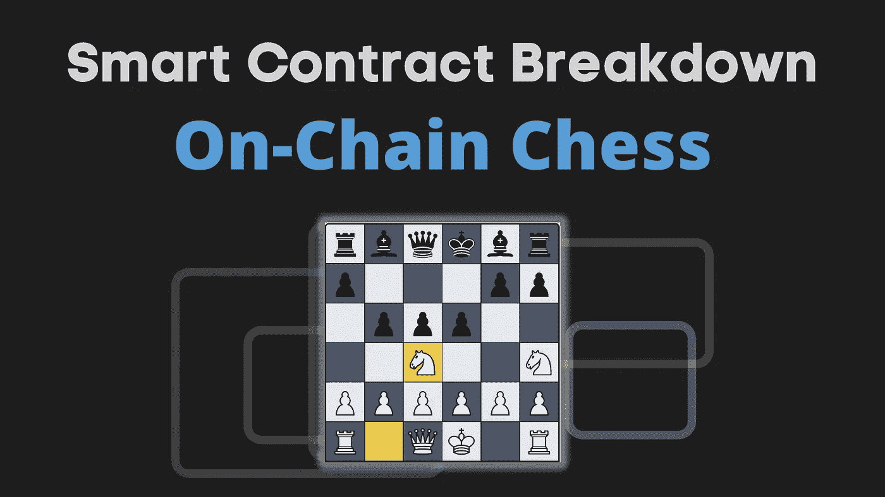
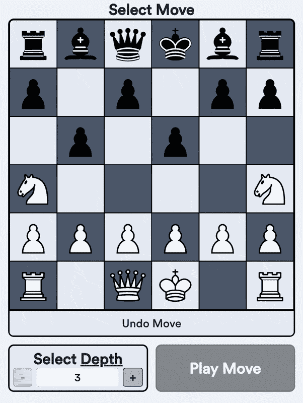
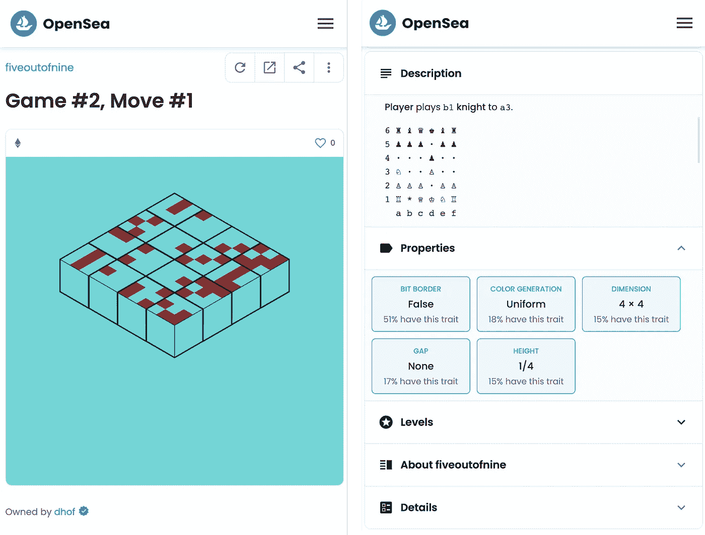
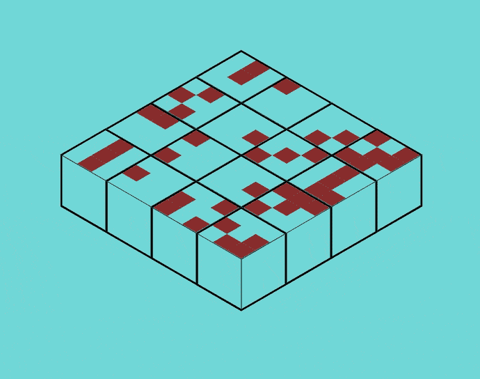
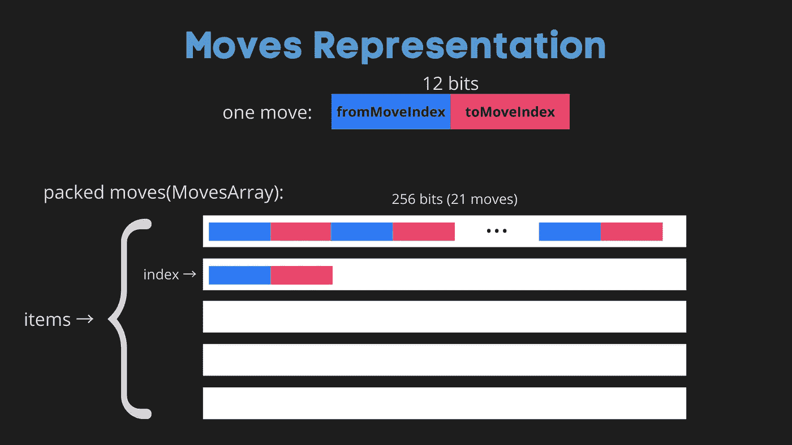
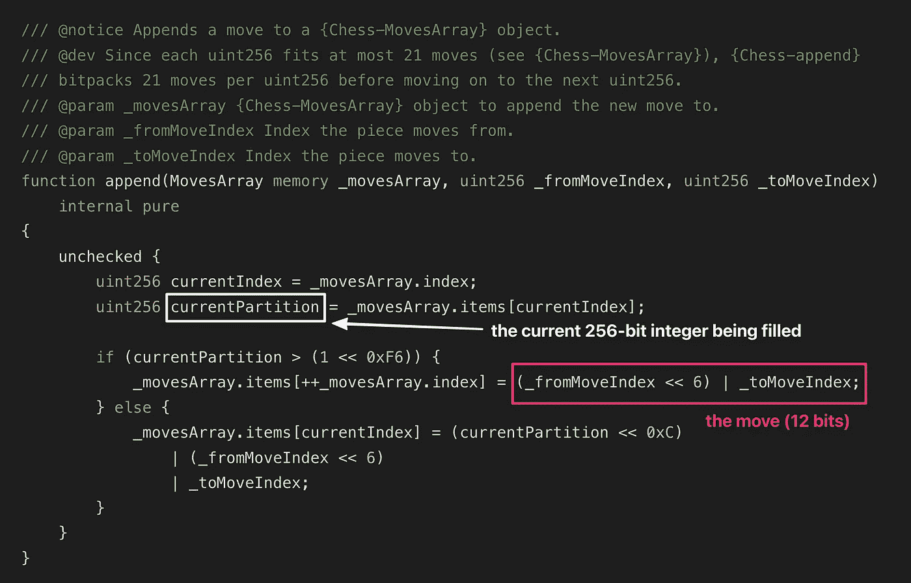
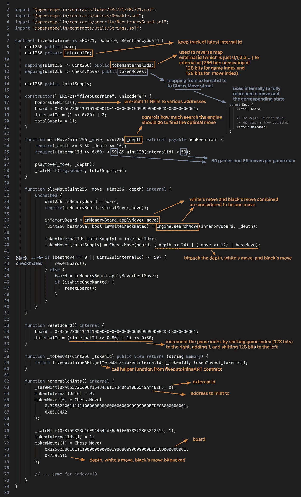
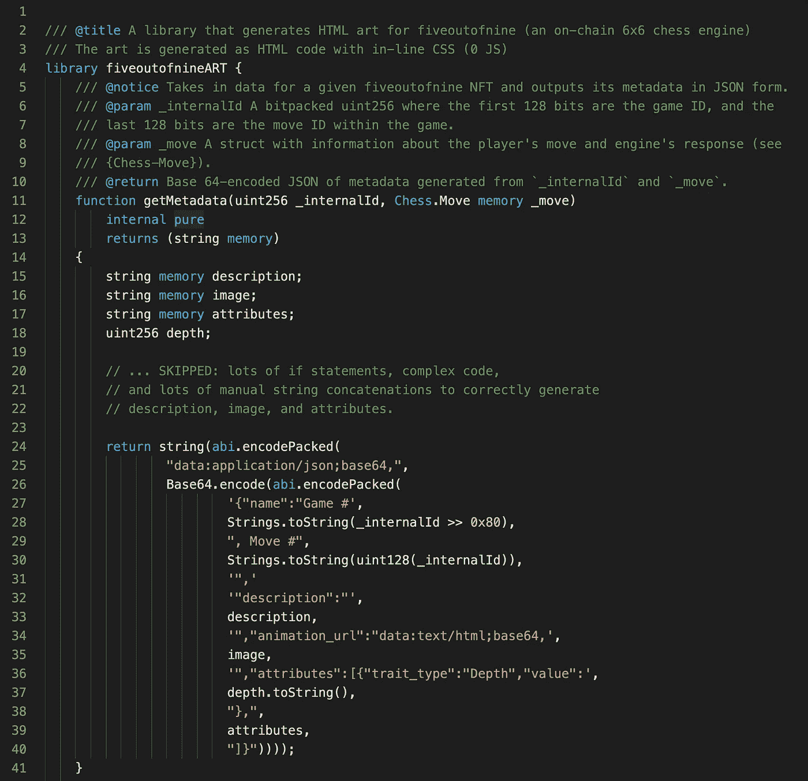
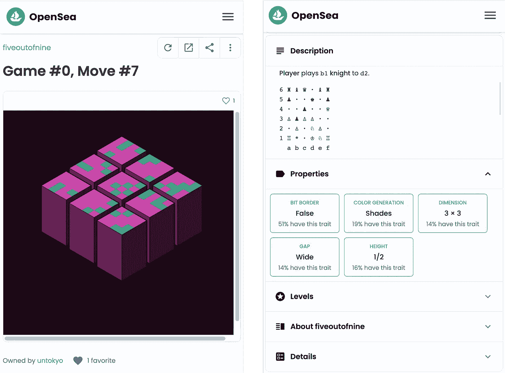
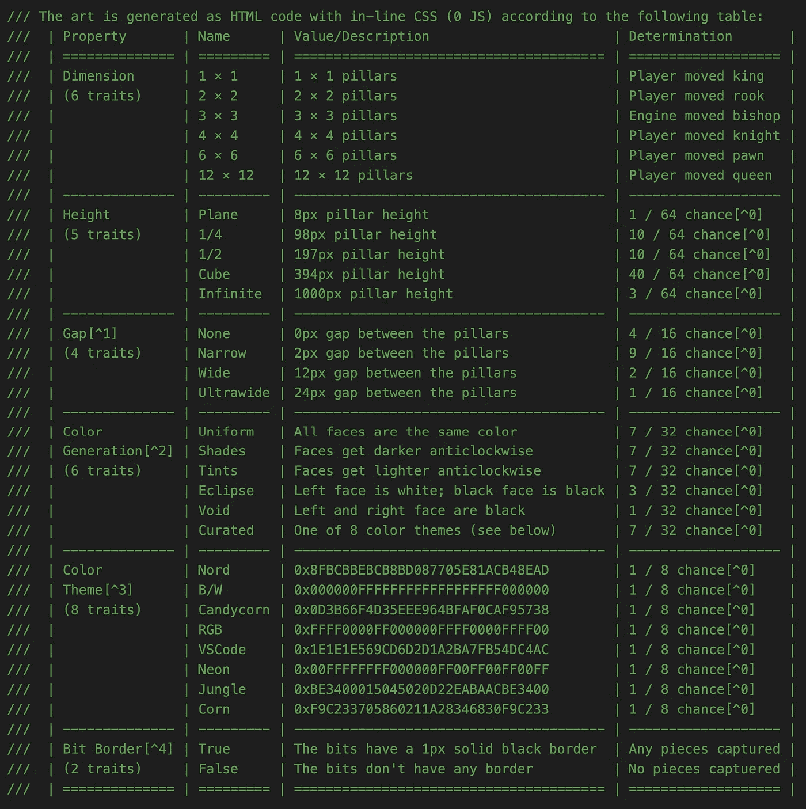

# 连锁象棋:智能合同分解

> 原文：<https://betterprogramming.pub/on-chain-chess-smart-contract-breakdown-7d01cdaaeb54>

## 有人如何决定把整个国际象棋游戏链



今天，我们将回顾第一个连锁象棋引擎背后的智能合同。叫 5/9 ( [fiveoutofnine](https://www.fiveoutofnine.com/) )。《T2》的创作者刚刚[决定](https://twitter.com/fiveoutofnine/status/1470102097937027072?s=20&t=jKndyHyiOxo2VdBORPBSvQ):去他妈的，我要把整个象棋游戏链上。这不仅仅是玩游戏的人工智能，他还把艺术(NFTs)完全放在链上。

将各种东西放在链上的例子有很多，比如 NFTs 的 [SVG](https://blog.simondlr.com/posts/flavours-of-on-chain-svg-nfts-on-ethereum) 数据和 [3D](https://mirror.xyz/angelsay.eth/Fpqj6Hawn-IWGgXm9oEYXyscIgolotYscShuNaVTmI4) 数据。甚至是 SVG 和 3D 渲染器。我总是被这些迷住。这让我想起了 90 年代，当时计算资源稀缺，人们想出各种办法/优化来支持慢速硬件上的游戏。同样的事情也发生在区块链身上，那里的每一项性能和天然气都被挤出以获得最佳性能。

让我们深入探讨 5/9 为了在以太坊上运行国际象棋而必须进行的优化。下面是这篇文章的提纲:

*   游戏动力学——是关于什么的？
*   智能合同源代码
*   链上数据表示
*   生成 NFT
*   游戏引擎

# 游戏动力学

*   游戏由你(玩家)和智能合约中的人工智能对战组成。人工智能总是玩黑色。
*   你可以动一动，引擎也会用自己的举动来回应。行动需要汽油，但你会得到一个 NFT 作为回报。



我认为主页[上的入职](https://www.fiveoutofnine.com/)值得单独鼓掌——可以马上采取行动，创造一个 NFT。

*   所有的游戏和动作都记录在区块链上。最多有 59 局，每局最多 59 步。
*   一次只能玩一个游戏。任何人都可以采取下一步行动，游戏将继续进行。
*   一切都在链上:引擎、NFT 数据和图像(以 HTML 的形式)
*   对 NFT/web3 世界有一个有趣的改编:每一步棋(以及 AI 相应的反棋)都将被铸造成一个 NFT:



注意到主人了吗？



NFT 是交互式的

# 智能合同源代码

有 4 种智能合同:

1.  `Chess.sol` —用于数据表示。棋盘、棋子和移动是如何在链上表示的。
2.  `Engine.sol`——会走棋、抓棋子等的 AI
3.  `fiveoutofnine.sol`——ERC-721 实施允许铸币移动
4.  `fiveoutofnineART.sol` —上述契约使用的助手，用于为 NFTs 生成元数据和图像

源代码可以在 [5/9 网站](https://fiveoutofnine.com/contract)或 [Etherscan](https://etherscan.io/address/0xb543f9043b387ce5b3d1f0d916e42d8ea2eba2e0#code) 上找到。

创建者还[将](https://twitter.com/fiveoutofnine/status/1497596567284506624?s=20&t=XekP6w0pdLYc5ZHXxYT_UA)前两个智能契约(数据表示和引擎)翻译成 Python，以便于阅读和理解。你不能在区块链上运行它们，但从逻辑上讲，它们相当于实际的可靠性合同。在 [Github](https://gist.github.com/fiveoutofnine/84d8efb9ec1ff739f9cdf5c888bc9700) 上查看它们。

现在让我们逐一分解合同。

# 链上数据表示

`Chess.sol`定义棋盘、棋子和走法的数据结构。一块用 4 位表示:

董事会代表稍微复杂一点。整个板适合 256 位整数(8×8 板=64 个单元，每个单元 4 位→ 64*4=256)。您可以使用位移位和位掩码访问电路板中的单元:`(board >> (27 << 2)) & 0xF`与`board[27]`相同，如果电路板只是一个平面阵列。

为什么实际板是`6x6`而不是`8x8`？因为我们需要保持最外面的行和列为空，以便有效地计算移动是否在棋盘边界内(`isValid`函数)

此外，棋盘右下角的位代表该轮到谁移动:

这些移动用 12 位紧凑地表示。

这些移动不是一个接一个地存储，因为没有有效的数据结构来可靠地存储 12 位。取而代之的是，21 次移动被打包成一个 256 位整数(21*12=252<256)。游戏假设每局最多有 105 步棋:

index 是当前使用的 256 位整数的索引



`append`功能向`MovesArray`添加一个动作:



检查当前分区是否已满。如果满了，就加招。否则，在添加之前移动现有的移动

其余的`Chess.sol`契约只是帮助函数，允许你做诸如/操纵棋盘、应用移动等事情。以下是所有这些函数(为了简洁起见，我跳过了其中一些函数的实现):

`Chess.sol`契约被用作`uint256`和`movesArray`的库，以便助手函数(`rotate`、`applyMove`等)被附加到`uint256`和`movesArray`:

这允许您执行以下操作:

# 生成 NFT

让我们继续下一个合同:

*   `fiveoutofnine.sol`—ERC-721 标准的实施。
*   `fiveoutofnineART.sol` —用于生成 NFT 艺术的辅助函数集合—由`fiveoutofnine.sol`调用。

下面是注释的`fiveoutofnine.sol`:



上面的契约记录了游戏索引、移动索引、所有已经进行的移动、外部和内部令牌 id 等。它调用`Engine.sol`契约(游戏 AI)来搜索最佳对策。

每一步棋(实际上由白棋的*和*黑棋的棋组成)都有一个令牌 id，可以被铸造成 NFT。NFT 的艺术在`_tokenURI`函数中生成，该函数本身调用`fiveoutofnineART.sol`的`getMetadata`函数。



`getMetadata`手动构建 NFT 图像的 HTML。正如您所料，有许多 if 语句和字符串串联来生成 HTML 及其内联 CSS。这个[要点](https://gist.github.com/ilamanov/3a7e8162492237b6b152a1e0429f1bd1)有这个代码的缩短版。

`getMetadata`也为 NFT 的属性手动创建 JSON。这些属性是:

*   **名称:**格式为“游戏#X，移动#Y”的字符串
*   **描述:**如下图所示



*   **位边框、颜色生成、尺寸、间隙和高度:**解释如下



以下是来自 [OpenSea 页面](https://opensea.io/collection/fiveoutofnine)的一些具有各种属性的图片:


# 游戏引擎

现在，进入最后一个合同:`Engine.sol`。这个契约有`searchMove`功能，被`fiveoutofnine.sol`用来做反棋。

我不会进入这个合同的细节，因为它有许多国际象棋特定的算法。但是从上面的代码片段中可以清楚地看出高级策略:生成所有可能的移动，根据一些启发式规则评估每个移动，并选择最佳移动。

# 结束语

这是一个非常酷的项目，展示了区块链的可能性。作者通过尽可能高效地对所有内容进行位打包，在气体优化方面付出了巨大努力。这是如此硬核，让我想起了 c。是的，它使代码难以阅读，但你用这种类型的代码节省了很多汽油。(到目前为止，铸造一个移动的成本约为 0.06 eth = 175 美元。对于这样一个复杂的契约来说已经很不错了)。

作者还使游戏 100%不可信:这意味着没有人，甚至作者也不能改变游戏的逻辑。没有升级机制之类的东西。是的，它导致了现在无法修复的[bug](https://www.fiveoutofnine.com/contract)，但是它是 100%不可信的。

该项目还为每一步棋提供了非常酷的艺术/NFT，让你拥有一段国际象棋历史。

最令人着迷的是，这一切都是由一个大学生完成的。这是他们学习稳健的方式。该项目已经激发了其他人( [MateInEight](https://etherscan.io/address/0xf5a48d9f32dfe700ff502edaa5b2e90ef6d8b39a#code) )在 5/9 的基础上进行建设。

5/9 合同破裂到此为止！我希望这有所帮助。如果你有任何问题，请在评论中告诉我。

我计划对流行的智能合约进行更多的分解，如 **ArtBlocks** 和 **DAI Stablecoin，**，所以请在 Medium 或 Twitter 上关注我以获取更新。

你还可以在[solidnoob.com](https://www.solidnoob.com/)查看其他智能合约的细目表和更多关于 Solidity noobs 的东西。

```
**Want to Connect?**Follow me on [Twitter](https://twitter.com/nazar_ilamanov).
```